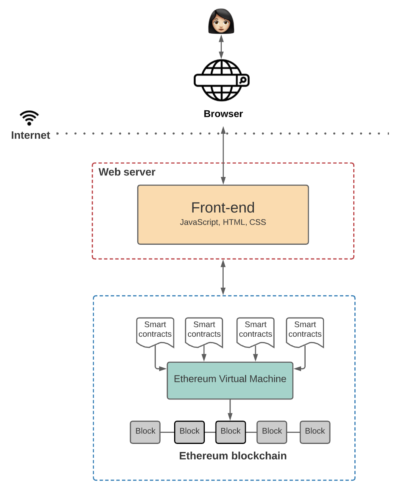

# **Chapter 1: Understanding Blockchain Scalability Challenges**

## **Introduction**  

Blockchain technology promises a decentralized, secure, and transparent approach to handling digital transactions and computation. However, as its adoption grows, scalability remains a significant barrier preventing blockchain networks from achieving mass adoption. Unlike traditional centralized systems like VISA or PayPal, which process thousands of transactions per second (TPS), major blockchain networks like Ethereum and Bitcoin struggle to achieve even a fraction of that throughput.

Scalability is critical not just for financial transactions but also for broader applications like gaming, AI-driven agents, and supply chain tracking. This chapter introduces blockchain scalability issues, examining real-world bottlenecks, past challenges, and industry efforts to redefine what scalability means in a decentralized system.

---
## **The Scalability Gap: A Comparative View**  

To understand blockchain’s scalability problem, we must compare its performance with traditional financial networks:  

| **System**       | **Transactions Per Second (TPS)** | **Notes** |
|-----------------|-------------------------------|----------|
| **VISA**       | 24,000                        | Centralized payment network |
| **PayPal**     | 193                            | Centralized digital payments |
| **Ethereum**   | ~20                            | General-purpose smart contracts |
| **Bitcoin**    | ~7                             | Secure but slow settlement |
| **Solana**     | ~4,000                         | High TPS, but network outages |
| **Aptos**      | ~160,000                       | Uses parallel execution (MoveVM) |

Ethereum is the **second-largest cryptocurrency by market cap after Bitcoin**, but it is much more than just a digital asset. **Ethereum is a decentralized computing platform capable of running a wide variety of applications, including an entire ecosystem of decentralized finance (DeFi) protocols.** However, despite its versatility, Ethereum's ability to process **only 20 TPS** presents a major bottleneck.  

As a decentralized **world computer**, Ethereum facilitates **smart contracts, DeFi applications, and NFT transactions**. If it is to serve as the backbone of an **open, global financial system**, it must be capable of handling a significantly higher transaction load. However, in its current form, Ethereum's **execution model requires network-wide consensus for every transaction**, which severely limits throughput.  

This limitation raises two fundamental concerns:  
1. **Network Congestion:** When too many users submit transactions simultaneously, the network struggles to handle the load.  
2. **Gas Fees:** Increased competition for block space leads to rising transaction fees, making blockchain transactions costly.  

However, scalability is not unique to Ethereum. It is a **universal challenge** faced by virtually all blockchain networks, from Bitcoin’s 7 TPS to high-throughput chains like Solana and Aptos. Each blockchain approaches scalability differently, often making trade-offs between **throughput, decentralization, and security** —a concept we will explore in detail in later chapters.

This book is not just about Ethereum’s scalability; It is about **blockchain scalability as a whole**. Blockchain researchers are exploring Layer 2 scaling solutions, sharding, and alternative consensus mechanisms. This book will examine these approaches in depth.

---
## **Understanding Gas Fees and Transaction Costs in Ethereum**  

Ethereum and many other blockchains operate as a **decentralized computing platform**, enabling smart contracts and decentralized applications (dApps) to execute code in a trustless manner. However, executing computations and storing data on Ethereum requires resources, which leads us to the concept of **gas**.  

### **What Is Gas?**  

Gas is a fundamental unit in Ethereum that **measures the computational work required to process transactions and execute smart contracts**. Every operation performed by the **Ethereum Virtual Machine (EVM)** consumes a certain amount of gas.  

For example:  
- **A simple ETH transfer** (sending ETH from one address to another) **costs 21,000 gas**.  
- **Interacting with smart contracts** (e.g., swapping tokens on Uniswap) may require significantly **more gas**, depending on the complexity of the operation.  

Gas itself is not a currency—it is just a measurement unit. However, gas must be **paid for** using **ETH** for Ethereum, and this cost fluctuates based on network demand.  

### **Why Do Gas Fees Fluctuate?**  

Ethereum transactions do not process at a fixed cost. Instead, users must **bid** for block space by offering a gas price, measured in **gwei** (1 gwei = 0.000000001 ETH). When the network is congested, users must compete to get their transactions included in the next block, leading to higher fees. For example, during the 2021 NFT boom, minting an NFT could cost upwards of $200 in gas fees, making it inaccessible for many users.

Gas fees depend on three main factors:  

1. **Gas Limit:** The maximum amount of gas a transaction is allowed to consume.  
2. **Base Fee:** A dynamically adjusted minimum fee set by Ethereum’s protocol based on network congestion.  
3. **Priority Fee (Tip):** An optional tip paid to miners/validators to prioritize transactions.  

### **The Impact of Gas Fees on dApps and Users**  

Gas fees play a **crucial role in network security**—they prevent spam attacks by making transactions costly. However, they also pose significant challenges:  
- **High costs** make small transactions impractical (e.g., buying a $5 NFT with a $50 gas fee).  
- **Variable fees** lead to unpredictable transaction costs.  
- **Smart contract interactions** (e.g., DeFi swaps, NFT minting) can be prohibitively expensive during peak congestion.  

### **Ethereum Gas Fees and scalability in Action**  

To better understand how gas fees and scalability impact the network, let’s examine a real-world example: **CryptoKitties**, one of the first dApps to expose Ethereum’s scalability limitations.  

---
## **Case Study: CryptoKitties and Network Congestion**  

CryptoKitties, one of Ethereum's earliest viral dApps, allowed users to breed and trade digital cats on-chain. The architecture was simple:  

- A **frontend** connected to Ethereum smart contracts.  
- Smart contracts handled **breeding, trading, and storage** of NFT assets.

Unlike traditional applications with centralized databases and backends, **CryptoKitties relied entirely on Ethereum smart contracts for logic execution**.  

### **The Scaling Problem**  

At launch, CryptoKitties' popularity **overloaded the Ethereum network**, causing:  
- **Severe network congestion** as thousands of users submitted transactions simultaneously.  
- **Spikes in gas fees**, making simple transactions expensive.  
- **Delays in transaction confirmation**, leading to a poor user experience.  

At its peak, CryptoKitties accounted for over 10% of Ethereum’s total transaction volume, causing gas fees to spike by 500%. This event highlighted the limitations of blockchain scalability and prompted the industry to search for better performance metrics.  

While Ethereum’s gas fees are a well-known example of transaction costs, other blockchains face similar challenges. Here’s how some popular networks handle fees and the trade-offs involved:

#### Bitcoin: Simplicity at a Cost
Bitcoin uses a fee market where users bid for block space. While this model is simple, it can lead to high fees during periods of congestion, as seen in December 2017 when average fees reached $55.

#### Solana: Low Fees, High Throughput
Solana offers extremely low fees (e.g., $0.00025 per transaction) due to its high throughput. However, its network has experienced congestion and outages during peak demand, highlighting the challenges of scaling without compromising reliability.

#### Binance Smart Chain: Lower Fees, Fewer Validators
BSC’s gas fees are paid in BNB and are generally lower than Ethereum’s. However, its smaller validator set raises concerns about centralization, and fees can still spike during periods of high demand.

#### Cardano: Predictable Fees
Cardano uses a fixed fee structure (e.g., 0.17 ADA per transaction), making costs predictable. However, its current throughput of ~250 TPS may limit its ability to handle large transaction volumes.

These examples illustrate that transaction costs and scalability challenges are universal in blockchain technology, though each network approaches them differently.

| **Blockchain**       | **Fee Mechanism**               | **Average Fee**       | **Challenges**                              |
|-----------------------|----------------------------------|-----------------------|---------------------------------------------|
| Ethereum             | Gas fees (bid-based)            | $10–$50 (varies)     | High fees during congestion                 |
| Bitcoin              | Fee market (bid-based)          | $1–$50 (varies)      | High fees during congestion                 |
| Solana               | Fixed fee                       | $0.00025             | Network congestion, outages                 |
| Binance Smart Chain  | Gas fees (paid in BNB)          | $0.10–$0.50          | Centralization concerns                     |
| Cardano              | Fixed fee                       | 0.17 ADA             | Limited throughput                          |
| Avalanche            | Gas-like fees (paid in AVAX)    | $0.01–$0.10          | Complexity of subnets                       |
| Polygon              | Layer 2 fees (settled on Ethereum) | $0.01–$0.05       | Reliance on Ethereum for final settlement   |

---
## **What Does “Scalability” Really Mean?**  

The term **scalability** is frequently used in blockchain discussions, but defining it precisely is challenging. Does it mean:  

- Higher **transactions per second**?  
- Faster **block finalization**?  
- More efficient use of **hardware resources**?  
- Achieving greater throughput **without centralization**?  

### **Lack of a Formal Definition**  

In multiprocessor computing, **scalability** is commonly discussed, but a widely accepted technical definition is lacking. In a seminal research paper, **Mark D. Hill** notes:  

> "Scalability is a frequently claimed attribute of multiprocessor systems. While the basic concept is intuitive, there is no generally accepted definition of scalability." [^1]

[^1]: Mark D. Hill, *What is Scalability？*. [Available here](https://minds.wisconsin.edu/bitstream/handle/1793/9676/file_1.pdf?sequence=1&isAllowed=y).

This ambiguity extends to blockchain. Without a standard metric, projects often define scalability in ways that serve their marketing rather than technical clarity.  

---
## **Defining Scalability: Lessons from Databases**  

Scalability is a concept that transcends blockchain technology. To clearly define blockchain scalability, it’s helpful to first explore how scalability is defined and measured in traditional databases—systems that have been optimizing for performance and growth for decades. By understanding the principles of database scalability, we can better appreciate the unique challenges and opportunities in blockchain systems.  

### **What Is Database Scalability?**  

In the context of databases, scalability refers to the system’s ability to handle increasing workloads—such as more users, transactions, or data—without degrading performance. A scalable database can grow to meet demand, whether by adding more resources to a single machine (**vertical scaling**) or distributing the workload across multiple machines (**horizontal scaling**).  

### **How Is Database Scalability Measured?**  

Database scalability is typically quantified using the following metrics:  

- **Throughput**: The number of transactions or queries the system can process per second (**TPS** or **QPS**).  
- **Latency**: The time it takes to complete a single transaction or query.  
- **Resource Utilization**: How efficiently the system uses hardware resources (e.g., CPU, memory, storage).  
- **Elasticity**: The ability to scale up or down dynamically in response to changing workloads.  

These metrics provide a clear framework for evaluating scalability, whether in centralized databases or decentralized blockchains.  

---

## **Fundamental Problems in Blockchain Scalability**  

While traditional databases have largely solved scalability through centralized or semi-centralized approaches, blockchains face unique challenges due to their **decentralized nature**. The core problems in blockchain scalability stem from three fundamental requirements:  

1. **Replicated Computation** → Every node in the network processes all transactions, leading to redundant computation.  
2. **Replicated Storage** → Every node stores all historical data, resulting in significant storage overhead.  
3. **Consensus Overhead** → Nodes must agree on the total ordering of transactions, which introduces communication and coordination costs.  

These requirements create a **scalability trilemma**: achieving **high throughput, low latency, and decentralization** simultaneously is extremely difficult.  

For example:  

- **In Bitcoin and Ethereum**, every node processes all transactions and stores the entire blockchain, limiting throughput and increasing latency.  
- **Consensus protocols like Proof of Work (PoW) or Proof of Stake (PoS)** add significant overhead, further reducing scalability.  

---

## **Fundamental Challenges for Scalable Blockchain Systems**  

To address these problems, the blockchain community is exploring whether it’s possible to achieve:  

- **Partial Transaction Processing** → Can nodes process only a subset of transactions, rather than all of them?  
- **Partial Data Storage** → Can nodes store only a portion of the blockchain data, rather than the entire history?  
- **Efficient Consensus** → Can consensus protocols be optimized to reduce communication overhead while maintaining security?  

These challenges are often framed in terms of three key properties:  

- **State Validity** → Ensuring that the state of the blockchain (e.g., account balances, smart contract states) is correct and consistent across nodes.  
- **Data Availability** → Ensuring that all necessary data is available for validation, even if nodes only store partial data.  
- **Byzantine Adversary Resistance** → Ensuring that the system remains secure and consistent even in the presence of malicious actors.  

---

## **Defining Blockchain Scalability**  

Given these challenges, we can define **blockchain scalability** as the ability of a blockchain system to:  

- **Increase throughput** (transactions per second) without significantly increasing latency.  
- **Reduce resource usage** (computation, storage, and communication) while maintaining decentralization and security.  
- **Scale dynamically** to handle growing workloads, such as more users, transactions, or smart contract interactions.  

Unlike traditional databases, **blockchain scalability must be achieved without compromising the core principles of decentralization, security, and immutability**. This makes scalability one of the most pressing challenges in blockchain technology today.  

---
## **Learning from Traditional Systems: Benchmarking Scalability**  

Now that we have defined blockchain scalability and examined its fundamental challenges, a natural question arises: **how do we measure scalability effectively?** The blockchain industry still lacks a universal standard for benchmarking scalability, making it difficult to compare different systems objectively.  

To better understand the importance of benchmarking, we can turn to **database systems**, which have been optimizing for performance and scalability for decades. **The benchmarking methodologies used in databases provide valuable insights into how structured performance evaluation can drive improvements and innovation.**  

---

## **Benchmarking Databases: A Systematic Approach**  

In the database industry, benchmarking plays a crucial role in evaluating **performance, scalability, and efficiency**. Over decades, database systems have developed structured benchmarking methodologies that help compare different architectures under standardized conditions. These benchmarks are essential because they provide a **consistent, repeatable** way to measure how systems handle increasing workloads, allowing developers and researchers to optimize performance.  

---

### **How Are Databases Benchmarked?**  

Databases are benchmarked using **standardized testing frameworks** that assess performance across various workloads. Some of the most widely used database benchmarks include:  

- **TPC-C** – Measures online transaction processing (**OLTP**) performance, simulating real-world e-commerce workloads.  
- **TPC-H** – Evaluates **decision-support systems** and complex queries.  
- **YCSB (Yahoo! Cloud Serving Benchmark)** – Designed for benchmarking **NoSQL databases** and key-value stores.  
- **OLTPBench** – A framework that supports multiple **transactional workloads** for relational databases.  

Each benchmark focuses on key performance indicators such as:  

- **Throughput (Transactions Per Second, TPS)** – Measures how many transactions the system can process within a given time.  
- **Latency** – Assesses the delay between submitting a query and receiving a response.  
- **Scalability** – Evaluates how well the system adapts as the number of users, queries, or nodes increases.  
- **Concurrency Handling** – Determines the system’s ability to process multiple operations simultaneously.  
- **Resource Utilization** – Examines how efficiently the system uses **CPU, memory, and storage**.  

These benchmarks follow **rigorous methodologies**, ensuring **fair comparisons** across different database architectures, whether **relational (SQL) or NoSQL systems**.

---

### **Why Is Benchmarking Important?**  

1. **Standardization** – It allows for **objective comparisons** between different database implementations.  
2. **Optimization** – Helps engineers identify **bottlenecks** and optimize performance.  
3. **Scalability Insights** – Demonstrates how a database performs under **real-world, high-load conditions**.  
4. **Industry Adoption** – A well-established benchmark can influence **technology adoption** by enterprises.  

Without proper benchmarking, database performance claims would be **inconsistent, misleading, or difficult to verify**. The structured benchmarking frameworks provide **scientific rigor** to ensure that improvements in performance are **measurable and reproducible**.  

---

### **Challenges in Benchmarking Databases**  

While database benchmarking has been widely adopted, it is **not without challenges**:  

- **Diverse Workloads** → Different databases are optimized for different use cases (**OLTP vs. OLAP**), making direct comparisons difficult.  
- **Hardware Variability** → Performance can be heavily influenced by **underlying infrastructure**, requiring careful test standardization.  
- **Tuning & Optimization** → Some databases require extensive **manual tuning** to perform well in benchmarks, which may not reflect real-world conditions.  
- **Scalability Metrics** → Traditional benchmarks measure **centralized scalability**, but distributed systems introduce new variables like **consistency models, replication lag, and fault tolerance**.  

Despite these challenges, **database benchmarking remains one of the most reliable ways to evaluate system performance**, providing valuable insights for system architects and engineers.

---

## **Relevance to Blockchain Benchmarking**  

Understanding how databases are benchmarked helps us appreciate **why benchmarking blockchains is even more complex**. Unlike traditional databases, **blockchains introduce decentralization, consensus mechanisms, and cryptographic constraints**, making performance evaluation far more challenging.  

In the next section, we’ll explore how the blockchain industry is attempting to **develop standardized benchmarking frameworks**, such as **BLOCKBENCH**, to measure blockchain scalability systematically.  

---
## **Benchmarking Blockchain Scalability: BlockBench & Gas Per Second**  

As blockchain adoption grows, the need for **scalability benchmarking** becomes increasingly important. Unlike traditional databases, where performance can be measured using well-established benchmarks like TPC-C and YCSB, blockchain lacks a universal standard for measuring scalability. This makes it difficult to compare different blockchain implementations objectively.  

Two emerging approaches—**BlockBench** and **Gas Per Second (GPS)**—offer early attempts to standardize blockchain performance metrics.  

---

### **BlockBench: A First Step Toward Blockchain Benchmarking**  

BlockBench is one of the earliest frameworks developed to benchmark **private (permissioned) blockchains**. It introduces a structured methodology for evaluating blockchain scalability, focusing on three key layers:  

1. **Consensus Layer** – Measures how different consensus algorithms (e.g., PBFT, PoW, PoA) affect performance.  
2. **Data Layer** – Analyzes blockchain storage models and how they impact read/write speeds.  
3. **Execution Layer** – Benchmarks smart contract execution speed and efficiency, particularly for EVM-based chains.  

BlockBench evaluates **throughput, latency, and fault tolerance** using real-world workloads, such as key-value storage benchmarks (YCSB) and OLTP-style transactions.  

However, while BlockBench provides a useful starting point, its focus is primarily on **private blockchains**, making it **less relevant for public, high-throughput blockchains like Ethereum**.  

---

### **Gas Per Second: A More Accurate Measure for EVM Chains**  

While **Transactions Per Second (TPS)** is commonly used to measure blockchain performance, it has limitations—**not all transactions consume the same computational resources**. A more precise metric, **Gas Per Second (GPS)**, offers a better way to benchmark Ethereum and EVM-compatible blockchains.  

#### **Why GPS Matters**
- **Gas measures computational effort, not just transaction count.**  
- **GPS accounts for both execution and storage costs**, making it a better performance indicator than TPS.  
- **Helps prevent DoS attacks** by ensuring that performance evaluations account for resource usage, not just raw transaction count.  

GPS is calculated as:  
> **Gas Per Second = (Target Gas Usage Per Block) / (Block Time)**  

This metric allows researchers and developers to compare execution performance across different Ethereum-based Layer 1 and Layer 2 chains, offering a **standardized way to assess scalability**.  

---

### **The Road Ahead for Blockchain Benchmarking**  

While **BlockBench** and **GPS** are steps in the right direction, blockchain benchmarking is still in its infancy. A **comprehensive performance benchmark** should account for:  

1. **Execution scalability** – How efficiently smart contracts are processed.  
2. **State growth impact** – The cost of managing increasing blockchain state sizes.  
3. **Hardware utilization** – How well different clients optimize CPU and storage usage.  
4. **Cross-chain interoperability** – Performance across modular execution layers.  

Standardizing blockchain benchmarks will require ongoing collaboration between **developers, researchers, and infrastructure providers**. As blockchains move beyond experimental scaling models, rigorous benchmarking will be essential to ensuring that new architectures **deliver real performance gains** without compromising decentralization or security.  

---

## **Why This Matters**  

Understanding **database scalability** provides a useful benchmark for evaluating **blockchain scalability**. However, the **decentralized nature** of blockchains introduces unique constraints that require **innovative solutions**. By addressing the fundamental problems of **replicated computation, replicated storage, and consensus overhead**, and tackling the fundamental challenges of **state validity, data availability, and Byzantine adversary resistance**, the blockchain community can pave the way for **scalable, high-performance systems**.  

In the next section, we’ll explore how these challenges are being addressed through **Layer 1 and Layer 2 solutions**, as well as technologies like **sharding** and **rollups**.