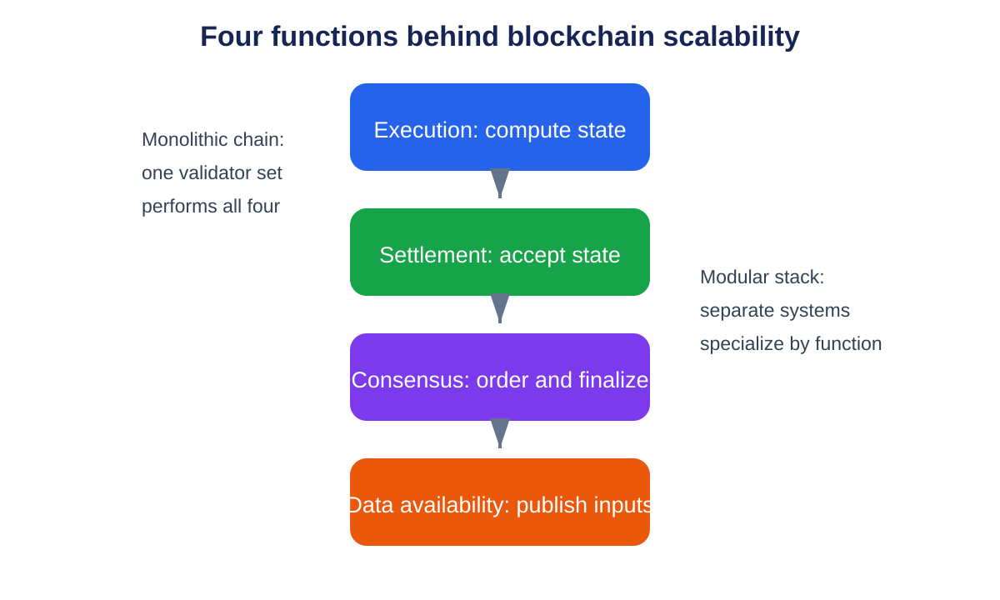

# **Chapter 1: Understanding Blockchain Scalability Challenges**

## **Introduction**

Blockchain scalability is the ability to support increasing useful demand while keeping verification, participation, and failure recovery within acceptable resource and latency bounds. The definition deliberately includes more than transactions per second. It asks what work completed, when it became final, which machines and operators were required, and what happens when a component fails.

Public blockchains combine replicated execution and storage with adversarial consensus. That redundancy lets users verify shared state without trusting one database operator, but it also makes capacity expensive. The techniques in this book divide, compress, schedule, or prove the work while trying to preserve that independent check.

## **A Minimal Blockchain Model**

Before discussing scalability, it helps to picture the smallest useful blockchain.

A **transaction** is a signed instruction, such as "send one token to Maya" or "exchange these two assets." A digital signature lets anyone verify that the holder of a private key authorized the instruction without revealing the private key.

Transactions are grouped into **blocks**. Each block points to the preceding block by including its cryptographic hash, a short fingerprint that changes if the earlier data changes. These links create an ordered history. Changing an old block would change its fingerprint and every later link.

A blockchain also maintains **state**: the latest balances, contract storage, ownership records, and other values applications use now. A transaction changes the old state into new state under deterministic rules. "Deterministic" means honest computers starting from the same inputs calculate the same result.

Several independent computers, called **nodes**, exchange transactions and blocks. Some nodes participate in **consensus**, the protocol for choosing one canonical order when messages arrive at different times or a participant lies. A **validator** is a consensus participant that checks proposed blocks and votes, attests, or otherwise helps the network accept them. A **block producer** proposes an ordered block. One machine can fill several roles, but the roles are conceptually different.

The word **canonical** means "the version the protocol currently accepts." This matters because two valid-looking blocks can briefly compete. A wallet may first show a transaction as included, then wait for **finality**, the point at which the protocol's assumptions make reversal sufficiently unlikely or forbidden. Finality is not instant by definition; later chapters distinguish probabilistic and voting-based forms.

### **Why replicate the work?**

A normal online service can keep one authoritative database. Users trust its operator to preserve balances and apply rules. A public blockchain instead lets many parties hold and check the same history. Replication is intentionally inefficient: it prevents one database owner from silently rewriting the result.

Imagine a shared notebook copied to hundreds of desks. Everyone checks each new page before adding it. The copies make tampering visible, but every page must travel to many desks and be checked many times. Blockchain scalability asks how to handle more useful work without abandoning the checks that make the notebook trustworthy.

### **Accounts, contracts, and virtual machines**

An **account** identifies an owner or program and may hold assets or data. A **smart contract** is a program stored and executed under blockchain rules. It does not understand legal intent; it applies code to inputs and current state.

A **virtual machine (VM)** defines the contract instruction set and execution rules. Ethereum's VM is the **EVM**. Every EVM validator must calculate the same result for the same ordered transactions. This shared execution enables applications to interact, but it also makes computation a replicated resource.

### **Hashes, trees, and commitments**

A cryptographic hash maps any input to a fixed-length fingerprint. Finding two useful inputs with the same fingerprint should be infeasible. Protocols combine hashes into a **Merkle tree**, where leaf fingerprints are repeatedly paired and hashed until one **root** remains.

The root is a compact **commitment** to all leaves. A **Merkle proof** supplies the few neighboring hashes needed to show that one leaf belongs under that root. Think of the root as a tamper-evident seal on a large filing cabinet: the proof opens one drawer while still letting the verifier check the seal.

State roots, transaction roots, data commitments, and proof systems build on this idea. A commitment proves what data was bound only when the verifier also has a valid proof and the protocol specifies how the data was encoded.

### **The basic user journey**

A transfer usually follows these steps:

1. a wallet constructs and signs a transaction;
2. a node receives it and shares it with peers;
3. a producer selects and orders it in a block;
4. validators check signatures, rules, and the resulting state;
5. consensus accepts the block as canonical;
6. later blocks or votes strengthen finality;
7. wallets and applications update what they show the user.

The same action therefore has several completion points: submitted, received, included, executed, accepted, and final. Much confusion about blockchain performance comes from timing one point and comparing it with another.

### **The adversarial setting**

Ordinary distributed systems expect crashes and network delay. Blockchains also consider **Byzantine faults**: participants may send conflicting messages, fabricate data, censor users, or coordinate attacks. A system's security claim must say how many or how much weight may be Byzantine and which network conditions are assumed.

**Safety** means honest participants do not accept incompatible outcomes. **Liveness** means valid work eventually progresses under the stated conditions. A network partition may preserve safety by halting, or preserve availability by letting sides continue and reconciling later. Asset systems usually make that choice explicit because accepting two conflicting spends creates loss.

### **Where scaling enters**

The basic design repeats computation, storage, data transfer, and consensus. Scaling techniques change that repetition:

- **sharding** assigns different work to different groups;
- **channels** keep repeated interactions between participants off the shared chain;
- **rollups** execute batches elsewhere and publish data plus a proof or challenge path;
- **data availability sampling** lets nodes test that large published data can be recovered without downloading all of it;
- **parallel execution** runs independent transactions at the same time;
- **succinct proofs** let a verifier check a large computation with a much smaller proof.

Every shortcut must answer the beginner's most important question: if fewer parties do the original work, what evidence lets everyone else trust the result, and what can a user do when that evidence or service is missing?

---
## **Why Naive Comparisons Fail**

A payment network, an exchange database, and a public blockchain perform different work under different trust assumptions. A card network may authorize a payment quickly while settlement, fraud handling, and bank reconciliation occur later. A public blockchain validates signatures, executes shared state, propagates data, and reaches Byzantine consensus before offering its strongest finality.

This does not make performance comparison useless. It means the comparison must hold the workload and completion boundary constant. A transfer-only TPS figure cannot be compared with arbitrary smart-contract execution. A sequencer acknowledgement cannot be compared with L1 finality. A laboratory cluster cannot be compared with a geographically distributed validator network without reporting the difference.

The immediate symptoms of insufficient capacity are familiar: transactions wait, fee markets rise, users retry, and applications become unreliable. Historic events such as the CryptoKitties congestion episode made those symptoms visible. Their precise fees and shares of network traffic are less important than the mechanism: demand exceeded scarce blockspace, so inclusion latency and price rose together.

## **Gas and the Price of Shared Computation**

Ethereum meters execution in **gas**. Every operation consumes a defined gas amount, and a transaction supplies a gas limit that bounds its work. This prevents a Turing-complete program from consuming validator resources forever.

Since EIP-1559, an Ethereum transaction pays a protocol-determined **base fee** that is burned and may add a **priority fee** to reward inclusion. The base fee changes with block utilization. The transaction's execution payment is approximately:

> `gas used × (base fee + priority fee)`

Blob-carrying transactions use a separate blob fee market. This separation matters for scaling: rollup data demand can change without pricing every EVM operation identically.

Gas is both metering and congestion pricing. It approximates execution and state cost well enough for the protocol to ration resources, but it is not a perfect hardware benchmark. An opcode's gas schedule is a governance and security parameter, while actual client performance changes with software and hardware.

## **Case Study: Congestion and Application Design**

When one popular application fills blocks, every application sharing the fee market competes for the same capacity. Users who need immediate inclusion bid more; users with low-value actions wait or leave. This is the practical consequence of synchronous composability: applications share one state and can interact atomically, but they also share congestion.

Scaling designs respond differently. A larger L1 block admits more shared activity but raises validator load. An application-specific chain isolates congestion but fragments state and security. A rollup batches application execution and shares the cost of data publication. A state channel avoids publishing repeated interactions but works only for a constrained participant set.

The right design depends on whether the application needs global synchronous state, how valuable its assets are, what latency users need, and how they recover from operator failure.

## **Named Case Study: From CryptoKitties Congestion to a Production Rollup Workload**

**Deployment labels: the CryptoKitties episode is historical production; Arbitrum One is a current production rollup.** Together they show that scaling is not merely increasing one transactions-per-second number. The 2017 episode exposed a capacity knee on Ethereum's shared execution layer. A modern rollup moves much application execution into another pipeline, but adds sequencing, batch publication, proof and bridge boundaries that users must understand.

### **Ethereum in December 2017: one application meets shared blockspace**

CryptoKitties let users buy, breed and transfer unique on-chain cats. Breeding was not one cheap database update. The application's own incident post explained that `giveBirth()` combined genetic data in a contract call using more than 250,000 gas, over ten times the 21,000 gas of a simple ETH transfer. When demand surged, the team said Ethereum was "completely full," raised its suggested gas price to 25 gwei, and increased the birthing fee from 0.002 ETH to 0.015 ETH so independent callers would again have an incentive to execute births.[^4]

Trace one congested birth. A user submitted the breeding transaction and waited through the gestation rule. A later `giveBirth()` call had to enter Ethereum's public transaction pool and compete for block gas with unrelated payments, token sales and contract calls. Miners selected transactions partly by fee. A previously reasonable gas price could become uncompetitive while the transaction waited. If the user's account then sent a higher-nonce transaction, that later work could wait behind the underpriced nonce.

The application had also created a time-sensitive external incentive. Anyone could call `giveBirth()` and receive the birthing fee. Under normal fees, community-operated bots performed this work. When gas cost exceeded the fixed reward, those operators stopped and the CryptoKitties team paid the difference itself. Congestion therefore changed more than latency: it changed who could economically perform a safety- and fairness-related application action.

MetaMask reported user confusion over long-pending and failed transactions, expanded infrastructure capacity, and added a way to resubmit with a higher gas price.[^5] Consensys's retrospective describes rising pending queues, overloaded read infrastructure, fees that could exceed the item being purchased, and application changes that moved nonessential activity away from on-chain transactions.[^6] These are observable consequences of offered load exceeding several capacities at once: block gas, fee estimation, mempool management, RPC service, user nonce management, and application support.

Failure path: the user saw no completion and resent without understanding nonce replacement. The wallet could create another pending transaction rather than more capacity. An underpriced earlier nonce could hold later actions. A centralized birth bot could keep the game moving but change the application's operational trust. The correct short-term tools were status, fee replacement, queue visibility and reducing unnecessary writes. The long-term lesson was to separate which actions require global consensus from browsing, offers, indexing and other work that can remain off-chain.

### **Arbitrum One: the same demand enters a layered pipeline**

Now place an NFT marketplace workload on Arbitrum One. Users submit transfers, listings and contract calls to the Arbitrum sequencer. Nitro executes EVM-compatible transactions and the sequencer feed gives applications fast soft confirmations. A batch poster compresses ordered transactions and publishes them to Ethereum through blobs or calldata. Validators reproduce execution, state assertions are governed by the BoLD dispute protocol, and canonical withdrawals wait for the accepted state path described in Chapter 6.[^7] [^8]

At the user interface, this feels faster because the application need not wait for every individual call to win space in an Ethereum L1 block. Many L2 transactions share one compressed data-publication cost. But the production workload now consumes a resource vector:

```text
sequencer admission and execution
+ L2 state reads and writes
+ compressed bytes in an Ethereum batch
+ blob/calldata publication and settlement gas
+ validator replay and assertion/dispute capacity
+ bridge and withdrawal processing
```

Congestion can move rather than disappear. A popular mint can saturate sequencer execution or create one hot contract state. Ethereum blob prices can raise the shared publication component. A batch backlog can make soft confirmations diverge in age from L1-published data. A sequencer outage can stop the fast path, after which users rely on the delayed inbox and pay L1 cost. A proof or assertion dispute can delay canonical withdrawals even while the L2 interface remains responsive.

The production dashboard should therefore report at least sequencer acceptance latency, L2 inclusion, oldest unpublished batch age, data-publication cost and bytes, assertion status, forced-inclusion queue, withdrawal age, and Ethereum settlement finality. L2BEAT's Arbitrum One page is an example of an independent view that separates activity, data posted, liveness, state validation, operator, sequencing, withdrawals, permissions and upgrades rather than compressing the system into TPS.[^9]

Failure path: the sequencer accepts a user's purchase and then stops before publication. The user has a soft receipt but no canonical Ethereum batch evidence yet. The wallet should say this and offer the delayed-inbox route when warranted, not call the purchase settled. If Ethereum blobspace becomes expensive, the rollup can amortize cost across a batch, but users may still see higher L2 data fees or delayed posting. If a disputed assertion is false, BoLD needs an effective honest validator with data and the ability to act. If an emergency upgrade replaces critical code, ordinary proof assumptions do not answer whether governance used that power safely.

### **What actually improved**

| Question | 2017 Ethereum application | Production rollup application |
|---|---|---|
| User's fast path | Public L1 mempool and miner inclusion | Rollup sequencer and L2 execution |
| Shared scarce resource | L1 block gas for each contract call | L2 execution plus compressed shared L1 data and settlement |
| Early acknowledgement | Mempool visibility | Sequencer receipt or L2 block |
| Stronger completion | Included history under Ethereum confirmation policy | Batch published, assertion accepted, Ethereum finality; withdrawal has another bridge boundary |
| Congestion symptom | Pending nonces, gas bidding, RPC load, unaffordable application calls | Sequencer queue, hot L2 state, publication backlog, blob price, withdrawal delay |
| Escape/recovery | Replace or wait for L1 transaction; application redesign | Forced L1 inbox, independent replay/challenge, canonical bridge path, plus governance controls |

The rollup increases useful capacity by compressing data and avoiding repeated L1 execution. It also creates more completion states. That is an acceptable engineering trade when each state is measurable and recovery is real. The wrong comparison takes CryptoKitties-era L1 transactions per second and places it beside sequencer acknowledgements. The correct comparison fixes the contract workload, reports hardware and data cost, and follows each transaction to the security boundary the application actually needs.


## **From Database Benchmarks to Blockchain Benchmarks**

Database benchmarks show why a workload must be specified. TPC-C, analytical queries, and key-value workloads exercise different resources. A result becomes meaningful through a transaction mix, dataset, concurrency, duration, hardware, tuning policy, and latency objective.

Blockchain evaluation keeps those controls and adds consensus topology, state replication, signature work, adversarial faults, finality, and recovery. BlockBench helped separate consensus, data, and execution behavior in permissioned blockchains.[^2] Gas per second is useful for comparing EVM execution because transactions consume different gas, but it remains only one resource metric: gas schedules approximate work and omit network consensus, data availability, proof generation, and long-run state costs.[^3]

The right output is not one universal score. It is an operating envelope showing which workloads a system sustains, on which resources, at which latency and finality boundary, and under which faults.

## **A Scalability Model for This Book**

The word *scalability* has long lacked one universally accepted systems definition.[^1] In blockchain discussions, it is often used when a team really means peak throughput. This book uses a stricter definition:

> A blockchain scales when it can support increasing useful demand while keeping verification, participation, and failure recovery within acceptable cost and latency bounds.

This definition has four consequences. First, the workload must be specified. Ten thousand independent transfers are not equivalent to ten thousand swaps that all modify one liquidity pool. Second, resources must be specified: CPU model, core count, memory, storage, network bandwidth, validator count, and geographic distribution. Third, security must remain comparable. A system that replaces 1,000 independent validators with one database has increased capacity but has not demonstrated blockchain scalability. Fourth, the result must survive failure. Normal-path TPS says little about a sequencer outage, leader change, data withholding attack, or mass exit.

### **Throughput, Latency, and Capacity**

*Throughput* is completed work per unit time. *Latency* is the time one request takes. *Capacity* is the maximum sustainable load before latency or failure rate becomes unacceptable. They interact but are not interchangeable.

A batching system illustrates the distinction. Waiting to collect 1,000 transactions may increase throughput and reduce cost per transaction, but the first user in the batch waits longer. A pipelined consensus protocol may commit one block per round after warming up even though each block needs several rounds to reach finality. Always ask which quantity improved.

### **Vertical and Horizontal Scaling**

Vertical scaling extracts more work from one machine by using faster hardware or better software. Horizontal scaling divides work among machines. Blockchains need both, but horizontal scaling is harder because machines may be faulty or adversarial and must agree on shared state.

A useful mental model is a replicated state machine. If every validator executes every transaction, adding validators increases redundancy and security but does not add execution capacity. Sharding, rollups, and parallel execution change which work is repeated, where it is performed, or how independent work is scheduled.

## **A Transaction as a Resource Vector**

TPS treats every transaction as one unit. In reality, a transaction consumes several resources:

- signature verification and EVM computation;
- state reads and writes;
- bytes propagated across the network;
- bytes retained temporarily or permanently;
- consensus votes and block space;
- proof generation or verification in a validity system.

Represent a workload as a vector rather than a count. A calldata-heavy rollup batch stresses data bandwidth. A zero-knowledge application may stress proving. A hot DeFi contract stresses sequential state access. The sustainable transaction rate is bounded by the first exhausted resource.

Ethereum gas captures part of computation and storage cost, which makes gas per second more informative than transfer TPS. It is still not a universal metric because gas schedules approximate resource usage and exclude consensus and off-chain proving.

## **Worked Example: Benchmarking Two Chains**

Chain A reports 20,000 TPS using simple transfers on eight validator machines in one data center. Chain B reports 4,000 TPS using contract calls across 200 geographically distributed validators. Chain A is faster for the measured workload, but the headline does not establish that its architecture is more scalable.

A fair experiment fixes or reports the transaction mix, validator hardware, network topology, state size, block size, duration, client version, and tolerated failure rate. It measures p50 and p99 latency, not only the average. It runs long enough to expose state growth and database compaction. It introduces a faulty leader or network delay and records recovery.

The output should be a curve. At low load, latency is stable. As offered load approaches capacity, queues form and tail latency rises. Beyond the knee, throughput may flatten while failures increase. The knee of that curve under a realistic workload is more useful than one peak number.

## **The Four-Layer Evaluation Framework**

<p align="center">
  
  <br>
  <em>Figure 1.4: A blockchain transaction depends on execution, settlement, consensus, and data availability. Monolithic chains combine them; modular systems separate some roles. Original figure for this book.</em>
</p>


The chapters ahead repeatedly separate four functions:

1. **Execution** computes state transitions.
2. **Settlement** decides which transition is accepted and resolves disputes.
3. **Consensus** orders data and finalizes a history.
4. **Data availability** ensures that the information needed for verification can be obtained.

A monolithic chain performs all four together. A rollup may execute elsewhere while Ethereum supplies settlement, consensus, and data. A modular DA layer may order and publish data without knowing an application's execution rules. Keeping these functions separate prevents category errors, such as assuming a validity proof also proves data availability or assuming a bridge gives a sidechain Layer 1 security.

## **Security and Decentralization Measurements**

Decentralization is not a raw node count. Nodes operated by one company, hosted in one cloud, or controlled by one key do not provide independent failure domains. Relevant measures include stake or hash-power concentration, client diversity, hosting and geographic distribution, hardware requirements, governance power, and the ability of an ordinary user to verify and exit.

Security should be expressed as an adversary model. What fraction of validators can be Byzantine? Can the attacker delay the network, corrupt participants adaptively, or withhold data? Which guarantees fail first: liveness, safety, censorship resistance, or data retrieval? A protocol is secure only relative to those assumptions.

## **How to Read Performance Claims**

When a project claims a large scalability gain, ask:

- What transactions were executed?
- Was the number measured, simulated, or projected?
- Which hardware and network were used?
- How many independent validators participated?
- Which finality boundary ended the timer?
- Was data publication included?
- Did the test include proof generation, state storage, and failures?
- Can users recover if the normal operator disappears?

These questions do not dismiss performance work. They make results reproducible and comparable.

## **From Transaction Submission to Finality**

A blockchain performance measurement needs a precise start and finish. A transaction passes through construction and signing, RPC admission, peer-to-peer propagation, block inclusion, execution and fork choice, then finality. "Transaction latency" may stop at any one of these boundaries.

A wallet often shows block inclusion because it is fast and useful. A bridge waits for stronger finality because releasing assets against a reverted source transaction can create an unbacked claim. A rollup adds further milestones: sequencer acknowledgement, L2 inclusion, data publication, proof acceptance, and settlement finality.

This path explains why VM throughput is not chain throughput. The result still has to be encoded, propagated, agreed upon, committed to state, indexed, and served back to users.

## **Queueing and the Capacity Knee**

When transactions arrive more slowly than the system processes them, queues remain short. Near capacity, ordinary variance produces bursts faster than blocks or batches can absorb. Waiting time rises even before average demand exceeds average service.

Let work arrive at rate `λ` and be processed at sustainable rate `μ`. A basic queue becomes unstable when `λ ≥ μ`. Blockchains add batches, heterogeneous transactions, and fee priority, but the lesson holds: running continuously at advertised peak throughput creates poor tail latency.

A sound capacity plan reserves headroom for larger witnesses, failed leaders, prover retries, database compaction, and recovery traffic. Fee markets act as admission control. When demand exceeds scarce blockspace, users bid for priority while low-value work waits. The fee spike is the mechanism allocating congestion, not an unrelated symptom.

## **State, History, and Working Sets**

**History** is the ordered record of blocks and transactions. **State** is the latest value of live accounts, contracts, or objects. The **working set** is the portion current execution touches. Pruning history does not shrink live state. Stateless validation reduces a validator's need to store state by supplying witnesses, but a builder or state provider still needs data to produce those witnesses.

Benchmark duration matters because caches hide storage cost. A short test may keep its working set in memory. A long-running chain reads cold state, compacts databases, creates snapshots, and serves synchronization. Sustainable performance includes these tasks.

## **A Reproducible Benchmark Procedure**

1. Define completion: execution, inclusion, optimistic confirmation, proof acceptance, or consensus finality.
2. Publish transaction templates, state size, locality, and conflict rate.
3. Record client commits, protocol parameters, validator count, hardware, geography, and network shaping.
4. Warm representative state under a published rule.
5. Sweep offered load while measuring queue depth, failures, resource usage, fees, and p50/p95/p99 latency.
6. Inject a faulty leader, sequencer outage, delayed region, data withholding event, and prover crash.
7. Report the highest load meeting the latency and error objective, not the largest transient burst.

### **Worked Benchmark: A Rollup Exchange**

Suppose an exchange sees 60% limit-order placements, 30% cancellations, and 10% market orders. Placements write an order and one price level. Market orders can touch many levels and accounts. A transfer benchmark misses this shared state.

A realistic generator samples prices and sizes, creates bursts around market moves, and records sequencer acknowledgement, L2 inclusion, publication, proof completion, and settlement. The first limit may be a hot price level. After partitioning markets, blob publication may dominate. After compression, proof generation may queue. Each optimization requires another end-to-end test.

## **Scalability Claims as Falsifiable Statements**

A useful claim states workload, duration, validator topology, hardware, latency, finality, and failure behavior. "This system sustains the published mixed workload for one hour across 100 distributed validators while p99 finality stays below ten seconds and one leader failure recovers within thirty seconds" can be tested. "Up to 100,000 TPS" cannot.

## **Worked Capacity Envelope**

Assume a chain targets a mixed workload of 70 percent transfers, 20 percent swaps, and 10 percent contract deployments. Measurements on disclosed hardware produce these per-transaction averages:

| Transaction | Execution gas | Published bytes | Net state growth |
|---|---:|---:|---:|
| Transfer | 21,000 | 110 | 16 B |
| Swap | 140,000 | 260 | 80 B |
| Deployment | 1,200,000 | 8,000 | 6,000 B |

The weighted average execution demand is:

```text
0.70 × 21,000 + 0.20 × 140,000 + 0.10 × 1,200,000
= 162,700 gas/transaction
```

The weighted published data is:

```text
0.70 × 110 + 0.20 × 260 + 0.10 × 8,000
= 929 bytes/transaction
```

The weighted state growth is:

```text
0.70 × 16 + 0.20 × 80 + 0.10 × 6,000
= 627.2 bytes/transaction
```

Suppose the measured system sustains 60 million execution gas per second, 500 kB/s of canonical data, and 25 kB/s of acceptable long-run state growth. Each resource implies a different transaction ceiling:

```text
execution: 60,000,000 / 162,700 ≈ 369 tx/s
data:        500,000 / 929     ≈ 538 tx/s
state:        25,000 / 627.2   ≈ 40 tx/s
```

Under these assumptions, long-run state growth is the tightest policy limit even though CPU and block data could support much more short-term throughput. If the state-growth budget is a governance objective rather than a hard protocol limit, the report should say so and project the resulting database size.

At 40 transactions per second, annual net state growth is approximately:

```text
40 × 627.2 B × 31,536,000 s ≈ 791 GB/year
```

That result should trigger questions: can inactive state expire, do updates overwrite existing values rather than add new ones, how large are witnesses, who serves snapshots, and is the 10 percent deployment mix realistic? A surprising calculation is a reason to inspect the workload, not hide the number.

### Add latency and headroom

Capacity is not the same as a safe operating target. If the state database, block propagation, and leader changes become unstable above 70 percent of the measured limit, target load should remain below that knee. Use the minimum across resources after applying their own headroom policies:

```text
safe rate = min(
  execution capacity × execution headroom,
  data capacity × data headroom,
  state budget × state headroom,
  consensus capacity × consensus headroom,
  proving capacity × proving headroom
)
```

Headroom is resource-specific. Data publication may need burst capacity after an outage. Consensus needs time for a failed leader. A prover fleet needs capacity after one worker fails. State growth is cumulative and may need a policy margin rather than an operational utilization target.

### Workload sensitivity

If deployments fall from 10 percent to 1 percent while swaps increase to 29 percent, both average gas and state growth change sharply. Report a sensitivity table instead of one mix:

| Scenario | Transfer | Swap | Deployment | Purpose |
|---|---:|---:|---:|---|
| Typical | 70% | 20% | 10% | Expected mean |
| Mature application | 70% | 29% | 1% | Fewer deployments |
| Launch burst | 45% | 35% | 20% | Contract-heavy stress |
| Hot market | 20% | 80% | 0% | Shared-state contention |

A weighted average also hides variance. One maximum-size deployment can delay many transfers even when the mean fits. Run burst and adversarial scenarios, and publish p50, p95, and p99 completion latency at each offered load.

### Reproducibility record

A reviewer should be able to reconstruct every number from:

```text
client commit and protocol parameters
transaction generator and random seed
initial state snapshot and working-set distribution
hardware, storage, operating system, and compiler
validator count, regions, latency, loss, and bandwidth
run duration, warm-up, offered-load schedule, and errors
raw block, queue, resource, and finality measurements
calculation script and unit conventions
```

Keep decimal and binary byte units distinct. State whether `kB` means 1,000 bytes and `KiB` means 1,024. Define whether throughput counts submitted, included, executed, successful, or finalized transactions. Unit discipline catches many performance claims that are numerically correct but semantically incomparable.

## **Chapter Summary**

Blockchain scalability is sustained useful capacity under explicit workload, resource, security, and recovery assumptions. TPS alone omits transaction complexity, latency, hardware, decentralization, and data. The central difficulty comes from globally replicated execution and storage plus the communication required for Byzantine consensus.

The rest of the book studies ways to divide or compress that work: sharding at Layer 1, channels and rollups at Layer 2, modular data availability, parallel execution, and more efficient consensus.


## **References**

[^1]: Hill, Mark D. "What is Scalability?" *ACM SIGARCH Computer Architecture News* 18, no. 4 (1990). <https://minds.wisconsin.edu/bitstream/handle/1793/9676/file_1.pdf?sequence=1&isAllowed=y>.
[^2]: Dinh, Tien Tuan Anh, et al. "BLOCKBENCH: A Framework for Analyzing Private Blockchains." SIGMOD 2017. <https://www.comp.nus.edu.sg/~ooibc/blockbench.pdf>.
[^3]: Konstantopoulos, Georgios. "Reth's path to 1 gigagas per second, and beyond." Paradigm, 2024. <https://www.paradigm.xyz/writing/reth-perf>.

[^4]: CryptoKitties. "CryptoKitties birthing fees increases in order to accommodate demand." <https://medium.com/cryptokitties/cryptokitties-birthing-fees-increases-in-order-to-accommodate-demand-acc314fcadf5>.
[^5]: MetaMask. "CryptoKitty Performance Update." <https://medium.com/metamask/metamask-cryptokitty-performance-update-83d851af0147>.
[^6]: Consensys. "The Inside Story of the CryptoKitties Congestion Crisis." <https://consensys.io/blog/the-inside-story-of-the-cryptokitties-congestion-crisis>.
[^7]: Arbitrum Docs. "Transaction lifecycle on Arbitrum." <https://docs.arbitrum.io/how-arbitrum-works/deep-dives/transaction-lifecycle>.
[^8]: Arbitrum Docs. "The Sequencer and Censorship Resistance." <https://docs.arbitrum.io/how-arbitrum-works/deep-dives/sequencer>.
[^9]: L2BEAT. "Arbitrum One." <https://l2beat.com/layer2s/projects/arbitrum>.
