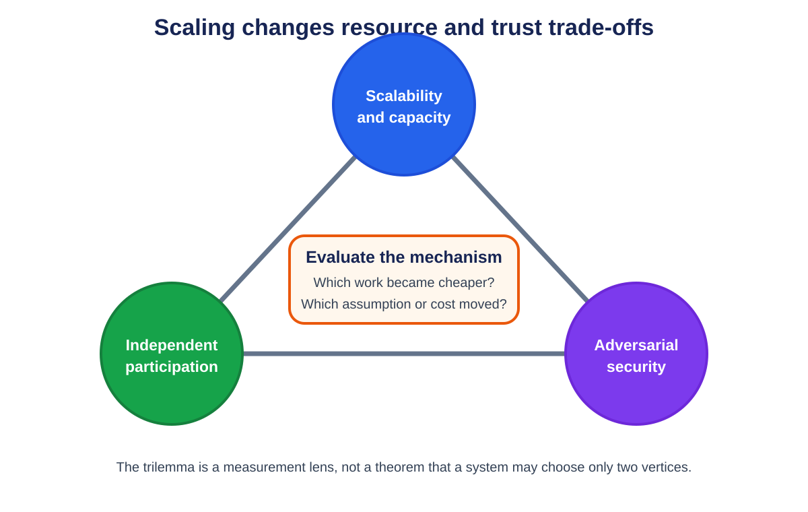

# Chapter 2: The Blockchain Trilemma

## **Introduction**

The blockchain trilemma is a design heuristic: increasing capacity, broad independent participation, and adversarial security draw on the same finite bandwidth, computation, storage, capital, and coordination. It is often summarized as a tension among **decentralization**, **security**, and **scalability**.[^1]

It is not a theorem saying a blockchain can choose exactly two properties. Better cryptography, networking, and software can improve all three. The heuristic becomes useful when it forces a proposal to name which resource burden, trust assumption, or recovery cost changed. This chapter defines each axis, tests the framework against several architectures, and turns it into measurable questions.

## **A Beginner's Way to Use the Trilemma**

The trilemma is easiest to understand as a budget, not a triangle that forces a choice of two labels.

A blockchain spends bandwidth, computation, storage, capital, and human coordination to provide useful work. It also asks independent people to run nodes and withstand attackers. A scaling proposal changes how those finite resources are spent.

Imagine a town keeping a public record. Sending every update to every resident makes independent checking easy but slow. Letting three clerks handle updates is faster, but residents now depend more on those clerks. Giving everyone better copying machines may improve speed without changing authority, although the machines still cost money. The trilemma asks what changed in each proposal.

- **Scalability:** How much useful work completes, and with what delay and operating cost?
- **Decentralization:** How many genuinely independent parties can verify, produce, govern, and recover the system?
- **Security:** Which attackers and failures can the system tolerate, and what loss or halt occurs beyond that boundary?

These are not percentages to add into one score. A chain can have decentralized validation but centralized block building, strong consensus safety but a weak bridge, or high normal throughput but poor recovery.

### **Trade-off versus improvement**

An efficiency improvement performs the same secure work using fewer resources. Better signature verification is an example. A trade-off changes the service or assumption: larger blocks may exclude slower validators; a committee checks work instead of everyone; a rollup moves execution to a sequencer and restores verifiability with data and proofs.

Both can be reasonable. The reader should ask whether the result still protects the same workload, assets, finality boundary, and recovery path.

### **How to read percentages**

Security thresholds often use fractions of voting weight, stake, or hash power. A claim such as "fewer than one-third Byzantine" does not mean an attacker has a 33 percent chance of success. It means the proof assumes adversarial voting weight remains below that boundary. At or beyond it, different properties may fail.

Concentration percentages can overlap. If 40 percent of validators use one cloud and 30 percent are in one region, adding them to get 70 percent is wrong when many validators belong to both groups. Failure-domain analysis needs validator-level overlap.

### **Cost to attack versus value at risk**

A large token market capitalization is not automatically the amount an attacker must spend or lose. Ask which stake can be borrowed, hedged, withdrawn, or slashed; who holds signing keys; how fast defenders react; and how much value a bridge or application releases before finality.

This chapter's tables and scenarios turn the three broad labels into those concrete questions.

## What Is the Blockchain Trilemma?

The three labels are shorthand for measurable system properties:

<p align="center">
  
  <br>
  <em>Figure 2.1: Scaling proposals should show which resource burden, participation cost, security assumption, or recovery cost changes. Original figure for this book.</em>
</p>

1. **Decentralization**: how widely verification, production, governance, and recovery power are distributed, including the cost of entering each role.
2. **Security**: the faults and adversaries the system tolerates, the value required to attack it, and the consequences and recoverability of failure.
3. **Scalability**: whether useful throughput grows under a specified workload while latency, cost, state growth, and validator burden remain within an operating envelope.

A design may improve capacity without sacrificing either other axis when it performs the same work more efficiently. A trade-off appears when larger blocks exclude slower validators, a small committee replaces broad verification, or another layer moves safety or liveness into a bridge, sequencer, proof, or data assumption.[^2]

## Breaking Down the Trilemma

Each axis needs more than a slogan.

### Decentralization

Decentralization is role-specific. A network can have many validating keys while a few custodians control stake, one client dominates execution, one relay carries order flow, or an upgrade multisignature can replace the rules. Count independent failure domains and dangerous coalitions, not only nodes.

Broad verification deliberately replicates work. Ethereum validators reproduce canonical EVM execution so users need not trust one operator.[^3] This limits per-node execution capacity, but cheap verification and permissionless entry can keep the check on producers widely available.

### Security

Security is a set of conditional guarantees. Consensus safety may hold below a Byzantine threshold while liveness also depends on network timing. Application safety may depend on contract correctness, key custody, data availability, and bridge finality.

Bitcoin makes history costly to rewrite through proof of work, but attack analysis must distinguish majority hash power, censorship, eclipse attacks, software bugs, and custody failure.[^4] A smaller committee can reduce communication latency while making capture or correlated failure easier. The relevant question is which actor can cause which loss under which condition.

### Scalability

Scalability is the response to increasing offered load. Measure completed throughput, queue growth, tail latency, fees, state growth, and recovery while holding workload and finality boundary constant. A transfer benchmark does not establish smart-contract capacity, and a sequencer acknowledgement is not settlement finality.

Larger or faster blocks may raise throughput while increasing orphan risk and validator bandwidth. Delegating work to a subset can raise aggregate capacity while concentrating production or introducing committee security. The result is a new operating point, not free capacity.

## Architecture Examples

### Conservative Replicated Execution

A chain with conservative block limits and broad independent verification accepts lower base-layer throughput to keep propagation and validation within reach of more operators. This can strengthen censorship resistance and fault detection, but users compete for scarce blockspace when demand rises.

### High-Performance Monolithic Execution

A chain can raise capacity with optimized networking, parallel execution, explicit account access, and higher validator hardware. The relevant trade is not a brand-level label. Measure validator and RPC requirements, client and hosting concentration, network recovery, and performance under contentious state access.

### Sharded or Committee-Based Execution

Assigning different work to subsets of validators increases aggregate capacity when committees operate in parallel. Security then depends on assignment randomness, committee size, adversarial concentration, cross-shard messaging, data reconstruction, and reshuffling. The whole validator set may be large while one transaction is protected by a smaller sample.

### Rollup-Centric Execution

Rollups let a base layer specialize in settlement and data availability while separate systems execute applications. Cheap base-layer verification can support far more computation, but users encounter sequencers, proof or dispute systems, bridges, data retention, and upgrade controls. Each role has its own decentralization and failure boundary.

### Exchanges as an Architectural Comparison

A centralized exchange can update an internal order book quickly because one operator chooses the database, matching policy, custody system, and recovery process. Users gain low-latency trading but must trust the operator for solvency, withdrawals, and rule enforcement.

An on-chain automated market maker uses consensus and contract rules for custody and execution. Every validating node reproduces the transition, which makes the result independently checkable but competes for scarce blockspace. A rollup exchange batches execution and settles commitments to a base layer, reducing per-trade cost while adding sequencer, data, proof or challenge, bridge, and upgrade dependencies.

These architectures should not be reduced to "centralized versus decentralized." Compare who holds assets, who orders trades, who verifies state, when a withdrawal is final, and how a user recovers during operator failure.

### The Trilemma in Context: Lessons from Traditional Systems

The CAP theorem and blockchain trilemma are not interchangeable. CAP concerns consistency and availability when a network partition occurs.[^12] A blockchain additionally deals with Byzantine actors, Sybil resistance, economic incentives, public verifiability, and irreversible asset movement. CAP vocabulary can clarify partition behavior, but it does not prove a trilemma claim.

## **Named Case Study: Bitcoin, Ethereum, and Solana on One Fixed Workload**

**Deployment label: all three are production networks.** Compare one workload: 10,000 users each authorize a simple native-asset payment to a distinct recipient, with no smart-contract call beyond the chain's normal transfer rules. Measure four boundaries separately: node admission, block inclusion, the chain's strongest commonly exposed finality or confirmation policy, and independent verification from protocol data. This is not a live throughput benchmark; transaction sizes, fees, congestion, hardware and software versions change. It is an architectural trace that keeps the work constant.

### **Bitcoin: UTXOs, mempool policy, and probabilistic confirmation**

Each payer constructs a transaction consuming one or more unspent transaction outputs (UTXOs), creates a recipient output and usually a change output, and signs the relevant spending conditions. A node checks syntax, scripts, input availability and local relay policy before admitting it to its mempool. Mempool acceptance is not consensus: another node can apply different policy, and miners choose transactions under fee and block constraints.[^4][^5]

A miner includes a subset in a proof-of-work block. Nodes validate the block and update the UTXO set. A payment has one confirmation when its block is accepted on the node's best-work chain; each later block increases the work that would need to be replaced by a competing history. There is no Byzantine-finality certificate after a fixed number of rounds. An application chooses a confirmation policy based on value and reorganization risk.

The 10,000 payments can spend distinct UTXOs and be individually verified, but Bitcoin's canonical state transition is still applied in block order. The workload consumes serialized bytes, signature checks, script execution, UTXO reads and writes, propagation bandwidth, and long-term history. Scaling the block limit would admit more payments but increases propagation, validation and storage load for every fully validating participant.

Failure path: two payments spend the same UTXO. Nodes may relay one under policy, but a valid chain can include at most one. A low-fee transaction may remain in some mempools or be evicted without confirmation. A shallow reorganization can remove an included payment, so an exchange should not equate "seen" or one block with its high-value completion rule.

### **Ethereum: account nonces, gas, execution, and proof-of-stake finality**

Each payer signs a typed Ethereum transaction naming chain, nonce, recipient, value, gas limit, fee caps and signature. Nodes check format, signature, account nonce, balance and fee conditions for admission. A block builder orders eligible transactions. The Ethereum Virtual Machine applies them against account state, charging gas even though a plain native transfer uses little execution compared with a contract call.[^6][^7]

The 10,000 users have distinct sender accounts, so they do not contend on one nonce. They still share block gas, builder ordering, state access, propagation and consensus. Inclusion changes balances and increments each sender nonce. Proof-of-stake validators attest to blocks; Ethereum's consensus exposes justified and finalized checkpoints under its Gasper design rather than asking applications to count proof-of-work confirmations indefinitely.[^8]

The workload shows why "one transfer" is not identical across chains. Ethereum carries an account and gas model designed for general stateful computation. That flexibility lets the same transaction envelope call contracts, but also makes shared execution and state access a base-layer resource. A higher gas limit can fit more transfers while raising worst-case block processing and propagation requirements.

Failure path: the user submits nonce 8 before nonce 7 is available. The later transaction waits or is rejected under node policy. A base-fee rise can make the fee cap insufficient. A transaction included before finality can move to a noncanonical branch. A builder can reorder transactions, though a native transfer with distinct accounts has less application-level ordering sensitivity than an exchange call.

### **Solana: declared accounts, compute budget, and slot commitment**

Each payer signs a Solana transaction whose message includes a recent blockhash, instructions, and every account the runtime needs. Writable and read-only flags expose dependencies before execution. The pipeline receives and deserializes the transaction, verifies signatures, sanitizes it, checks compute budget and age, validates nonce and fee payer, loads accounts, executes instructions, and commits or rolls back.[^9][^10]

For 10,000 transfers over distinct sender and recipient accounts, the writable sets are mostly disjoint. Solana's runtime can schedule independent transactions across cores. If all payments also update one writable global counter, that account lock serializes the workload. The declared-access model converts application state layout directly into available parallelism.

A leader includes transactions in slots, validators replay them, and RPC commitment levels describe progressively stronger observation of the cluster's voted history. Applications must name the commitment level they treat as complete. A recent blockhash also gives an ordinary transaction a finite validity window; a client that cannot find a result must distinguish expiry from a transaction that landed under a signature it is about to resend.

Failure path: two payments write the same sender account or another hot account and encounter lock contention. A transaction with an expired blockhash cannot be newly processed through the ordinary path. A leader or RPC acknowledgement is not finality, and a skipped or reorganized slot can change an early observation. High parallel execution does not remove networking, leader, state-storage or vote-processing bottlenecks.

### **Architectural result**

| Boundary | Bitcoin | Ethereum | Solana |
|---|---|---|---|
| Payment state model | Consume and create UTXOs | Update sender/recipient accounts with nonce and gas | Execute instruction over declared accounts |
| Admission evidence | Local mempool policy and input/script checks | Local pool policy, nonce, balance and fee checks | Pipeline checks, recent blockhash, signatures, account loading |
| Parallelism exposed by workload | Independent validation, but one canonical block transition | Distinct accounts reduce nonce conflict; block execution and state remain shared | Disjoint writable account sets are schedulable in parallel |
| Strong completion notion | Application-selected depth on best-work chain | Consensus finality checkpoint for containing history | Named RPC/consensus commitment and cluster finality policy |
| Main duplicate/conflict guard | UTXO can be spent once | Sender nonce orders transactions | Signatures, recent blockhash/nonces, and writable-account state |
| Scale cost paid by verifiers | Bytes, scripts, UTXO/state growth, bandwidth | Gas execution, state access/growth, bytes, attestations | Signatures, account locks, compute, high-throughput networking/storage |

The trilemma appears in the resources required to reproduce and defend the result. Bitcoin spends latency and limited block capacity to keep validation rules and hardware demands conservative. Ethereum supports general synchronous state and economic finality while budgeting gas and validator load. Solana exposes parallel account access and uses higher-performance validator pipelines to reduce latency and increase throughput. None "solves" the workload without cost. The costs move among hardware, bandwidth, state, consensus timing, application design and the population able to verify independently.


## The Trilemma Is a Constraint, Not a Theorem

The blockchain trilemma is a design heuristic, not a mathematical impossibility result with one universal definition. A protocol can improve all three dimensions through better cryptography, networking, or hardware. The constraint appears when it scales one dimension by increasing the burden on another.

For example, larger blocks improve transaction capacity but raise bandwidth and storage requirements, which may reduce the population able to validate independently. Smaller committees improve communication latency but concentrate consensus power. A rollup improves execution capacity while introducing a sequencer, bridge, proof system, and data-publication path that each need separate analysis.

The proper question is not whether a project has "solved" the trilemma. It is which costs moved, which assumptions changed, and whether users can verify those assumptions.

## Quantifying the Three Axes

No single metric captures an axis, but a measurement set makes comparisons less subjective.

**Scalability** includes sustained throughput for a stated workload, finality latency, fee behavior under demand, state growth, and recovery performance.

**Decentralization** includes the concentration of stake or hash power, number of independent operators, client and hosting diversity, entry cost, governance and upgrade control, and whether users can verify with ordinary hardware.

**Security** includes the cost or fraction required to violate safety, the network model, resistance to censorship and data withholding, bridge and smart-contract risk, and the time and cost of recovery.

The measurements can conflict. Reducing validator hardware may improve participation but lower capacity. Adding a committee may improve latency but add a bribery target. The purpose of the framework is to expose those choices.

## Worked Example: Increasing the Block Size

Assume a chain doubles its block payload from 2 MB to 4 MB while keeping the block interval fixed. If transaction size and execution cost remain constant, nominal throughput may nearly double. But each validator now receives, verifies, and stores twice the block data.

A validator with a 20 Mbps connection needs at least 1.6 seconds just to receive 4 MB under ideal conditions, before gossip overhead and verification. Validators with slower links see blocks later and are more likely to build on stale state. Block producers with private high-speed links gain an advantage. Archive growth also doubles, increasing long-run operating cost.

The change may still be worthwhile. The point is that it occupies a different trilemma position. A complete proposal includes propagation measurements, stale-block behavior, hardware distribution, state-growth projections, and the effect on home validators.

## Worked Example: A Rollup's Trade

A rollup moves execution away from every Ethereum validator. One sequencer may execute thousands of transactions and Ethereum verifies a compressed commitment. This improves throughput and fees without asking every L1 node to replay the work.

The trade is architectural rather than a simple sacrifice of security. State validity may inherit Ethereum through fraud or validity proofs, while liveness initially depends on the sequencer. Data may be published to Ethereum blobs, inherited from another DA layer, or held by a committee. Upgrade keys may override contracts. The rollup occupies several points on the trilemma at once, depending on the property examined.

This is why later chapters use a layered threat model rather than labeling a whole system decentralized or secure.

## **Security Budgets and Participation Costs**

Decentralization and security are connected through participation cost. If validation requires rare hardware or privileged networking, fewer independent operators can check the chain. If production requires large stake, specialized proving hardware, or exclusive order flow, control concentrates even when entry is formally permissionless.

Every design has a security budget. Proof-of-work miners spend energy and hardware. Proof-of-stake validators lock capital and risk penalties. Rollups pay for data and challengers or provers. Bridges pay committees, relayers, or light-client verification. A system claiming dramatically lower cost should identify which security work became cheaper and which work was delegated.

The relevant budget includes stake liquidity, concentration among custodians, correlated software, cloud dependence, governance capture, and response time, not token price alone.

## **Decentralization Across Roles**

Modern stacks divide power among RPC providers, sequencers, builders, validators, provers or challengers, DA nodes, relayers, bridge contracts, and governance. A system can be decentralized in one role and centralized in another. Permissionless validators do not compensate for one instant upgrade key. Multiple provers do not help if one sequencer can censor the fallback path.

Build a role matrix. For each role, ask what it can do alone, what coalition is dangerous, how users detect abuse, and whether the system can recover without it.

## **Asymmetric Verification**

One way to improve the trilemma frontier is to make verification much cheaper than production. Digital signatures make authorization cheap to check. Succinct proofs compress large computations. Data sampling gives confidence about a large block after downloading random pieces.

Asymmetry lets many ordinary participants verify work produced by stronger machines. It does not remove assumptions. A proof depends on its encoded program. Sampling depends on correct encoding and dissemination. Cheap verification can coexist with centralized production. The target is competitive production, cheap independent verification, and permissionless recovery.

## **Failure Domains, Not Key Counts**

One hundred validator keys do not create one hundred independent replicas if eighty run one client, seventy share one cloud region, or most stake is controlled by two custodians. Client diversity, hosting, operator control, network paths, jurisdiction, and signing infrastructure form different correlation graphs.

A decentralization report should show these distributions and the protocol actions each concentration enables. This is more useful than a single node count.

## **Worked Comparison: Scaling an Exchange**

A larger monolithic L1 preserves synchronous shared state but asks every validator to process more data. An appchain isolates exchange traffic and can use a small fast committee, but its assets inherit that committee and bridge. A rollup batches execution and uses an L1 for settlement, while adding sequencer, data, proof, and bridge dependencies.

None has one trilemma score. The correct comparison lists roles, participation cost, assets at risk, finality, and recovery for the exchange's workload.

## **Governance as a Fourth Axis**

The trilemma usually treats rules as fixed, but deployed systems change. Governance can replace a verifier, pause a bridge, increase block limits, or rotate a committee. Fast emergency action can protect security while concentrating power; slow action improves predictability but delays fixes.

For every upgradeable system, evaluate current code and the process that can replace it. The latter is part of the security boundary from launch.

## Worked Failure-Domain Audit

Suppose a proof-of-stake network advertises 1,200 active validator keys. Key count alone does not reveal whether faults are independent. Collect control and infrastructure data:

| Dimension | Largest observed concentration |
|---|---:|
| Beneficial owner or custodian | 31% of stake |
| Validator client | 68% of stake |
| Cloud provider | 46% of stake |
| Geographic region | 39% of stake |
| MEV relay or block-builder path | 72% of proposed blocks |
| Governance delegation bloc | 37% of votes |

These percentages cannot be added: one validator may belong to every category. Instead, construct correlation scenarios.

### Scenario 1: client bug

If one client controls 68 percent and a deterministic bug makes it accept an invalid transition, the effect depends on consensus rules and what minority clients do. Diversity counted by the number of available clients is irrelevant when deployment share remains concentrated.

Test the actual failure: feed all clients the divergent block, observe voting and fork choice, and rehearse coordinated but non-simultaneous recovery. An emergency social response may preserve the intended history, but that is a recovery assumption outside ordinary consensus.

### Scenario 2: cloud and region outage

A cloud provider holds 46 percent of stake, with 30 percentage points in one region. A provider-wide outage may threaten liveness; a regional outage overlaps but is not independent. Model the union from validator-level data rather than summing 46 and 39.

Operators should spread replicas only when the protocol permits redundant signing safely. Running two active signers for one key can create equivocation during a partition. High availability needs fencing or remote-signing controls that ensure only one valid signing state.

### Scenario 3: custodian compromise

A custodian controls 31 percent, below a one-third Byzantine boundary but close enough that additional correlated stake can cross it. Determine whether the custodian controls withdrawal keys, validator signers, governance votes, or only delegates stake. Each permission produces a different attack.

Economic security cannot be reduced to 31 percent of market capitalization. Measure stake that can actually be slashed, time to exit, borrowability, derivative hedges, and whether governance can cancel penalties.

### Scenario 4: block-building concentration

A builder or relay path touching 72 percent of blocks may censor or reorder transactions without controlling consensus finality. Inclusion lists, alternate relays, local building, and forced paths address this role. Counting consensus validators does not measure ordering decentralization.

### Independence scorecard

For each role, record:

```text
entities and weights
shared software and version
hosting provider, region, and network
signing and custody infrastructure
governance and upgrade authority
fallback path and tested recovery time
```

Then calculate the smallest plausible correlated set that can:

- halt finality;
- finalize conflicting state;
- censor a transaction past its deadline;
- withhold enough data to prevent recovery;
- replace protocol or bridge code;
- stop users from exiting.

The answer can differ for every action. One coalition may halt consensus, another may censor ordering, and a single upgrade key may replace a verifier.

### Home-validator budget

Decentralization also depends on the lower end of participation. Publish bandwidth, CPU, memory, storage IOPS, state size, history growth, synchronization time, and operational attention for a validating node. Measure p95 requirements under load and recovery, not minimum idle specifications.

If a capacity increase raises annual state by 2 TB and requires 50 Mbps sustained ingress, estimate how many current operators and regions can still participate. A proposal may improve throughput and keep the same consensus threshold while reducing the population able to verify independently.

### Audit conclusion

A defensible report should not say "1,200 validators means decentralized." It should say which roles were measured, the largest control and infrastructure concentrations, the smallest dangerous coalitions, the participation budget, and the observed recovery from correlated faults.

This converts the decentralization axis from a brand judgment into a set of failure hypotheses that can be tested.

## **Conclusion**

The trilemma is useful when it exposes where a scaling design spends resources and trust. It does not assign one score to a chain, prove that only two properties are possible, or make decentralization a validator count.

A defensible comparison names workload, completion boundary, validator burden, dangerous coalitions, control keys, data and bridge assumptions, and recovery path. Chapter 3 applies that discipline to Layer 1 and Layer 2 architectures.


## **References**

[^1]: Buterin, Vitalik. "The Blockchain Trilemma." *Ethereum Blog* (2017). Available at: <https://vitalik.eth.link/general/2017/12/31/sharding_faq.html>.
[^2]: Hill, Mark D. "What is Scalability?" *ACM SIGARCH Computer Architecture News* (1990). Referenced in Chapter 1.
[^3]: Wood, Gavin. "Ethereum: A Secure Decentralised Generalised Transaction Ledger." *Ethereum Yellow Paper* (2014). Available at: <https://ethereum.github.io/yellowpaper/paper.pdf>.
[^4]: Nakamoto, Satoshi. "Bitcoin: A Peer-to-Peer Electronic Cash System" (2008). Available at: <https://bitcoin.org/bitcoin.pdf>.
[^12]: Brewer, Eric A. "Towards Robust Distributed Systems." *PODC Keynote* (2000). Available at: <https://doi.org/10.1145/343477.343502>.

[^5]: Bitcoin Developer Reference. "Transactions." <https://developer.bitcoin.org/reference/transactions.html>.
[^6]: Ethereum.org. "Transactions." <https://ethereum.org/developers/docs/transactions/>.
[^7]: Ethereum.org. "Ethereum gas and fees." <https://ethereum.org/developers/docs/gas/>.
[^8]: Ethereum.org. "Gasper." <https://ethereum.org/developers/docs/consensus-mechanisms/pos/gasper/>.
[^9]: Solana Documentation. "Transactions." <https://solana.com/docs/core/transactions>.
[^10]: Solana Documentation. "Transaction processing pipeline." <https://solana.com/docs/core/transactions/transaction-pipeline>.
