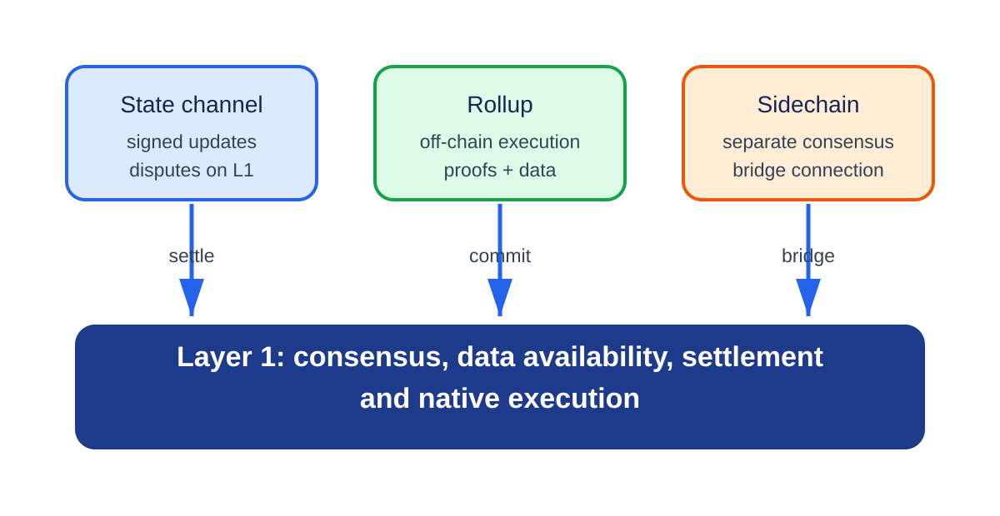

# **Chapter 3: Layer 1 vs Layer 2 - Comparing Different Approaches to Blockchain Scaling**

## **Introduction**

Layer 1 and Layer 2 are different places to spend a system's resource and trust budget. Layer 1 changes the base protocol that validators execute and agree on. Layer 2 moves repeated work into another protocol while retaining an enforcement or settlement relationship with the base chain.

The labels do not rank security or performance. A larger L1 block, a payment channel, a rollup, and a sidechain improve different workloads and fail in different ways. This chapter compares them by following execution, data, finality, cost, and recovery rather than by treating "L2" as a synonym for fast or cheap.

---

## **What Is Layer 1 Scaling?**

Layer 1 refers to the **base blockchain protocol**, such as Ethereum, Bitcoin, or Solana. Scaling Layer 1 involves changing the underlying consensus mechanism, data structure, or execution environment to boost performance.

Sharding partitions some combination of data, state, execution, or validator work. It can increase aggregate capacity without asking every node to process every item, but cross-shard messages, committee security, state movement, and data availability become protocol responsibilities.

### **Common Layer 1 Scaling Techniques**

- **Increasing Block Size or Block Frequency**  
  More transactions per block or faster blocks can increase throughput. However, this increases the resource requirements for running full nodes, possibly reducing decentralization.

- **Optimizing Execution Environments**  
  Better interpreters, compilers, storage layouts, state commitments, and parallel runtimes reduce the resource cost of executing or verifying a unit of work. A VM choice alone does not guarantee parallelism; the state-access model and workload determine conflicts.

- **Consensus Optimization**  
  Pipelining, signature aggregation, efficient block propagation, and linear-message BFT protocols can reduce latency or communication. Changing Sybil resistance from proof of work to proof of stake changes energy use and security economics, but does not by itself create execution capacity.

- **Sharding**  
  Dividing the blockchain into smaller parts (shards) so different transactions can be processed in parallel. This increases throughput while keeping node requirements manageable.

---

## **What Is Layer 2 Scaling?**

<p align="center">
  
  <br>
  <em>Figure 3.1: Channels and rollups use Layer 1 for enforcement or settlement, while a sidechain connects through a bridge but runs separate consensus. Original figure for this book.</em>
</p>


A Layer 2 protocol performs some work outside Layer 1 while using Layer 1 to enforce a result, resolve a dispute, or let users recover. The inheritance is specific, not total. A rollup may inherit settlement consensus while depending on a sequencer for timely inclusion and an upgrade process for contract integrity.

Optimistic rollups use a dispute window and at least one honest party able to reconstruct and challenge invalid state. Validity rollups require a proof accepted by an L1 verifier. Neither design makes sequencer acknowledgement equivalent to L1 finality, and neither removes data-availability or upgrade risk.

### **Common Layer 2 Techniques**

- **State Channels**  
  Two parties lock funds on L1 and interact off-chain, only submitting the final state to L1. Great for recurring transactions between fixed participants.

- **Plasma**  
  A hierarchical chain structure where child chains handle transactions and periodically commit results to L1.

- **Optimistic Rollups**  
  Transactions are executed off-chain and posted to L1 with a challenge period. Assumes correctness unless proven otherwise. Lower cost, but slower finality due to dispute windows.

- **Zero-Knowledge Rollups (zkRollups)**  
  Batch transactions are executed off-chain and verified on-chain using succinct cryptographic proofs. Offers fast finality and lower gas, but comes with higher complexity.

---

## **Comparing Layer 1 vs Layer 2**

| Question | Layer 1 change | Rollup or channel | Sidechain |
|---|---|---|---|
| Who executes? | Base-layer validators | L2 operators or participants | Sidechain validators |
| Where is canonical data? | Base layer | L1, a DA layer, or participants, depending on design | Sidechain and archival services |
| What establishes correctness? | Base consensus and execution rules | L1 contract plus dispute, proof, or signed-state rules | Sidechain consensus and bridge verifier |
| What gives fast confirmation? | Block producer and fork choice | Sequencer or participant signature | Sidechain consensus |
| What is the recovery path? | Reorganization/finality and client recovery | Force inclusion, dispute, or exit | Sidechain governance and bridge recovery |
| Main scaling cost | Higher validator load or protocol complexity | New operators, contracts, proofs, data, and exit paths | Independent security budget and bridge risk |

## **Real-World Trade-Offs**

An L1 capacity increase benefits every application sharing that protocol, but requires broad coordination and may raise validator cost. An L2 can specialize and upgrade faster, but users must cross a bridge and reason about an additional operator, contract, data, and finality path.

Ethereum's proof-of-stake transition changed consensus economics and energy use; it was not by itself a throughput multiplier. EIP-4844 is a clearer example of L1 scaling for L2: separate blob capacity lowers rollup data cost while preserving a base-layer availability commitment.[^1] Rollups then amortize publication and verification across batches.

In an optimistic rollup, the security condition is not that every user watches the chain. The condition is that at least one independent challenger can access the data and successfully use the fault-proof path before the deadline.[^2] A validity rollup replaces that challenge assumption with proof-system, circuit, verifier, and prover-liveness dependencies.

---

## **Why Both Layers Matter**

Layer 1 and Layer 2 capacity are complementary when their interfaces are explicit. Base-layer data, settlement, and forced-inclusion capacity bound what rollups can safely process and recover. L2 execution lets applications specialize without forcing every L1 validator to execute every user action.

Adding more layers does not automatically add security. Each layer introduces another finality, data, upgrade, and recovery dependency. The architecture is useful when the lower layer can enforce the property the upper layer claims to inherit.

---

## **A Transaction's Path Through Layer 1 and Layer 2**

The difference between L1 and L2 becomes clearer by following the same token transfer through each system.

On Layer 1, a user signs a transaction and sends it to the peer-to-peer network. A block producer chooses its position, every validating node executes it, consensus selects the canonical block, and the resulting state becomes final under the chain's rules. Execution, data publication, and consensus all happen in the same security domain.

On a rollup, the user normally sends the transaction to an L2 sequencer. The sequencer orders and executes it and may return a soft confirmation immediately. Later, the rollup publishes transaction data and a state commitment. Ethereum consensus finalizes that publication. The rollup contract then accepts the state after either a fraud-proof window or verification of a validity proof. One user action therefore has several milestones: receipt by the sequencer, inclusion in an L2 block, publication to L1, proof acceptance, and L1 finality.

A sidechain follows a different path. Its own validators execute and finalize the transaction. Ethereum sees nothing unless a bridge message is later submitted. The sidechain may be fast, but its correctness comes from its validator set and bridge, not from Ethereum merely because assets can move between them.

These paths explain why the label "Layer 2" should describe a security relationship rather than a position in a diagram. A system is meaningfully layered when the base chain can enforce state correctness or user exits under stated assumptions.

## **The Scaling Bottleneck Moves**

A system rarely has one permanent bottleneck. Raising an L1 gas limit can move the limit from execution to block propagation. A parallel VM can move it from CPU to state-database access. A rollup can make execution cheap enough that data publication dominates fees. Cheap blobspace can make proving or sequencing the next constraint.

This is why capacity planning must be end to end. Let:

- `E` be sustainable execution capacity in gas per second;
- `D` be data capacity in bytes per second;
- `C` be consensus capacity in blocks or votes per second;
- `P` be proof generation capacity for a validity system.

Application throughput is bounded by the first saturated resource. Adding capacity to `E` has little effect when each transaction consumes enough published bytes to saturate `D`. An optimization should identify which resource is limiting under the target workload and show that the next resource can absorb the displaced demand.

## **A Better Comparison Framework**

The earlier table gives a useful overview, but a production choice needs more detail.

### **Security and Recovery**

Ask who can make invalid state final, who can withhold data, and what a user can do when the normal operator disappears. An L2 with a centralized sequencer may still preserve fund safety if users can force inclusion and exit. A sidechain with many validators may still be exposed if its bridge is controlled by a small multisig.

### **Finality**

Separate user-perceived confirmation from economic and cryptographic finality. L2 confirmations are often fast because a sequencer promises an order. A bridge receiving a large deposit may wait for L1 settlement and proof acceptance instead.

### **Cost**

Layer 1 users pay for globally replicated execution and data. Rollup users share publication and verification across a batch. Sidechain users pay that chain's validators. Channel users pay to open and close while bearing the opportunity cost of locked liquidity. Fee comparisons should include the cost of withdrawal and failure recovery, not only the normal transaction.

### **Composability**

Contracts on one synchronous state machine can call each other atomically. Moving execution across rollups or shards turns those calls into messages. The result may scale better, but developers must handle delay, replay protection, and partial completion.

### **Decentralization of Operations**

Validator count is only one dimension. Sequencers, provers, relayers, bridge administrators, RPC providers, and upgrade signers can each become a control point. A complete architecture diagram names these roles.

## **Worked Design Choice: An On-Chain Game**

Suppose a game generates 500 player actions per second, needs sub-second feedback, and has occasional high-value asset withdrawals.

Putting every action on Ethereum L1 gives strong settlement but poor cost and latency. A payment channel is insufficient because players interact with shared game state. A high-throughput sidechain can meet latency, but the game's valuable assets inherit the sidechain bridge's trust model. A rollup can execute frequent actions cheaply and settle asset ownership to Ethereum, while a centralized sequencer initially provides fast feedback.

The rollup is not automatically the answer. If the game state is too large to publish economically, a validium or external DA layer may be considered. That lowers cost but adds a withholding assumption. If the game requires every player action to synchronously interact with DeFi on Ethereum, asynchronous messaging may make the experience unacceptable. The design decision follows the workload and recovery requirements, not a universal ranking of technologies.

## **Forced Transactions and Censorship Recovery**

A layered system should let users bypass the normal operator. An L1 inbox can accept canonically encoded L2 transactions. The sequencer must include them within a bounded period; otherwise another party advances state, the protocol changes mode, or the user exits. In the OP Stack, for example, L1 deposits form part of the derivation inputs used to construct the L2 chain.[^3]

The deadline balances responsiveness and cost. A short timeout turns temporary outages into expensive L1 recovery. A long timeout gives a censor more power. Test the mechanism under L1 congestion, when many users may invoke it together.

## **Deposits, Withdrawals, and Finality**

An L2 should wait for sufficient L1 finality before crediting a deposit. Otherwise an L1 reorganization can remove collateral after its L2 representation has moved. In the other direction, a canonical bridge verifies an accepted L2 withdrawal message and replay protection before releasing L1 assets.

Optimistic withdrawals wait for the challenge rule; validity withdrawals wait for proof acceptance. A concrete optimistic withdrawal specification separates initiation on L2, proof on L1, finalization delay, and execution.[^4] Liquidity bridges can pay earlier but introduce separate solvency and message risk. A full fee and latency estimate follows the user's entire deposit-action-withdrawal journey.

## **Fee Anatomy Across Layers**

```text
L2 fee = execution charge
       + allocated publication charge
       + proving or challenging and operating charge
       + margin or congestion premium
```

Batching spreads publication over many transactions. An appchain may subsidize validators or DA through inflation or treasury spending. "Low fee" should identify who pays the remainder. Recovery and canonical withdrawal costs matter for one-time users.

## **L3s and Recursive Layering**

An L3 executes above an L2 and uses that L2 for settlement, data, or both. A withdrawal may wait for L3 proof, L2 publication, L2 proof or challenge, and Ethereum finality. If the L2 operator is offline, the L3 must state whether its fallback can reach L1 directly.

Layer numbers do not define security. Apply the same transaction-path and recovery-path analysis at every boundary.

## **Migration and Upgrade Strategy**

Applications may move from L1 to a shared rollup and then an appchain. A safe migration announces source and destination versions, freezes or snapshots finalized source state, publishes a commitment to migrated balances, allows verification or challenge, activates destination state, and preserves an exit for users who decline migration.

Without a verifiable state mapping, migration becomes administrator custody.

## **Architecture Decision Record**

Record workload, latency objective, assets at risk, composability needs, execution and DA requirements, sequencing, proof or challenge rules, normal and forced message paths, fee subsidies, upgrade authority, and shutdown plan. Revisit the record as demand changes.

## **Worked Migration: L1 Application to Rollup**

Moving an application from L1 to a rollup is a state transition across security domains, not a deployment script. Users need a verifiable mapping from old assets and state to new state, and a choice not to follow the migration.

Consider a game with fungible balances, unique items, open marketplace orders, and pending withdrawals. The migration team selects an L1 block that is final under the published policy and records:

```text
MigrationManifest {
  source_chain,
  source_contracts[],
  source_final_block,
  source_state_root,
  extraction_code_hash,
  destination_rollup,
  destination_contracts[],
  destination_genesis_root,
  mapping_version,
  challenge_deadline
}
```

### Inventory and freeze policy

Inventory every source state category and decide whether it migrates, settles, cancels, or remains claimable on L1. An open order should not silently become executable in both places. A pending withdrawal should not disappear from one queue and reappear with a fresh nonce.

A full freeze simplifies the snapshot but stops the application. A rolling migration can reduce downtime while creating dual-write and replay complexity. If both systems remain active, define which actions are canonical and how one-way messages prevent double spending.

### Deterministic extraction

The extraction program reads source state at the finalized block and emits canonical destination records. Publish the program, compiler/build information, input block, and output commitment. Independent parties should reproduce the same destination genesis root.

The mapping handles:

- address and signature-scheme differences;
- token decimals, metadata, and native-versus-wrapped identity;
- contract storage layout and default values;
- ownership and approval state;
- consumed nonces and pending messages;
- rounding and dust;
- paused, frozen, or blacklisted records if applicable.

Do not discard zero balances or empty records unless the source semantics make them irrelevant. Presence itself can affect authorization or future storage behavior.

### Claim versus push

A **push migration** initializes every account on the destination. It offers a complete genesis but may be expensive. A **claim migration** commits to a Merkle root; each user later supplies a proof and initializes only needed state.

Claim migration needs a permanent or sufficiently long proof-data service. Correctness can be trustless while availability is not. Several independent hosts should retain the leaf set and tree construction code. Claims need domain binding and a consumed key so the same source asset cannot initialize twice.

### User choice and exit

Publish destination contracts, sequencer and DA assumptions, bridge, upgrade keys, expected fees, and finality before the opt-in deadline. Users who decline need an L1 withdrawal, sale, redemption, or continued old-version path. A choice is not meaningful when the escape transaction costs more than the asset or the window closes during congestion.

### Activation trace

1. finalize the source snapshot or claim root;
2. complete the challenge or reproduction period;
3. deploy destination code with pinned versions;
4. initialize the destination root or claim contract;
5. test deposit, action, forced inclusion, and withdrawal on the final deployment;
6. activate user routing and indexers;
7. keep source recovery and proof data available through the promised window;
8. reconcile total supply, ownership counts, pending messages, and claims.

### Failure matrix

| Failure | Required outcome |
|---|---|
| Source block reorganizes | snapshot is invalidated unless finality policy still holds |
| Extraction code omits state | challenge or independent reproduction blocks activation |
| Destination root differs | deployment does not activate |
| User claims twice | consumed source identifier rejects the duplicate |
| Marketplace order exists on both systems | canonical cancellation/migration rule permits only one execution |
| Bridge or sequencer fails at launch | forced path and exit work on the deployed contracts |
| Claim data host disappears | independent hosts and reproducible tree restore service |
| Upgrade occurs during migration | manifest version remains fixed or migration restarts transparently |

### Reconciliation

For fungible assets, prove:

```text
source locked or burned
= destination issued
+ source refunds
+ explicitly documented remainder
```

For unique items, compare the set of identifiers and owners. For messages, compare source pending, destination consumed, expired, and refunded sets. A total supply match alone misses ownership swaps or duplicate non-fungible identifiers.

Run reconciliation before activation, after the first claims, at the migration deadline, and after source cleanup. Publish machine-readable results. Migration is complete when users can verify the mapping and recovery, not when the new front end points at the rollup.

## **Conclusion**

Layer 1 scaling changes the shared protocol and its validator resource envelope. Layer 2 scaling reduces the base-layer work per user action while retaining a defined enforcement or settlement path. Sidechains add independent capacity rather than inheriting correctness merely because they have a bridge.

A sound choice starts with workload and follows one transaction through ordering, execution, data publication, proof or dispute, finality, fees, and failure recovery. Chapter 4 now examines the base-layer mechanisms in detail.


## **References**

[^1]: Buterin, Vitalik, et al. "EIP-4844: Shard Blob Transactions." <https://eips.ethereum.org/EIPS/eip-4844>.
[^2]: Ethereum.org. "Optimistic Rollups." <https://ethereum.org/developers/docs/scaling/optimistic-rollups/>.
[^3]: Optimism. "Derivation." *OP Stack Specification*. <https://specs.optimism.io/protocol/derivation.html>.
[^4]: Optimism. "Withdrawals." *OP Stack Specification*. <https://specs.optimism.io/protocol/withdrawals.html>.
