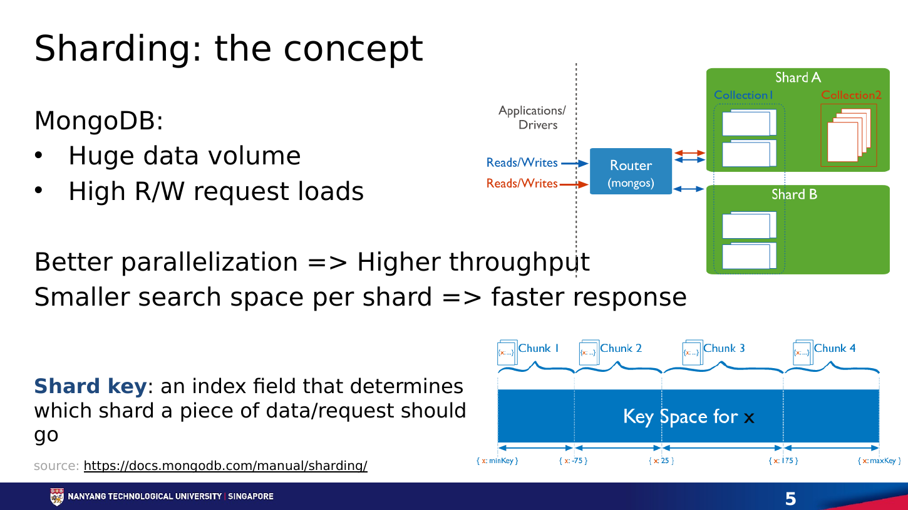

# **Chapter 4: Layer 1 On-Chain Scalability**

## **Introduction**

Layer 1 scaling changes the base blockchain itself. Instead of moving work to a separate protocol, it asks how the network can process more computation, store more state, publish more data, and reach agreement faster while preserving open verification.

The simplest ideas are larger blocks and shorter block times. Both can raise headline throughput, but they increase bandwidth, storage, and CPU requirements. If fewer people can validate the chain independently, scalability has been purchased by weakening decentralization. Good Layer 1 design aims for more capacity per unit of validator resource, or divides work so that no validator must process everything.

The course frames the problem around replicated computation, replicated storage, and consensus communication. Layer 1 techniques attack these bottlenecks through protocol optimization, sharding, and interoperability.

---

## **The Four Jobs of a Base Layer**

A general-purpose blockchain performs four related jobs:

1. **Execution** – applying transactions to the current state.
2. **Settlement** – deciding which state transition is canonical and resolving disputes.
3. **Consensus** – ordering blocks and finalizing them despite faulty participants.
4. **Data availability** – ensuring that the data needed to verify a block can be obtained.

A monolithic chain performs all four within one validator network. Every full validator repeats much of the same work. Scaling one job can expose another bottleneck: faster execution is of limited value if block propagation or consensus cannot keep up.

---

## **Vertical Scaling: Making One Chain Faster**

Vertical scaling improves the capacity of a single chain through:

- more efficient clients and databases;
- pipelined block production and execution;
- signature aggregation;
- faster peer-to-peer block propagation;
- a more efficient virtual machine;
- larger blocks or higher gas limits.

These changes matter, but are bounded by validator hardware and network capacity. Larger blocks take longer to propagate and verify. Higher state growth makes it harder for a new node to synchronize. Performance should therefore be reported with latency, hardware, state growth, and validator distribution, not TPS alone.

Gas per second is useful for EVM systems because it measures computational work rather than treating a simple transfer and a complex smart-contract call as identical. It still does not capture data availability or consensus capacity.

---

## **Horizontal Scaling Through Sharding**

  
   
  <em>Figure 4.1: Sharding divides a key space so independent workers can process different partitions. Source: Neil Han, SC6019 Lecture 02, slide 5.</em>

Sharding divides the system into groups that process different portions of the workload. Rather than every node storing and executing every transaction, nodes are assigned to subsets called **shards**.

- **Network sharding** divides validators into committees.
- **Transaction sharding** assigns transactions to committees.
- **State sharding** divides the world state.
- **Execution sharding** processes independent transitions in parallel.

If there are *k* shards operating concurrently, aggregate throughput can grow with *k*. The benefit is horizontal: adding validators can create more processing capacity instead of more replicas of the same work.

### **Random Validator Assignment**

A shard committee is easier to attack than the full network because it is smaller. Random assignment makes it difficult for an adversary to choose the shard it controls. Periodic reshuffling limits long-lived capture.

The security question becomes probabilistic. More, smaller shards improve parallelism but reduce each committee's margin. Sharding changes the point at which the scalability trilemma is managed; it does not eliminate it.

### **Cross-Shard Transactions**

Transactions contained within one shard are simpler. A transaction that reads or writes state across shards requires coordination. A common design uses asynchronous messages:

1. the source shard executes the first part;
2. it emits a receipt;
3. the destination verifies and applies the receipt later.

This preserves parallelism but changes application semantics. Developers must account for delayed completion, partial failure, and asynchronous calls. Atomic composability is harder across shards.

### **State Validity and Data Availability**

Validators outside a shard need confidence that its transition is valid and that the underlying data exists. Techniques include fraud proofs, validity proofs, erasure coding, data availability sampling, and stateless validation with witnesses.

NEAR's Nightshade design represents shards as chunks within one logical chain. Cross-shard actions create receipts, while validators rotate responsibilities for chunk production and validation.[^1]

---

## **Interoperability as a Form of Sharding**

The course compares sharding with an ecosystem of independent chains. Cosmos zones process separate state and communicate through Inter-Blockchain Communication (IBC). IBC uses light-client verification and packet commitments to authenticate messages between chains.[^2]

Both models divide computation and state. Their security differs:

- protocol shards normally inherit one validator set;
- sovereign chains choose their own security and governance;
- shared-security systems sit between them.

Cross-chain communication introduces more assumptions. A bridge is only as safe as its verification mechanism, validator set, upgrade keys, and the chains on both sides.

---

## **Ethereum's Rollup-Centric Data Sharding**

Early Ethereum roadmaps emphasized execution shards. The rollup-centric roadmap shifted priority toward data capacity. Rollups execute outside Ethereum but publish data needed for reconstruction and verification. Increasing cheap data capacity can scale many rollups at once.

EIP-4844 introduced blob-carrying transactions, or proto-danksharding. Blob data is committed to by consensus but unavailable to EVM execution and retained only for a defined period. It provides a separate data market for rollups and groundwork for sampling.[^3]

Full danksharding aims to expand blob capacity while allowing nodes to verify availability without downloading every blob.[^4] This is Layer 1 scaling designed primarily to support Layer 2 execution.

---

## **Trade-Offs**

| Technique | Main Gain | Main Risk |
|---|---|---|
| Larger or faster blocks | More transactions per unit time | Higher node requirements and propagation pressure |
| Client or VM optimization | More work from the same hardware | Network or storage becomes the next bottleneck |
| Sharding | Parallel execution and storage | Smaller security domains and cross-shard complexity |
| Appchains | Isolation and sovereignty | Fragmented liquidity and separate security |
| Data sharding | More capacity for rollups | Sampling, coding, and networking complexity |

A robust protocol must handle committee corruption, data withholding, partitions, validator churn, and state synchronization. The recovery path often determines real security.

## **Worked Example: A Cross-Shard Transfer**

Consider Alice on shard A paying Bob on shard B. Shard B must not credit Bob unless shard A has irrevocably debited Alice. A practical design uses an authenticated receipt. Shard A verifies Alice's signature and balance, debits ten tokens, and places a receipt in an outgoing queue. The receipt names the destination, Bob's account, the amount, a nonce, and proof that shard A finalized the debit. Shard B later verifies the proof and consumes the receipt exactly once. The nonce prevents replay.

The transfer is economically atomic but not simultaneous. Between debit and credit, the payment is in flight. Applications must expose that intermediate state. Congestion on shard B can delay delivery, and a contract on shard A cannot assume an immediate callback from shard B. Cross-shard calls therefore look more like reliable message passing than like calls inside one EVM transaction.

The protocol must price receipt queues, bound their growth, handle reorganizations, and define what happens when a destination rejects a message. Aggregate shard throughput alone hides these costs.

## **Committee Security by Calculation**

Suppose 1,000 validators include 250 controlled by an adversary. The protocol forms committees of 100 and fails if more than one-third of any committee is Byzantine. The expected adversarial count is 25, but an attack needs at least 34. Security depends on the tail probability of drawing that many attackers, not on the average.

Smaller committees create more parallel shards but widen this tail risk. Rotation limits persistent targeting, yet it costs bandwidth because validators need new shard state. Committee size, reshuffle frequency, validator stake distribution, and the fault threshold must be evaluated together.

## **Conclusion**

Layer 1 scaling is not simply making blocks larger. It redesigns execution, storage, networking, data availability, and consensus so the system can grow without excluding independent validators. Sharding provides horizontal capacity; client and protocol optimization push vertical limits.

The emerging architecture is layered: the base layer supplies secure settlement and verifiable data while execution is parallelized across shards, rollups, and application-specific chains. The next chapter examines moving repeated interaction off the base chain.

## **References**

[^1]: Skidanov, Alex, Illia Polosukhin, and Bowen Wang. "Nightshade: NEAR Protocol Sharding Design." <https://near.org/papers/nightshade>.
[^2]: Cosmos. "IBC Protocol Overview." <https://ibc.cosmos.network/main/ibc/overview.html>.
[^3]: Buterin, Vitalik, et al. "EIP-4844: Shard Blob Transactions." <https://eips.ethereum.org/EIPS/eip-4844>.
[^4]: Ethereum.org. "Danksharding." <https://ethereum.org/roadmap/danksharding/>.
