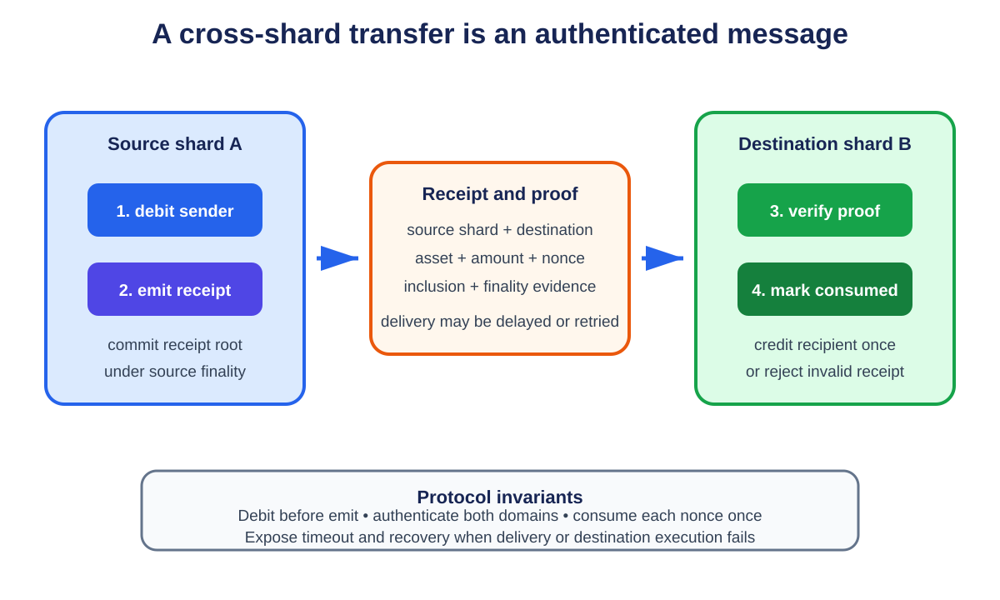

# **Chapter 4: Layer 1 On-Chain Scalability**

## **Introduction**

Layer 1 scaling changes the base blockchain itself. Instead of moving work to a separate protocol, it asks how the network can process more computation, store more state, publish more data, and reach agreement faster while preserving open verification.

The simplest ideas are larger blocks and shorter block times. Both can raise headline throughput, but they increase bandwidth, storage, and CPU requirements. If fewer people can validate the chain independently, scalability has been purchased by weakening decentralization. Good Layer 1 design aims for more capacity per unit of validator resource, or divides work so that no validator must process everything.

The course frames the problem around replicated computation, replicated storage, and consensus communication. Layer 1 techniques attack these bottlenecks through protocol optimization, sharding, and interoperability.

---

## **The Four Jobs of a Base Layer**

A general-purpose blockchain performs four related jobs:

1. **Execution** - applying transactions to the current state.
2. **Settlement** - deciding which state transition is canonical and resolving disputes.
3. **Consensus** - ordering blocks and finalizing them despite faulty participants.
4. **Data availability** - ensuring that the data needed to verify a block can be obtained.

A monolithic chain performs all four within one validator network. Every full validator repeats much of the same work. Scaling one job can expose another bottleneck: faster execution is of limited value if block propagation or consensus cannot keep up.

---

## **Vertical Scaling: Making One Chain Faster**

Vertical scaling improves the capacity of a single chain through:

- more efficient clients and databases;
- pipelined block production and execution;
- signature aggregation;
- faster peer-to-peer block propagation;
- a more efficient virtual machine;
- larger blocks or higher gas limits.

These changes matter, but are bounded by validator hardware and network capacity. Larger blocks take longer to propagate and verify. Higher state growth makes it harder for a new node to synchronize. Performance should therefore be reported with latency, hardware, state growth, and validator distribution, not TPS alone.

Gas per second is useful for EVM systems because it measures computational work rather than treating a simple transfer and a complex smart-contract call as identical. It still does not capture data availability or consensus capacity.

---

## **Horizontal Scaling Through Sharding**

<p align="center">
  
  <br>
  <em>Figure 4.1: A source shard debits funds and emits a receipt; the destination verifies finality and inclusion, marks the nonce consumed, and credits once. Original figure for this book, based on the sharding workflow in SC6019 Lecture 02.</em>
</p>


Sharding divides the system into groups that process different portions of the workload. Rather than every node storing and executing every transaction, nodes are assigned to subsets called **shards**.

- **Network sharding** divides validators into committees.
- **Transaction sharding** assigns transactions to committees.
- **State sharding** divides the world state.
- **Execution sharding** processes independent transitions in parallel.

If there are *k* shards operating concurrently, aggregate throughput can grow with *k*. The benefit is horizontal: adding validators can create more processing capacity instead of more replicas of the same work.

### **Random Validator Assignment**

A shard committee is easier to attack than the full network because it is smaller. Random assignment makes it difficult for an adversary to choose the shard it controls. Periodic reshuffling limits long-lived capture.

The security question becomes probabilistic. More, smaller shards improve parallelism but reduce each committee's margin. Sharding changes the point at which the scalability trilemma is managed; it does not eliminate it.

### **Cross-Shard Transactions**

Transactions contained within one shard are simpler. A transaction that reads or writes state across shards requires coordination. A common design uses asynchronous messages:

1. the source shard executes the first part;
2. it emits a receipt;
3. the destination verifies and applies the receipt later.

This preserves parallelism but changes application semantics. Developers must account for delayed completion, partial failure, and asynchronous calls. Atomic composability is harder across shards.

### **State Validity and Data Availability**

Validators outside a shard need confidence that its transition is valid and that the underlying data exists. Techniques include fraud proofs, validity proofs, erasure coding, data availability sampling, and stateless validation with witnesses.

NEAR's Nightshade design represents shards as chunks within one logical chain. Cross-shard actions create receipts, while validators rotate responsibilities for chunk production and validation.[^1]

---

## **Interoperability as a Form of Sharding**

The course compares sharding with an ecosystem of independent chains. Cosmos zones process separate state and communicate through Inter-Blockchain Communication (IBC). IBC uses light-client verification and packet commitments to authenticate messages between chains.[^2]

Both models divide computation and state. Their security differs:

- protocol shards normally inherit one validator set;
- sovereign chains choose their own security and governance;
- shared-security systems sit between them.

Cross-chain communication introduces more assumptions. A bridge is only as safe as its verification mechanism, validator set, upgrade keys, and the chains on both sides.

---

## **Ethereum's Rollup-Centric Data Sharding**

Early Ethereum roadmaps emphasized execution shards. The rollup-centric roadmap shifted priority toward data capacity. Rollups execute outside Ethereum but publish data needed for reconstruction and verification. Increasing cheap data capacity can scale many rollups at once.

EIP-4844 introduced blob-carrying transactions, or proto-danksharding. Blob data is committed to by consensus but unavailable to EVM execution and retained only for a defined period. It provides a separate data market for rollups and groundwork for sampling.[^3]

Full danksharding aims to expand blob capacity while allowing nodes to verify availability without downloading every blob.[^4] This is Layer 1 scaling designed primarily to support Layer 2 execution.

---

## **Trade-Offs**

| Technique | Main Gain | Main Risk |
|---|---|---|
| Larger or faster blocks | More transactions per unit time | Higher node requirements and propagation pressure |
| Client or VM optimization | More work from the same hardware | Network or storage becomes the next bottleneck |
| Sharding | Parallel execution and storage | Smaller security domains and cross-shard complexity |
| Appchains | Isolation and sovereignty | Fragmented liquidity and separate security |
| Data sharding | More capacity for rollups | Sampling, coding, and networking complexity |

A production protocol must handle committee corruption, data withholding, partitions, validator churn, and state synchronization. The recovery path often determines real security.

## **Worked Example: A Cross-Shard Transfer**

Consider Alice on shard A paying Bob on shard B. Shard B must not credit Bob unless shard A has irrevocably debited Alice. A practical design uses an authenticated receipt. Shard A verifies Alice's signature and balance, debits ten tokens, and places a receipt in an outgoing queue. The receipt names the destination, Bob's account, the amount, a nonce, and proof that shard A finalized the debit. Shard B later verifies the proof and consumes the receipt exactly once. The nonce prevents replay.

The transfer is economically atomic but not simultaneous. Between debit and credit, the payment is in flight. Applications must expose that intermediate state. Congestion on shard B can delay delivery, and a contract on shard A cannot assume an immediate callback from shard B. Cross-shard calls therefore look more like reliable message passing than like calls inside one EVM transaction.

The protocol must price receipt queues, bound their growth, handle reorganizations, and define what happens when a destination rejects a message. Aggregate shard throughput alone hides these costs.

## **Committee Security by Calculation**

Suppose 1,000 validators include 250 controlled by an adversary. The protocol forms committees of 100 and fails if more than one-third of any committee is Byzantine. The expected adversarial count is 25, but an attack needs at least 34. Security depends on the tail probability of drawing that many attackers, not on the average.

Smaller committees create more parallel shards but widen this tail risk. Rotation limits persistent targeting, yet it costs bandwidth because validators need new shard state. Committee size, reshuffle frequency, validator stake distribution, and the fault threshold must be evaluated together.

## **Implementing a Sharded State Machine**

A sharding protocol needs more than a partition function. It must specify which shard owns each state item, how validators learn their assignment, how blocks commit to every shard, and how messages survive validator rotation.

A simple account partition might define `shard(account) = hash(account) mod k`. This balances random account addresses reasonably well, but it cannot balance activity. A popular contract can make one shard hot while others remain idle. More advanced designs move ranges or split state dynamically, but migration itself consumes capacity and changes which committee can authenticate a receipt.

A shard block normally commits to its input messages, transactions, resulting state, and outgoing messages. One conceptual header is:

```text
ShardHeader {
    shard_id
    height
    previous_shard_root
    input_receipts_root
    transactions_root
    new_state_root
    output_receipts_root
    committee_signature
}
```

The roots bind execution to the exact inputs and outputs. The committee signature certifies the header under the shard's fault rule. A beacon chain or common consensus layer can then order shard headers and make their receipts final.

### **Receipt Processing**

A destination shard should treat an incoming receipt like an authenticated, exactly-once message:

```text
process(receipt, proof):
    require verify_source_finality(receipt.source_header, proof)
    require receipt.destination_shard == this_shard
    require not consumed(receipt.id)
    require receipt.expiry >= current_height

    mark_consumed(receipt.id)
    result = execute(receipt.payload)
    emit acknowledgement(receipt.id, result)
```

The consumed marker prevents replay. Marking before external execution prevents reentrancy-like duplicate consumption. An expiry bounds queue lifetime, but requires a refund or cancellation rule on the source shard. If acknowledgements can themselves fail, the application needs an idempotent retry path.

### **Validator Rotation and State Handover**

Randomly rotating validators frustrates adaptive corruption, but a validator joining a shard needs its state. Downloading full state at every epoch can dominate bandwidth. Checkpoints, snapshots, state-sync proofs, and witnesses reduce this cost.

The handover boundary is security-sensitive. The old committee must not sign two final checkpoints, and the new committee must not process receipts against an unfinalized snapshot. Protocols often overlap committees or anchor the transition in a common beacon block.

## **Sharding Failure Modes**

**Single-shard capture.** An adversary gains enough committee seats to certify an invalid transition. Random assignment, adequate committee size, slashing, and cross-shard fraud or validity proofs reduce this risk.

**Data withholding.** A committee certifies a header but withholds the body. Other shards cannot verify receipts. Erasure coding and availability attestations make withholding detectable.

**Receipt flooding.** One shard creates more cross-shard messages than another can process. Per-destination queues, fees, rate limits, and backpressure prevent unbounded memory.

**Hot shard.** A popular application concentrates load. Dynamic resharding, application-level partitioning, and asynchronous subcomponents can redistribute work, but cannot make a single sequential state variable parallel.

**Correlated validators.** Random keys are not independent operators. If many validators share hosting, software, or control, committee probability computed from keys overstates resilience.

## **L1 Engineering Checklist**

Before claiming horizontal scale, a design should answer:

1. Which state and transactions belong to each shard?
2. What is the committee-selection distribution and corruption model?
3. How are cross-shard receipts authenticated, replay-protected, and expired?
4. What happens to an in-flight receipt across reorganization or resharding?
5. How does a new validator obtain state and prove its correctness?
6. How is unavailable shard data detected and recovered?
7. Which workloads create hot shards?
8. Does aggregate throughput include cross-shard communication and state sync?

## **State Sharding Design Choices**

A state-sharded chain must choose a partition key. Hash partitioning spreads addresses evenly but ignores application locality. Range partitioning keeps related keys together but can create hot ranges. Application-aware partitioning can reduce cross-shard calls but gives protocol designers or developers more responsibility.

Contracts complicate ownership. If a contract's code lives on one shard but its users' balances live elsewhere, calls become messages. If the complete contract state stays together, a popular application becomes a hot shard. If storage slots are split, one contract invocation may need several asynchronous reads.

There is no partition function that makes every workload local. A protocol can expose placement hints, support dynamic resharding, or encourage applications to model state as independent objects. Each choice moves complexity between the protocol and application.

### **Dynamic Resharding**

Dynamic resharding splits a busy shard or combines quiet shards. A safe split needs a finalized boundary:

1. choose a source checkpoint;
2. partition its state into child commitments;
3. assign new committees;
4. route new transactions by the new mapping;
5. forward or transform receipts created under the old mapping;
6. retain proofs linking child roots to the source root.

During transition, clients may hold stale routing information. Gateways can forward requests, but signatures and receipts should bind logical destination state rather than a transient network endpoint. Migrations also need backpressure; moving a large state database while processing peak load can worsen the congestion that triggered the split.

## **Stateless Validation and Witnesses**

A stateless validator receives the values and authentication paths needed for a block's reads. Starting from the prior state root, it verifies each witness, executes the block, applies writes, and obtains the new root.

If an account proof contains `O(log n)` hashes, a block touching many unrelated accounts carries many paths. Multiproofs share common branches. Verkle trees use vector commitments to reduce witness size for wide state. Smaller witnesses lower validator storage needs but increase builder duties and cryptographic verification.

Witness availability becomes part of block validity. A proposer that announces a header without witnesses can stall validators even when transaction data is available. Builders need full or distributed state access to construct witnesses, creating a risk that cheap validation centralizes production.

## **Cross-Shard Contract Pattern: Request and Callback**

Synchronous code might write:

```text
price = oracle.read(pair)
settle_trade(price)
```

Across shards, the caller sends a request and returns. The oracle later sends a callback:

```text
request_id = send oracle.read(pair)
store PendingTrade(request_id, user, limits, expiry)

on_oracle_reply(request_id, price):
    trade = load PendingTrade(request_id)
    require not trade.completed
    require now <= trade.expiry
    require price satisfies trade.limits
    mark trade.completed
    settle_trade(price)
```

The application must handle duplicate, late, missing, and reordered replies. It should not lock unrelated global state while waiting. This pattern resembles distributed services, with the added need for authenticated receipts and deterministic execution.

## **Sharding and Composability Economics**

Cross-shard calls consume source execution, consensus on the source receipt, network delivery, destination verification, and destination execution. Pricing only the source call subsidizes remote work and invites flooding. A fee can reserve destination capacity or let the receipt carry a budget refunded when unused.

Developers then face locality economics. Contracts interacting frequently have an incentive to share a shard; popular clusters become hot. Dynamic placement may improve throughput but changes latency and fees. Tooling should profile cross-shard call graphs before deployment and show developers which state edges dominate cost.

## **Worked Resharding Trace: Moving a Hot Account Range**

Static shards eventually become unbalanced. A popular application can saturate one shard while others remain idle. Dynamic resharding changes the partition map without losing, duplicating, or accepting transactions against two owners of the same state.

Assume shard `A` owns keys in range `[m, z]`. The protocol will move `[t, z]` to new shard `B` at epoch `E+1`. The transition needs an authenticated handoff point.

### Prepare

Before the boundary, consensus finalizes a resharding plan:

```text
ReshardPlan {
  plan_id,
  source_shard = A,
  destination_shard = B,
  key_range = [t, z],
  freeze_height,
  activation_epoch = E + 1,
  source_state_root,
  protocol_version
}
```

The plan is part of canonical state. Nodes reject a local operator command that changes ownership without this decision. Clients learn the future map early enough to route transactions and update proofs.

At `freeze_height`, shard `A` stops accepting new writes to the moving range under the old routing version. It finishes earlier transactions and outbound receipts, then commits a root for the frozen range. Reads may continue if the API labels the snapshot and prevents stale writes.

### Transfer

Shard `A` exports state leaves, contract code, storage, pending asynchronous messages, consumed-message nonces, and any rent or metadata required to interpret the range. A snapshot manifest binds chunks to the finalized range root:

```text
SnapshotManifest {
  plan_id,
  range_root,
  chunk_commitments[],
  pending_message_root,
  consumed_nonce_root,
  total_bytes
}
```

Shard `B` retrieves chunks from several peers, verifies every commitment, reconstructs the range, and replays or imports pending message state under a deterministic rule. Importing account balances without replay-protection state would let an old cross-shard receipt execute again after migration.

### Activate

At epoch `E+1`, validators agree on a partition map assigning `[t,z]` to `B` and an activation commitment produced by the import. Transactions carry or derive the routing version. Shard `A` rejects new-version writes to the range; shard `B` rejects old-version writes except explicitly authenticated forwarding messages.

There must be no interval where both shards can finalize ordinary writes to the same key. A forwarding period can improve availability, but forwarding is a message path, not dual ownership. It needs a nonce, expiry, destination binding, and idempotent handling.

### Failure cases

| Failure | Risk | Required behavior |
|---|---|---|
| Snapshot chunk missing | Activation with incomplete state | Delay activation or reconstruct from erasure/replica sources |
| Source reorganizes before freeze finality | Exported root no longer canonical | Discard snapshot and rebuild from canonical freeze point |
| Message arrives during freeze | Lost or double-applied callback | Include it before range root or queue under a bound handoff rule |
| Destination imports wrong code version | Divergent execution after activation | Bind protocol/code hashes and verify import vectors |
| Both shards accept a write | Conflicting ownership and asset creation | Routing-version and epoch checks reject one path |
| Validator set changes simultaneously | Handoff certificate ambiguity | Authenticate both set transition and range activation in one canonical boundary |
| Destination fails after source prunes | Unrecoverable state | Retain source snapshot until activation and recovery window finalizes |
| Client uses stale partition map | Submission delay or wrong-shard replay | Return authenticated redirect; never accept under ambiguous ownership |

### Capacity and state transfer

If the moving range contains 400 GB and must be copied within a 45-minute maintenance window, the minimum payload rate is:

```text
400 GB / 2,700 s ≈ 148 MB/s
```

This excludes encoding expansion, proofs, retransmission, concurrent state changes outside the frozen range, and peer overhead. At a 60 percent planning utilization, provision roughly `148 / 0.6 ≈ 247 MB/s` of usable transfer capacity. If that requirement is unrealistic, reduce range size, lengthen the window, pre-copy immutable data, or use incremental snapshots before the final freeze.

The freeze pauses writes, so migration planning must also bound user-visible downtime. A protocol can pre-copy most state while live, then transfer a final delta after freeze. The delta algorithm becomes safety-critical: it must prove that the base snapshot plus ordered delta equals the finalized handoff root.

### Resharding assertions

A test harness should generate transactions and cross-shard callbacks continuously while triggering the handoff. It should crash source and destination nodes at every manifest and activation boundary, delay random chunks, reorganize the pre-final freeze block, and restart with stale routing caches.

Assert conservation of balances, one owner per key and epoch, exact message-once semantics, identical imported roots across clients, bounded redirect loops, and the ability to recover before the source prunes. Resharding is complete only when state, pending work, replay protection, validator authentication, routing, and operational recovery move together.

## **Conclusion**

Layer 1 scaling is not simply making blocks larger. It redesigns execution, storage, networking, data availability, and consensus so the system can grow without excluding independent validators. Sharding provides horizontal capacity; client and protocol optimization push vertical limits.

The emerging architecture is layered: the base layer supplies secure settlement and verifiable data while execution is parallelized across shards, rollups, and application-specific chains. The next chapter examines moving repeated interaction off the base chain.

## **References**

[^1]: Skidanov, Alex, Illia Polosukhin, and Bowen Wang. "Nightshade: NEAR Protocol Sharding Design." <https://near.org/papers/nightshade>.
[^2]: Cosmos. "IBC Protocol Overview." <https://docs.cosmos.network/ibc/latest/intro>.
[^3]: Buterin, Vitalik, et al. "EIP-4844: Shard Blob Transactions." <https://eips.ethereum.org/EIPS/eip-4844>.
[^4]: Ethereum.org. "Danksharding." <https://ethereum.org/roadmap/danksharding/>.
