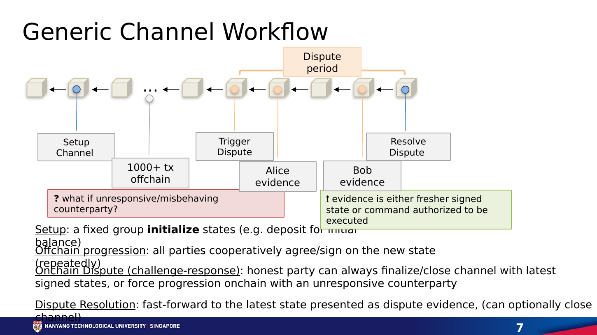

# **Chapter 5: Layer 2 Off-Chain Scalability**

## **Introduction**

Layer 2 scaling moves repeated work away from the base blockchain while retaining a defined relationship with it. The Layer 1 chain becomes a court and settlement system rather than the place where every interaction must occur.

The important question is not merely whether transactions happen "off-chain." Centralized exchanges also process activity off-chain. A Layer 2 protocol must explain how users recover assets, how incorrect state is rejected, which data must be available, and which security properties are inherited from Layer 1.

The course groups the main approaches into channels, sidechains and commit-chains, Plasma, and rollups. They differ in participants, data location, dispute mechanisms, and trust assumptions.

---

## **The General Off-Chain Pattern**

  
   
  <em>Figure 5.1: A channel opens on-chain, advances through signed off-chain states, and returns on-chain only for settlement or dispute. Source: Neil Han, SC6019 Lecture 03, slide 7.</em>

Most Layer 2 systems follow three steps:

1. **Lock or represent assets on Layer 1.** A contract defines the rules and custody boundary.
2. **Update state elsewhere.** Participants exchange signed messages or an operator publishes batches.
3. **Settle or exit on Layer 1.** The latest valid state is enforced, or an invalid proposal can be challenged.

Moving work off-chain reduces base-layer computation. The challenge is making the cheaper path safe when another participant disappears, censors a transaction, or submits dishonest state.

---

## **Payment Channels**

A payment channel allows two parties to transact repeatedly without placing every payment on-chain. They fund a shared output or contract. Each off-chain payment creates a newly signed allocation. Only opening, cooperative closing, or a dispute needs Layer 1.

The Bitcoin Lightning Network connects bilateral channels. A payment can be routed through intermediate nodes using hashed timelock contracts. The receiver reveals a secret to claim the payment, and the same secret lets each upstream hop settle. Timelocks protect participants if the route does not complete.[^1]

### **Strengths**

- very low marginal cost for repeated payments;
- fast confirmation between online participants;
- limited data burden on the base chain;
- more privacy than publishing every update on-chain.

### **Limitations**

- Payment channels require capital to be locked in advance;
- participants or watchtowers must monitor the chain during dispute windows;
- routing depends on available liquidity along an entire path;
- channels work best for repeated interactions, not arbitrary one-off users.

## **Generalized State Channels**

Ethereum-style state channels extend the idea beyond payments. Participants can update the state of a game, exchange, or application by signing messages. If everyone cooperates, only the final result reaches Layer 1. If they disagree, the contract examines signed evidence and resolves the dispute.

Application-specific channels encode one state machine. Generalized channels let participants install different applications inside a persistent channel. Sprites showed that a global contract can reduce the collateral lock-up time of multi-hop payments compared with purely local timelocks.[^2]

Channels offer excellent performance inside a stable participant set. They are less suitable when membership changes frequently or when an application requires shared global state.

---

## **Sidechains and Commit-Chains**

A sidechain is a separate blockchain connected to the base chain by a bridge. It has its own consensus and normally its own security budget. Users may gain low fees and fast blocks, but they do not automatically inherit Layer 1 security. If the sidechain validator set or bridge is compromised, the base chain may be unable to distinguish honest and dishonest withdrawals.

A commit-chain uses an operator or committee to order off-chain transactions and periodically commits a state root to Layer 1. Users retain signed evidence and may be able to exit through the base contract. The exact guarantee depends on whether transaction data is published and whether invalid commitments can be challenged.

These categories describe architecture, not a marketing label. A system should be evaluated by asking:

- Who orders transactions?
- Who can censor users?
- Where is transaction data stored?
- Can any user reconstruct the state?
- What must a user monitor to exit safely?
- Which keys can upgrade the contracts?

---

## **Plasma**

Plasma creates child chains whose operators periodically commit Merkle roots to Ethereum. Users can prove ownership of outputs and withdraw to the root contract. If an operator publishes an invalid spend or withholds data, users enter an exit process and challenge dishonest claims.[^3]

Plasma Cash assigns each deposit a unique position. A user follows the history of that coin rather than the entire child chain. This improves verification, but mass exits and data withholding remain difficult. Complex smart-contract state is also harder to represent than simple payments or non-fungible outputs.

Plasma made a major conceptual contribution: computation can happen elsewhere while Layer 1 enforces exits. Rollups improved the model by publishing transaction data on-chain, allowing anyone to reconstruct the state instead of forcing each user to retain a personal history.

---

## **Rollups as the Dominant General-Purpose Layer 2**

A rollup executes transactions outside Layer 1 and posts compressed transaction data plus a state commitment to Layer 1. Because the data is available, independent nodes can reconstruct and verify the rollup state.

- **Optimistic rollups** accept state commitments by default and use fraud proofs to reject invalid transitions.
- **Validity rollups** submit cryptographic proofs that the new state follows from the previous state and the published inputs.

Rollups reduce cost by amortizing Layer 1 data and verification across a batch. They support general-purpose smart contracts more naturally than channels or Plasma. Chapter 6 studies their sequencers, bridges, proving systems, and security models in detail.

---

## **Comparing Off-Chain Approaches**

| Approach | Best Fit | Data Location | Main Security Requirement | Main Limitation |
|---|---|---|---|---|
| Payment channel | Repeated payments | Participants | Timely dispute and channel liquidity | Fixed capital and routing |
| State channel | Repeated interactions among known users | Participants | Signed updates and dispute contract | Changing participants/shared state |
| Sidechain | Independent high-throughput chain | Sidechain | Sidechain consensus and bridge | Does not inherit L1 security |
| Plasma | Payments and owned outputs | Operator/users | Users retain proofs and can exit | Data withholding and mass exits |
| Rollup | General smart contracts | Published to L1 or approved DA layer | Fraud or validity proof system | Sequencing, proving, and bridge risk |

---

## **Security Is a Spectrum**

The phrase "secured by Ethereum" can hide important differences. A mature assessment separates:

1. **State validity** – can an invalid transition be finalized?
2. **Data availability** – can users obtain the inputs needed to verify or exit?
3. **Censorship resistance** – can users force a transaction or withdrawal through Layer 1?
4. **Finality** – when is a transaction economically and cryptographically irreversible?
5. **Upgrade control** – can a small group change the contracts or proof rules?

A protocol may use Ethereum for settlement while relying on a centralized sequencer for liveness, an external committee for data, or a multisig for upgrades. These do not make the system useless, but they must be visible in the trust model.

## **Worked Example: Closing a Channel Against an Old State**

Alice and Bob deposit five tokens each. After several updates, their latest signed state pays Alice two and Bob eight. Bob disappears, so Alice submits the latest state to the adjudicator contract.

Suppose Bob returns and submits an older state paying him nine. The contract cannot identify freshness from balances. Every update therefore carries a monotonically increasing sequence number. Alice presents both signatures and the higher sequence. The contract replaces Bob's claim and finalizes the two/eight allocation after the dispute window.

That window creates the channel's online assumption. Alice, or a watchtower acting for her, must notice the old-state attempt in time. A longer window protects occasionally offline users but delays settlement. A shorter window improves capital velocity but requires more reliable monitoring. Signed messages also need a chain ID, channel ID, participants, sequence, and expiry. Otherwise a valid signature may be replayed in another context.

## **Routing Is a Liquidity Problem**

A Lightning path can exist topologically and still fail economically. Every hop needs outbound liquidity in the correct direction for the amount and fees. Hashed timelock contracts link the route: the receiver reveals a preimage, which propagates backward so every intermediary can claim its incoming payment. Timelocks decrease along the route, giving each intermediary time to react if the next hop stops.

This safety margin locks capital. Longer routes and a congested base layer require more conservative expiries. Channel scalability is therefore a graph-routing problem, a monitoring problem, and a capital-efficiency problem at the same time.

## **Conclusion**

Layer 2 systems scale by avoiding global replication of every interaction. Channels are efficient for stable participants, sidechains provide independent capacity, Plasma uses exit games, and rollups combine off-chain execution with verifiable state commitments and available data.

No Layer 2 is free of trade-offs. Its safety depends on its exit path, data model, proof system, sequencer, and governance. The next chapter focuses on rollups, the leading general-purpose design in Ethereum's scaling roadmap.

## **References**

[^1]: Poon, Joseph, and Thaddeus Dryja. "The Bitcoin Lightning Network." <https://lightning.network/lightning-network-paper.pdf>.
[^2]: Miller, Andrew, et al. "Sprites and State Channels." <https://arxiv.org/abs/1702.05812>.
[^3]: Poon, Joseph, and Vitalik Buterin. "Plasma: Scalable Autonomous Smart Contracts." <http://plasma.io/plasma.pdf>.
