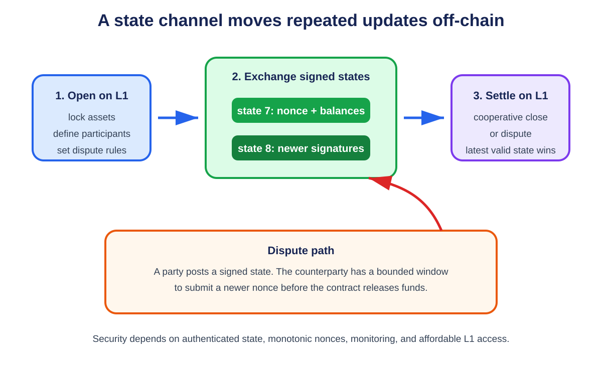

# **Chapter 5: Layer 2 Off-Chain Scalability**

## **Introduction**

Layer 2 scaling moves repeated work away from the base blockchain while retaining a defined relationship with it. The Layer 1 chain becomes a court and settlement system rather than the place where every interaction must occur.

The important question is not merely whether transactions happen "off-chain." Centralized exchanges also process activity off-chain. A Layer 2 protocol must explain how users recover assets, how incorrect state is rejected, which data must be available, and which security properties are inherited from Layer 1.

The course groups the main approaches into channels, sidechains and commit-chains, Plasma, and rollups. They differ in participants, data location, dispute mechanisms, and trust assumptions.

---

## **Intuition: Signed Receipts Instead of Global Updates**

A base chain is expensive because every update is broadcast, checked, and stored by many nodes. Off-chain protocols ask whether participants can exchange evidence privately and involve the chain only for a checkpoint or dispute.

Imagine Alice and Bob playing many rounds of a game. Instead of paying a court to record every score, they both sign the latest score sheet. If they agree at the end, they submit only the final sheet. If Bob submits an older sheet, Alice shows the newer signature during a dispute window.

This simple idea introduces the chapter's core terms:

- A **channel** locks assets or state in an on-chain contract and lets named participants exchange signed updates.
- A **commitment transaction** is a pre-authorized on-chain outcome representing one channel state.
- A **dispute window** is the time allowed to challenge stale or invalid evidence.
- A **timelock** prevents an action until a time or block height, giving another party time to respond.
- A **revocation secret** is evidence that an older Lightning commitment should no longer be used.
- A **watchtower** monitors the chain and responds for a user who is offline.

The chain is the judge of last resort. Safety depends on the contract recognizing the newest valid evidence and users being able to reach it before deadlines.

### **Payments through intermediaries**

A payment channel connects only its participants. To pay someone without a direct channel, a sender can route through intermediaries. Each intermediary needs a guarantee: it should pay the next hop only if it can claim from the previous hop.

A **hash time-locked contract (HTLC)** combines two conditions. The receiver must reveal a secret whose hash matches a known value, and must do so before a deadline. Revealing the secret lets claims propagate backward along the route. Staggered deadlines give each intermediary time to react on-chain if the next hop waits.

Think of several locked boxes in a row that open with the same code. The receiver opens the last box, revealing the code; each intermediary then uses it to open the preceding box. The boxes also have closing times, ordered so an intermediary does not pay out after losing its own chance to claim.

### **Liquidity, not only connectivity**

A route can exist in the network graph and still fail. A channel with 10 units total may have all 10 on the wrong side. **Liquidity** is spendable balance in the needed direction, not total channel capacity.

Routing therefore resembles finding roads that have both a connection and enough remaining cargo allowance. Fees, timelocks, private channels, concurrent payments, and failed attempts make the map imperfect.

### **Plasma, sidechains, and rollups**

These systems all move activity away from ordinary L1 execution but return different evidence:

- A **sidechain** has its own consensus. A bridge decides when to accept its messages.
- A **Plasma chain** posts commitments while users retain data needed to challenge and exit. Missing data can force many users to leave together.
- A **rollup** publishes transaction data, or enough recoverable data under its model, and lets the base layer reject invalid state through a fault proof or validity proof.

The beginner's test is: if the off-chain operator disappears today, what evidence does the user already have, what data can they obtain, which contract can they call, and how long do they have?

## **The General Off-Chain Pattern**

<p align="center">
  
  <br>
  <em>Figure 5.1: A channel locks assets on Layer 1, advances through newer jointly signed states, and returns to Layer 1 for cooperative settlement or dispute. Original figure for this book, based on the state-channel protocol described in SC6019 Lecture 03.</em>
</p>


Most Layer 2 systems follow three steps:

1. **Lock or represent assets on Layer 1.** A contract defines the rules and custody boundary.
2. **Update state elsewhere.** Participants exchange signed messages or an operator publishes batches.
3. **Settle or exit on Layer 1.** The latest valid state is enforced, or an invalid proposal can be challenged.

Moving work off-chain reduces base-layer computation. The challenge is making the cheaper path safe when another participant disappears, censors a transaction, or submits dishonest state.

---

## **Payment Channels**

A payment channel allows two parties to transact repeatedly without placing every payment on-chain. They fund a shared output or contract. Each off-chain payment creates a newly signed allocation. Only opening, cooperative closing, or a dispute needs Layer 1.

The Bitcoin Lightning Network connects bilateral channels. A payment can be routed through intermediate nodes using hashed timelock contracts. The receiver reveals a secret to claim the payment, and the same secret lets each upstream hop settle. Timelocks protect participants if the route does not complete.[^1]

### **Strengths**

- low marginal cost for repeated payments;
- fast confirmation between online participants;
- limited data burden on the base chain;
- more privacy than publishing every update on-chain.

### **Limitations**

- Payment channels require capital to be locked in advance;
- participants or watchtowers must monitor the chain during dispute windows;
- routing depends on available liquidity along an entire path;
- channels work best for repeated interactions, not arbitrary one-off users.

## **Generalized State Channels**

Ethereum-style state channels extend the idea beyond payments. Participants can update the state of a game, exchange, or application by signing messages. If everyone cooperates, only the final result reaches Layer 1. If they disagree, the contract examines signed evidence and resolves the dispute.

Application-specific channels encode one state machine. Generalized channels let participants install different applications inside a persistent channel. Sprites showed that a global contract can reduce the collateral lock-up time of multi-hop payments compared with purely local timelocks.[^2]

Channels offer excellent performance inside a stable participant set. They are less suitable when membership changes frequently or when an application requires shared global state.

---

## **Sidechains and Commit-Chains**

A sidechain is a separate blockchain connected to the base chain by a bridge. It has its own consensus and normally its own security budget. Users may gain low fees and fast blocks, but they do not automatically inherit Layer 1 security. If the sidechain validator set or bridge is compromised, the base chain may be unable to distinguish honest and dishonest withdrawals.

A commit-chain uses an operator or committee to order off-chain transactions and periodically commits a state root to Layer 1. Users retain signed evidence and may be able to exit through the base contract. The exact guarantee depends on whether transaction data is published and whether invalid commitments can be challenged.

These categories describe architecture, not a marketing label. A system should be evaluated by asking:

- Who orders transactions?
- Who can censor users?
- Where is transaction data stored?
- Can any user reconstruct the state?
- What must a user monitor to exit safely?
- Which keys can upgrade the contracts?

---

## **Named Case Study: Polygon Chain Has Independent Consensus**

**Deployment label: production. Naming checked September 2026.** Current documentation calls the network **Polygon Chain**, while many bridge interfaces and documentation paths retain the **Polygon PoS** name. It provides EVM-compatible execution through its own validator and block-production system, connected to Ethereum by staking, checkpoint, and bridge contracts. The documented chain architecture has two operating layers: Heimdall-v2 for consensus and finality, and Bor for block production and EVM execution.[^4] [^5] This makes it a useful contrast with the rollups in Chapter 6.

Trace Maya depositing ETH, making a Polygon payment, and withdrawing. On Ethereum, Maya calls the PoS bridge and locks the asset. The bridge event is observed and processed through Polygon's state-sync path, which delivers a corresponding message to Polygon Chain. After that message executes, Maya receives the mapped representation on Polygon. This first leg already crosses two security domains: Ethereum finalized the escrow event, while Polygon validators and bridge logic must recognize and apply it exactly once.[^6]

Maya sends the payment to a Polygon RPC endpoint. Bor block producers order and execute EVM transactions. Heimdall-v2 validators participate in the network's validation and checkpoint process. A checkpoint summarizes a span of Bor blocks with a Merkle commitment and is proposed, validated in Heimdall, and submitted to the checkpoint contract on Ethereum. Ethereum records the checkpoint acknowledgement. The checkpoint lets a later bridge proof refer to Polygon events without asking Ethereum to execute every Polygon transaction.[^5]

For the return path, Maya initiates a withdrawal on Polygon by burning or otherwise invoking the mapped-token exit logic. She waits for the Bor block containing the exit event to be covered by an accepted Ethereum checkpoint. She then submits the required Merkle proof to the Ethereum bridge so it can verify event inclusion and release the escrowed asset. The bridge marks the exit as consumed to prevent replay.[^7]

The important contrast is correctness. A rollup posts data and a state claim that Ethereum can accept or reject through a validity proof or fault-proof rule. Polygon Chain reaches transaction consensus with its own validator set; Ethereum checkpoint contracts authenticate commitments produced through that system, but do not run a rollup proof that every Bor state transition followed EVM rules. Ethereum custody and checkpoints strengthen the bridge boundary. They do not make Polygon execution inherit Ethereum's rollup security model.

The user-visible stages should therefore be explicit: Ethereum deposit included; deposit final enough for policy; Polygon state-sync message observed; Polygon balance minted; Polygon payment included; payment checkpointed to Ethereum; withdrawal burn included; containing checkpoint accepted; exit proof submitted; Ethereum asset released. "On Ethereum" can describe the staking and checkpoint contracts while still leaving Polygon consensus as a separate assumption.

Failure path: Bor stops producing blocks. Polygon transactions and withdrawals stop advancing even if Ethereum continues normally. If Heimdall cannot validate or submit a checkpoint, Polygon may continue producing some local history while new exits cannot obtain the Ethereum checkpoint evidence required by the bridge. Polygon's checkpoint documentation includes an acknowledgement path and a missing-acknowledgement path precisely because submission and recognition are separate operational events.[^5] If enough Polygon validator power violates safety, a fraudulent or conflicting history can threaten the bridge according to its verification and governance rules. If bridge contracts contain a bug or an upgrade authority is compromised, correct Polygon consensus does not protect Ethereum escrow.

Now compare three designs on operator failure. In a payment channel, Maya can use signed states to close on-chain under the channel contract. In an optimistic rollup, she can force data through L1 and rely on an honest challenge against invalid state. In Polygon Chain, she depends on Polygon validators, checkpoint production, bridge proof machinery, and the bridge's pause and upgrade controls. A checkpoint delay is mainly liveness; acceptance of a bad authenticated commitment or a bridge-verification bug can be a safety failure.

| Property | Polygon Chain | Optimistic rollup | Validity rollup |
|---|---|---|---|
| Transaction consensus | Polygon validator/Bor-Heimdall system | Rollup ordering plus Ethereum-enforced dispute rule | Rollup ordering plus Ethereum-verified validity proof |
| Data needed to reconstruct state | Served by Polygon network and archives under its protocol | Published to the specified DA path for challengers and users | Published to the specified DA path for users and future state |
| Ethereum evidence | Checkpoints and bridge proofs | Batch data, assertions and fault-proof outcome | Batch data/commitments and validity proof |
| Canonical exit depends on | Polygon checkpoint, valid event proof, bridge contracts | Confirmed assertion after challenge rule, bridge contracts | Verified proof/accepted state, bridge contracts |
| Main independent security assumption | Polygon validator and bridge governance system | At least one effective honest challenger plus correct contracts/data | Sound proof system, verifier, data and correct contracts |

The classification is not an insult or a quality ranking. It tells Maya which failure she must survive. A production sidechain can be fast, inexpensive, and widely used. The engineering mistake is to call its Ethereum checkpoints "rollup settlement" and then omit the validator-set and bridge assumptions from a risk review.


## **Plasma**

Plasma creates child chains whose operators periodically commit Merkle roots to Ethereum. Users can prove ownership of outputs and withdraw to the root contract. If an operator publishes an invalid spend or withholds data, users enter an exit process and challenge dishonest claims.[^3]

Plasma Cash assigns each deposit a unique position. A user follows the history of that coin rather than the entire child chain. This improves verification, but mass exits and data withholding remain difficult. Complex smart-contract state is also harder to represent than simple payments or non-fungible outputs.

Plasma made a major conceptual contribution: computation can happen elsewhere while Layer 1 enforces exits. Rollups improved the model by publishing transaction data on-chain, allowing anyone to reconstruct the state instead of forcing each user to retain a personal history.

---

## **Rollups for General-Purpose Layer 2 Execution**

A rollup executes transactions outside Layer 1 and posts compressed transaction data plus a state commitment to Layer 1. Because the data is available, independent nodes can reconstruct and verify the rollup state.

- **Optimistic rollups** accept state commitments by default and use fraud proofs to reject invalid transitions.
- **Validity rollups** submit cryptographic proofs that the new state follows from the previous state and the published inputs.

Rollups reduce cost by amortizing Layer 1 data and verification across a batch. They support general-purpose smart contracts more naturally than channels or Plasma. Chapter 6 studies their sequencers, bridges, proving systems, and security models in detail.

---

## **Comparing Off-Chain Approaches**

| Approach | Best Fit | Data Location | Main Security Requirement | Main Limitation |
|---|---|---|---|---|
| Payment channel | Repeated payments | Participants | Timely dispute and channel liquidity | Fixed capital and routing |
| State channel | Repeated interactions among known users | Participants | Signed updates and dispute contract | Changing participants/shared state |
| Sidechain | Independent high-throughput chain | Sidechain | Sidechain consensus and bridge | Does not inherit L1 security |
| Plasma | Payments and owned outputs | Operator/users | Users retain proofs and can exit | Data withholding and mass exits |
| Rollup | General smart contracts | Published to L1 or approved DA layer | Fraud or validity proof system | Sequencing, proving, and bridge risk |

---

## **Security Is a Spectrum**

The phrase "secured by Ethereum" can hide important differences. A mature assessment separates:

1. **State validity** - can an invalid transition be finalized?
2. **Data availability** - can users obtain the inputs needed to verify or exit?
3. **Censorship resistance** - can users force a transaction or withdrawal through Layer 1?
4. **Finality** - when is a transaction economically and cryptographically irreversible?
5. **Upgrade control** - can a small group change the contracts or proof rules?

A protocol may use Ethereum for settlement while relying on a centralized sequencer for liveness, an external committee for data, or a multisig for upgrades. These do not make the system useless, but they must be visible in the trust model.

## **Worked Example: Closing a Channel Against an Old State**

Alice and Bob deposit five tokens each. After several updates, their latest signed state pays Alice two and Bob eight. Bob disappears, so Alice submits the latest state to the adjudicator contract.

Suppose Bob returns and submits an older state paying him nine. The contract cannot identify freshness from balances. Every update therefore carries a monotonically increasing sequence number. Alice presents both signatures and the higher sequence. The contract replaces Bob's claim and finalizes the two/eight allocation after the dispute window.

That window creates the channel's online assumption. Alice, or a watchtower acting for her, must notice the old-state attempt in time. A longer window protects occasionally offline users but delays settlement. A shorter window improves capital velocity but requires more reliable monitoring. Signed messages also need a chain ID, channel ID, participants, sequence, and expiry. Otherwise a valid signature may be replayed in another context.

## **Routing Is a Liquidity Problem**

A Lightning path can exist topologically and still fail economically. Every hop needs outbound liquidity in the correct direction for the amount and fees. Hashed timelock contracts link the route: the receiver reveals a preimage, which propagates backward so every intermediary can claim its incoming payment. Timelocks decrease along the route, giving each intermediary time to react if the next hop stops.

This safety margin locks capital. Longer routes and a congested base layer require more conservative expiries. Channel scalability is therefore a graph-routing problem, a monitoring problem, and a capital-efficiency problem at the same time.

## **Implementing a State Channel**

A channel contract can be small, but its signed message format must be exact. One state object might contain:

```text
ChannelState {
    chain_id
    channel_contract
    channel_id
    participants[]
    sequence
    balances_or_application_state
    final
}
```

Every participant signs a domain-separated hash of this object. `chain_id` and `channel_contract` prevent a signature from being replayed on another chain or adjudicator. `channel_id` separates simultaneous channels among the same users. `sequence` gives states a total freshness order. The `final` flag permits cooperative closure without waiting through a dispute window.

The adjudicator stores the highest sequence it has seen:

```text
challenge(state, signatures):
    require all_required_signatures(state, signatures)
    require state.channel_id == expected_channel
    require state.sequence > best_sequence
    best_state = state
    best_sequence = state.sequence
    deadline = now + challenge_period
```

After the deadline, settlement applies `best_state`. A generalized channel may instead execute an application-specific transition on-chain when participants disagree. That fallback must be deterministic and bounded, or an adversary can make disputes too expensive to resolve.

### **Watchtowers and Delegated Monitoring**

A watchtower does not need custody of funds. The user gives it encrypted or pre-authorized evidence sufficient to respond to a stale close. A good design limits the tower's power to presenting a newer state. It also defines incentives: how the tower is paid, how missed responses are detected, and whether several towers can monitor the same channel.

Monitoring assumptions should be measured against base-layer conditions. A one-hour challenge window is weak if the L1 can remain congested for longer or if confirmation finality takes much of that hour.

## **Implementing HTLC Routing**

For a three-hop payment, the receiver chooses secret `r` and sends the payer `H(r)`. Each channel update creates a conditional payment:

```text
pay amount to next_hop if preimage(H) is revealed before timeout
otherwise refund amount to current_hop after timeout
```

Timeouts decrease toward the receiver. If Carol's output expires at height 100, Bob's incoming output must expire later, perhaps at 110, so Bob has time to learn the preimage and claim on-chain. Each hop adds a safety delta, increasing the total collateral lock time.

Atomic multipath payments split a large payment into smaller routes and reveal the claim condition only when all parts arrive. This improves routing around limited channels but creates coordination and probing concerns.

## **Plasma Exit Games in More Detail**

A Plasma operator publishes roots of child-chain blocks. To exit, a user presents a coin's position, latest transaction, and Merkle proof. Other users can challenge with evidence that the coin was spent later or that the exiting history is invalid.

The parent contract cannot cheaply reconstruct the whole child chain. Safety depends on users retaining data and watching exits. If the operator withholds a block, many users may attempt to leave at once. The root chain then becomes the bottleneck precisely during failure. Exit priority, bonds, and challenge ordering must prevent the operator from stealing with an old history.

Rollups change this by publishing enough batch data for any observer to reconstruct all balances. Users no longer need a private copy of every coin history, though they still rely on correct contracts and a functioning challenge or proof system.

## **L2 Classification Checklist**

Before calling a system Layer 2, identify:

- the contract or rule that holds canonical assets;
- the data each user must retain;
- who can propose new state;
- how invalid state is rejected;
- how censorship is bypassed;
- the longest period a user may safely remain offline;
- the cost of a disputed or mass exit;
- the keys that can replace these rules.

These answers classify the system more accurately than branding.

## **Channel Factories and Virtual Channels**

Opening one channel per user pair consumes L1 transactions. A channel factory lets several users lock funds in one contract and create many internal channels off-chain. The factory's participants sign updates allocating its total collateral among subchannels.

A virtual channel connects two users through intermediaries without opening a new on-chain channel. Intermediaries lock collateral in underlying channels and agree to enforce the virtual relationship. This saves setup cost but adds participants whose liquidity and availability matter.

Factories increase capital reuse while enlarging the failure group. A dispute may involve the factory state, subchannel state, and application state. Sequence numbers and challenge rules at each level must compose without allowing an old factory allocation to invalidate a newer subchannel.

## **Channel Privacy and Metadata**

Off-chain updates avoid public execution, but channel openings, capacities, routes, timing, and closures can reveal relationships. Routed-payment nodes observe neighboring hops and amounts. Probing can infer liquidity by testing which payments fail.

Privacy techniques include onion routing, route blinding, rendezvous routing, multipath splitting, and private channels. They reduce visibility but do not erase timing and liquidity signals. Watchtowers also need enough encrypted information to recognize a punishable close without learning every application update.

A privacy claim should state the observer: a routing intermediary, blockchain analyst, watchtower, counterparty, or global network adversary sees different metadata.

## **Sidechain Bridge Verification Models**

A sidechain bridge can verify messages in several ways.

**Multisignature or committee.** A threshold signs withdrawals. This is simple and cheap but makes the signer set a custody boundary.

**Light client.** The destination verifies source consensus headers and inclusion proofs. Security follows the source consensus more closely, but on-chain verification may be expensive and validator-set changes must be tracked.

**Optimistic bridge.** Relayers assert messages and watchers can challenge invalid assertions during a delay. This reduces routine verification cost but needs available source data and one honest challenger.

**Validity-proof bridge.** A proof attests to source consensus or state transition. Verification is compact, while proving the source protocol and keeping circuits current is complex.

Bridge labels such as "trustless" hide these mechanisms. The verification rule, upgrade authority, finality delay, and recovery behavior are the meaningful facts.

## **Mass-Exit Capacity**

Exit designs often prove one user can recover. The stronger question is whether many users can recover simultaneously.

If an L2 holds one million accounts and the parent chain can process only thousands of exit transactions per day, an emergency window can close before everyone exits. Aggregated exits, claim trees, priority queues, and validity proofs improve capacity. Rate limits can bound theft but delay honest withdrawals.

A mass-exit test should publish parent-chain gas per exit, maximum exits per block, challenge load, data required by each user, and the outcome when the operator withholds the final state. Safety for the fastest users is not system-wide safety.

## **Payment-Channel Rebalancing**

Successful payments move liquidity in one direction. A channel can remain fully funded yet unable to send further along the depleted side. Rebalancing sends a circular payment that returns funds to the same owner through other channels, or performs an on-chain splice that changes channel capacity without a full close.

Rebalancing costs routing fees and may fail because the required cycle lacks liquidity. Automated policies choose target balances and fee limits. They can leak demand information or compete with user payments. Network throughput therefore depends on liquidity distribution and rebalancing efficiency, not only total locked value.

## **Worked Lightning Route: Amounts, Fees, and Timelocks**

Consider a payment from Alice to Dave through Bob and Carol:

```text
Alice -> Bob -> Carol -> Dave
```

Dave must receive 100,000 millisatoshis. Carol charges a 1,000 msat base fee plus 0.1 percent of the forwarded amount. Bob charges 500 msat plus 0.05 percent. Ignoring integer-rounding details for the illustration, compute backward from the receiver.

Carol must receive enough to forward 100,000 msat and retain:

```text
1,000 + 0.001 × 100,000 = 1,100 msat
```

So Bob offers Carol 101,100 msat. Bob's fee is approximately:

```text
500 + 0.0005 × 101,100 = 550.55 msat
```

Alice therefore offers Bob about 101,651 msat after applying the protocol's integer rounding. Route construction works backward because each incoming HTLC must cover the next hop's outgoing amount plus fee.

### Timelock ladder

The outgoing HTLC near Dave expires first. Each upstream HTLC expires later by a safety delta:

```text
Alice-Bob expiry: 700
Bob-Carol expiry: 660
Carol-Dave expiry: 620
```

Dave reveals the payment preimage to claim Carol's HTLC. Carol uses the same preimage to claim from Bob, who uses it to claim from Alice. The decreasing expiries give an intermediary time to learn the preimage downstream and enforce its incoming claim on-chain before that claim expires.

A delta that is too small exposes an intermediary during congestion or a counterparty delay. A delta that is too large locks liquidity longer. Implementations account for confirmation depth, block-time variance, fee spikes, and the time required to publish a commitment transaction and second-stage claim.

### Failure traces

**Insufficient directional liquidity.** A channel can have enough total capacity while lacking balance in the required direction. The sender tries another route or amount. Repeated probes can leak payment intent.

**Dave never reveals the preimage.** Every HTLC times out in reverse order. Funds remain temporarily locked, reducing routing capacity, but no intermediary should lose principal if deadlines and on-chain actions are correct.

**Carol learns the preimage but goes offline.** Bob may enforce the outgoing or incoming contract on-chain according to the channel design. Watchtowers can react to revoked states, but they do not create missing liquidity or eliminate base-layer congestion.

**An old channel state is published.** The counterparty uses the revocation or newer-state mechanism during the dispute window. Security depends on monitoring and affordable chain access before deadline.

**The base layer is congested.** Many expiring HTLCs compete for blockspace. Fee reserves and deadline margins are part of channel safety. A theoretical claim path that cannot be included before expiry is not an effective remedy.

### Multipath payments

If no one route can carry 100,000 msat, the sender may split the payment. Atomic multipath designs bind parts to one payment condition so the receiver claims only when the required total arrives. Splitting improves liquidity use but increases routing attempts, fees, privacy leakage, and the number of temporary locks.

### Route-level accounting

A useful payment trace records:

- amount delivered and total amount sent;
- fee at each hop and rounding rule;
- outgoing and incoming expiry at each hop;
- channel balance before and after;
- attempt count and failure reason;
- time to receiver claim and full upstream settlement;
- whether any hop required an on-chain transaction.

Network TPS is not the useful metric. Capacity depends on directional liquidity, route length, fee policy, failure rate, lock duration, rebalancing, and base-layer dispute capacity.

## **Channel Backup, Restore, and Disaster Recovery**

A channel wallet cannot recover from a seed phrase alone if current channel state, revocation data, or counterparty commitments are missing. Ordinary on-chain wallets reconstruct funds by scanning history; channels may require private, frequently changing state.

### Recovery data

Back up:

```text
ChannelBackup {
  chain_id,
  channel_id,
  funding_outpoint,
  counterparty,
  latest_commitment_number,
  encrypted_static_recovery_data,
  watchtower_appointment_receipts,
  close_and_sweep_descriptors,
  wallet_and_protocol_version
}
```

A **static channel backup** may contain enough information to find the counterparty and request a safe close, but not enough to continue operating the channel or unilaterally reconstruct every latest balance. State what the backup guarantees.

Never copy live database files without a consistent snapshot rule. A backup captured between related writes can restore a commitment number without corresponding secrets or signatures.

### Revocation safety

In penalty-based channels, broadcasting an old commitment can let the counterparty claim a penalty. Restoring stale local state is therefore dangerous even when the file is authentic.

On startup after restore, mark channels recovery-only, contact counterparties and watchtowers, compare commitment points through the protocol, and avoid signing or broadcasting until synchronization proves the safe state. A user should not guess which backup is newest from filenames.

### Data-loss protection

Peers can exchange bounded recovery information that helps detect stale state without giving one peer power to fabricate balances. The protocol must resist a malicious counterparty falsely claiming that the user is behind and forcing an unfavorable close.

Authenticated monotonic commitment numbers identify ordering but do not by themselves reveal missing signed transactions. Define the safe response for each mismatch: continue, cooperative close, force close, or manual recovery.

### Watchtower receipts

A client needs durable evidence that a tower accepted the appointment covering its newest revocable state. Store tower identity, channel hint, covered commitment range, receipt signature, expiry, and fee policy.

A backup containing appointments that were queued but never acknowledged creates false confidence. Verify receipts after restore and reappoint when tower retention or chain horizon may have expired.

### Seed and channel database separation

The seed derives keys but not necessarily counterparty signatures, revocation history, pending HTLCs, or watchtower acknowledgements. Document distinct backup materials and their confidentiality.

Channel backups may reveal counterparties, funding transactions, balances, or routing activity. Encrypt with authenticated encryption, version the format, test wrong-password behavior, and avoid cloud filenames that leak identifiers.

### Pending HTLCs

Recovery during pending routed payments is time-sensitive. The node may need preimages, onion-routing secrets, incoming/outgoing HTLC mappings, and deadlines to claim or refund safely.

Prioritize channels by earliest on-chain expiry. A general restore process that takes hours can lose funds when one HTLC has minutes of safety margin. Persist critical forwarding state before acknowledging the upstream message.

### Worked recovery point

Suppose backups upload every 10 minutes, but channel updates occur once per second. Up to 600 updates can occur between backups:

```text
10 minutes × 60 updates/minute = 600 updates
```

A 10-minute recovery point objective is meaningless for continuing a penalty channel safely. Use synchronous or near-synchronous durable state, protocol data-loss protection, and watchtowers; periodic bulk backup is supplemental.

### Force-close recovery

A disaster runbook identifies funding outputs, latest safe commitments, closing transaction, sweep paths, CSV or absolute timelocks, fee reserves, and monitoring duration. **CheckSequenceVerify (CSV)**-style relative delays commonly require waiting a number of blocks after confirmation before a sweep path becomes valid.

Fee spikes can make pre-signed or fixed-fee transactions unusable. Test fee bumping or child-pays-for-parent paths under the exact channel format.

A force close can create several outputs with different delays and conditions. "Close confirmed" does not mean every balance is spendable. Wallet status should show each output and earliest action.

### Multi-device hazards

Two active devices controlling one channel can create divergent commitments. Cloud sync is not distributed consensus. Use one active writer, cryptographic fencing, or a protocol designed for replicated signing.

A device believed lost may later reconnect with stale state. Rotate credentials and prevent it from signing before restore is considered complete.

### Recovery drill

1. destroy the primary node and local channel database;
2. restore seed and documented backup artifacts on a new host;
3. identify all channels and funding outputs;
4. handle one stale backup, one unavailable counterparty, and one pending HTLC;
5. verify watchtower coverage;
6. recover through cooperative or force close;
7. sweep every delayed output under a fee spike and chain reorganization;
8. reconcile recovered balances and fees.

Measure time to detect, first protective transaction, final spendability, user loss, and manual decisions. Repeat without the original cloud account or hardware.

### Production assertions

A channel system should state what seed-only, static-backup, full-database, peer-assisted, and watchtower recovery each guarantee. Test every format version and migration.

Off-chain scalability is credible when reducing on-chain writes does not make private state an untested single point of fund loss.

## **Watchtower Data and Privacy**

A watchtower needs enough information to recognize a revoked commitment and publish the appropriate remedy, but users should not disclose their entire channel history. Designs can send encrypted penalty material indexed by a transaction-derived hint. The tower learns little until a matching breach appears on-chain.

The client must durably confirm that a tower accepted the latest appointment before treating protection as active. Towers need fee strategy, chain monitoring, data retention, and redundancy. If several apparent towers share one operator or infrastructure region, they are one failure domain.

Test breach response while the client is offline, the tower restarts, the fee market spikes, a chain reorganization removes the first remedy, and an appointment is duplicated or delivered out of order. Measure from breach publication to irrevocable remedy, not only webhook detection.

## **Conclusion**

Layer 2 systems scale by avoiding global replication of every interaction. Channels are efficient for stable participants, sidechains provide independent capacity, Plasma uses exit games, and rollups combine off-chain execution with verifiable state commitments and available data.

No Layer 2 is free of trade-offs. Its safety depends on its exit path, data model, proof system, sequencer, and governance. The next chapter focuses on rollups, a general-purpose design in Ethereum's rollup-centric roadmap.

## **References**

[^1]: Poon, Joseph, and Thaddeus Dryja. "The Bitcoin Lightning Network." <https://lightning.network/lightning-network-paper.pdf>.
[^2]: Miller, Andrew, et al. "Sprites and State Channels." <https://arxiv.org/abs/1702.05812>.
[^3]: Poon, Joseph, and Vitalik Buterin. "Plasma: Scalable Autonomous Smart Contracts." <http://plasma.io/plasma.pdf>.

[^4]: Polygon Documentation. "Polygon Chain overview." <https://docs.polygon.technology/pos/overview>.
[^5]: Polygon Documentation. "Checkpoints." <https://docs.polygon.technology/pos/architecture/heimdall_v2/checkpoints>.
[^6]: Polygon Documentation. "Ethereum to PoS." <https://docs.polygon.technology/pos/how-to/bridging/ethereum-polygon/ethereum-to-matic>.
[^7]: Polygon Documentation. "PoS to Ethereum." <https://docs.polygon.technology/pos/how-to/bridging/ethereum-polygon/matic-to-ethereum>.
