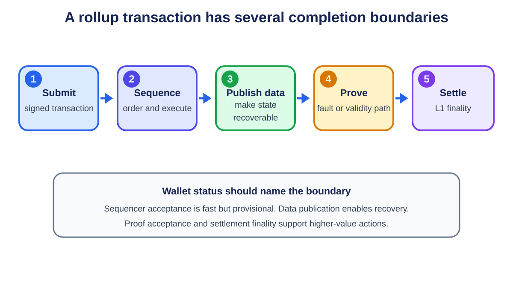

# **Chapter 6: Rollups**

## **Introduction**

Rollups move transaction execution away from the base chain while using it for settlement and data. Hundreds or thousands of transactions are compressed into a batch. The rollup publishes a new state commitment and enough information for the base layer to enforce correctness.

This design separates three questions: who orders transactions, who executes them, and how the result is proven. Understanding that separation is more useful than memorizing project names.

---

## **The Rollup Lifecycle**

<p align="center">
  
  <br>
  <em>Figure 6.1: A rollup transaction moves through sequencing, data publication, proof, and settlement. Applications should name which boundary they treat as complete. Original figure for this book.</em>
</p>


A typical transaction follows this path:

1. a user signs and submits a transaction to a sequencer;
2. the sequencer orders transactions and produces an L2 block;
3. an executor computes the new rollup state;
4. batch data or a data commitment is posted;
5. a state root is submitted to the settlement contract;
6. correctness is established by a fraud proof or validity proof;
7. the state becomes final under the rollup's rules.

The sequencer provides fast inclusion and a useful user experience, but its acknowledgement is normally **soft confirmation**. Settlement finality comes later. A centralized sequencer can censor or reorder transactions even when it cannot steal funds. Force-inclusion mechanisms and sequencer decentralization address this liveness risk.

---

## **Optimistic Rollups**

Optimistic rollups assume a proposed state is valid unless someone proves otherwise. After a batch is posted, a challenge period allows a verifier to submit a fraud proof.

A modern fault-proof system narrows disagreement to a specific execution step, then asks Layer 1 to evaluate that step. This avoids re-executing an entire batch on-chain.

### **Benefits**

- close compatibility with the EVM;
- relatively simple proving assumptions;
- computation is performed off-chain unless disputed;
- mature developer tooling and ecosystems.

### **Trade-Offs**

- canonical withdrawals can wait through the challenge period;
- at least one honest party must be able to reconstruct and challenge bad state;
- the fault-proof implementation and upgrade mechanism are security-critical;
- fast third-party bridges add liquidity and counterparty risk.

The honest verifier requirement does not mean every user must personally watch the chain. It means the system needs an open, economically sustainable set of watchers with access to the data and a working dispute path.[^1]

---

## **Validity Rollups**

Validity rollups, often called ZK rollups, attach a succinct proof that the new state was computed correctly. The Layer 1 verifier checks the proof rather than replaying the entire batch.

The proof may use a SNARK or STARK. These families differ in proof size, prover cost, verification cost, transparency, and cryptographic assumptions. The phrase "zero knowledge" describes the ability to hide witness data, but a validity rollup can use validity proofs without offering transaction privacy.

### **Benefits**

- invalid state cannot pass the verifier if the proof system and implementation are sound;
- withdrawals do not require a fraud-proof challenge window;
- verification cost can remain small even for a large computation;
- recursive proofs can aggregate many blocks.

### **Trade-Offs**

- proving is computationally demanding;
- circuits or zkVMs add implementation complexity;
- bugs in circuits, verifiers, or trusted setup procedures can be severe;
- EVM equivalence and rapid protocol upgrades are difficult engineering problems.

The course's STARK case study emphasizes **scalable proofs**: the verifier performs much less work than the prover, making it possible to amortize verification over a batch.

---

## **Where the Data Lives**

Validity proves that a transition is correct; it does not by itself make the underlying data available.

- A **rollup** publishes transaction data to the base layer.
- A **validium** stores data off-chain, often with a data availability committee.
- A **volition** lets users or applications choose between on-chain and off-chain data.

Validium can reduce cost, but an unavailable committee can prevent users from reconstructing balances or exiting, even if it cannot forge a validity proof. This is why state validity and data availability must be evaluated separately.

---

## **Compression and the Cost Model**

For many rollups, data publication is the largest variable cost. A batch saves money by:

- removing repeated signature and transaction fields;
- encoding values compactly;
- sharing one Layer 1 transaction across many L2 transactions;
- using blobs rather than expensive EVM calldata where supported.

EIP-4844 introduced blob-carrying transactions with their own fee market. Blobs are committed to by Ethereum consensus and retained for a limited period, which is sufficient for rollup reconstruction and challenges while avoiding permanent EVM storage.[^2]

A rollup's user fee can be viewed as:

> **L2 execution cost + allocated data-publication cost + proving/operation cost + margin**

High batch utilization lowers the data cost per user. Empty blocks or fragmented liquidity reduce those economies of scale.

---

## **Bridges and Forced Exits**

The canonical bridge locks an asset on Layer 1 and represents it on Layer 2. Withdrawals burn or release the L2 representation and unlock the L1 asset after the required proof or challenge process.

The bridge contract is often the rollup's largest pool of value. Security depends on:

- correct message authentication;
- replay protection;
- the state-root acceptance rule;
- proof verification;
- upgrade and emergency powers;
- a usable escape path if the sequencer stops.

A rollup is not trustless merely because it has a proof system. Users should examine whether contracts are upgradeable, who controls the upgrade keys, whether there is a delay, and whether users can exit before a disputed upgrade takes effect.

---

## **Optimistic vs Validity Rollups**

| Feature | Optimistic Rollup | Validity Rollup |
|---|---|---|
| Correctness rule | Valid unless challenged | Proof required before acceptance |
| Main proof | Fraud/fault proof | SNARK or STARK |
| L1 computation | Mostly during disputes | Verify each aggregate proof |
| Canonical withdrawal | Delayed by challenge period | After proof and L1 finality |
| Prover burden | Lower in normal operation | Significant and continuous |
| Compatibility | Mature EVM compatibility | zkEVM/zkVM complexity |
| Core assumption | One honest challenger with data | Sound proof system and available data |

Neither design dominates every workload. Optimistic systems benefit from simple execution compatibility. Validity systems benefit from concise finality and proof aggregation. Both still face sequencing, governance, bridging, and data-availability choices.

---

## **From Rollups to Appchains**

The course asks why applications are becoming chains. A dedicated rollup can choose its fee token, block time, execution environment, governance, and sequencing policy. It can isolate congestion and capture more of the economics generated by its users.

The cost is fragmentation. Users must bridge assets, liquidity is split, and synchronous calls across rollups become asynchronous messages. Superchain and hyperchain designs try to standardize bridges, messaging, and upgrades across related rollups. Shared sequencers and proof aggregation aim to restore some atomicity and economies of scale.

## **Worked Example: From Transaction to Withdrawal**

Assume 1,000 users submit transfers to an optimistic rollup. The sequencer checks signatures and nonces, chooses an order, and returns quick receipts. It executes the batch, produces a new state root, and publishes compressed transaction data to Ethereum. The rollup contract records the proposed root.

A verifier re-executes the data. If its root differs, it opens a dispute. A bisection game narrows the disagreement until the contract checks one disputed machine step. A dishonest proposal is rejected and its bond can be penalized. If nobody challenges during the window, the root becomes final under the rollup contract.

A canonical withdrawal proves that finalized L2 state contains the withdrawal message. A liquidity bridge can pay earlier, but that is a separate service accepting delay and reorganization risk for a fee.

In a validity rollup, a prover generates a proof and the contract verifies it before accepting the root. The user avoids a fraud-proof window but may still wait for proving, batch publication, Ethereum inclusion, and L1 finality. "Instant finality" must be separated into sequencer confirmation, proof finality, and settlement finality.

## **Sequencer Failure and the Escape Hatch**

A sequencer outage should reduce convenience, not destroy ownership. Force inclusion lets a user submit data to Layer 1; after a timeout, the rollup must process it or permit an exit. This path must remain usable when many users need it simultaneously.

Upgrade control is part of the same threat model. If an administrator can replace the verifier immediately, the proof system cannot protect users from that administrator. Delayed upgrades and an exit window make the cryptographic guarantee operationally credible.

## **Rollup State Commitments and Inboxes**

A rollup contract usually maintains an ordered inbox and a sequence of accepted state commitments. The inbox binds the L2 to data posted on L1, including force-included transactions. A simplified commitment might be:

```text
BatchCommitment {
    previous_state_root
    new_state_root
    inbox_start
    inbox_end
    transaction_data_hash
    l2_block_range
}
```

The transition rule states that executing inbox items and batch data from `previous_state_root` must produce `new_state_root`. An optimistic rollup lets a proposer assert this relation subject to challenge. A validity rollup requires a proof of it.

This structure prevents a proposer from proving an arbitrary computation unrelated to user messages. It also lets bridge contracts authenticate an L2 withdrawal against an accepted root.

## **Interactive Fault Proofs**

Re-executing a large batch on Ethereum would remove the scaling benefit. An interactive game instead commits both parties to execution traces. If a trace contains `2^n` steps, repeated bisection isolates one disputed step in about `n` rounds.

Suppose the proposer claims a final machine state and the challenger computes another. They compare a midpoint commitment. Whichever half disagrees becomes the next interval. Eventually the L1 contract executes one instruction against an agreed pre-state and decides which trace is correct.

Implementation details matter:

- the machine state must have a canonical hash;
- instruction semantics on L1 must match L2 exactly;
- deadlines prevent one party from stalling;
- bonds cover verification cost and discourage spam;
- the challenger needs all batch data;
- the system needs at least one working path to submit the challenge.

A permissionless game can still be practically centralized if proof software is difficult to run or the bond is prohibitively large.

## **Validity-Proof Pipeline**

A validity rollup converts execution into an arithmetic statement. The witness contains transaction data, signatures or signature-verification inputs, prior state paths, and intermediate values. The circuit or zkVM constrains each transition and exposes public inputs such as old root, new root, and batch commitment.

A production pipeline includes:

1. **trace generation**, turning VM execution into witness data;
2. **witness generation**, filling circuit columns or zkVM memory;
3. **proving**, committing to the trace and producing the argument;
4. **aggregation**, recursively combining several proofs;
5. **verification**, checking one compact proof on the settlement layer.

The prover is an availability component even when it cannot violate safety. If only one prover implementation exists and it crashes on a valid block, finality stalls. Multiple provers, deterministic trace formats, and the ability to reproduce witnesses improve resilience.

### **Circuit Correctness**

Cryptographic soundness proves the encoded relation, not the intended protocol. If a circuit forgets to constrain a value, a proof can be valid for an invalid state transition. Teams use specification tests, differential execution against a reference VM, formal methods for critical gadgets, and independent audits.

Upgrading a zkVM changes the relation being proven. Settlement contracts must bind a proof to a verifier and program version. Upgrade delays give users time to examine new rules and exit.

## **Data Encoding and Fee Estimation**

Batchers reduce bytes by omitting values that can be inferred from order or state, replacing addresses with indices, compressing signatures, and aggregating repeated fields. The decoder must be canonical; two decodings of the same bytes would threaten consensus.

A rough rollup fee estimator is:

```text
user fee = L2 gas × L2 gas price
         + user data bytes × expected blob byte price
         + allocated proving and operation cost
         + risk margin
```

Blob prices vary with demand, so batchers estimate future publication cost and may delay low-priority batches. Delay improves compression and cost per transaction but increases latency and the amount of unposted state at risk during a sequencer failure.

## **Rollup Operations Checklist**

A production rollup should document and monitor:

- sequencer uptime, reorganization policy, and forced-inclusion delay;
- batch submission lag and unposted transaction volume;
- DA publication success and retrieval;
- proof or challenge status for every commitment;
- canonical bridge balances and pending withdrawals;
- contract implementation, administrator, and upgrade delay;
- prover diversity and backlog;
- the tested cost and capacity of forced exits.

A block explorer that shows only L2 blocks covers the first step of a longer settlement pipeline.

## **Deriving a Canonical Withdrawal**

Assume a rollup stores withdrawals in a Merkle tree. A user withdrawing 10 tokens receives a message leaf:

```text
leaf = hash(
    source_rollup,
    destination_chain,
    withdrawal_nonce,
    sender,
    recipient,
    token,
    amount
)
```

After the state root is accepted, the user submits the message, Merkle path, and root identifier to the bridge. The bridge verifies inclusion, confirms finality under the rollup rule, marks the nonce spent, and transfers the asset.

Marking consumption before transfer avoids reentrancy and replay. Binding both domains prevents the same proof from being reused on another chain. Token mapping must distinguish native assets from representations and handle tokens with unusual transfer behavior.

## **Fault-Proof Game Economics**

A challenger spends compute to replay batches and capital to post bonds. If rewards do not cover monitoring and transaction cost, "one honest challenger" may exist in theory but not operation.

The protocol can pay successful challengers from proposer bonds. Bonds must be large enough to deter false assertions and cover dispute cost, but not so large that only a few actors can participate. Challenge transactions also compete for L1 inclusion during congestion. Systems can sponsor challengers, run several independent watchers, and pre-fund accounts.

Permissionless participation should be tested: a new challenger using public software and ordinary infrastructure must be able to reproduce state, detect an invalid assertion, and complete the game.

## **Prover Performance Engineering**

Proof generation is a pipeline of CPU, GPU, memory, storage, and network work. Trace generation may be sequential even when polynomial commitments parallelize. Large witnesses may exceed accelerator memory and require partitioning.

Measure proofs per unit time, time to first proof, peak memory, accelerator count, energy, and cost. Report the program and workload because cryptographic operations, memory accesses, and control flow affect circuits differently.

Recursive proof systems split a block into segments, prove segments in parallel, and aggregate them. Segmentation shortens the critical path but adds recursive overhead. A scheduler balances segment size, available hardware, and settlement deadline.

## **Sequencer Architecture**

A sequencer commonly has an RPC/mempool layer, admission controls, ordering engine, execution engine, state database, block builder, and batch publisher. High availability can use an active-passive replica or a consensus group.

Replicating a sequencer introduces its own fork-choice problem. If two replicas issue conflicting soft confirmations, users need a rule for which survives. One approach gives only an elected leader signing authority; another uses a quorum certificate for each L2 block. The latter improves fault tolerance but adds latency.

Admission control protects the sequencer from transactions designed to consume simulation or storage resources without paying. Nonce gaps, replacement transactions, invalid signatures, and underpriced data must be bounded before they fill queues.

## **Decentralized Sequencing Trade-Offs**

Rotating sequencers reduce dependence on one operator but require consensus on L2 order and state. Permissionless participation needs stake or another Sybil-resistance mechanism, networking, penalties, and a way to distribute fees.

Decentralization can worsen latency and make reorganization behavior visible to users. A protocol may separate fast preconfirmations from final L2 consensus. Wallets and applications must know which promise they received.

Based sequencing inherits ordering from L1 proposers. Shared sequencing amortizes consensus across rollups. Each choice changes censorship, MEV, latency, and cross-rollup composition rather than simply making sequencing "more decentralized."

## **Rollup Upgrade and Escape Testing**

Before an upgrade, operators should replay historical blocks against the new implementation, compare state roots, test bridge messages, and execute the forced path. A canary deployment or shadow prover can find divergence before activation.

The upgrade announcement should publish code hashes, verifier addresses, activation time, audit results, and user exit deadline. Emergency changes need narrower scope and a postmortem. An escape hatch that an upgrade can silently disable is not independent protection.

## **End-to-End Implementation Example: A Rollup Payment**

Consider a minimal account-based rollup supporting deposits, transfers, and withdrawals. The example is intentionally small enough to audit, but its boundaries match production systems.

### State and transaction format

The L2 state maps an account identifier to a balance, nonce, and public key. A transfer contains:

```text
Transfer {
  chain_id,
  rollup_contract,
  sender,
  receiver,
  amount,
  fee,
  nonce,
  expiry,
  signature
}
```

`chain_id` and `rollup_contract` prevent the signature from being replayed on another deployment. The nonce prevents replay within this rollup. Expiry bounds how long a censored or delayed transaction remains valid. The signed payload includes fee and receiver so an intermediary cannot change either.

A deposit is not an ordinary signed L2 transfer. It begins as an L1 event emitted after the bridge receives funds. The rollup derives a unique deposit identifier from the source block, transaction, and event position. The state transition marks that identifier consumed before crediting the account. A reorganization policy defines how much L1 finality is required before the deposit can enter a batch.

### Batch construction

The sequencer validates syntax and signatures, rejects stale nonces, selects an order, and executes against a parent state root. It creates a batch header:

```text
BatchHeader {
  rollup_id,
  batch_number,
  parent_state_root,
  post_state_root,
  transaction_data_commitment,
  inbox_cursor,
  timestamp,
  protocol_version
}
```

The batch number and parent root make the state chain explicit. The inbox cursor proves which forced L1 messages and deposits have been consumed. The protocol version chooses one deterministic transition function. The data commitment binds the encoded transactions used to reproduce the post-state root.

Before signing the header, an implementation checks three invariants: the parent is the last accepted state, every mandatory inbox item through the cursor was processed exactly once, and re-execution from published data produces the proposed post-state root.

### Publication and proof

The operator publishes compressed transaction data to the chosen DA path and submits the header to the settlement contract. These actions must be linked. A contract that accepts a state root without binding it to available transaction data can leave users unable to reconstruct state.

An optimistic design starts a challenge window. Challengers download the data, reproduce execution, and dispute an invalid transition. A validity design proves a statement equivalent to:

```text
given parent_state_root and committed batch data,
valid decoding + signatures + nonce rules + balance rules
produce post_state_root and inbox_cursor
```

The public inputs must bind the rollup identity, protocol version, roots, data commitment, and inbox position. Omitting one can make a proof valid for the wrong deployment, program, or batch.

### Withdrawal lifecycle

A withdrawal transition debits L2 funds and inserts a message leaf containing source rollup, destination chain, recipient, asset, amount, and unique nonce. After the batch is accepted under the rollup's proof rule, the user supplies a Merkle proof to the L1 bridge.

The bridge verifies the accepted state or message root, checks domain separation and finality, marks the message consumed, then transfers the asset. Marking before transfer follows checks-effects-interactions and blocks reentrancy-based replay. The consumed key should bind every field that distinguishes one withdrawal from another.

A wallet should not show one undifferentiated "complete" state. Useful statuses are:

1. **received** - sequencer accepted the signed transfer;
2. **included** - transaction appears in an L2 block;
3. **data published** - independent nodes can reconstruct it;
4. **state accepted** - proof or challenge rule accepted the batch;
5. **settlement final** - the relevant L1 block is final under policy;
6. **withdrawal executed** - the destination bridge consumed the message.

### Failure and recovery table

| Failure | Safe behavior | Recovery path |
|---|---|---|
| Sequencer stops before inclusion | User funds and nonce remain unchanged | Submit through forced inbox or another sequencer |
| Sequencer equivocates on soft confirmations | Conflicting promises are visible but not final | Follow canonical published batch; apply preconfirmation penalty if defined |
| Batch data is missing | Do not accept a state that depends on unavailable data | Reconstruct from DA network or reject/halt under protocol rule |
| Optimistic batch is invalid | Challenger prevents final acceptance | Execute fault-proof game before deadline |
| Validity proof is unavailable | State cannot advance, but prior accepted state remains safe | Fail over to another prover or use delayed escape mode |
| Settlement chain reorganizes | Do not release against the reverted commitment | Re-evaluate batch and message after required finality |
| Bridge transaction is replayed | Consumed-message check rejects it | No recovery needed; retain evidence and alert |
| Upgrade changes transition rules | Old and new versions must not silently diverge | Timelocked activation, shadow execution, and user exit window |

### Test harness

An end-to-end test starts from a known L1 and L2 genesis, deposits funds, transfers them, publishes a batch, proves or challenges it, withdraws, and verifies final balances on both layers. Repeat the flow after process restarts and at every persistence boundary.

Then inject faults: reorder inbox messages, duplicate a deposit, change one encoded amount after commitment, prove against the wrong program version, withhold data, stop the primary prover, reorganize an unfinalized deposit, replay a withdrawal, and activate an incompatible upgrade. Assert both a safety result and an observable status. "The transaction failed" is insufficient; the user and operator need to know which boundary failed and which recovery action is valid.

This small example demonstrates why rollup correctness is not one proof or contract. It is an agreement among transaction encoding, deterministic execution, data publication, proof rules, settlement finality, bridge replay protection, operator persistence, and user-facing status.

## **Conclusion**

Rollups scale execution by batching work and turning Layer 1 into a verifier and data-publication layer. Optimistic rollups use disputes; validity rollups use cryptographic proofs. Their real security also depends on sequencers, bridges, data availability, upgrades, and exit mechanisms.

Rollups do not remove the need to scale Layer 1. They make Layer 1 data capacity more valuable. The next chapters study the modular architecture behind this relationship and the data-availability problem that makes it possible.

## **References**

[^1]: Ethereum.org. "Optimistic Rollups." <https://ethereum.org/developers/docs/scaling/optimistic-rollups/>.
[^2]: Buterin, Vitalik, et al. "EIP-4844: Shard Blob Transactions." <https://eips.ethereum.org/EIPS/eip-4844>.
