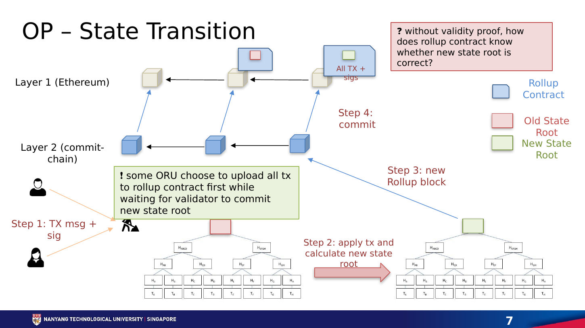

# **Chapter 6: Rollups**

## **Introduction**

Rollups move transaction execution away from the base chain while using it for settlement and data. Hundreds or thousands of transactions are compressed into a batch. The rollup publishes a new state commitment and enough information for the base layer to enforce correctness.

This design separates three questions: who orders transactions, who executes them, and how the result is proven. Understanding that separation is more useful than memorizing project names.

---

## **The Rollup Lifecycle**

  
   
  <em>Figure 6.1: Users submit signed transactions, the rollup executes them, and a commitment to the new state is posted to Layer 1. Source: Neil Han, SC6019 Lecture 04, slide 6.</em>

A typical transaction follows this path:

1. a user signs and submits a transaction to a sequencer;
2. the sequencer orders transactions and produces an L2 block;
3. an executor computes the new rollup state;
4. batch data or a data commitment is posted;
5. a state root is submitted to the settlement contract;
6. correctness is established by a fraud proof or validity proof;
7. the state becomes final under the rollup's rules.

The sequencer provides fast inclusion and a useful user experience, but its acknowledgement is normally **soft confirmation**. Settlement finality comes later. A centralized sequencer can censor or reorder transactions even when it cannot steal funds. Force-inclusion mechanisms and sequencer decentralization address this liveness risk.

---

## **Optimistic Rollups**

Optimistic rollups assume a proposed state is valid unless someone proves otherwise. After a batch is posted, a challenge period allows a verifier to submit a fraud proof.

A modern fault-proof system narrows disagreement to a specific execution step, then asks Layer 1 to evaluate that step. This avoids re-executing an entire batch on-chain.

### **Benefits**

- close compatibility with the EVM;
- relatively simple proving assumptions;
- computation is performed off-chain unless disputed;
- mature developer tooling and ecosystems.

### **Trade-Offs**

- canonical withdrawals can wait through the challenge period;
- at least one honest party must be able to reconstruct and challenge bad state;
- the fault-proof implementation and upgrade mechanism are security-critical;
- fast third-party bridges add liquidity and counterparty risk.

The honest verifier requirement does not mean every user must personally watch the chain. It means the system needs an open, economically sustainable set of watchers with access to the data and a working dispute path.[^1]

---

## **Validity Rollups**

Validity rollups, often called ZK rollups, attach a succinct proof that the new state was computed correctly. The Layer 1 verifier checks the proof rather than replaying the entire batch.

The proof may use a SNARK or STARK. These families differ in proof size, prover cost, verification cost, transparency, and cryptographic assumptions. The phrase "zero knowledge" describes the ability to hide witness data, but a validity rollup can use validity proofs without offering transaction privacy.

### **Benefits**

- invalid state cannot pass the verifier if the proof system and implementation are sound;
- withdrawals do not require a fraud-proof challenge window;
- verification cost can remain small even for a large computation;
- recursive proofs can aggregate many blocks.

### **Trade-Offs**

- proving is computationally demanding;
- circuits or zkVMs add implementation complexity;
- bugs in circuits, verifiers, or trusted setup procedures can be severe;
- EVM equivalence and rapid protocol upgrades are difficult engineering problems.

The course's STARK case study emphasizes **scalable proofs**: the verifier performs much less work than the prover, making it possible to amortize verification over a batch.

---

## **Where the Data Lives**

Validity proves that a transition is correct; it does not by itself make the underlying data available.

- A **rollup** publishes transaction data to the base layer.
- A **validium** stores data off-chain, often with a data availability committee.
- A **volition** lets users or applications choose between on-chain and off-chain data.

Validium can reduce cost, but an unavailable committee can prevent users from reconstructing balances or exiting, even if it cannot forge a validity proof. This is why state validity and data availability must be evaluated separately.

---

## **Compression and the Cost Model**

For many rollups, data publication is the largest variable cost. A batch saves money by:

- removing repeated signature and transaction fields;
- encoding values compactly;
- sharing one Layer 1 transaction across many L2 transactions;
- using blobs rather than expensive EVM calldata where supported.

EIP-4844 introduced blob-carrying transactions with their own fee market. Blobs are committed to by Ethereum consensus and retained for a limited period, which is sufficient for rollup reconstruction and challenges while avoiding permanent EVM storage.[^2]

A rollup's user fee can be viewed as:

> **L2 execution cost + allocated data-publication cost + proving/operation cost + margin**

High batch utilization lowers the data cost per user. Empty blocks or fragmented liquidity reduce those economies of scale.

---

## **Bridges and Forced Exits**

The canonical bridge locks an asset on Layer 1 and represents it on Layer 2. Withdrawals burn or release the L2 representation and unlock the L1 asset after the required proof or challenge process.

The bridge contract is often the rollup's largest pool of value. Security depends on:

- correct message authentication;
- replay protection;
- the state-root acceptance rule;
- proof verification;
- upgrade and emergency powers;
- a usable escape path if the sequencer stops.

A rollup is not trustless merely because it has a proof system. Users should examine whether contracts are upgradeable, who controls the upgrade keys, whether there is a delay, and whether users can exit before a disputed upgrade takes effect.

---

## **Optimistic vs Validity Rollups**

| Feature | Optimistic Rollup | Validity Rollup |
|---|---|---|
| Correctness rule | Valid unless challenged | Proof required before acceptance |
| Main proof | Fraud/fault proof | SNARK or STARK |
| L1 computation | Mostly during disputes | Verify each aggregate proof |
| Canonical withdrawal | Delayed by challenge period | After proof and L1 finality |
| Prover burden | Lower in normal operation | Significant and continuous |
| Compatibility | Mature EVM compatibility | zkEVM/zkVM complexity |
| Core assumption | One honest challenger with data | Sound proof system and available data |

Neither design dominates every workload. Optimistic systems benefit from simple execution compatibility. Validity systems benefit from concise finality and proof aggregation. Both still face sequencing, governance, bridging, and data-availability choices.

---

## **From Rollups to Appchains**

The course asks why applications are becoming chains. A dedicated rollup can choose its fee token, block time, execution environment, governance, and sequencing policy. It can isolate congestion and capture more of the economics generated by its users.

The cost is fragmentation. Users must bridge assets, liquidity is split, and synchronous calls across rollups become asynchronous messages. Superchain and hyperchain designs try to standardize bridges, messaging, and upgrades across related rollups. Shared sequencers and proof aggregation aim to restore some atomicity and economies of scale.

## **Worked Example: From Transaction to Withdrawal**

Assume 1,000 users submit transfers to an optimistic rollup. The sequencer checks signatures and nonces, chooses an order, and returns quick receipts. It executes the batch, produces a new state root, and publishes compressed transaction data to Ethereum. The rollup contract records the proposed root.

A verifier re-executes the data. If its root differs, it opens a dispute. A bisection game narrows the disagreement until the contract checks one disputed machine step. A dishonest proposal is rejected and its bond can be penalized. If nobody challenges during the window, the root becomes final under the rollup contract.

A canonical withdrawal proves that finalized L2 state contains the withdrawal message. A liquidity bridge can pay earlier, but that is a separate service accepting delay and reorganization risk for a fee.

In a validity rollup, a prover generates a proof and the contract verifies it before accepting the root. The user avoids a fraud-proof window but may still wait for proving, batch publication, Ethereum inclusion, and L1 finality. "Instant finality" must be separated into sequencer confirmation, proof finality, and settlement finality.

## **Sequencer Failure and the Escape Hatch**

A sequencer outage should reduce convenience, not destroy ownership. Force inclusion lets a user submit data to Layer 1; after a timeout, the rollup must process it or permit an exit. This path must remain usable when many users need it simultaneously.

Upgrade control is part of the same threat model. If an administrator can replace the verifier immediately, the proof system cannot protect users from that administrator. Delayed upgrades and an exit window make the cryptographic guarantee operationally credible.

## **Conclusion**

Rollups scale execution by batching work and turning Layer 1 into a verifier and data-publication layer. Optimistic rollups use disputes; validity rollups use cryptographic proofs. Their real security also depends on sequencers, bridges, data availability, upgrades, and exit mechanisms.

Rollups do not remove the need to scale Layer 1. They make Layer 1 data capacity more valuable. The next chapters study the modular architecture behind this relationship and the data-availability problem that makes it possible.

## **References**

[^1]: Ethereum.org. "Optimistic Rollups." <https://ethereum.org/developers/docs/scaling/optimistic-rollups/>.
[^2]: Buterin, Vitalik, et al. "EIP-4844: Shard Blob Transactions." <https://eips.ethereum.org/EIPS/eip-4844>.
