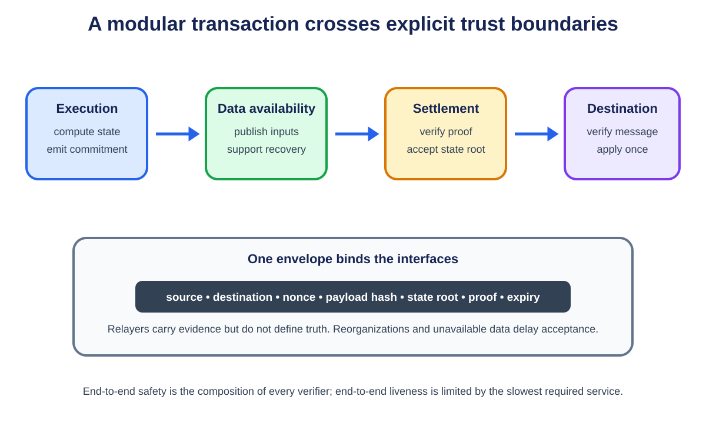

# **Chapter 7: Modular vs Monolithic Blockchains**

## **Introduction**

A monolithic blockchain asks one protocol and validator network to provide execution, settlement, consensus, and data availability. A modular blockchain separates some of these functions so that specialized systems can perform them independently.

Modularity is not automatically more decentralized or more secure. It creates explicit interfaces and lets each layer scale differently, but the end-to-end system inherits the assumptions and failure modes of every layer it uses.

---

## **From One Machine to a Stack of Services**

A **monolithic blockchain** asks one validator network to order transactions, execute them, agree on the result, and make block data available. "Monolithic" does not mean badly designed; it means the core jobs share one protocol and security boundary.

A **modular blockchain stack** separates some jobs into different protocols. A rollup may execute transactions, Ethereum may settle its state claims, and a data-availability network may publish the batch bytes. Separation lets each layer specialize, but the user now depends on the interfaces between them.

Think of sending a parcel. One company can collect, transport, clear, and deliver it end to end. A modular route may use a storefront, international carrier, customs broker, and local courier. Specialization can lower cost, but tracking "shipped" is ambiguous unless it names which service completed which step.

### **Four jobs, four questions**

- **Execution:** Given an ordered transaction and prior state, what new state results?
- **Settlement:** Which claimed result is accepted, and where can a dispute or proof be enforced?
- **Consensus:** Which ordered data history is canonical?
- **Data availability:** Can participants obtain the data needed to verify or reconstruct that history?

Consensus can agree on a data commitment without understanding an application's transactions. Settlement can accept a proof without storing every historical query. Execution can calculate a result before another layer considers it final.

### **Sovereign and settled rollups**

A **settled rollup** uses a settlement contract to decide which state root is valid. Its bridge can release assets according to that contract.

A **sovereign rollup** publishes ordered data but its own nodes interpret the rules and choose upgrades or forks. The DA layer establishes what data was ordered, not which software version the rollup community should follow. A bridge to a sovereign rollup must therefore decide how it identifies the canonical fork.

The word **sovereign** describes rule choice, not automatic safety. Users still need data, honest verification, and an explicit bridge or light-client policy.

### **Messages between layers**

Layers communicate through commitments and proofs. A message envelope usually binds source and destination, sender and recipient, payload, nonce, timeout, and protocol version. **Domain separation** prevents valid evidence from one chain or channel from being replayed in another.

A **relayer** transports evidence. When verification is complete, the relayer need not be trusted for correctness: it can delay delivery, but it cannot change a proven amount or recipient. Permissionless relaying means another party can submit the same evidence.

### **End-to-end security**

Security does not add like independent features. A valid execution proof cannot rescue unavailable data; final data does not rescue a bridge with an upgrade key that can mint assets; correct layers do not rescue a decoder that interprets their interface differently.

Use a chain of custody: name the evidence emitted by one layer, the verifier at the next layer, the finality required, and the recovery if evidence stops. The weakest accepted transition bounds the user outcome.

## **The Monolithic Model**

In a monolithic chain, validators:

1. receive and order transactions;
2. execute them;
3. agree on a block;
4. store and distribute the block data;
5. maintain the resulting state.

The strength of this model is integrated security and synchronous composability. A transaction can call several contracts against one state and either complete atomically or revert. Developers and users reason about one fee market, one finality rule, and one validator set.

The weakness is replicated work. Increasing capacity raises the requirements of the same nodes that secure the network. Congestion in one popular application can affect every other application.

---

## **The Modular Stack**

<p align="center">
  
  <br>
  <em>Figure 7.1: A modular transaction crosses execution, data availability, settlement, and destination interfaces. A domain-separated message envelope binds the evidence carried between them. Original figure for this book.</em>
</p>


A modular system separates the four jobs:

- **Execution layers** run transactions and compute state transitions.
- **Settlement layers** verify proofs, resolve disputes, and define canonical state.
- **Consensus layers** order data and finalize blocks.
- **Data availability layers** publish enough data for verification and reconstruction.

An Ethereum rollup is a practical example. The rollup provides execution, while Ethereum supplies settlement, consensus, and data availability. A sovereign rollup may instead use a data availability layer for ordering and publication while its own nodes define the canonical state and fork-choice rules.

---

## **Why Specialization Helps**

Modularity allows different scaling techniques for different bottlenecks:

- execution can use parallel VMs or application-specific logic;
- validity proofs can compress verification;
- data layers can use erasure coding and sampling;
- settlement can remain deliberately conservative;
- many execution layers can share one security base.

It also gives applications sovereignty. A game may prioritize low latency, an exchange may optimize parallel order processing, and a privacy application may use a custom proof system without asking an entire Layer 1 community to change its execution environment.

---

## **The Hidden Costs of Modularity**

### **Fragmented Liquidity and State**

Assets and applications spread across execution layers. Moving between them requires bridges and asynchronous messages. The integrated composability of one chain becomes a distributed-systems problem.

### **More Trust Boundaries**

A modular transaction can depend on a sequencer, a proof system, a settlement contract, a data layer, and a bridge. A failure in any one can delay finality or block exits.

### **Different Meanings of Finality**

A user may see sequencer confirmation in seconds, data publication later, and settlement finality later still. Applications must decide which stage is sufficient for deposits, withdrawals, and cross-chain messages.

### **Operational Complexity**

Developers need indexers, relayers, proof infrastructure, bridge monitoring, and policies for upgrades across several layers. The stack is easier to customize but harder to observe as a whole.

---

## **Celestia and Data Availability Specialization**

Celestia focuses on ordering transactions and making their data available rather than executing application state. Light nodes sample small portions of erasure-coded blocks. With enough random samples, they gain high confidence that the complete block can be reconstructed by the network.[^1]

This allows many rollups to publish data without requiring Celestia validators to execute each rollup. The rollup chooses whether its state is validated by a settlement layer, validity proofs, fraud proofs, or its own full nodes.

The security statement must be precise: the data layer can show that data was published, but it does not necessarily prove that a particular rollup's state transition was valid.

---

## **Named Deployment Trace: An OP Stack Chain With Celestia DA**

**Deployment label: production-capable stack and deployed integrations; the exact security label belongs to each chain configuration.** The OP Stack separates sequencing, derivation, execution, data availability, settlement and governance into named components. Celestia's OP Stack integration replaces Ethereum as the primary location for transaction batch data while retaining an Ethereum-facing commitment and verification path through the configured alternative-DA contracts.[^2][^3] This is a concrete modular deployment, not a hypothetical four-box diagram.

Trace Maya's payment on an OP Stack chain configured for Celestia DA. Maya signs an EVM transaction and sends it to the chain's sequencer. The sequencer's execution client checks and executes it, while `op-node` coordinates L2 block production. Maya receives a fast L2 result under the sequencer's ordering promise. At this point the transaction has executed in the operator's view, but independent derivation still depends on publication.

The batcher collects L2 blocks and compresses their transaction data. In the default Ethereum-DA configuration, that data is posted in Ethereum calldata or blobs. In the Celestia alternative-DA configuration, the batcher sends the payload to Celestia and receives a commitment or reference under the integration protocol. It then posts the compact DA commitment through the OP Stack's Ethereum-facing data-availability contract path. An independent node reads Ethereum's canonical inputs, sees the alternative-DA reference, retrieves the payload from Celestia, verifies that the bytes match the commitment, and feeds them into the OP derivation pipeline. The execution engine reproduces the same L2 blocks and state.[^2][^4]

The settlement path remains another module. An output proposal or dispute-game claim commits to L2 state on Ethereum under that chain's fault-proof configuration. A challenger reconstructing a disputed state needs the Celestia payload. If it cannot retrieve the data required by the configured DA rule, it cannot safely treat the execution claim as reproducible merely because an Ethereum contract stored a short commitment. The integration must define how unavailable alternative data blocks state acceptance or activates a challenge.

A canonical withdrawal now crosses all of these boundaries. Maya initiates an L2-to-L1 message. The message is in an L2 block derived from Celestia-backed batch data. A state claim covering that block is proposed on Ethereum and passes the applicable dispute period. Maya proves and finalizes the withdrawal through the OP bridge contracts. Ethereum holds the escrow and judges the fault-proof game, but the transaction data needed to reconstruct the claim came from Celestia. End-to-end security is the composition, not the strongest module named in the diagram.

### **Exact trust and liveness assumptions**

The sequencer can delay or reorder the fast path. Users need the chain's configured L1 submission or recovery mechanism to bypass it. Celestia validators and data-availability sampling secure publication under Celestia's model, while retrievers and archives determine whether challengers can still obtain the batch throughout the required window. Ethereum orders the DA commitments, state claims and bridge actions and executes the settlement contracts. OP derivation and execution clients must agree on the alternative-DA encoding. The fault-proof program and challenger set must be effective. Governance can replace contracts, chain configuration, DA adapters or proof components.

This deployment does **not** inherit Ethereum blob availability for its batch bytes. It does **not** ask Celestia to execute the EVM transaction or decide the OP Stack state root. Blobstream can relay Celestia data-root commitments to an EVM chain, but it proves facts about Celestia consensus and commitments, not correctness of Maya's application execution.[^5] The OP fault-proof path establishes execution correctness relative to available input and the deployed program.

### **Observable consequences and failure paths**

Operators should connect one batch across systems with durable identifiers: L2 block range and batch hash; Celestia namespace, height and blob commitment; Ethereum alternative-DA commitment transaction; derived L2 safe head; output or dispute-game claim; and withdrawal message. A dashboard that monitors only Ethereum batch transactions can report healthy settlement while Celestia retrieval is failing. A Celestia explorer can show available bytes while the Ethereum commitment adapter or OP derivation client is broken.

Suppose the sequencer produces 100 L2 blocks, publishes their payload to Celestia, but crashes before posting the alternative-DA commitment to Ethereum. Celestia contains bytes, yet canonical OP derivation has no authenticated pointer in its Ethereum input stream. A replacement batcher needs an idempotent recovery rule that posts the same commitment and block range, not a new encoding that forks derivation.

Suppose the Ethereum commitment lands, but Celestia data cannot be reconstructed. Nodes stop advancing the safe derived chain at that input. They must not replace unavailable bytes with a batch fetched privately from the sequencer unless the protocol authenticates the same commitment and the DA acceptance rule is satisfied. The rollup's proof and withdrawal timers must not outrun the challenge data.

Suppose Celestia reorganizes a not-yet-final block containing the blob while Ethereum retains the reference. The integration needs a finality policy and a response: wait before posting, update or invalidate the reference under allowed rules, or halt derivation. A reference to a noncanonical DA block must not silently become valid because Ethereum finalized the reference transaction.

Suppose Blobstream or another bridge carrying Celestia commitments pauses. Celestia can remain available while Ethereum-side verification and settlement stop. This is a liveness failure at the bridge module. If the bridge accepts a false root because its validator or contract assumptions fail, that becomes a safety failure. A circuit breaker can limit value or stop new withdrawals, but it cannot by itself reconstruct missing data or prove the correct state.

### **Deployment comparison**

| Layer | Standard OP Stack with Ethereum DA | OP Stack with Celestia DA |
|---|---|---|
| Execution | OP execution client/EVM | OP execution client/EVM |
| Sequencing | Configured OP sequencer | Configured OP sequencer |
| Batch bytes | Ethereum calldata or blobs | Celestia blob under integration namespace/rules |
| Canonical reference | Ethereum batch input | Ethereum alternative-DA commitment/reference |
| DA security | Ethereum protocol and blob/calldata availability | Celestia consensus, coding/sampling and retrieval assumptions |
| Settlement | Ethereum OP contracts and fault proofs | Ethereum OP contracts and fault proofs, now dependent on Celestia input retrieval |
| Added module | None beyond normal OP path | DA adapter, Celestia client/retriever, commitment verification or Blobstream path |
| Distinct failure | Ethereum data price/capacity | Cross-layer finality mismatch, retriever failure, adapter/bridge failure |

The modular design can reduce publication cost or add capacity, and it lets execution and DA evolve separately. Its cost is a longer proof chain. A production claim should therefore state the complete route: "OP Stack execution, Celestia data availability, Ethereum settlement through these contracts and this bridge version," followed by the exact fallback and upgrade controls. "Secured by Ethereum" alone leaves out the layer whose data makes an Ethereum challenge possible.


## **Sovereign and Settled Rollups**

A **settled rollup** submits state roots to a settlement contract that enforces its validity or dispute rules. Its canonical bridge depends on that contract.

A **sovereign rollup** uses a data layer for ordering and availability, while rollup nodes interpret the data and choose the canonical fork. Upgrades may occur through social consensus among those nodes rather than through a settlement contract.

This is a governance difference as much as a technical one. Settled rollups gain shared enforcement and canonical bridges. Sovereign rollups gain freedom over their state machine and upgrade process.

---

## **Monolithic vs Modular**

| Dimension | Monolithic | Modular |
|---|---|---|
| Execution and security | Integrated | Split across layers |
| Composability | Synchronous within one state | Often asynchronous across layers |
| Scaling | Bounded by shared validator resources | Specialized and horizontally expandable |
| Application control | Constrained by base protocol | Custom VMs, fees, and governance |
| Failure analysis | Fewer interfaces | More dependencies and bridge risk |
| User experience | One account and fee market | Bridging and varied finality |

The choice is not binary. A monolithic chain can host modular rollups, and a modular data layer still has a monolithic consensus protocol. Real systems sit on a spectrum.

---

## **A Framework for Evaluating an Architecture**

Ask the following questions:

1. Where is execution performed?
2. Who orders transactions, and can users bypass that party?
3. Where is data published, and for how long?
4. Who verifies state transitions?
5. Which layer defines finality?
6. How can users exit during a failure?
7. Who can upgrade each layer?
8. Which messages or bridges connect fragmented state?

These questions reveal more than labels such as L2, appchain, validium, or modular chain.

## **End-to-End Transaction Walkthrough**

Imagine a game rollup that executes on a custom VM, posts data to Celestia, and settles validity proofs on Ethereum. A player signs a move. The sequencer orders it and gives a soft confirmation. The VM updates the player's objects. Encoded data is included by Celestia consensus. A prover generates a transition proof, and Ethereum records the new state root after verification.

The move crosses several finality boundaries. The sequencer can promise an order but fail to publish. Celestia can finalize the data while knowing nothing about the game rules. Ethereum verifies the state only after the commitment and proof arrive. A bridge or marketplace must decide which boundary is sufficient before releasing an asset.

This architecture scales because no validator set performs every job. It is harder to debug: a delayed withdrawal may be stuck at sequencing, DA submission, proving, Ethereum inclusion, or relaying. User interfaces need to name the stalled layer rather than report a generic "pending" status.

## **Security Composition**

End-to-end safety is bounded by the weakest assumption on the path. Correct execution with unavailable data prevents users from constructing new state. Available data with a broken bridge allows theft. Sound proofs with an immediate upgrade key leave governance in control.

A useful engineering artifact is a dependency graph. For each edge, document what is trusted, how failure is detected, what finality is assumed, and whether users can recover without cooperation from the failed component.

## **Designing the Interfaces Between Modules**

A modular architecture succeeds or fails at its interfaces. Each interface should carry enough authenticated information for the receiving layer to verify its responsibility without silently assuming another layer did the work.

### **Execution to Settlement**

An execution layer sends a state assertion containing the prior root, new root, input range, data commitment, and proof metadata. The settlement contract verifies a fault or validity proof and records the accepted root. It should not accept a root without binding it to an exact data range, because otherwise a proof about one batch may be replayed or interpreted against another.

### **Execution to Data Availability**

The rollup publishes a namespaced blob or batch and receives a commitment plus inclusion proof. Rollup nodes need a deterministic rule that maps a settlement assertion to the DA commitment. If the DA chain reorganizes after settlement accepts the assertion, recovery depends on the finality assumptions embedded in the bridge or oracle connecting them.

### **Settlement to Bridge**

A bridge verifies that a withdrawal message belongs to an accepted state root and has not already been consumed. The message needs source chain, destination chain, sender, recipient, asset, amount, nonce, and version. Domain separation is what keeps a proof from one rollup or deployment from being valid in another.

### **Sequencer to User**

A sequencer receipt is a promise, not necessarily final state. It should identify the ordered transaction, L2 block, sequencer signature, and expiry or reorganization policy. Wallets can then label it accurately as pending publication or pending settlement.

## **Sovereign Rollup Fork Choice**

A sovereign rollup does not ask a settlement contract to choose its canonical state. Full nodes read ordered data from the DA layer and apply the rollup's fork-choice and execution rules locally. An upgrade may be a social fork: users choose software interpreting the same data differently.

This gives the community sovereignty but complicates light clients and bridges. A light client needs a way to identify the accepted rollup rules and validator or proof system. A bridge needs its own decision about which fork is canonical. A settled rollup outsources that decision to the settlement contract; a sovereign rollup cannot avoid defining it somewhere.

## **Modular Liveness Matrix**

| Failed component | Immediate effect | Safety impact | Recovery path |
|---|---|---|---|
| Sequencer | No fast ordering | Usually none if force inclusion works | Submit through fallback or L1 inbox |
| Batch submitter | New state lacks published data | Unposted confirmations can disappear | Another submitter posts the batch |
| DA network | New batches cannot be proven available | Accepting unavailable data can break recovery | Halt settlement, switch only through governed upgrade |
| Prover | Validity finality stalls | Normally none | Another prover reconstructs witness |
| Settlement chain | Withdrawals and finality stall | Depends on reorganization/finality failure | Wait or invoke documented social recovery |
| Bridge relayer | Messages delayed | None if anyone can relay | Permissionless relay |
| Upgrade multisig | Routine upgrades delayed | None | Governance replacement under existing rules |

The matrix distinguishes safety from liveness. A component can be operationally centralized without being able to steal assets, yet its outage can still make the application unusable.

## **Implementation Checklist for a Modular Stack**

1. Pin protocol and verifier versions in every cross-layer message.
2. Use chain and rollup domain identifiers in signatures and proofs.
3. Define finality delays for each source chain before consuming messages.
4. Make relaying permissionless where possible.
5. Expose each pipeline stage in user receipts and monitoring.
6. Reconstruct state from DA using an independent node before launch.
7. Test sequencer, prover, submitter, DA, and settlement outages separately.
8. Document coordinated upgrades when one interface changes.

## **Cross-Layer Message Envelopes**

A modular stack should standardize the envelope carried across layers. One conceptual format is:

```text
MessageEnvelope {
    protocol_version
    source_domain
    destination_domain
    source_height
    nonce
    sender
    target
    payload_hash
    expiry
}
```

The source-domain state commits to the envelope. A relay supplies the envelope plus proof to the destination. The destination verifies source finality, domain and version, expiry, and replay status before dispatching the payload.

Versioning belongs in the signed or committed message. Otherwise an upgrade can cause two layers to decode the same bytes differently. `payload_hash` avoids ambiguous variable-length encodings; the full payload follows a canonical serialization. Nonces can be global, per sender, or per channel, but the destination must enforce exactly one model.

### **Ordered and Unordered Channels**

An ordered channel processes nonce `n` only after `n-1`. This is easy for applications needing sequence, but one missing message blocks all later work. An unordered channel accepts any unused nonce and requires the application to manage dependencies.

IBC makes this distinction explicit. Modular rollup systems need the same clarity. A token bridge may use unordered transfers, while a replicated state machine may require order.

## **Relayers Are Replaceable, Not Trusted**

A relayer observes a source event and submits its proof to a destination. If the proof is complete and verification is on-chain, a dishonest relayer cannot forge a message; it can only delay or censor its own delivery.

This liveness property depends on permissionless replacement. Message data and proofs must be publicly retrievable, and another relayer must be allowed to submit them. Exclusive relayers turn a replaceable service into a trust boundary.

Fee design pays relayers without letting them alter recipients or amounts. The source message can name a maximum fee, or the destination can reimburse the submitter under protocol rules. Applications should handle duplicate relay attempts safely.

## **Cross-Layer Reorganizations**

A destination consuming a message before source finality risks accepting an event that later disappears. Waiting longer reduces this risk but increases latency. Different source chains provide deterministic finality, probabilistic confirmations, or optimistic assertions.

A bridge policy maps source evidence to destination acceptance. For probabilistic chains, it may require a confirmation depth. For BFT chains, it verifies a finality certificate. For rollups, it waits for challenge or validity-proof completion. This policy should be explicit and upgradeable only with a delay because changing it alters the security budget of every pending message.

## **Light-Client Bootstrap and Checkpoint Trust**

A light client can verify new headers cheaply once it has a trusted starting point. The first accepted header, validator set, or commitment is therefore part of the security boundary. "Verify, do not trust" begins after bootstrap; it does not explain bootstrap itself.

### Bootstrap package

A client installation should identify:

```text
Bootstrap {
  chain_id,
  genesis_hash,
  checkpoint_height,
  checkpoint_hash,
  validator_or_committee_root,
  consensus_version,
  checkpoint_expiry,
  distribution_signatures[],
  software_build_hash
}
```

The package binds the intended network and verification rules. Chain names and token symbols are insufficient because testnets, forks, and malicious deployments can reuse them.

### Sources of initial trust

A client may begin from:

- genesis plus verification of every transition;
- a checkpoint embedded in reviewed software;
- a recent checkpoint authenticated by a social or governance process;
- a proof verified by another already trusted chain;
- several independent checkpoint providers under a stated threshold.

Each route has a different cost and assumption. Genesis verification can be impractical for a mobile wallet and may still require weak-subjectivity information in proof-of-stake systems. Multiple providers are useful only when their identities, operations, and failure domains are independent.

### Weak subjectivity

In some proof-of-stake protocols, validators can withdraw and later sign an alternative history without risking current stake. A client offline for too long may see two internally valid histories and lack enough current accountability evidence to choose.

A **weak-subjectivity checkpoint** is a sufficiently recent trusted state from which ordinary consensus verification resumes. The client must know the maximum safe checkpoint age under protocol assumptions. "Latest" from one RPC endpoint is not authentication.

If the checkpoint expires, fail closed and ask for a fresh authenticated package. Silently extending its life turns a bounded trust assumption into permanent trust.

### Checkpoint distribution

Distribute checkpoints through several authenticated channels: signed release metadata, official domains, package repositories, hardware-wallet updates, or another chain. The channels should publish the exact hash and height, not a link that redirects to mutable content.

Threshold signatures can reduce dependence on one publisher, but signer independence and key recovery matter. A threshold controlled by one build administrator is one trust domain.

Clients should show the checkpoint age and source class in diagnostics. Bridge operators need alerts before any source client approaches expiry.

### Eclipse resistance

An **eclipse attack** surrounds a client with attacker-controlled peers and hides honest network data. Even a correct consensus verifier can follow stale history or fail to learn a newer finalized header when all inputs come from the attacker.

Use peers from diverse networks and discovery paths, pin known-good bootnodes without relying only on them, compare headers through independent transports, and rate-limit peer churn. A wallet using one hosted RPC is not operating a peer-diverse light client.

Conflicting valid evidence should freeze progress and preserve both branches for investigation. Conflicting unauthenticated RPC responses are a provider problem, not proof of consensus failure; diagnostics should distinguish them.

### Validator-set and committee sync

A BFT light client must verify how the trusted set authorizes the next set. A sync-committee client must verify committee periods and participation thresholds. Skipping periods may require a proof chain or protocol-specific update that remains within a trust window.

Bound update size and verification work. An attacker should not be able to force the client to process years of useless transitions before rejecting a bad final header.

### Clock and freshness assumptions

Some light-client rules compare header timestamps, trusting periods, and local time. A badly wrong device clock can accept stale information or reject valid updates. State the allowed clock drift and obtain time from more than the untrusted peer being checked.

Freshness is application-specific. A read-only balance display can tolerate more delay than a bridge releasing assets. Bind bridge acceptance to an explicit maximum client age and finality policy.

### Software and parameter upgrades

A consensus upgrade may change header fields, signature schemes, validator transitions, or domain separation. The light client must select verification rules by authenticated height or version, not by whatever decoder accepts the bytes.

Ship test vectors across the transition. If old software can no longer verify new headers, it should stop with an actionable version error rather than treating the chain as permanently halted or accepting a compatibility shortcut.

### Worked offline-return trace

A wallet last synchronized at height 1,000 with a 14-day trust period and returns after 30 days:

1. it recognizes that its checkpoint is expired;
2. it refuses to accept a new head solely from its normal RPC;
3. it downloads a newly signed checkpoint package through two independent channels;
4. it verifies chain ID, height, hash, signer threshold, software compatibility, and package freshness;
5. it resumes header verification from the new checkpoint;
6. it cross-checks the resulting finalized head across diverse peers.

If the channels disagree, the wallet remains read-only and reports the conflict. User convenience cannot resolve which chain controls real assets.

### Production tests

Test first install, offline return just before and after expiry, wrong chain ID, stale but correctly signed checkpoint, compromised minority signer, threshold loss, bad local clock, eclipse by all initial peers, validator-set transition, consensus upgrade, and conflicting checkpoint channels.

A light client is independently useful when it makes bootstrap trust explicit, bounds it in time, verifies every later transition, obtains data through diverse paths, and stops safely when its trusted basis expires or conflicts.

## **Light-Client Bridge Verification Trace**

A light-client bridge verifies the source chain's consensus evidence on the destination chain instead of trusting a fixed signer set. This can reduce discretionary custody, but only if the destination verifier correctly follows source consensus, validator-set changes, and finality.

Consider chain `A` sending a 10-token transfer to chain `B`. The bridge on `B` stores:

```text
ClientState {
  source_chain_id,
  latest_height,
  latest_commitment_root,
  current_validator_set,
  trusting_period,
  frozen_height,
  verification_version
}
```

The transfer message on `A` is committed under root `R_h` at height `h`:

```text
Packet {
  source_port,
  source_channel,
  destination_port,
  destination_channel,
  sequence,
  sender,
  recipient,
  asset_id,
  amount,
  timeout_height,
  timeout_timestamp,
  version
}
```

### Normal verification path

1. The sender escrows 10 tokens on `A`, and execution commits packet hash `P` under `R_h`.
2. A relayer submits header `H_h`, its finality certificate, any validator-set transition proof, and a Merkle proof from `P` to `R_h` on `B`.
3. The client contract checks chain ID, header linkage, validator signatures and weights, trusting period, monotonic height, and the consensus rule that makes `H_h` final.
4. The packet verifier checks the commitment proof, destination, channel version, sequence, timeout, and denomination mapping.
5. The bridge records the packet as consumed before minting or releasing 10 representation tokens.
6. An acknowledgement can be proven back to `A`; timeout handling is mutually exclusive with successful receipt.

Relayers provide data but no authority. If one relayer withholds a packet, another can submit the same evidence. If a relayer changes the recipient or amount, the commitment proof fails.

### Validator-set update

Source validators change from set `V_n` to `V_{n+1}`. The destination cannot accept a header solely because it is signed by unknown `V_{n+1}`. It verifies the transition according to source consensus, commonly by checking that a trusted set finalized a commitment to the next set, then using that set for later headers.

Skipping many heights may require adjacent transition proofs or a protocol-specific overlap rule. The implementation must bound proof length and signature work. An attacker should not be able to submit a million empty transitions to exhaust gas.

### Trusting-period expiry

Some clients are secure only if updated within a trusting period shorter than the source chain's unbonding or accountability window. After expiry, the old validator set may no longer be slashable and could sign a conflicting history.

The safe response is to stop, not to accept a convenient new header. Recovery needs an explicitly governed checkpoint or a fresh trusted state. Operators should alert well before expiry and permit anyone to keep the client updated.

### Conflicting finality evidence

If two valid-looking finalized headers exist at the same height, the client freezes at that height and rejects new packets. Evidence may indicate source consensus failure, a verifier bug, or forged signatures. Continuing automatically can double mint assets on `B`.

A frozen client needs a recovery policy: verify accountable misbehavior and a canonical checkpoint, upgrade the verifier if necessary, and reconcile packets whose status is uncertain. "Governance will decide" is not enough; specify who decides, the delay, loss limits, and how users exit.

### Replay and channel confusion

Packet sequence 42 on channel `x` must not authorize packet 42 on channel `y`, another deployment, or a fork with the same asset symbol. Commitments and consumed-packet keys need domain separation across chain IDs, ports, channels, versions, and packet identifiers.

Mark consumption before the external token call, or use a reentrancy-safe checks-effects-interactions pattern. Test tokens that call back, return no value, charge a transfer fee, rebase, or pause.

### Timeout race

Suppose the packet expires at destination height 500. The sender tries to reclaim escrow on `A` while a relayer tries to prove receipt on `B`. A safe protocol defines exactly which chain's height or timestamp controls expiry and requires proof of non-receipt for refunds. Receipt and refund must not both succeed.

Clock-based timeouts inherit assumptions about timestamp drift and light-client freshness. Height-based timeouts inherit assumptions about destination progress. Applications should add slack rather than treating nominal wall-clock equivalence as exact.

### Security budget

A light-client bridge is no safer than:

- source consensus and its accountable stake;
- the on-destination consensus-client implementation;
- commitment-proof correctness;
- upgrade and freeze governance;
- destination chain safety;
- wrapped-token and escrow contracts;
- client-update availability before timeout or trusting-period expiry.

Value at risk should be capped below the loss a plausible failure can create. Rate limits, delayed large withdrawals, per-asset caps, and circuit breakers reduce blast radius but do not repair invalid verification.

### Production tests

Run adversarial vectors for invalid signature weights, duplicate validators, malformed keys, skipped validator transitions, expired clients, conflicting headers, proof-depth limits, wrong chain IDs, replayed packets, timeout/receipt races, and reentrant tokens. Differentially test the on-chain verifier against the source chain's reference implementation.

Finally, rehearse a relayer outage, near-expired trusting period, frozen client, emergency verifier upgrade, and orderly channel shutdown. A bridge is production-ready when operators can explain every accepted proof, bound the value exposed while evidence is ambiguous, and recover without silently choosing a chain history.

## **Bridge Accounting, Limits, and Circuit Breakers**

A bridge is both a verification system and an accounting system. Correct proofs do not help if token mapping, fee behavior, rounding, or pending liabilities let destination supply exceed source backing.

### Conservation equation

For a lock-and-mint bridge at one observation boundary:

```text
source escrow
= destination circulating representation
+ finalized burns awaiting source release
+ finalized deposits awaiting destination mint
+ explicitly identified fees and reserves
```

The exact terms depend on message timing, but every unit must occupy one named state. Reconcile by asset identifier and message ID, not only aggregate dollar value.

For burn-and-mint across native domains, track authorized supply changes rather than escrow. For liquidity-network bridges, track provider liabilities and claims separately from canonical issuance.

### Asset identity

Bind source chain, source contract, destination chain, destination contract, decimals, version, and bridge route. Symbols such as `USDC` are display labels and can collide.

Decimal conversion needs a canonical rounding rule. Bridging 1 unit from an 18-decimal token to a 6-decimal representation can create dust. Decide whether dust remains escrowed, accumulates for later claims, or is rejected. It must not vanish into operator discretion.

Fee-on-transfer and rebasing assets break naive "requested amount equals received amount" assumptions. Measure the escrow's effective balance change and define which asset behaviors are supported. An upgradeable source token can change behavior after onboarding, so monitor its implementation authority.

### Message lifecycle

Use one state machine:

```text
observed -> finalized -> proven -> releasable -> consumed
                    \-> expired / canceled / disputed
```

Transitions are monotonic and keyed by a domain-separated message identifier. "Consumed" is recorded before or atomically with external asset release. A failed token call must leave a retryable state without allowing a second successful release.

A relayer retry should submit the same proof and converge on one state. Operator databases are caches; the contract or protocol state is authoritative.

### Rate limits

Rate limits bound loss from a verifier, key, or accounting failure. They do not make an invalid release correct.

Possible limits include:

- amount per asset per hour or day;
- amount per destination and route;
- one-message maximum;
- net outflow relative to inflow;
- total value at risk;
- new-asset probation caps;
- slower lanes for unusually large claims.

Use deterministic windows or token buckets. Define timestamp source, boundary behavior, retries, and whether unused capacity accumulates. A miner-controlled timestamp should not permit a large window jump.

### Worked token bucket

Suppose a route allows a sustained 100 tokens per minute and a burst capacity of 500. The bucket refills at `100 / 60 ≈ 1.67` tokens per second up to 500.

After a 400-token withdrawal, 100 tokens remain. A new 250-token withdrawal must wait for 150 tokens of refill:

```text
150 / 1.67 ≈ 90 seconds
```

The interface should show the limiting route and earliest estimated eligibility. Splitting the withdrawal into smaller messages must not bypass the shared bucket.

### Value-aware limits

Token amounts are not comparable across assets. A price-based global limit introduces oracle risk: stale or manipulated prices can admit excessive value or freeze safe transfers.

Use conservative price sources, staleness checks, per-asset hard caps, and a deterministic fallback. Newly listed or thinly traded assets should not inherit a large cap from an unreliable spot price.

Caps should consider source finality and bridge verification delay. The maximum loss before detection can include all releases during the alert, governance, pause, and settlement windows.

### Circuit breakers

A circuit breaker pauses a narrow transition when objective conditions hold:

- conflicting finality evidence;
- accounting imbalance;
- proof verification anomaly;
- withdrawal rate above the configured envelope;
- stale light client or oracle;
- unexpected contract implementation change;
- consumed-message collision;
- monitored supply change without a matching bridge event.

Automatic halts should be conservative and observable. An attacker must not be able to keep a bridge halted cheaply with unauthenticated reports. Manual pause keys add power and need thresholds, scope, expiry, and public evidence.

Separate deposit, mint, burn, and release controls. It may be safe to stop new deposits while allowing previously proven withdrawals, or necessary to stop release while preserving proof submission and accounting visibility.

### Fast and slow lanes

Small transfers can use an ordinary lane. Large transfers may require stronger finality, more confirmations, delayed release, additional proof review, or liquidity-provider collateral.

Publish the threshold and timing. Hidden discretionary review makes fungible users receive different security without knowing it. Attackers can split claims unless limits aggregate by sender, asset, route, intent, and system-wide outflow where appropriate.

### Monitoring and reconciliation

Continuously compare:

- source escrow balance;
- destination total supply;
- pending deposits and withdrawals by status;
- consumed identifiers;
- rate-limit state;
- fees, dust, and reserves;
- contract implementation and authority;
- light-client and oracle freshness.

Run reconciliation from independent indexers and direct chain state. Matching dashboards that share one database are not independent evidence.

### Failure and recovery

If an imbalance appears, stop the release or mint transition that can enlarge it, preserve every message and proof, and identify the last balanced boundary. Do not "fix" totals by burning a user asset or changing escrow without message-level reconciliation.

A recovery manifest lists affected IDs, expected and observed states, correction transactions, signers, before/after supply equations, and user remedies. Reopen under low caps and an observation window.

### Production tests

Test decimal mismatches, dust, rebasing, transfer fees, paused and callback tokens, duplicate proofs, failed external calls, window boundaries, split claims, oracle staleness, source reorganization, implementation upgrades, and circuit-breaker recovery.

A bridge is operationally safe when every unit has a named state, every release has unique final evidence, limits bound loss during response, and operators can reconcile and resume without inventing balances.

## **Operating a Modular Stack**

Observability should correlate one transaction across every layer. Assign a stable journey identifier and record:

- sequencer receipt and L2 block;
- DA transaction and commitment;
- proof job, version, and completion;
- settlement transaction and accepted root;
- outbound message nonce;
- relay submission and destination execution.

Alerts should name which service owns the delay. Service-level objectives can then distinguish fast confirmation, publication deadline, proof deadline, settlement deadline, and message-delivery deadline.

Runbooks need safe halt conditions. If DA finality is uncertain, settlement should stop accepting new assertions rather than guess. If the prover is down, sequencing may continue only within a bounded unpublished or unproven window. If a bridge verifier has a bug, a pause key may limit loss, but its scope and recovery governance must be documented.

## **Modular Cost Accounting**

The application pays several providers: sequencer, execution nodes, DA layer, prover, settlement chain, and relayers. Some costs are variable per transaction; others are fixed infrastructure or security subsidies.

Unit economics should allocate batch and proof cost by the resource each transaction consumes, not divide equally. A large data-heavy transaction should pay more DA cost; a computation-heavy transaction should pay more proving cost. Mispricing invites denial of service against the subsidized resource.

## **Worked Failure Trace: A Cross-Rollup Swap**

Consider a user swapping an asset on rollup `R1` for an asset on rollup `R2`. Both rollups publish data to DA network `D` and settle to chain `S`. A solver provides liquidity and a relayer carries proofs. The desired outcome is atomic from the user's perspective: either the user receives the minimum output on `R2`, or the input on `R1` remains recoverable.

A safe intent can bind:

```text
SwapIntent {
  source_domain,
  destination_domain,
  input_asset,
  max_input,
  output_asset,
  min_output,
  beneficiary,
  nonce,
  expiry,
  refund_address
}
```

The signature covers domains, assets, bounds, beneficiary, expiry, and refund. It should not authorize arbitrary calls chosen later by a solver. A settlement design may escrow input on `R1`, accept evidence that output was delivered on `R2`, then release input to the solver.

### Normal path

1. the user signs the bounded intent and escrows input on `R1`;
2. `R1` publishes the escrow transition to `D` and later anchors its state to `S`;
3. a solver pays the beneficiary on `R2` before expiry;
4. `R2` publishes and settles the output transition;
5. the solver submits authenticated `R2` evidence to the escrow contract or verifier;
6. after the required finality policy, the input releases to the solver;
7. the intent nonce is marked consumed on every accepting domain.

Fast execution on both rollups does not make this path synchronously atomic. It is a state machine with pending, paid, claimable, released, expired, and refunded states.

### Partial failures

**Solver disappears before paying.** The escrow remains locked until expiry, after which the user calls refund. The expiry must account for clock semantics and source-chain finality. A solver acknowledgement is not evidence of payment.

**Solver pays, but the relayer fails.** Any party should be able to carry the same proof. The relayer is replaceable because destination verification checks authenticated state, not relayer identity. If only one allowlisted relayer can complete the claim, it is part of the liveness boundary.

**Output appears in an unfinalized `R2` block that reorganizes.** Releasing input immediately can leave the solver paid on neither canonical history while the user receives a refund or double benefit. The claim rule must name `R2` finality, settlement finality on `S`, and how conflicting preconfirmations are treated.

**`R2` data is unavailable.** A state root or validity proof may show a transition while independent parties cannot reconstruct user state. The escrow contract may still verify a succinct proof, but the system's user-recovery claim has weakened. The product should not label this state equivalent to one with published, retrievable data.

**Settlement chain `S` halts.** Both rollups may continue offering provisional execution while cross-domain claims cannot achieve the required finality. Operators need a policy for pausing new intents, extending expiries, or letting existing escrows refund without accepting contradictory histories.

**One rollup upgrades its message format.** Version and verifier identity belong in the envelope. A decoder should reject an unknown version rather than interpret fields under the old layout. Upgrade timing must leave already-open intents claimable or refundable.

### Safety and liveness matrix

| Dependency | Safety role | Liveness role | Recovery |
|---|---|---|---|
| `R1` execution | correct escrow and refund state | accepts user and claim transactions | forced inclusion or exit |
| `R2` execution | correct beneficiary payment | accepts solver payment | alternate solver or refund |
| DA network `D` | data bound to settled transitions | reconstruction and proof generation | independent retrieval/repair; halt if unavailable |
| Settlement `S` | authentic final state for both rollups | advances finality and bridge claims | wait, bounded emergency rule, or social recovery |
| Solver | cannot exceed signed bounds | supplies destination liquidity | competition and expiry refund |
| Relayer | no correctness power if proof is complete | transports claim evidence | permissionless replacement |
| Upgrade governance | can alter verifiers and formats | can repair broken deployment | timelock, monitoring, old-version exit |

### Observability

The user interface should report the current state and its controlling deadline:

- **escrow pending publication**;
- **escrow final on source**;
- **solver payment observed, not final**;
- **destination payment final**;
- **claim submitted to source**;
- **input released**;
- **refund available at a named time**;
- **blocked by DA, settlement, or verifier condition**.

Retries are safe only when operations are idempotent. The intent nonce, output payment identifier, and claim identifier must make duplicate submissions converge on one state rather than pay twice.

### Integration tests

Test every cut between steps: crash after escrow but before publication, pay output twice, relay the same proof twice, cross the expiry while a claim waits in the mempool, reorganize each unfinalized chain, withhold DA data, stop settlement finality, and upgrade one decoder with in-flight intents.

For each cut, assert conservation of assets, one terminal outcome, permissionless proof delivery, bounded lock time, and an observable recovery action. A cross-domain protocol is ready only when partial completion is a designed state, not an exception handled by an administrator.

## **Conclusion**

Monolithic blockchains offer integrated security and composability but require validators to repeat all major work. Modular architectures separate execution, settlement, consensus, and data availability so each can specialize and many execution layers can share a base.

The gain is flexibility and scale. The cost is fragmentation and a larger set of dependencies. The next chapter examines the least intuitive of these services - proving that block data is actually available without requiring every node to download all of it.

## **References**

[^1]: Celestia Docs. "Data Availability." <https://docs.celestia.org/learn/celestia-101/data-availability/>.

[^2]: Optimism Documentation. "OP Stack components." <https://docs.optimism.io/op-stack/protocol/components>.
[^3]: Optimism Documentation. "Transaction flow." <https://docs.optimism.io/op-stack/transactions/transaction-flow>.
[^4]: Celestia Documentation. "OP Stack integration." <https://docs.celestia.org/build/stacks/op-alt-da/introduction/>.
[^5]: Celestia Documentation. "Blobstream." <https://docs.celestia.org/learn/blobstream/>.
