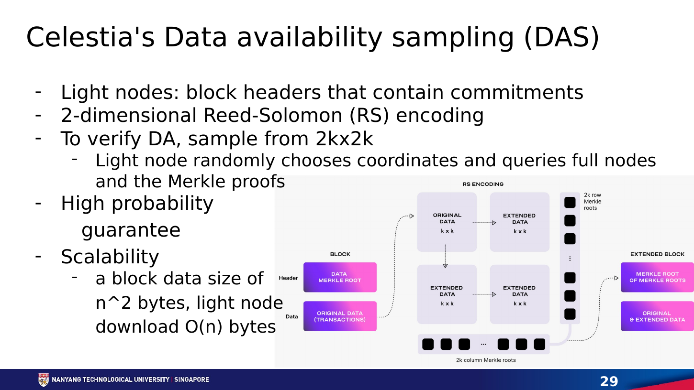

# **Chapter 8: Data Availability Scaling**

## **Introduction**

A block header can commit to a large body of transactions with a small hash. The hash proves what the data should be, but it does not prove that anyone received the data. A malicious producer could publish the header, reveal only selected pieces, and prevent validators from checking the state transition.

This is the **data availability problem**. It appears whenever nodes want assurance about a large block without downloading all of it. The problem is central to sharding, light clients, and rollups.

---

## **Validity Is Not Availability**

State validity asks whether a transition followed the protocol rules. Data availability asks whether the inputs behind that transition can be obtained.

Fraud proofs require the data needed to identify an invalid step. Even validity proofs do not necessarily reveal the new state to users. If transaction data is withheld, users may be unable to reconstruct balances, create future transactions, or exit.

A commitment therefore provides **integrity**, not **availability**. Seeing a Merkle root is not the same as seeing the block.

---

## **The Withholding Attack**

Suppose a light client receives a header for a block divided into many shares. It asks peers for several shares and receives all of them. This is weak evidence: a malicious producer may selectively answer the light client while withholding different shares from the wider network.

The objective is to encode and distribute data so that withholding enough shares to prevent reconstruction is likely to be detected by random sampling.

---

## **Erasure Coding**

Erasure coding expands *k* original data shares into *n* shares, where the original block can be reconstructed from a threshold subset. Reed-Solomon codes are a common construction.

The producer commits to the extended data. If it withholds enough shares to make reconstruction impossible, it must hide a substantial fraction of the encoded block. A light node that requests random shares then has a meaningful probability of encountering a missing share.

After *s* independent samples, the probability of missing a withholding attack falls exponentially. This turns a binary download requirement into a tunable confidence level.

Erasure coding alone is not sufficient. Nodes also need confidence that the encoding was performed correctly. Two-dimensional coding, fraud proofs for incorrect encoding, and polynomial commitments are used to make malformed shares detectable.[^1]

---

## **Data Availability Sampling**

A light node performing data availability sampling (DAS):

1. obtains the block header and commitment;
2. requests randomly selected shares from different peers;
3. verifies each share against the commitment;
4. accepts availability after enough successful samples.

No individual light node reconstructs the block. Across many independently sampling nodes, the network requests enough shares for honest full nodes to recover it.

This produces an unusual scaling property: as more light nodes join and sample, the network can support larger blocks while maintaining strong confidence. The details still depend on peer-to-peer distribution, sampling independence, encoding correctness, and the assumed adversary.

---

## **Celestia's Approach**

  
   
  <em>Figure 8.1: Celestia light nodes sample small parts of an erasure-coded block rather than downloading the full block. Source: Neil Han, SC6019 Lecture 05, slide 29.</em>

Celestia arranges block data in a square, applies two-dimensional Reed-Solomon encoding, and commits to rows and columns. Light nodes sample shares and verify inclusion proofs. Namespace Merkle trees allow an application to retrieve the portions of data relevant to its namespace without processing every rollup's data.[^2]

Celestia provides consensus and data availability. It does not execute each rollup. Rollup nodes interpret the published data and apply their own validity rules.

---

## **Ethereum Blobs and PeerDAS**

EIP-4844 added blobs as a separate data type for rollups. The EVM cannot directly read blob contents, but it can access cryptographic commitments. Blob data is priced separately from ordinary execution and retained for a limited period.[^3]

This is enough because rollups need the data during the period when nodes reconstruct state and, for optimistic designs, issue challenges. Permanent historical storage can be supplied by archival services rather than every consensus node.

PeerDAS extends the design so nodes custody and request subsets of blob data instead of every node downloading every blob. EIP-7594 specifies a peer-to-peer sampling model built on erasure coding and data-column sidecars.[^4]

---

## **External Data Availability Layers**

Rollups can publish data in several places:

- **Layer 1 calldata or blobs** – stronger integration with settlement, generally higher cost;
- **dedicated DA network** – greater capacity and lower cost, with a separate consensus assumption;
- **data availability committee** – cheap and simple, but a small group can withhold data;
- **local storage** – suitable only when users accept operator trust or have another recovery path.

EigenDA and similar systems use restaked or dedicated operators to disperse encoded data and attest to availability. The main evaluation questions are who signs, what threshold is required, how data is retrieved, and what happens after withholding.

---

## **Availability, Retrievability, and Permanence**

These terms should not be confused:

- **Availability** means data was disseminated so the network could obtain it during the required window.
- **Retrievability** means a user can fetch it from some service now.
- **Permanence** means historical data remains stored indefinitely.

A consensus protocol can guarantee availability at publication without requiring every validator to retain the data forever. Applications that need historical queries should define separate archival assumptions.

---

## **Trade-Offs**

| Design | Validator Load | Security Integration | Main Risk |
|---|---|---|---|
| Full replication | High | Native | Capacity limited by weakest validators |
| L1 blobs + sampling | Distributed | Native settlement consensus | Complex networking and coding |
| Dedicated DA layer | Specialized capacity | Separate validator set | Cross-layer assumption |
| DA committee | Low cost | Small signer group | Coordinated withholding |

A cheaper data layer can materially reduce rollup fees. It also changes the system's failure model. Cost comparisons without the availability assumption are incomplete.

## **Sampling Probability by Example**

Suppose erasure coding expands a block so that an adversary must hide at least half the shares to prevent reconstruction. One uniformly random request misses the attack with probability at most one-half. Twenty independent requests miss every hidden share with probability at most `(1/2)^20`, roughly one in a million.

The arithmetic is simple; its assumptions are not. Samples must be unpredictable. Peers must not selectively answer one client while isolating the wider network. The commitment must prove that returned shares belong to one correctly encoded block. Independence is weakened if a client asks one malicious peer for every sample. Practical DAS combines cryptographic commitments, peer diversity, and network distribution rules.

## **A Data-Withholding Failure**

Consider an optimistic rollup operator that publishes a state root but withholds the batch. Users can see the commitment, and the operator's interface might still display balances. Independent verifiers cannot replay the batch and therefore cannot construct a fraud proof. The root does not visibly look invalid; nobody can test it.

An integrated DA layer changes this. A block is accepted only after encoded shares have been disseminated. Sampling nodes check availability, and reconstruction nodes recover the full data. Once the batch is available, one honest verifier can challenge an invalid transition. The DA layer does not perform the challenge, but it preserves the possibility of doing so.

Validity and availability are therefore complementary. The system needs both a rule for correct transitions and access to the information those rules operate on.

## **Two-Dimensional Reed-Solomon Encoding**

A common DAS construction arranges `k × k` original shares in a square. Each row is extended to `2k` shares with Reed-Solomon coding. Each resulting column is then extended to `2k`, producing a `2k × 2k` extended square. The block header commits to row and column roots.

If a producer withholds enough shares to prevent reconstruction, it must hide a noticeable fraction of the square. Random sampling detects that fraction with increasing probability. If the producer encodes a row incorrectly, an encoding-fraud proof can identify inconsistent shares. Polynomial-commitment designs can instead prove that samples belong to correctly encoded polynomials.

The network protocol matters as much as the code. A sampler requests coordinates from several peers. Full or bridge nodes reconstruct rows and columns when enough shares arrive, then redistribute recovered shares. Sampling success by one isolated client does not establish global dissemination; peer exchange and custody rules are designed to make selective disclosure difficult.

## **Namespaced Data and Selective Retrieval**

A general DA layer may carry batches for thousands of applications. A rollup should not download every other rollup's data. Namespace Merkle trees organize shares by namespace while allowing proofs that all shares for a namespace were returned.

A namespaced commitment supports two statements: a share belongs to the block, and a range contains all data under a given namespace. This lets a rollup node retrieve its own batches while light clients sample across the full block.

Namespaces are not access control. Data remains public; the namespace is an indexing and proof mechanism.

## **Blob Commitments and Retention**

EIP-4844 transactions carry blob commitments. Consensus clients disseminate blob sidecars alongside blocks and verify that commitments match the block. Execution sees a versioned hash of the commitment rather than the blob bytes.

A rollup contract can therefore bind a batch assertion to blob data without making that data permanent EVM storage. Consensus nodes retain blobs for the protocol window; rollup nodes, indexers, and archives keep longer history according to application needs.

The retention boundary creates an operational deadline. A new rollup node joining after blob expiry needs a snapshot or historical provider. Trust can be minimized by checking the reconstructed state against finalized roots, but availability of old history remains a service assumption.

## **Implementing a DA Client**

A light DA client should:

1. follow finalized or appropriately confirmed headers;
2. derive unpredictable sample coordinates;
3. request samples from diverse peers;
4. verify each share against the header commitment;
5. reject the header if required samples are missing by deadline;
6. store evidence of invalid encoding or inconsistent responses;
7. expose confidence and peer health to dependent rollups.

A rollup full node additionally fetches every share in its namespace, reconstructs missing data, decodes batches canonically, and confirms that the settlement assertion refers to that exact data.

## **DA Threat Model Checklist**

- What fraction of shares must be hidden to prevent reconstruction?
- How many independent samples reach the desired failure probability?
- Can a producer answer samplers selectively?
- Who verifies correct erasure encoding?
- How are samples distributed across peers?
- When is a header considered final?
- How long is consensus data retained?
- Who serves historical data afterward?
- What does the settlement layer do if the DA layer halts or reorganizes?
- Can a governance key switch DA commitments retroactively?

## **Availability Certificates and Their Limits**

Some DA systems disperse encoded chunks to operators and collect signatures. An availability certificate proves that a threshold attested to receiving assigned data. If enough signers are honest and retain chunks for the required period, the block can be reconstructed.

The certificate is only as strong as membership, threshold, custody challenge, and slashing. A signer may acknowledge data and delete it later. Proofs of custody or periodic challenges test continued possession. Slashing needs objective evidence that a signer failed, which is harder for a network timeout than for an invalid signature.

A committee certificate differs from DAS by light clients. The former relies on a signer threshold; the latter derives confidence from encoded data and random samples. Hybrid systems use both.

## **Selective Disclosure and Eclipse Attacks**

A producer can try to answer requested shares only to selected samplers while hiding them from reconstruction nodes. If the attacker controls a client's peers, it can create a false view of availability.

Peer sampling should diversify network paths and avoid revealing all future coordinates to one peer. Nodes can gossip received shares so answering one client helps distribute data. Sampling requests may be parallelized across peers, and clients monitor peer overlap or autonomous-system concentration.

An eclipse-resistant DAS design therefore includes peer discovery and networking assumptions. Cryptographic verification rejects wrong shares but cannot force an isolated client to meet an honest peer.

## **Reconstruction and Repair**

When enough shares are available, a full node reconstructs missing rows or columns. Recovered shares are verified against commitments and redistributed. Repair keeps data retrievable when some custodians leave.

Reconstruction consumes CPU and bandwidth. An adversary may repeatedly provide just enough shares to trigger expensive repair while withholding others. Implementations bound concurrent jobs, prioritize finalized blocks, and charge or rate-limit requests.

For long retention, storage networks can pin complete blobs after the consensus availability window. Their correctness is checked against old commitments, but their economic model determines whether data remains retrievable years later.

## **DA Capacity Planning**

Let each block contain `B` original bytes, expand by coding factor `r`, and arrive every `t` seconds. The network disperses approximately `rB/t` bytes per second before protocol overhead. Each node's custody and sampling share may be smaller, but reconstruction nodes and producers handle more.

Capacity tests should measure producer upload, peer fanout, sample latency, reconstruction time, and behavior under missing shares. Increasing block size until average bandwidth is saturated leaves no room for repair or adversarial peers.

Rollups also need publication deadlines. If a sequencer executes faster than DA accepts blobs, unpublished batches accumulate. Set a maximum pending-data window and stop accepting new soft confirmations before recovery becomes unbounded.

## **DA Integration Test**

A useful integration test creates a batch, encodes and publishes it, samples it from independent light nodes, deletes selected shares, reconstructs them, then verifies that a rollup node decodes the same transactions and state commitment. Negative cases include malformed encoding, wrong namespace, incomplete range, old commitment, DA reorganization, and expired history.

Testing only successful upload verifies storage API behavior, not data availability security.

## **Conclusion**

Data availability scaling allows nodes to gain strong confidence that block data exists without downloading all of it. Erasure coding makes severe withholding easier to detect, while random sampling gives light clients a tunable confidence level.

This technology connects Layer 1 sharding and rollup-centric scaling. Execution can move elsewhere only if users and verifiers can obtain the data required to reconstruct and challenge state. The next chapter turns from scaling data to scaling execution itself.

## **References**

[^1]: Al-Bassam, Mustafa, Alberto Sonnino, and Vitalik Buterin. "Fraud and Data Availability Proofs." <https://arxiv.org/abs/1809.09044>.
[^2]: Celestia Docs. "Data Availability." <https://docs.celestia.org/learn/celestia-101/data-availability/>.
[^3]: Buterin, Vitalik, et al. "EIP-4844: Shard Blob Transactions." <https://eips.ethereum.org/EIPS/eip-4844>.
[^4]: Feist, Dankrad, et al. "EIP-7594: PeerDAS." <https://eips.ethereum.org/EIPS/eip-7594>.
