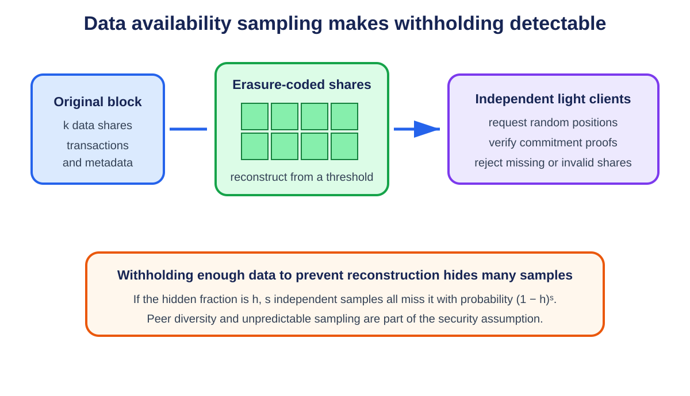

# **Chapter 8: Data Availability Scaling**

## **Introduction**

A block header can commit to a large body of transactions with a small hash. The hash proves what the data should be, but it does not prove that anyone received the data. A malicious producer could publish the header, reveal only selected pieces, and prevent validators from checking the state transition.

This is the **data availability problem**. It appears whenever nodes want assurance about a large block without downloading all of it. The problem is central to sharding, light clients, and rollups.

---

## **Intuition: A Correct Answer Needs Recoverable Inputs**

Suppose a teacher writes only "the class total is 742" on the board. The number might be correct, but students cannot check it or continue calculating averages without the individual scores. A commitment or proof of correct processing does not necessarily reveal the underlying data.

**Data availability (DA)** means the data needed to verify or reconstruct a block was published and can be obtained when the protocol requires it. It is not the same as:

- **validity:** whether transactions followed the rules;
- **retrievability:** whether a convenient service answers a request now;
- **permanent storage:** whether the data will remain archived years later.

A protocol can guarantee availability near publication while applications pay separate archives for historical queries.

### **Withholding attacks**

A producer can publish a block header containing a commitment while sending the actual block to too few peers. The header looks compact and valid, but users cannot reconstruct state or prove that hidden transactions were invalid.

The difficult case is a **partial withholding attack**. The producer serves requested pieces selectively so some nodes believe data exists while no honest group possesses enough to reconstruct the whole block. Merely asking one server for one copy does not solve this.

### **Erasure coding**

**Erasure coding** expands `k` original pieces into `n` encoded pieces so any sufficiently large subset can reconstruct the original. It resembles cutting a document into pieces and adding carefully designed redundancy: losing some pieces is harmless, but preventing recovery requires hiding many.

This differs from ordinary replication. Three complete copies tolerate loss of two whole hosts. Erasure coding spreads smaller redundant pieces and can use bandwidth more efficiently, but clients must verify that the producer encoded them consistently.

**Reed-Solomon coding** is one mathematical family used for this purpose. Readers do not need its polynomial algebra to follow the security argument: correct encoding creates redundant shares, and a reconstruction threshold defines how many are needed.

### **Sampling**

A light client cannot download the entire large block without losing the scalability benefit. Instead, it asks for random encoded shares and verifies proofs that each share belongs to the committed block. This is **data availability sampling (DAS)**.

If an attacker must hide a large fraction to prevent reconstruction, random requests have a chance of hitting hidden pieces. Repeating independent samples makes missing every hidden piece exponentially less likely.

If hidden fraction is `h` and the client takes `s` independent samples, the chance that all samples avoid the hidden fraction is:

```text
(1 - h)^s
```

For `h = 0.5` and `s = 10`:

```text
(1 - 0.5)^10 = 0.5^10 = 1 / 1,024 ≈ 0.098%
```

This number is a model, not a complete guarantee. Requests must be unpredictable, peers must be diverse, proofs must be valid, and attackers must not show each client a different view.

### **Commitments and inclusion proofs**

A block header commits to encoded shares. An **inclusion proof** shows that one returned share occupies a particular position under that commitment. It prevents a peer from answering with invented data.

The proof does not by itself show that every other share exists. Sampling combines many authenticated spot checks with the coding threshold. Peer-to-peer exchange then helps sampled shares spread among honest nodes.

### **Two dimensions and namespaces**

Some designs arrange data in rows and columns and apply coding in both directions. Two-dimensional coding gives clients structured samples and supports reconstruction from rows or columns.

A **namespace** labels data belonging to one application or rollup. A namespaced Merkle tree lets that application retrieve and prove its portion without downloading unrelated data. Namespace separation improves selective access; it does not let an application ignore the chain's overall availability assumptions.

### **How to read DA claims**

Ask:

1. What exact bytes are committed?
2. Who performs and checks erasure coding?
3. How many shares reconstruct the data?
4. How are random sample positions chosen?
5. Can one peer or gateway answer every request?
6. When does consensus treat availability as sufficient?
7. How long is data retained, and who archives it afterward?
8. What does the dependent rollup do when availability is uncertain?

The rest of the chapter turns this intuition into probability, client, network, and integration details.

## **Validity Is Not Availability**

State validity asks whether a transition followed the protocol rules. Data availability asks whether the inputs behind that transition can be obtained.

Fraud proofs require the data needed to identify an invalid step. Even validity proofs do not necessarily reveal the new state to users. If transaction data is withheld, users may be unable to reconstruct balances, create future transactions, or exit.

A commitment therefore provides **integrity**, not **availability**. Seeing a Merkle root is not the same as seeing the block.

---

## **The Withholding Attack**

Suppose a light client receives a header for a block divided into many shares. It asks peers for several shares and receives all of them. This is weak evidence: a malicious producer may selectively answer the light client while withholding different shares from the wider network.

The objective is to encode and distribute data so that withholding enough shares to prevent reconstruction is likely to be detected by random sampling.

---

## **Erasure Coding**

Erasure coding expands *k* original data shares into *n* shares, where the original block can be reconstructed from a threshold subset. Reed-Solomon codes are a common construction.

The producer commits to the extended data. If it withholds enough shares to make reconstruction impossible, it must hide a substantial fraction of the encoded block. A light node that requests random shares then has a meaningful probability of encountering a missing share.

After *s* independent samples, the probability of missing a withholding attack falls exponentially. This turns a binary download requirement into a tunable confidence level.

Erasure coding alone is not sufficient. Nodes also need confidence that the encoding was performed correctly. Two-dimensional coding, fraud proofs for incorrect encoding, and polynomial commitments are used to make malformed shares detectable.[^1]

---

## **Data Availability Sampling**

A light node performing data availability sampling (DAS):

1. obtains the block header and commitment;
2. requests randomly selected shares from different peers;
3. verifies each share against the commitment;
4. accepts availability after enough successful samples.

No individual light node reconstructs the block. Across many independently sampling nodes, the network requests enough shares for honest full nodes to recover it.

This produces an unusual scaling property: as more light nodes join and sample, the network can support larger blocks while maintaining strong confidence. The details still depend on peer-to-peer distribution, sampling independence, encoding correctness, and the assumed adversary.

---

## **Celestia's Approach**

<p align="center">
  
  <br>
  <em>Figure 8.1: Erasure coding forces an availability attacker to hide many shares, while independent light clients test random positions. Original figure for this book, based on Celestia's data availability design.</em>
</p>


Celestia arranges block data in a square, applies two-dimensional Reed-Solomon encoding, and commits to rows and columns. Light nodes sample shares and verify inclusion proofs. Namespace Merkle trees allow an application to retrieve the portions of data relevant to its namespace without processing every rollup's data.[^2]

Celestia provides consensus and data availability. It does not execute each rollup. Rollup nodes interpret the published data and apply their own validity rules.

---

## **Ethereum Blobs and PeerDAS**

EIP-4844 added blobs as a separate data type for rollups. The EVM cannot directly read blob contents, but it can access cryptographic commitments. Blob data is priced separately from ordinary execution and retained for a limited period.[^3]

This is enough because rollups need the data during the period when nodes reconstruct state and, for optimistic designs, issue challenges. Permanent historical storage can be supplied by archival services rather than every consensus node.

PeerDAS extends the design so nodes custody and request subsets of blob data instead of every node downloading every blob. EIP-7594 specifies a peer-to-peer sampling model built on erasure coding and data-column sidecars.[^4]

---

## **External Data Availability Layers**

Rollups can publish data in several places:

- **Layer 1 calldata or blobs** - stronger integration with settlement, generally higher cost;
- **dedicated DA network** - greater capacity and lower cost, with a separate consensus assumption;
- **data availability committee** - cheap and simple, but a small group can withhold data;
- **local storage** - suitable only when users accept operator trust or have another recovery path.

EigenDA and similar systems use restaked or dedicated operators to disperse encoded data and attest to availability. The main evaluation questions are who signs, what threshold is required, how data is retrieved, and what happens after withholding.

---

## **Named Case Study: One Rollup Batch on Celestia, EigenDA, and Avail**

**Deployment labels: Celestia, EigenDA, and Avail DA are production networks.** They can all carry data for a rollup, but they do not give the settlement contract identical evidence or rely on the same validator set. The comparison below fixes one input: a 600 kB compressed rollup batch containing ordered transactions and a header that binds the rollup identifier, batch number, parent state root, encoding version, and byte length.

The rollup first serializes the batch deterministically. This is the common boundary. If different publishers can encode the same transactions into different bytes, no DA system can repair the ambiguity. Let `B` be the exact 600 kB byte string and `H(B)` its application commitment. The rollup stores `H(B)` alongside whichever network-specific receipt or inclusion proof it uses. A verifier accepts the resulting state only if it can bind the DA evidence back to `B`, the batch header, the correct DA network, and a sufficiently final DA block.

### **Celestia path: namespaced shares and sampling**

A publisher submits `B` as one or more Celestia blobs under a namespace allocated to the rollup. Celestia's block data is split into shares, arranged and erasure-coded into an extended data square, and committed through namespaced Merkle structures. The namespace lets a rollup retrieve and prove its own shares without treating every other application's bytes as its payload. Celestia consensus orders the transaction and commits the data root; light nodes sample shares to gain probabilistic confidence that the extended block data is available.[^2] [^5]

Trace the batch. The publisher broadcasts a blob transaction. After Celestia includes it, the rollup records the Celestia height, namespace, commitment, share range, and transaction or blob identifier. A verifier retrieves the namespaced shares from independent nodes, checks inclusion against the data commitment, reconstructs `B`, checks length and `H(B)`, decodes transactions under the bound version, and re-executes the rollup. A settlement integration such as Blobstream can convey Celestia data-root commitments to another chain, but the application still needs a rule connecting the particular namespace shares and finality level to its accepted rollup batch.[^6]

The availability assumption is tied to Celestia's consensus and data-availability sampling design. A light client does not prove that a permanent archive will serve `B` months later. Celestia documentation distinguishes availability around block production from later retrievability and pruning.[^7] The rollup therefore runs or contracts archival retrieval if its fraud-proof or recovery window exceeds ordinary node retention.

Failure path: the publisher receives an RPC acknowledgement but the blob never reaches a final Celestia block. No settlement state should advance. If the block is final but the rollup's retrieval peers are eclipsed, those clients may report failure while the wider network still has the shares; peer diversity and independent sampling matter. If enough data is genuinely withheld for reconstruction, sampling should make acceptance unlikely under the stated model, but a verifier must fail closed rather than substitute the publisher's local copy. If the namespace or share range is wrong, a valid proof for someone else's bytes must not satisfy this batch.

### **EigenDA path: dispersal to operator quorums**

EigenDA uses a different shape. A disperser accepts `B`, erasure-codes it into chunks, distributes assigned chunks to EigenDA operators, and collects authenticated acknowledgements from the configured quorum or quorums. The client polls the blob status and receives a certificate or confirmation data that downstream components can verify under the integration's rules. EigenDA's official V2 guide makes the API boundary visible: prepare bytes, send data, receive a blob key, and check status.[^8]

Trace the same batch. The rollup submits `B` with payment and dispersal parameters. The disperser returns an identifier before availability is necessarily certified, so the rollup marks the batch **dispersing**, not available. Operators validate and store their assigned chunks and sign acknowledgements. Once the threshold for every required quorum is met, the batch becomes confirmed. A verifier or retriever uses the blob key and certificate data to request chunks, reconstructs `B`, verifies its commitment and encoding, and re-executes the rollup transition.

The trust boundary is not Celestia consensus. EigenDA's security model depends on its operator quorums, chunk assignment, encoding rate, threshold configuration, cryptographic commitments, and the economic or fork-based consequences defined for operator misbehavior.[^9] A rollup can configure quorum participation, but adding quorums changes cost and failure correlation rather than turning the certificate into Ethereum blob inclusion. The settlement contract must know exactly which EigenDA certificate format, quorum set, threshold, reference block, and commitment it accepts.

Failure path: the disperser crashes after accepting `B` but before enough operators acknowledge it. The blob remains unconfirmed and the rollup must retry through a healthy path without changing `B` or creating an ambiguous second batch. If a threshold certificate exists but retrievers cannot reconstruct, the incident targets operator storage, assignment, or serving assumptions and may trigger the protocol's accountability path. If the rollup configures one highly correlated operator set, nominal operator count can overstate resilience. If a settlement contract accepts an outdated quorum configuration or fails to bind the certificate to `H(B)`, a formally valid certificate can authorize the wrong bytes.

### **Avail path: application identifiers and validity-backed sampling**

Avail DA orders data submissions in its own proof-of-stake chain. A publisher submits `B` in an extrinsic associated with an **application identifier**. Avail extends block data with erasure coding and commits to it with polynomial commitments; light clients sample cells and verify proofs against the block commitment. The application identifier gives the rollup a selective data stream, while the block commitment binds all included data.[^10] [^11]

Trace the batch. The rollup signs and submits the data extrinsic under its application identifier. It records the Avail block, extrinsic position, application identifier, commitment, and finality evidence. A verifier checks finality, filters or proves the rollup's data, obtains enough shares or the complete application payload, reconstructs `B`, checks `H(B)`, and executes it. As with Celestia, a bridge or proof system that transports Avail commitments to another settlement chain is an additional component. DA-chain finality does not automatically update an Ethereum rollup contract.

The trust assumption centers on Avail's validator consensus, erasure-coding and commitment implementation, light-client sampling, and any bridge used by the settlement layer. Sampling says the committed block data was likely available under the model. It does not promise indefinite retention. The rollup still needs archival policy, correct application-ID filtering, and a recovery route when its preferred RPC or light-client network is unavailable.

Failure path: a publisher labels `B` with the wrong application identifier. Avail may correctly include and make the bytes available, while the rollup's normal selective retriever never sees them. That is an integration failure, not DA-chain withholding. A client that trusts one full-node RPC without checking commitments has reduced the system to provider trust. A settlement bridge that lags leaves the batch available on Avail but not yet usable by the rollup's settlement contract. A deep reorganization or validator-set safety failure on the DA chain requires the rollup to roll back or halt according to its explicit finality policy.

### **Same batch, different evidence**

| Question for batch `B` | Celestia | EigenDA | Avail DA |
|---|---|---|---|
| Publication unit | Blob transaction split into namespaced shares | Blob dispersed as coded chunks to operator quorums | Data extrinsic associated with an application identifier |
| Primary availability evidence | DA-chain block commitment, namespaced inclusion, and sampling/retrieval evidence | Threshold operator acknowledgements and the accepted EigenDA certificate/configuration | DA-chain finality, block polynomial commitment, inclusion/filtering, and sampling/retrieval evidence |
| Selective retrieval key | Namespace, height, share range or blob commitment | Blob key/certificate plus retriever interfaces | Application identifier, block and extrinsic/data position |
| Who orders publication | Celestia validator consensus | Dispersal/certificate flow; the rollup separately orders its own batches | Avail validator consensus |
| Settlement integration | Verify or relay Celestia commitments, often through a bridge such as Blobstream | Verify the configured EigenDA certificate and reference state | Verify or relay Avail commitments through the chosen bridge/proof path |
| Main correlation risk | DA validators, sampling peers, and archival providers may share infrastructure | Many operators may share cloud, code, stake dependencies, or one disperser path | Validators, sampling peers, bridge and archive services may share infrastructure |
| Retention statement | Availability at publication is separate from later retrievability | Certificate/storage duration must match the rollup's challenge and recovery needs | Sampling availability is separate from application archival retention |

For all three, the safe acceptance rule has the same outer form:

```text
accept rollup state only if
  network_id is expected
  and batch header binds H(B), length, namespace/app/quorum context, and encoding version
  and network-specific availability evidence satisfies current policy
  and settlement has authenticated that evidence
  and an independent verifier can reconstruct and decode B
```

The systems differ inside `network-specific availability evidence`. Hiding that field behind a generic boolean such as `data_available = true` removes the information an auditor needs. A production dashboard should expose the source network, finality height or reference state, certificate or commitment, retrieval success from independent paths, retention deadline, settlement-bridge status, and the exact batch commitment that execution consumed.


## **Availability, Retrievability, and Permanence**

These terms should not be confused:

- **Availability** means data was disseminated so the network could obtain it during the required window.
- **Retrievability** means a user can fetch it from some service now.
- **Permanence** means historical data remains stored indefinitely.

A consensus protocol can guarantee availability at publication without requiring every validator to retain the data forever. Applications that need historical queries should define separate archival assumptions.

---

## **Trade-Offs**

| Design | Validator Load | Security Integration | Main Risk |
|---|---|---|---|
| Full replication | High | Native | Capacity limited by weakest validators |
| L1 blobs + sampling | Distributed | Native settlement consensus | Complex networking and coding |
| Dedicated DA layer | Specialized capacity | Separate validator set | Cross-layer assumption |
| DA committee | Low cost | Small signer group | Coordinated withholding |

A cheaper data layer can materially reduce rollup fees. It also changes the system's failure model. Cost comparisons without the availability assumption are incomplete.

## **Sampling Probability by Example**

Suppose erasure coding expands a block so that an adversary must hide at least half the shares to prevent reconstruction. One uniformly random request misses the attack with probability at most one-half. Twenty independent requests miss every hidden share with probability at most `(1/2)^20`, roughly one in a million.

The arithmetic is simple; its assumptions are not. Samples must be unpredictable. Peers must not selectively answer one client while isolating the wider network. The commitment must prove that returned shares belong to one correctly encoded block. Independence is weakened if a client asks one malicious peer for every sample. Practical DAS combines cryptographic commitments, peer diversity, and network distribution rules.

## **A Data-Withholding Failure**

Consider an optimistic rollup operator that publishes a state root but withholds the batch. Users can see the commitment, and the operator's interface might still display balances. Independent verifiers cannot replay the batch and therefore cannot construct a fraud proof. The root does not visibly look invalid; nobody can test it.

An integrated DA layer changes this. A block is accepted only after encoded shares have been disseminated. Sampling nodes check availability, and reconstruction nodes recover the full data. Once the batch is available, one honest verifier can challenge an invalid transition. The DA layer does not perform the challenge, but it preserves the possibility of doing so.

Validity and availability are therefore complementary. The system needs both a rule for correct transitions and access to the information those rules operate on.

## **Two-Dimensional Reed-Solomon Encoding**

A common DAS construction arranges `k × k` original shares in a square. Each row is extended to `2k` shares with Reed-Solomon coding. Each resulting column is then extended to `2k`, producing a `2k × 2k` extended square. The block header commits to row and column roots.

If a producer withholds enough shares to prevent reconstruction, it must hide a noticeable fraction of the square. Random sampling detects that fraction with increasing probability. If the producer encodes a row incorrectly, an encoding-fraud proof can identify inconsistent shares. Polynomial-commitment designs can instead prove that samples belong to correctly encoded polynomials.

The network protocol matters as much as the code. A sampler requests coordinates from several peers. Full or bridge nodes reconstruct rows and columns when enough shares arrive, then redistribute recovered shares. Sampling success by one isolated client does not establish global dissemination; peer exchange and custody rules are designed to make selective disclosure difficult.

## **Namespaced Data and Selective Retrieval**

A general DA layer may carry batches for thousands of applications. A rollup should not download every other rollup's data. Namespace Merkle trees organize shares by namespace while allowing proofs that all shares for a namespace were returned.

A namespaced commitment supports two statements: a share belongs to the block, and a range contains all data under a given namespace. This lets a rollup node retrieve its own batches while light clients sample across the full block.

Namespaces are not access control. Data remains public; the namespace is an indexing and proof mechanism.

## **Blob Commitments and Retention**

EIP-4844 transactions carry blob commitments. Consensus clients disseminate blob sidecars alongside blocks and verify that commitments match the block. Execution sees a versioned hash of the commitment rather than the blob bytes.

A rollup contract can therefore bind a batch assertion to blob data without making that data permanent EVM storage. Consensus nodes retain blobs for the protocol window; rollup nodes, indexers, and archives keep longer history according to application needs.

The retention boundary creates an operational deadline. A new rollup node joining after blob expiry needs a snapshot or historical provider. Trust can be minimized by checking the reconstructed state against finalized roots, but availability of old history remains a service assumption.

## **Implementing a DA Client**

A light DA client should:

1. follow finalized or appropriately confirmed headers;
2. derive unpredictable sample coordinates;
3. request samples from diverse peers;
4. verify each share against the header commitment;
5. reject the header if required samples are missing by deadline;
6. store evidence of invalid encoding or inconsistent responses;
7. expose confidence and peer health to dependent rollups.

A rollup full node additionally fetches every share in its namespace, reconstructs missing data, decodes batches canonically, and confirms that the settlement assertion refers to that exact data.

## **DA Threat Model Checklist**

- What fraction of shares must be hidden to prevent reconstruction?
- How many independent samples reach the desired failure probability?
- Can a producer answer samplers selectively?
- Who verifies correct erasure encoding?
- How are samples distributed across peers?
- When is a header considered final?
- How long is consensus data retained?
- Who serves historical data afterward?
- What does the settlement layer do if the DA layer halts or reorganizes?
- Can a governance key switch DA commitments retroactively?

## **Availability Certificates and Their Limits**

Some DA systems disperse encoded chunks to operators and collect signatures. An availability certificate proves that a threshold attested to receiving assigned data. If enough signers are honest and retain chunks for the required period, the block can be reconstructed.

The certificate is only as strong as membership, threshold, custody challenge, and slashing. A signer may acknowledge data and delete it later. Proofs of custody or periodic challenges test continued possession. Slashing needs objective evidence that a signer failed, which is harder for a network timeout than for an invalid signature.

A committee certificate differs from DAS by light clients. The former relies on a signer threshold; the latter derives confidence from encoded data and random samples. Hybrid systems use both.

## **Selective Disclosure and Eclipse Attacks**

A producer can try to answer requested shares only to selected samplers while hiding them from reconstruction nodes. If the attacker controls a client's peers, it can create a false view of availability.

Peer sampling should diversify network paths and avoid revealing all future coordinates to one peer. Nodes can gossip received shares so answering one client helps distribute data. Sampling requests may be parallelized across peers, and clients monitor peer overlap or autonomous-system concentration.

An eclipse-resistant DAS design therefore includes peer discovery and networking assumptions. Cryptographic verification rejects wrong shares but cannot force an isolated client to meet an honest peer.

## **Reconstruction and Repair**

When enough shares are available, a full node reconstructs missing rows or columns. Recovered shares are verified against commitments and redistributed. Repair keeps data retrievable when some custodians leave.

Reconstruction consumes CPU and bandwidth. An adversary may repeatedly provide just enough shares to trigger expensive repair while withholding others. Implementations bound concurrent jobs, prioritize finalized blocks, and charge or rate-limit requests.

For long retention, storage networks can pin complete blobs after the consensus availability window. Their correctness is checked against old commitments, but their economic model determines whether data remains retrievable years later.

## **Sampling Networks, Peer Diversity, and Adversarial Serving**

Data availability sampling assumes more than correct mathematics. Clients must obtain unpredictable samples through a network that prevents a producer from showing favorable pieces to each client while withholding enough globally to block reconstruction.

### Sampling request

```text
SampleRequest {
  chain_id,
  block_height,
  data_commitment,
  row_or_column,
  share_index,
  request_nonce,
  client_version
}
```

A response includes the share bytes and an inclusion proof. The client checks the requested position, commitment, encoding domain, and proof before counting success.

Do not let the server choose sample positions. Derive them from client randomness committed after the producer fixes the data commitment, or from a protocol randomness source whose timing prevents grinding.

### Selective serving

A malicious producer can serve shares to well-known monitors while withholding from ordinary nodes. Random clients should exchange observations and shares through diverse peers. A success result from one gateway says only that gateway answered one request.

Privacy matters because a server that links all requests from one client learns its complete sample set and can answer exactly those positions. Clients can distribute requests among peers or use privacy-preserving transports, but correlated infrastructure may still join them.

### Peer diversity

Count independent autonomous systems, regions, operators, and implementations, not IP addresses. One provider can expose thousands of endpoints.

Discovery uses several sources: bootstrap peers, peer exchange, DNS records, on-chain identities, and cached known-good peers. No source should control every initial connection. Rate-limit new peers and retain diversity during churn.

A client selects peers across failure domains and caps the fraction of samples answered by one domain. If diversity falls below policy, it reports reduced confidence rather than silently treating repeated answers as independent.

### Eclipse and partition attacks

An eclipse attacker surrounds a client and controls every response. It can serve an old chain, delay samples, or reveal only pieces matching its attack.

Cross-check finalized headers over a separate transport, maintain long-lived authenticated peers, limit address-table poisoning, and compare network observations. A light client should distinguish "share missing" from "all current peers are one untrusted domain."

During a network partition, two groups may each obtain different subsets. Reconstruction and consensus rules define whether the block progresses. Sampling confidence cannot choose between conflicting commitments; consensus finality is still required.

### Grinding sample positions

If sample positions are predictable before block construction, a producer may search over block encodings or commitments to make monitored samples land on available shares. This is **grinding**.

Bind positions to randomness unavailable when the producer commits, and include block/commitment domain separation. Analyze how many alternative encodings, nonces, or block proposals a producer can try. One bit of producer freedom doubles its search space.

### Correlated samples

The formula `(1-h)^s` assumes independent samples, where `h` is hidden fraction and `s` is sample count. Repeating the same share does not improve confidence. Sampling without replacement changes exact probability but usually helps slightly.

If 100 clients each take 20 samples but all use the same deterministic seed, the network has only 20 distinct positions, not 2,000. Mix client-specific or unpredictable randomness while preserving auditability.

### Serving load

Sampling creates many small random requests, which can stress disk I/O and connection overhead more than bulk block download. Cache recent shares, batch proofs, use range requests carefully, and cap unauthenticated work.

Suppose 50,000 light clients take 20 samples from each 12-second block:

```text
50,000 × 20 / 12 ≈ 83,333 sample responses/second
```

At 2 kB per response including proof, egress is roughly:

```text
83,333 × 2 kB ≈ 167 MB/s
```

This is ecosystem demand, not one node's obligation. Distribute it across serving nodes and measure p99 latency under churn and repair traffic.

### Negative caching

A missing response may mean withholding, slow peer, wrong request, or local outage. Negative caching prevents repeated expensive requests but can prolong a transient failure.

Record reason and expiry. Retry through another domain before classifying a share missing. Do not let one unauthenticated "not found" response poison the global cache.

### Share exchange and reconstruction

Sampled shares can be gossiped so honest clients collectively approach reconstruction. Verify before forwarding. Deduplicate by commitment and position, and bound storage by finalized height and retention policy.

When enough shares exist, reconstruct and verify the original commitment. A successful decode with a mismatched commitment is invalid, not "mostly available." Store evidence of inconsistent encoding for fraud or operator diagnosis.

### Confidence reporting

Expose:

- distinct valid positions sampled;
- number requested and failed by reason;
- peer and failure-domain diversity;
- header finality status;
- coding and commitment version;
- confidence under the stated hidden-fraction model;
- whether full reconstruction was attempted or achieved.

Avoid a single green badge when independence or network diversity is unknown.

### Adversarial tests

Test predictable seeds, repeated positions, one gateway answering all requests, sybil peer churn, selective serving to monitors, slow final shares, malformed proofs, inconsistent rows, provider-region outage, network partition, and load spikes.

A sampling network supports scalable verification only when sample choice is unpredictable, responses are authenticated, observations span independent paths, and serving capacity remains available during the same attacks that make availability important.

## **DA Capacity Planning**

Let each block contain `B` original bytes, expand by coding factor `r`, and arrive every `t` seconds. The network disperses approximately `rB/t` bytes per second before protocol overhead. Each node's custody and sampling share may be smaller, but reconstruction nodes and producers handle more.

Capacity tests should measure producer upload, peer fanout, sample latency, reconstruction time, and behavior under missing shares. Increasing block size until average bandwidth is saturated leaves no room for repair or adversarial peers.

Rollups also need publication deadlines. If a sequencer executes faster than DA accepts blobs, unpublished batches accumulate. Set a maximum pending-data window and stop accepting new soft confirmations before recovery becomes unbounded.

## **DA Integration Test**

A useful integration test creates a batch, encodes and publishes it, samples it from independent light nodes, deletes selected shares, reconstructs them, then verifies that a rollup node decodes the same transactions and state commitment. Negative cases include malformed encoding, wrong namespace, incomplete range, old commitment, DA reorganization, and expired history.

Testing only successful upload verifies storage API behavior, not data availability security.

## **Worked Integration Trace: Publishing a Rollup Batch**

A rollup integrating an external DA layer needs more than an upload API. The state commitment accepted by settlement must be cryptographically tied to the bytes that DA nodes encoded and made available.

Assume the rollup constructs canonical batch bytes `B`. Canonical means every verifier agrees on field order, integer encoding, compression, and version. The publisher computes or receives a commitment `C(B)` and submits `B` to the DA network under a namespace.

```text
BatchReference {
  rollup_id,
  batch_number,
  parent_state_root,
  post_state_root,
  da_network_id,
  da_height,
  namespace,
  data_commitment,
  encoding_version
}
```

The settlement transition should bind the state roots to `data_commitment`, DA domain, and encoding version. Binding only `da_height` is ambiguous because a DA block contains many items. Binding a commitment without a network identity enables cross-domain substitution when two systems use compatible proof formats.

### Publisher path

1. deterministically encode the ordered L2 transactions into `B`;
2. compute a local digest and retain it with the batch job;
3. submit `B` to several independent DA ingress peers;
4. wait for the protocol-defined inclusion and availability evidence;
5. verify that returned evidence commits to the local digest;
6. submit the batch reference and state proof to settlement;
7. continue serving `B` during the required reconstruction window.

The publisher must treat an RPC acknowledgement as receipt, not availability. It should not discard local bytes after one gateway says "accepted." Evidence may require a finalized DA header, inclusion proof, namespace proof, or availability certificate, depending on the network.

### Verifier path

A verifier obtains the authenticated DA header through a light client or settlement integration, verifies inclusion of `C(B)`, retrieves enough shares or the full namespace data, reconstructs `B`, and recomputes the rollup state transition.

```text
verify(reference):
    header = authenticate_da_header(reference.da_height)
    verify_inclusion(header, reference.namespace, reference.data_commitment)
    bytes = retrieve_and_reconstruct(reference)
    assert commit(bytes) == reference.data_commitment
    assert execute(reference.parent_state_root, decode(bytes))
           == reference.post_state_root
```

A validity-rollup verifier may use a succinct proof instead of locally executing. It still needs the data for users and future state reconstruction unless the design explicitly accepts a validium-style withholding assumption.

### Failure matrix

| Failure | Detection | Safe response |
|---|---|---|
| Gateway accepts but never broadcasts | Independent peers cannot retrieve or prove inclusion | Retry through another ingress; do not post state reference |
| Blob is included but encoding is invalid | Share or encoding proof fails | Reject availability; retain evidence |
| Publisher cites wrong namespace | Commitment cannot be found under bound namespace | Reject batch reference |
| DA chain reorganizes before finality | Authenticated header is replaced | Re-evaluate inclusion; do not finalize dependent message |
| Some peers selectively withhold shares | Random sampling or reconstruction reports missing positions | Diversify peers, gossip requests, and follow rejection threshold |
| Certificate signers attest unavailable bytes | Retrieval fails despite threshold signature | Halt dependent state; invoke slashing/governance only under specified evidence |
| Data expires from consensus nodes | Archival retrieval no longer succeeds | Use separately funded archives; this is permanence, not publication availability |
| Rollup decoder version differs | Reconstructed bytes yield divergent transactions | Bind encoding version and publish cross-client vectors |

### Capacity calculation

Suppose batches arrive every 8 seconds and average 600 kB after compression. The mean publication rate is:

```text
600 kB / 8 s = 75 kB/s
```

Mean rate is insufficient for provisioning. If the p99 batch is 1.8 MB and the system must catch up three missed batches within 16 seconds, recovery traffic alone is:

```text
3 × 1.8 MB / 16 s = 337.5 kB/s
```

Add erasure-coding expansion, inclusion proofs, peer overhead, sampling responses, retransmission, and unrelated DA tenants. Capacity tests should drive this burst while one ingress peer and one retrieval peer are unavailable.

### Integration assertions

A release test should prove that:

- identical batch inputs produce identical bytes and commitments across clients;
- changing any transaction or ordering changes the bound commitment;
- an inclusion proof for another namespace, height, or network is rejected;
- settlement does not accept a post-state root before required DA evidence;
- verifiers can reconstruct from independent peers after publisher shutdown;
- a DA reorganization rolls back or delays dependent state under policy;
- archived bytes remain retrievable for the application's stated history period;
- alerts distinguish publication delay, inclusion failure, sampling failure, and archival loss.

This trace separates four events often collapsed into "posted": an ingress accepted bytes, consensus included a commitment, the data was available for reconstruction, and an archive can still retrieve it later. Each event supports a different claim.

## **Conclusion**

Data availability scaling allows nodes to gain strong confidence that block data exists without downloading all of it. Erasure coding makes severe withholding easier to detect, while random sampling gives light clients a tunable confidence level.

This technology connects Layer 1 sharding and rollup-centric scaling. Execution can move elsewhere only if users and verifiers can obtain the data required to reconstruct and challenge state. The next chapter turns from scaling data to scaling execution itself.

## **References**

[^1]: Al-Bassam, Mustafa, Alberto Sonnino, and Vitalik Buterin. "Fraud and Data Availability Proofs." <https://arxiv.org/abs/1809.09044>.
[^2]: Celestia Docs. "Data Availability." <https://docs.celestia.org/learn/celestia-101/data-availability/>.
[^3]: Buterin, Vitalik, et al. "EIP-4844: Shard Blob Transactions." <https://eips.ethereum.org/EIPS/eip-4844>.
[^4]: Feist, Dankrad, et al. "EIP-7594: PeerDAS." <https://eips.ethereum.org/EIPS/eip-7594>.

[^5]: Celestia Documentation. "The lifecycle of a celestia-app transaction." <https://docs.celestia.org/learn/celestia-101/transaction-lifecycle/>.
[^6]: Celestia Documentation. "Blobstream." <https://docs.celestia.org/learn/blobstream/>.
[^7]: Celestia Documentation. "Data retrievability and pruning." <https://docs.celestia.org/learn/celestia-101/retrievability/>.
[^8]: EigenDA Documentation. "EigenDA Payment and Data Dispersal Guide." <https://docs.eigencloud.xyz/eigenda/integrations-guides/quick-start/v2/>.
[^9]: EigenDA Documentation. "Security Model." <https://docs.eigencloud.xyz/eigenda/core-concepts/security/security-model>.
[^10]: Avail. "Avail's Core Features Explained: DA Sampling & Validity Proofs." <https://blog.availproject.org/avails-core-features-explained/>.
[^11]: Avail. "Getting Started: App-Specific Data with Avail Light Client." <https://blog.availproject.org/getting-started-app-specific-data-management-using-avail-light-client/>.
