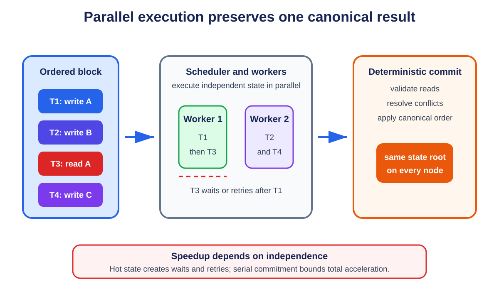

# **Chapter 9: Parallel Execution**

## **Introduction**

Most blockchain virtual machines execute transactions in a block one after another. This makes verification deterministic and simple, but it leaves modern multi-core processors underused. Parallel execution asks which transactions can run at the same time without changing the final state.

The problem is not merely starting several threads. Transactions can read and write shared accounts and contracts. A parallel engine must detect conflicts and produce exactly the result required by the chain's canonical transaction order.

---

## **Why the EVM Is Commonly Sequential**

<p align="center">
  
  <br>
  <em>Figure 9.1: Independent transactions can run on different workers, while conflicting reads wait or retry and commitment preserves the canonical result. Original figure for this book, based on Block-STM and SC6019 Lecture 05.</em>
</p>


An Ethereum transaction may call arbitrary contracts, which may call other contracts and touch storage addresses not obvious from the transaction envelope. The effect of transaction B can depend on the state produced by transaction A. Executing B early may therefore return a different value.

Sequential execution solves this by applying transactions in order. It is deterministic but limits execution throughput to a single ordered pipeline. Faster CPUs help, but adding cores does not automatically increase gas per second.

---

## **Conflict Graphs**

Two transactions can run concurrently when their state accesses do not conflict. A conflict exists when:

- both write the same state location; or
- one writes a location the other reads.

Two read-only accesses are compatible. If the access sets are known, an engine can build a dependency graph and schedule independent transactions together.

The main challenge is discovering those access sets. Smart contracts generate addresses dynamically, and calls may depend on prior reads.

---

## **Declared Access Lists**

Some systems ask transactions to declare the accounts or objects they will access. The scheduler can group non-overlapping transactions before execution.

Solana transactions specify accounts and whether they are read-only or writable. The Sealevel runtime can execute transactions that do not contend for writable accounts in parallel.[^1]

Sui uses an object-centric model. Transactions involving owned objects can often follow a fast path because their dependencies are explicit, while shared-object transactions require consensus ordering.[^2]

The benefit is predictable scheduling. The cost is a programming model that exposes concurrency to developers and users. Popular shared contracts can still become hot spots.

---

## **Optimistic Parallel Execution**

Optimistic execution starts transactions speculatively, detects conflicts afterward, and re-executes work when necessary. It is similar to software transactional memory in databases.

Block-STM, used by Aptos, executes an ordered block with multiple worker threads. Transactions record reads and writes in multi-version data structures. If a read is invalidated by an earlier transaction, the affected transaction is aborted and retried. Despite speculative execution, the committed result respects the original block order.[^3]

This approach preserves a familiar transaction model and discovers dependencies at runtime. Its performance depends on workload contention. Independent transfers scale well; thousands of transactions updating one shared counter do not.

---

## **Determinism and Consensus**

Validators must agree on the same state root. Parallel scheduling itself may be nondeterministic, but the committed semantics cannot be.

A safe engine defines:

1. a canonical transaction order;
2. rules for which version of state each read observes;
3. conflict detection and validation;
4. deterministic abort and retry behavior;
5. a final write order equivalent to sequential execution.

A performance bug can become a consensus bug if different validators commit different results. Parallel runtimes therefore need testing that combines database concurrency control with adversarial smart-contract behavior.

---

## **The Hot-State Problem**

Parallel execution does not help when a workload concentrates on one piece of state. An automated market maker pool, popular NFT mint, or global counter can serialize the block.

Applications can reduce contention through:

- partitioned order books or liquidity pools;
- per-user nonces and balances;
- commutative updates;
- batching and aggregation;
- actor or object models;
- delayed reconciliation.

This is co-design: the VM exposes concurrency, and applications organize state so the concurrency can be used.

---

## **Parallel Execution vs Sharding**

Parallel execution uses multiple cores within a validator. Sharding divides work across validator groups.

| Dimension | Parallel Execution | Sharding |
|---|---|---|
| Main scale unit | CPU cores in one validator | Validators and committees |
| State view | Often shared | Partitioned |
| Composability | Can remain synchronous | Cross-shard calls often asynchronous |
| Main limit | Contention and hardware | Committee security and communication |

The techniques complement each other. Each shard can execute transactions in parallel, and a rollup can use a parallel VM while relying on another layer for data and settlement.

---

## **Benchmarking Parallel Engines**

Peak TPS is especially misleading here. A benchmark should report:

- transaction mix and conflict rate;
- number and type of CPU cores;
- state size and storage medium;
- block size and latency;
- abort/re-execution rate;
- throughput under hot-state contention;
- time to compute and verify the state root.

The correct question is not how many ideal transfers fit in a second, but how performance degrades as real contracts share state.

## **Worked Example: Three Transactions, Two Cores**

Start with Alice holding ten tokens and Bob holding none. T1 transfers four from Alice to Bob. T2 reads Bob's balance and sends half to Carol. T3 updates an unrelated game object.

T1 and T3 can run concurrently because their read/write sets do not overlap. T2 cannot safely commit before T1 because it must observe Bob's balance of four. If T2 speculatively reads zero, validation detects that T1 wrote the same location earlier in canonical order. T2 aborts, reads version four, and retries. The result matches sequential execution while useful work from T3 ran in parallel.

Replace T3 with 10,000 swaps against one liquidity pool and the workload serializes because every swap touches the same reserves. More cores do not remove a contract-level dependency. Transfer-only benchmarks hide this behavior.

## **Designing Contracts for Concurrency**

An exchange can partition markets so ETH/USDC trades do not conflict with BTC/USDC. A game can store inventories as owned objects and batch global rankings. A rewards contract can accumulate per-user claims rather than increment one global counter.

These designs trade immediate global consistency for parallel work and need explicit reconciliation rules. The VM cannot invent independence that the application's state model does not contain.

## **Multi-Version State and Validation**

Optimistic parallel execution needs a versioned view of state. When transaction `T_i` writes key `k`, the executor records version `(i, value)`. A later transaction reads the highest version with index less than its own canonical index.

Workers may execute out of order, so a read can initially observe a speculative value. Validation checks whether the read version is still the correct predecessor after earlier transactions finish. If not, the transaction and dependent work are scheduled again.

Conceptually:

```text
execute(i):
    for each read(k):
        v = latest_version_before(k, i)
        record read_dependency(k, v.version)
    buffer writes as version i

validate(i):
    for each recorded dependency (k, j):
        require j == latest_committed_version_before(k, i)
    if any requirement fails:
        abort i and dependent transactions
```

A real implementation must coordinate incarnation numbers, speculative writes, memory reclamation, and dependency wake-ups without turning the scheduler itself into a bottleneck.

## **Static Scheduling With Access Lists**

Declared-access systems know conflicts before execution. Build a graph whose vertices are transactions and whose edges connect conflicting read/write sets. Transactions without edges between them can share a parallel wave.

The declaration needs enforcement. If a transaction touches an undeclared writable account, execution must fail rather than silently access it. Over-declaration is safe but reduces parallelism. Users or builders therefore have an incentive to provide narrow access lists.

Block construction can become concurrency-aware. A builder may choose a set of lower-fee independent transactions that uses all cores instead of a slightly higher-fee set contending on one account. This creates a new fee-market question: how should blockspace price scarce sequential state access versus abundant parallel capacity?

## **Deterministic State Commitment**

Even after execution, validators must compute one state root. If parallel workers update a shared Merkle tree with locks, root construction can serialize. Alternatives batch writes, sort them by key, and update independent subtrees concurrently before combining roots.

The state-commitment scheme affects witness generation and stateless validation. Verkle or sparse Merkle structures have different update, proof, and storage costs. VM throughput measured without root computation can overstate full-block performance.

## **Parallel Execution Failure Modes**

**Abort storms.** Many speculative transactions read values repeatedly invalidated by earlier writes. Adaptive scheduling can serialize hot keys after conflicts are detected.

**False conflicts.** Coarse account-level locks serialize transactions touching independent storage slots in one contract. Finer keys improve concurrency at the cost of tracking overhead.

**Nondeterministic host behavior.** Time, random numbers, floating-point differences, or iteration over unordered structures can produce different results. The VM must define deterministic inputs and arithmetic.

**Denial of service.** An attacker constructs transactions that trigger expensive speculative work and repeated aborts. Fees must cover wasted execution or the scheduler must bound speculation.

**State-root bottleneck.** Execution scales across cores but commitment remains sequential. End-to-end benchmarks reveal this gap.

## **Benchmark Matrix**

A useful benchmark varies both transaction complexity and conflict rate:

| Workload | Conflict pattern | What it measures |
|---|---|---|
| Independent transfers | Distinct accounts | Best-case scheduler scaling |
| Hot counter | One shared write | Worst-case serialization |
| DEX pairs | Partitioned markets | Application-level parallelism |
| NFT mint | Shared supply plus user writes | Burst contention |
| Mixed contracts | Read/write distribution from production | Realistic abort behavior |
| Adversarial conflicts | Deliberate invalidations | DoS resilience |

Report execution, validation, aborts, root computation, memory, and speedup against the same engine running one worker.

## **Scheduling Algorithms**

A scheduler can use several strategies.

**Greedy waves** place a transaction in the earliest wave whose writes do not conflict with earlier reads or writes. This works well when access lists are known and graph construction is cheap.

**Work stealing** gives each worker a queue and lets idle workers take ready transactions from others. It balances irregular execution times, but dependency bookkeeping must prevent a transaction from running before required predecessors.

**Speculative windowing** executes only a bounded range ahead of the validated frontier. A large window exposes more parallelism but wastes more work when early transactions invalidate later reads.

**Hot-key serialization** detects repeatedly conflicting keys and routes their transactions to an ordered lane while leaving unrelated work parallel.

The best scheduler depends on conflict distribution, transaction duration, and cost of abort. Benchmarks should include short and long transactions; counting transactions alone hides load imbalance.

## **Fee Markets for Contention**

A transaction can consume little CPU yet block many others by writing a popular key. Traditional gas meters its direct execution but not the opportunity cost of serializing a block.

A concurrency-aware market could charge for declared writable accounts, price hot keys dynamically, reserve parallel lanes, or let builders optimize total fee under a conflict graph. Each proposal affects predictability and manipulation. A user might over-declare reads to exclude competitors, while a builder might prefer independent low-fee transactions that fill idle cores.

The protocol must keep consensus deterministic. If scheduling affects inclusion, validators still verify one canonical ordered block; local thread decisions cannot change fees or results.

## **Parallel Smart-Contract Patterns**

### **Sharded Counters**

Replace one global counter with `k` buckets selected by account hash. Updates spread across buckets; reads sum them. This improves writes but makes reads more expensive and may provide only eventual snapshots.

### **Escrowed Objects**

Move an asset into an order-specific object before matching. Independent orders then touch independent state. Settlement combines only matched objects.

### **Commutative Accumulators**

Some updates can be combined regardless of order, such as adding independent reward deltas. The VM or contract batches deltas and applies a deterministic reduction.

### **Epoch Batching**

Collect actions during an epoch and compute one aggregate update. This reduces shared writes but adds latency and requires rules for ordering within the batch.

Patterns should preserve invariants under retries and partial execution. A parallel-friendly design that weakens accounting correctness is not an optimization.

## **Testing Determinism**

Run the same block many times with different worker counts, queue seeds, thread timing, and storage latency. Every run must produce identical receipts, logs, gas, and state root.

Differential tests compare the parallel engine with a simple sequential reference. Fuzzers generate transactions with nested calls, reverts, dynamic storage, and conflict patterns. Crash tests stop a worker after speculative writes and verify that recovery discards uncommitted versions.

Race detectors help implementation safety, but protocol determinism is a higher-level property. Two race-free executions can still disagree if iteration order or error precedence is unspecified.

## **End-to-End Speedup Limits**

Amdahl's law bounds speedup when part of execution remains serial. If fraction `p` is parallel and fraction `1-p` is serial, speedup on `N` workers is at most:

> `1 / ((1 - p) + p/N)`

If 20% of block processing is serial, infinite workers cannot exceed 5× speedup. Signature checks may parallelize while ordering, hot state, receipt assembly, and root commitment remain serial.

Measure the entire validation pipeline before projecting core scaling. Optimizing the parallel fraction can make the unchanged serial section the dominant cost.

## **Worked Scheduler Trace: Speculate, Validate, Commit**

Consider four transactions in canonical block order:

```text
T1: read A; write B = A + 1
T2: read C; write D = C + 1
T3: read B; write C = B + 1
T4: read E; write F = E + 1
```

`T1`, `T2`, and `T4` can begin from the same snapshot because their initial access sets do not conflict. `T3` reads `B`, which `T1` writes, and writes `C`, which `T2` read. If `T3` speculates before those dependencies are resolved, validation must abort and retry it against the state that includes earlier canonical transactions.

One possible trace is:

```text
worker 1: execute T1 at version 0 -> tentative write B
worker 2: execute T2 at version 0 -> tentative write D
worker 3: execute T3 at version 0 -> reads old B, tentative write C
worker 4: execute T4 at version 0 -> tentative write F

validate T1 -> success; commit version 1
validate T2 -> success; commit version 2
validate T3 -> stale read of B; abort tentative C
validate T4 -> success; commit when canonical prefix permits
retry T3 after T1/T2 -> read committed B; write C; commit version 3
commit T4 as version 4
```

Workers can finish out of order, but the visible result must match sequential execution of `T1,T2,T3,T4`. An engine may buffer `T4` even after successful validation until every earlier transaction has a committed result or deterministic abort.

### Multi-version state

Optimistic engines commonly tag values with transaction versions. A speculative read records both key and version observed. Validation asks whether an earlier canonical transaction wrote that key after the read's snapshot. If so, the read is stale.

```text
ReadRecord  = (transaction, key, observed_version)
WriteRecord = (transaction, key, new_value)
```

A retry must clear or supersede every tentative write and derived event from the aborted execution. Leaving one log, gas refund, message, or cache entry visible can create a state root that no sequential execution produces.

### Dynamic access

The scheduler may not know `T3` touches `C` until execution. Contract calls can compute keys from prior reads and invoke other contracts. Declared access lists improve planning, but the runtime must define behavior when a transaction touches an undeclared key: reject it, expand its lock set and retry, or execute it on a conservative path. Silently continuing breaks the scheduler's conflict assumptions.

### Deterministic failure

Transactions that revert still consume protocol-defined resources and may emit no durable writes. Parallel execution must reproduce the same success/revert decision and gas accounting as sequential execution. Sources of nondeterminism include host clocks, thread order, unordered map iteration, floating-point behavior, random number generators, external I/O, and races in native precompiles.

Consensus inputs such as block time or randomness must enter through canonical block fields. The VM should expose no process-local value that differs among validators.

### Scheduler invariants

For each committed block, test:

1. parallel and reference sequential execution produce identical state roots;
2. receipts, events, gas totals, and return data also match;
3. every committed read observes the newest earlier canonical write;
4. aborted attempts leave no durable state or externally visible event;
5. retries terminate or hit a deterministic block limit;
6. worker crashes and restarts do not change the committed prefix;
7. transaction outcome does not depend on worker count or thread interleaving.

Differential testing should run the same generated block with one worker, several worker counts, randomized scheduling seeds, and the sequential reference. Persist the seed and access trace on failure so the race can be reproduced.

## **Contention and Admission Control**

Retries consume real CPU, memory bandwidth, and cache capacity without increasing committed throughput. An attacker can construct transactions that appear independent early, then converge on one key late in execution. Even reverted attempts may exhaust the executor.

A production scheduler needs limits and pricing for speculative work. Options include capping attempts per transaction, charging for repeated execution under protocol rules, routing known-hot contracts to a serial lane, and using recent access history to avoid speculation likely to conflict. Any heuristic may affect performance but must not affect the canonical outcome.

Suppose 1,000 transactions each take 1 millisecond on the first attempt. With 16 workers and no conflicts, ideal execution time is about 62.5 milliseconds before serial overhead. If 40 percent abort once after completing their work, the executor performs 1,400 transaction-attempts, increasing ideal worker time to 87.5 milliseconds. If retries serialize on one hot key, the critical path can approach 400 milliseconds plus parallel work. Reporting only successful transactions hides this amplification.

Expose attempt count, aborted work, conflict keys, serial-lane depth, validation time, commit time, and state-database stalls. Capacity is the rate of committed canonical work under the target contention distribution, not the rate of speculative starts.

## **Conclusion**

Parallel execution turns transaction independence into throughput. Declared-access systems expose dependencies before execution; optimistic systems discover them during execution and retry conflicts. Both must preserve deterministic, sequentially valid results.

The limit is contention. A parallel VM is most effective when its application model avoids global hot state. The next chapter examines a different bottleneck: agreement among many validators.

## **References**

[^1]: Solana. "Transactions and Instructions." <https://solana.com/docs/core/transactions>.
[^2]: Sui. "The Sui Smart Contracts Platform." <https://docs.sui.io/paper/sui.pdf>.
[^3]: Gelashvili, Rati, et al. "Block-STM: Scaling Blockchain Execution by Turning Ordering Curse to a Performance Blessing." <https://arxiv.org/abs/2203.06871>.
