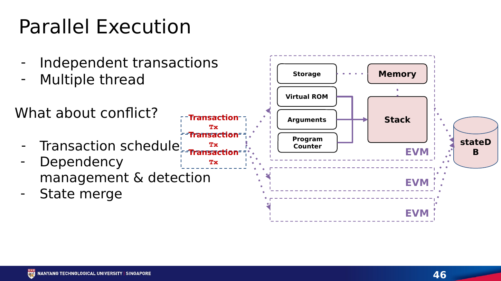

# **Chapter 9: Parallel Execution**

## **Introduction**

Most blockchain virtual machines execute transactions in a block one after another. This makes verification deterministic and simple, but it leaves modern multi-core processors underused. Parallel execution asks which transactions can run at the same time without changing the final state.

The problem is not merely starting several threads. Transactions can read and write shared accounts and contracts. A parallel engine must detect conflicts and produce exactly the result required by the chain's canonical transaction order.

---

## **Why the EVM Is Commonly Sequential**

  
   
  <em>Figure 9.1: Parallel execution needs a scheduler, dependency detection, and deterministic state merging when transactions conflict. Source: Neil Han, SC6019 Lecture 05, slide 46.</em>

An Ethereum transaction may call arbitrary contracts, which may call other contracts and touch storage addresses not obvious from the transaction envelope. The effect of transaction B can depend on the state produced by transaction A. Executing B early may therefore return a different value.

Sequential execution solves this by applying transactions in order. It is deterministic but limits execution throughput to a single ordered pipeline. Faster CPUs help, but adding cores does not automatically increase gas per second.

---

## **Conflict Graphs**

Two transactions can run concurrently when their state accesses do not conflict. A conflict exists when:

- both write the same state location; or
- one writes a location the other reads.

Two read-only accesses are compatible. If the access sets are known, an engine can build a dependency graph and schedule independent transactions together.

The main challenge is discovering those access sets. Smart contracts generate addresses dynamically, and calls may depend on prior reads.

---

## **Declared Access Lists**

Some systems ask transactions to declare the accounts or objects they will access. The scheduler can group non-overlapping transactions before execution.

Solana transactions specify accounts and whether they are read-only or writable. The Sealevel runtime can execute transactions that do not contend for writable accounts in parallel.[^1]

Sui uses an object-centric model. Transactions involving owned objects can often follow a fast path because their dependencies are explicit, while shared-object transactions require consensus ordering.[^2]

The benefit is predictable scheduling. The cost is a programming model that exposes concurrency to developers and users. Popular shared contracts can still become hot spots.

---

## **Optimistic Parallel Execution**

Optimistic execution starts transactions speculatively, detects conflicts afterward, and re-executes work when necessary. It is similar to software transactional memory in databases.

Block-STM, used by Aptos, executes an ordered block with multiple worker threads. Transactions record reads and writes in multi-version data structures. If a read is invalidated by an earlier transaction, the affected transaction is aborted and retried. Despite speculative execution, the committed result respects the original block order.[^3]

This approach preserves a familiar transaction model and discovers dependencies at runtime. Its performance depends on workload contention. Independent transfers scale well; thousands of transactions updating one shared counter do not.

---

## **Determinism and Consensus**

Validators must agree on the same state root. Parallel scheduling itself may be nondeterministic, but the committed semantics cannot be.

A safe engine defines:

1. a canonical transaction order;
2. rules for which version of state each read observes;
3. conflict detection and validation;
4. deterministic abort and retry behavior;
5. a final write order equivalent to sequential execution.

A performance bug can become a consensus bug if different validators commit different results. Parallel runtimes therefore need testing that combines database concurrency control with adversarial smart-contract behavior.

---

## **The Hot-State Problem**

Parallel execution does not help when a workload concentrates on one piece of state. An automated market maker pool, popular NFT mint, or global counter can serialize the block.

Applications can reduce contention through:

- partitioned order books or liquidity pools;
- per-user nonces and balances;
- commutative updates;
- batching and aggregation;
- actor or object models;
- delayed reconciliation.

This is co-design: the VM exposes concurrency, and applications organize state so the concurrency can be used.

---

## **Parallel Execution vs Sharding**

Parallel execution uses multiple cores within a validator. Sharding divides work across validator groups.

| Dimension | Parallel Execution | Sharding |
|---|---|---|
| Main scale unit | CPU cores in one validator | Validators and committees |
| State view | Often shared | Partitioned |
| Composability | Can remain synchronous | Cross-shard calls often asynchronous |
| Main limit | Contention and hardware | Committee security and communication |

The techniques complement each other. Each shard can execute transactions in parallel, and a rollup can use a parallel VM while relying on another layer for data and settlement.

---

## **Benchmarking Parallel Engines**

Peak TPS is especially misleading here. A benchmark should report:

- transaction mix and conflict rate;
- number and type of CPU cores;
- state size and storage medium;
- block size and latency;
- abort/re-execution rate;
- throughput under hot-state contention;
- time to compute and verify the state root.

The correct question is not how many ideal transfers fit in a second, but how performance degrades as real contracts share state.

## **Worked Example: Three Transactions, Two Cores**

Start with Alice holding ten tokens and Bob holding none. T1 transfers four from Alice to Bob. T2 reads Bob's balance and sends half to Carol. T3 updates an unrelated game object.

T1 and T3 can run concurrently because their read/write sets do not overlap. T2 cannot safely commit before T1 because it must observe Bob's balance of four. If T2 speculatively reads zero, validation detects that T1 wrote the same location earlier in canonical order. T2 aborts, reads version four, and retries. The result matches sequential execution while useful work from T3 ran in parallel.

Replace T3 with 10,000 swaps against one liquidity pool and the workload serializes because every swap touches the same reserves. More cores do not remove a contract-level dependency. Transfer-only benchmarks hide this behavior.

## **Designing Contracts for Concurrency**

An exchange can partition markets so ETH/USDC trades do not conflict with BTC/USDC. A game can store inventories as owned objects and batch global rankings. A rewards contract can accumulate per-user claims rather than increment one global counter.

These designs trade immediate global consistency for parallel work and need explicit reconciliation rules. The VM cannot invent independence that the application's state model does not contain.

## **Conclusion**

Parallel execution turns transaction independence into throughput. Declared-access systems expose dependencies before execution; optimistic systems discover them during execution and retry conflicts. Both must preserve deterministic, sequentially valid results.

The limit is contention. A parallel VM is most effective when its application model avoids global hot state. The next chapter examines a different bottleneck: agreement among many validators.

## **References**

[^1]: Solana. "Transactions and Instructions." <https://solana.com/docs/core/transactions>.
[^2]: Sui. "The Sui Smart Contracts Platform." <https://docs.sui.io/paper/sui.pdf>.
[^3]: Gelashvili, Rati, et al. "Block-STM: Scaling Blockchain Execution by Turning Ordering Curse to a Performance Blessing." <https://arxiv.org/abs/2203.06871>.
