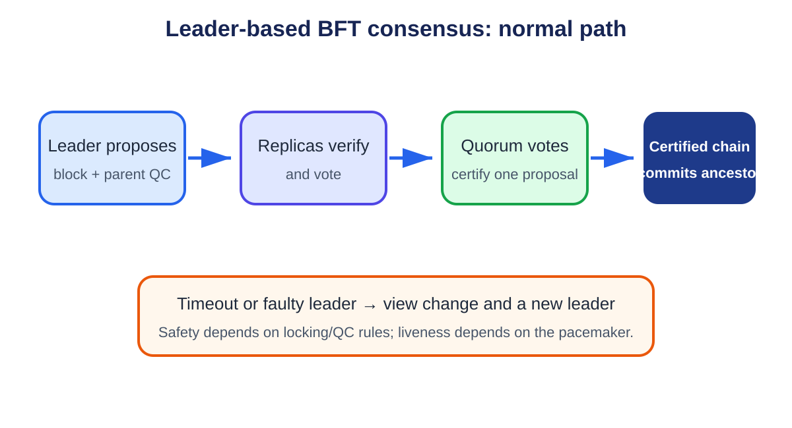

# **Chapter 10: Consensus Scaling**

## **Introduction**

Consensus allows independent nodes to agree on one ordered history despite failures and malicious behavior. It is also a scalability bottleneck. More validators improve fault tolerance and decentralization, but create more messages, signatures, and network delay.

Consensus scaling therefore seeks lower communication cost and faster finality without hiding the network and adversary assumptions that make those results possible.

---

## **Consensus From First Principles**

Nodes receive messages at different times. Two valid transactions may compete for the same funds, and two producers may propose different next blocks. **Consensus** is the protocol that lets independent nodes converge on one ordered history despite delay and faulty participants.

Consensus does not decide whether a contract rule is wise. It decides which valid proposal becomes canonical under agreed rules.

### **Fault models**

A **crash fault** stops or restarts. A **Byzantine fault** can lie, sign conflicting messages, or coordinate with others. Blockchain consensus also needs **Sybil resistance**, a rule that prevents one attacker from creating unlimited voting identities. Proof of work weights computational work; proof of stake weights bonded stake; permissioned BFT systems use an admitted validator set.

The fault threshold is part of the claim. "Tolerates one-third Byzantine weight" means safety or liveness is proven only while adversarial voting weight stays below a specified boundary and the network model holds.

### **Network models**

- **Synchronous:** messages arrive within a known maximum delay.
- **Partially synchronous:** such a bound eventually holds, but nodes may not know when stable conditions begin.
- **Asynchronous:** no fixed delivery bound is assumed.

A timeout cannot prove that a leader is malicious; the leader or network may be slow. Timeouts are tools for progress under a model, not evidence of intent.

### **Nakamoto-style consensus**

Bitcoin-like consensus allows producers to extend a chain of valid blocks. Nodes follow the valid chain with the most accumulated work or protocol-defined weight. Temporary forks resolve as one branch becomes heavier.

Finality is **probabilistic**: deeper blocks become increasingly costly or unlikely to replace, but no single vote makes them mathematically irreversible. Applications choose a confirmation depth based on value and risk.

### **BFT-style consensus**

A Byzantine fault tolerant (BFT) protocol uses explicit proposals and votes among a known validator set. With four equal replicas and at most one Byzantine, a quorum of three is common. Any two groups of three overlap in at least two replicas; because only one can be Byzantine, the overlap includes an honest replica.

Honest replicas follow locking or voting rules that prevent them from supporting incompatible commits. The overlap carries safety from one quorum certificate to another.

A **quorum certificate (QC)** is compact evidence that enough distinct validator weight voted for a proposal. It may contain individual signatures or one aggregated signature plus a signer bitmap. The verifier must still check membership and weight.

### **Views, leaders, and pacemakers**

A **view** is one numbered leader attempt. The leader proposes a block; replicas validate and vote. If progress stalls, a **pacemaker** uses timeouts and signed messages to move replicas to a higher view.

The new leader must carry forward the highest safe certificate or locked block. Replacing a stalled leader without this evidence could let different groups commit conflicting branches.

### **Safety versus liveness**

**Safety** asks whether two honest nodes can commit conflicting histories. **Liveness** asks whether valid work eventually commits. During a severe partition, a protocol may halt to preserve safety. Once communication assumptions recover, view changes should restore liveness.

Think of safety as "do not approve two incompatible ledgers" and liveness as "do not remain stuck forever." A fast protocol that sometimes approves both is unsafe; a perfectly consistent protocol that never produces another block is not live.

### **Finality and fork choice**

A **fork-choice rule** selects the branch nodes should build on now. A **finality rule** identifies a prefix that should not revert under the fault assumptions. Some protocols combine them; others use a longest-chain head plus a voting-based finality gadget.

A transaction can therefore be included at the head but not finalized. Bridges and high-value applications often wait for the stronger boundary.

### **Why consensus throughput is not execution throughput**

Voting on a block hash can be fast while distributing and executing the block body is slow. Empty-block benchmarks measure agreement on almost no application work. Complete tests include payload propagation, signature verification, execution, state commitment, leader failure, and catch-up.

Later sections introduce HotStuff, threshold signatures, DAG mempools, weighted quorums, and protocol traces. Each builds on the same questions: what evidence is signed, which quorums overlap, what state survives a crash, and how progress resumes after delay.

## **Safety, Liveness, and Finality**

A consensus protocol must separate three properties:

- **Safety** - honest nodes do not finalize conflicting blocks.
- **Liveness** - the protocol continues to finalize blocks.
- **Finality** - once finalized, a block cannot be reverted without violating the fault assumption.

Network timing matters. A synchronous model assumes a known message-delay bound. A partially synchronous model assumes the bound eventually holds but its starting time is unknown. An asynchronous model makes no timing bound.

These assumptions determine both fault tolerance and latency. Performance claims that omit them are incomplete.

---

## **Nakamoto and BFT-Style Consensus**

Nakamoto consensus selects a chain through accumulated proof of work. It scales to an open validator set and tolerates temporary forks, but finality is probabilistic. Larger or faster blocks increase stale-block pressure and may favor well-connected miners.

Classical Byzantine fault tolerant protocols use voting rounds. Under partial synchrony, a committee of *3f + 1* replicas can make progress and remain safe with up to *f* Byzantine replicas. Once a quorum certificate is formed, finality can be deterministic.

The challenge is communication. A naive all-to-all vote exchange requires quadratic messages as the validator set grows.

---

## **HotStuff**

<p align="center">
  
  <br>
  <em>Figure 10.1: A leader proposes, replicas vote, votes form a quorum certificate, and chained certificates drive commitment. A timeout moves the protocol to a new view. Original figure for this book, based on the HotStuff paper.</em>
</p>


HotStuff is a leader-based BFT protocol designed for linear communication in the normal case. Replicas vote on a leader's proposal, and the leader aggregates votes into a quorum certificate. A sequence of certified proposals creates the locking conditions needed for safety.[^1]

Its key contributions include:

- linear communication with threshold signatures or aggregated votes;
- optimistic responsiveness after the network becomes timely;
- a pacemaker abstraction for leader changes;
- pipelining in chained HotStuff.

A bad leader can still delay a view, but the protocol rotates leaders. The pacemaker and timeout rules are therefore as important to liveness as the happy path.

---

## **Sync HotStuff**


The course examines Sync HotStuff, a synchronous state-machine replication protocol. In the steady state, a leader broadcasts a proposal, replicas echo it, and a replica can commit after waiting for the maximum round-trip delay unless it observes equivocation.[^2]

The stronger synchrony assumption permits tolerance of up to one-half Byzantine replicas, compared with the familiar one-third bound under partial synchrony. The paper reports steady-state latency near `2Δ`, where `Δ` is the known delay bound, and optimistic responsiveness when fewer than one-quarter of replicas fail to respond.

The trade-off is explicit: stronger fault tolerance and a simple fast path depend on a meaningful bound on network delay. A wide-area public blockchain may find that assumption harder to defend than a consortium network or data-center service.

---

## **Reducing Communication**

Consensus protocols use several techniques to scale:

### **Leader Aggregation**

Validators send votes to a leader instead of broadcasting every vote to everyone. The leader distributes one certificate.

### **Threshold and Aggregate Signatures**

Many signatures are compressed into a smaller proof of quorum. This saves bandwidth and verification work, although distributed key generation and signer accountability introduce complexity.

### **Committees**

A smaller rotating committee reaches agreement on behalf of a larger set. Random selection reduces targeted capture, but committee size determines the probability of a Byzantine majority.

### **Pipelining**

Different consensus stages for consecutive blocks overlap. Throughput rises even if the latency of one block is unchanged.

### **DAG-Based Mempools**

A **directed acyclic graph (DAG)** is a set of items connected by one-way references with no path that loops back to its start. Unlike one chain where each block has one parent, a DAG can record several independently disseminated batches at the same time. A DAG mempool spreads and certifies transaction data before a later consensus step chooses its order.


Protocols can separate transaction dissemination from ordering. Validators first certify batches in a directed acyclic graph, then consensus orders references to those batches. This reduces duplicated data transmission and keeps the ordering layer small.[^3]

---

## **Block Propagation Is Part of Consensus**

A theoretically efficient vote protocol can still be bottlenecked by distributing block data. Compact blocks, erasure-coded broadcast, relay networks, and separating headers from transaction bodies reduce this pressure.

There is also a censorship and centralization risk. Specialized relays and powerful block builders improve propagation but can become privileged infrastructure. Consensus performance must be measured with the network topology and block payload, not votes alone.

---

## **Consensus and Execution Separation**

Consensus orders transactions; execution computes their effects. Separating them allows consensus to agree on compact batch references while execution and data dissemination proceed in parallel. Modular systems take this further by assigning consensus and data availability to one layer and execution to another.

The layers still interact. Consensus cannot finalize unavailable data safely, and execution cannot finalize state without a canonical order.

---

## **Named Case Studies: How Consensus Families Reached Production**

A protocol family is not a straight genealogy in which one paper becomes one product unchanged. Production systems borrow a safety rule, split one subsystem into two, replace the broadcast layer, or redesign the commit path. The three traces below separate what carried over from an earlier design from what did not.

### **From HotStuff to DiemBFT and AptosBFT**

**Deployment labels: Diem was a production-oriented implementation that did not become a public production network; AptosBFT is production.** HotStuff supplies a chained Byzantine fault-tolerant core: rotating leaders propose blocks, weighted quorum certificates summarize votes, and a pacemaker moves replicas between views. DiemBFT turned that paper structure into an implementation with transaction execution, persistent safety state, epoch changes, networking, and operational recovery. AptosBFT descends from that code and design line but runs in a live network with a distinct data-dissemination path.[^4][^5]

Trace an Aptos transfer from Alice to Bob. Alice submits a signed transaction to a fullnode, which forwards it toward validators. Validators validate and disseminate the transaction. Aptos documentation separates mempool, **Quorum Store**, consensus, execution, and storage. Quorum Store packages transaction batches and makes their availability independently certifiable. The round leader can propose references to available batches rather than bearing the full cost of first distributing every transaction inside the consensus proposal. Validators order the proposal through AptosBFT, execute the ordered transactions, vote, and commit after the required certificate path. Storage persists the committed result and the client can observe the transaction as committed.[^4]

The HotStuff inheritance is visible in rounds, leaders, quorum certificates, chained certified blocks, and timeout-driven progress. The important production idea is still that an honest validator does not vote in a way that violates its locked or preferred branch rule, and a new leader carries sufficient certificate evidence to propose safely. What did **not** carry over unchanged is a simple mental model in which the leader broadcasts one complete block and consensus alone handles all payload movement. Quorum Store separates payload availability from ordering. Aptos also couples the protocol to weighted stake, epochs, state synchronization, execution, and a real transaction pipeline. Calling all of that "HotStuff" conceals the components that dominate throughput and recovery.

Suppose the round leader fails. Validators time out, exchange timeout information, advance the round, and a later leader proposes from safe certificate state. That is the pacemaker liveness path. Suppose Quorum Store cannot form availability proofs for new batches. Consensus may still exchange empty or previously available proposals, but application throughput falls because ordering cannot safely refer to unavailable payloads. Suppose a validator loses its persisted safety state and signs conflicting rounds after restart. The mathematical quorum intersection argument cannot save a node that violates its own voting rule; slashing evidence and key safety become part of the production protocol.

For the user, the observable boundaries are submission to a fullnode, admission, batch availability, proposal, certification, execution, and commit. An RPC response that merely accepts Alice's transaction is not consensus finality. A useful incident report says whether the bottleneck was transaction dissemination, Quorum Store availability, leader progress, execution, state synchronization, or storage commit.

### **From Narwhal and Bullshark to Sui Mysticeti**

**Deployment labels: Narwhal and Bullshark are implemented research systems and prior production components; Mysticeti is Sui's production consensus.** Narwhal separates reliable transaction dissemination from consensus ordering by building a directed acyclic graph (DAG) of certified batches. Bullshark orders that DAG. The conceptual gain is that validators continuously disseminate data instead of waiting for one leader to carry a large block to everyone.[^3]

Sui's current consensus documentation names **Mysticeti** as its consensus protocol. Validators create signed blocks that reference earlier blocks, forming a DAG. A block can carry transaction information and votes implicit in those references. The protocol applies a decision rule to DAG structure and stake to commit leaders and derive one order. Sui also distinguishes consensus transactions from transactions that can use its object-centric fast path; not every operation needs identical consensus work.[^6]

Trace a Sui transaction that touches a shared object and therefore needs consensus. The client obtains the required signatures and sends the transaction to validators. Validators validate it and include it in DAG blocks. Other validators receive those blocks and reference them in later blocks, providing evidence of dissemination and support. Mysticeti's rule identifies commit decisions from this DAG and yields a deterministic transaction order. Validators execute against Sui's object model and the client observes effects and finality under the network's rules.

What carried over from Narwhal/Bullshark is the DAG-first intuition: dissemination and causal references continue across rounds, payload availability is not reduced to one leader's broadcast, and ordering can use accumulated DAG evidence. What did **not** carry over unchanged is the two-box textbook picture "Narwhal mempool plus Bullshark consensus." Mysticeti changes the DAG and commit protocol to reduce latency and integrates with Sui's transaction model. A reader should not assume that every Narwhal certificate type, Bullshark wave, or earlier round structure remains a live Mysticeti mechanism merely because the systems share authors and lineage.

Now let the designated leader's block arrive late. In a linear leader-broadcast design, replicas may wait and then start a view change. In a DAG design, validators can continue producing and referencing other blocks, while the decision rule handles a missing or unsupported leader. Throughput and liveness still depend on enough weighted validators exchanging DAG blocks. A partition that prevents quorum-weight communication stops finality. Equivocating validator blocks must be detected and treated under the protocol's rules. If data named by a DAG block is unavailable, a reference is not a substitute for the payload needed to validate and execute transactions.

The visible evidence is therefore richer than "block height." Operators inspect DAG round or slot progress, blocks received by stake weight, leader decisions, missing ancestors, transaction certification, execution effects, and epoch state. The production question is whether the exact Mysticeti decision and persistence rules are safe through equivocation, restart, epoch transition, and asymmetric delay, not whether the earlier Narwhal paper was sound.

### **From the PBFT family to Tendermint and CometBFT**

**Deployment label: CometBFT is production infrastructure used by application-specific chains.** Practical Byzantine Fault Tolerance (PBFT) established the familiar setting of a fixed validator group, fewer than one-third Byzantine faults, authenticated messages, and quorum intersection. Tendermint adapted the family for blockchains with repeated heights, stake-weighted validators, rotating proposers, locking, and two named voting steps. CometBFT is the maintained state-machine replication engine in that lineage and exposes the application through the Application Blockchain Interface.[^7][^8]

Trace one height. A proposer chooses a block for height `h` and round `r`. Validators receive and validate the proposal against consensus and application rules. They broadcast **prevotes** for the proposal or nil. If a validator observes more than two-thirds of voting power prevote a block, it can lock according to the protocol rule and broadcast a **precommit** for that block. More than two-thirds precommits for the same block at the height form the commit evidence; the engine advances to the next height and the application commits the resulting state. If no proposal or quorum arrives before a timeout, validators move to a higher round with a new proposer.[^7]

The PBFT inheritance is quorum intersection, Byzantine authentication, a proposer-led normal path, and safety from vote restrictions. What changed is as important. CometBFT does not use PBFT's client-request, pre-prepare, prepare, commit vocabulary as a drop-in transcript. It repeats propose-prevote-precommit rounds at each blockchain height, uses locks to preserve safety across rounds, weights votes by validator power, changes validator sets at defined boundaries, gossips blocks and votes over a peer network, and calls an external deterministic application through ABCI. It also commits a block before moving to the next height rather than using HotStuff's pipelined chain of several certified descendants.

Suppose the proposer is offline. Validators time out, prevote nil when required, fail to form a block commit in that round, and proceed to the next proposer. Suppose a validator saw a quorum prevote and locked block A, then receives block B in a later round. It may not simply follow the newest proposal; the lock and proof-of-lock rules govern when it can vote differently. This is the safety bridge across rounds. A validator that precommits conflicting blocks for the same height and round creates evidence of equivocation. A network partition with neither side holding more than two-thirds voting power preserves safety but halts commits.

Application behavior is part of the trace. CometBFT orders and replicates calls, but the ABCI application must be deterministic. If two correct validators return different results for the same ordered block because of local time, floating-point behavior, or an external API, consensus cannot turn those divergent applications into one state. Likewise, a valid consensus commit says that the validator quorum agreed to the block; it does not prove a bridge oracle, governance decision, or application price feed was economically correct.

### **Lineage comparison**

| Earlier family | Production descendant | Ideas that carried over | Ideas that changed or did not carry over |
|---|---|---|---|
| HotStuff | DiemBFT, then AptosBFT | Rotating leaders, chained quorum certificates, safe voting state, pacemaker/view change | Payload dissemination is split through Quorum Store; stake epochs, execution, state sync, and operations are part of the real system |
| Narwhal/Bullshark | Sui Mysticeti | DAG dissemination, causal references, continued data flow despite an imperfect leader | Mysticeti uses a different low-latency DAG decision protocol and Sui integration; do not project every Bullshark wave or Narwhal certificate onto it |
| PBFT family/Tendermint | CometBFT | Authenticated Byzantine quorum, proposer, quorum intersection, lock-like safety across retries | Propose-prevote-precommit rounds, weighted validators, repeated blockchain heights, gossip, ABCI, and non-pipelined commit distinguish the production engine |

These are not three brand names for one algorithm. AptosBFT emphasizes a chained-certificate core with separate payload availability. Mysticeti lets the DAG carry both dissemination and ordering evidence. CometBFT uses explicit prevote and precommit rounds with locking at each height. All still need quorum reachability, persisted signing safety, authenticated validator sets, deterministic execution, and tested recovery when timing assumptions fail.


## **Comparison**

| Family | Finality | Typical Fault Bound | Communication Idea | Main Trade-Off |
|---|---|---|---|---|
| Nakamoto | Probabilistic | Resource majority | Gossip and longest/heaviest chain | Slow certainty and fork risk |
| Practical Byzantine Fault Tolerance (PBFT)-style | Deterministic | `< 1/3` Byzantine | Multi-phase voting | Quadratic communication in basic form |
| HotStuff | Deterministic | `< 1/3` Byzantine | Leader aggregation and certificates | Leader/pacemaker complexity |
| Sync HotStuff | Deterministic | `< 1/2` Byzantine | Synchronous echo and wait | Relies on known delay bound |
| DAG + BFT | Deterministic | Usually `< 1/3` Byzantine | Separate dissemination and order | More protocol components |

## **Worked Example: Why a Quorum Certificate Matters**

Take four replicas, A through D, with at most one Byzantine replica. A quorum contains three votes. A leader proposes block X and gathers votes from A, B, and C. The certificate proves that at least two honest replicas voted for X.

Could conflicting block Y also obtain three votes at the same height? Any two sets of three among four overlap in at least two replicas. At least one overlapping replica is honest, so locking and voting rules prevent both certificates under the safety assumptions.

A certificate compresses quorum evidence, but it does not alone define commitment. HotStuff uses a chain of certified proposals so replicas can distinguish a safe extension from a conflict. That structure permits safe leader replacement.

## **The Liveness Path**

If leader A is offline, replicas time out, move to a new view, and send their highest certificates to leader B. B extends the safest certificate. Once messages arrive within the eventual network bound, it gathers a quorum and progress resumes.

Timeouts that are too short cause needless view changes during latency spikes. Timeouts that are too long make a faulty leader expensive. Pacemakers often back off after failures and reset after stable progress. Two implementations of the same paper can therefore show very different latency.

## **Throughput Is Not Finality Latency**

Pipelining can commit one block per round after the pipeline fills even if each block needs several rounds to become final. Throughput measures spacing between committed blocks; latency measures one transaction's journey. Benchmarks should report both, plus validator count, geography, payload size, signature scheme, and failure conditions.

## **HotStuff State and Voting Rules**

A HotStuff replica tracks more than the latest block. It stores the current view, the highest quorum certificate it knows, and a lock that prevents votes creating conflicting commits.

A proposal contains a block extending a parent and a justify QC. A replica votes only when the proposal is safe according to the locking rule. A simplified check is:

```text
safe_to_vote(proposal):
    return proposal.extends(locked_block)
        or proposal.justify_qc.view > locked_qc.view
```

The first condition follows the current lock. The second permits progress when the proposal carries newer quorum evidence. Exact protocol variants differ, but the invariant is the same: honest replicas do not vote in a way that lets two conflicting chains both satisfy the commit rule.

In chained HotStuff, each proposal can serve as a phase for an earlier block. Consecutive QCs pipeline prepare, pre-commit, and commit evidence. Once the required certified chain exists, an ancestor commits. The pipeline raises throughput because a new proposal advances several blocks' phases at once.

## **Pacemaker and View Synchronization**

Safety can hold in a fully asynchronous period, but liveness requires honest replicas to spend enough time in the same view with an honest leader. The pacemaker creates this overlap.

When a timer expires, a replica broadcasts a timeout containing its highest QC. A timeout certificate or threshold of timeout messages justifies moving to the next view. The new leader collects the highest safety evidence and proposes an extension.

Timeout selection is adaptive. A fixed timeout small enough for normal operation may cause endless view changes during an outage. An exponential backoff eventually exceeds actual delay after the network stabilizes. Implementations reset or reduce timeouts carefully after progress so latency returns to normal without synchronizing replicas into another failure cycle.

## **Threshold Signatures and Accountability**

A threshold signature compresses `2f + 1` votes into one constant-size certificate. Validators first participate in distributed key generation or receive shares under another trusted process. No coalition below the threshold can sign.

Aggregation saves bandwidth, but a single threshold signature can hide individual signers. Systems needing slashing evidence may carry signer bitmaps or use aggregate signatures that preserve attribution. Key rotation, lost shares, and membership changes also add operational cost.

A consensus design should say whether a QC proves only quorum weight or also identifies every signer. This affects forensic analysis and punishment after equivocation.

## **DAG Mempools**

Consensus proposals often carry large transaction batches. If every leader retransmits those bytes, bandwidth and leader performance dominate. A DAG mempool separates dissemination:

1. each validator broadcasts a transaction batch;
2. peers sign availability acknowledgements;
3. a certificate proves enough peers received the batch;
4. later consensus proposals order compact certificates rather than raw transactions.

The DAG records causal references among certificates. Ordering can continue with small messages after data dissemination has completed. Safety still depends on the ordering consensus, while availability depends on the certificate threshold and retrieval protocol.

This architecture adds queues and garbage collection. Nodes must retain certified batches until committed, recover missing parents, and prevent an attacker from flooding unreferenced data.

## **Consensus Implementation Checklist**

- Define the exact block, vote, QC, timeout, and view-change messages.
- Domain-separate every signature by chain, epoch, message type, and view.
- Persist locks and safety state before sending votes.
- Test crash recovery between persistence and network send.
- Bound proposal and certificate sizes.
- Measure leader change under packet loss and skew.
- Include real block dissemination in benchmarks.
- Specify validator-set transitions and old-key retirement.
- Expose highest QC, lock, current view, and timeout metrics.
- Run conflicting-message and malformed-certificate tests across all clients.

The most dangerous consensus bugs live in rare transitions: restart, epoch change, delayed old messages, and view changes during partial network recovery.

## **Epoch and Validator-Set Changes**

Consensus safety proofs often assume a fixed validator set, while proof-of-stake systems change membership. An epoch transition must bind the new set to a finalized decision by the old set.

A transition block can commit to validator public keys, weights, activation height, and protocol version. New validators begin voting only after the transition is final. Old signatures remain valid for old views but cannot authorize new-epoch blocks.

Light clients need a chain of authenticated set changes. Skipping directly from an old checkpoint to a current header without verifying intermediate transitions lets an attacker invent a validator set. Sync committees or succinct proofs compress this chain under additional assumptions.

Long-range attacks occur when old validators, whose stake is no longer slashable, sign an alternative history. Weak subjectivity addresses this by requiring clients to obtain a recent trusted checkpoint within a defined period. This is a social/bootstrap assumption distinct from short-range BFT safety.

## **Slashing Safety and Validator Key Operations**

Slashing penalizes objectively provable validator behavior such as signing incompatible blocks. It strengthens incentives only when keys, domains, evidence, and appeal/recovery rules are correct. Operational mistakes can trigger the same signature evidence as malicious behavior.

### Signing domain

Every consensus signature binds:

```text
SigningDomain {
  chain_id,
  genesis_or_fork_id,
  protocol_version,
  epoch,
  view_or_slot,
  message_type,
  payload_hash
}
```

A vote, proposal, timeout, and aggregate have distinct message types. Reusing a signature across testnet/mainnet, old/new forks, or proposal/vote contexts must fail.

### Slashing protection database

Before signing, a validator records enough history to reject a double vote, surround vote, conflicting proposal, or other prohibited pair under protocol rules. Persist the record before releasing the signature.

A remote signer must enforce protection itself; relying only on the validator client allows two clients to request conflicts. The database needs atomic writes, authenticated backups, versioning, and a merge procedure when migrating hosts.

### Active-active danger

Running two validators with one key for availability can cause equivocation during network partitions. A load balancer that sends requests to both is not safe redundancy.

Use active-passive fencing, one remote signer, consensus-aware replicas, or a protocol that explicitly supports redundant shares. Promotion verifies that the old signer cannot continue and imports the latest protection state.

### Key hierarchy

Separate withdrawal, governance, consensus-signing, fee-recipient, and operator API keys. Compromise has different effects. A consensus key may equivocate without being able to withdraw stake; a withdrawal key may steal funds without voting.

Keep online signing keys in hardened signers or hardware appropriate to latency needs. Backup and rotate under a documented ceremony. Never test recovery for the first time during an outage.

### Threshold signing

A threshold validator splits signing authority among members. A signature requires `t` shares, reducing one-device compromise risk. It adds network latency, share availability, distributed key generation, and membership operations.

The threshold group represents one protocol validator, not `t` independent consensus votes. Slashing protection must be consistent across share signers so two subsets cannot sign conflicts.

If `t=3` of `5`, any three shares sign. Two disjoint groups of three cannot exist, but groups `{A,B,C}` and `{C,D,E}` overlap only at C. If C signs both because its local state is inconsistent, conflicting signatures can form. Shared or cryptographically enforced signing state remains necessary.

### Evidence lifecycle

Slashing evidence includes both signed messages, signer identity, domain, and proof that they violate a rule. Nodes verify evidence before gossip and bound storage to the accountable window.

Duplicate submission must not slash twice. Evidence from expired accountability windows, old forks, or wrong validator sets is rejected. Retain data long enough for network delays and censorship recovery.

### False positives and software faults

A slashing condition should be objective from signed bytes. Monitoring can be wrong, but the on-chain verifier must not slash from an unauthenticated alert.

A common client bug can make many validators sign invalid or conflicting messages. The protocol may still slash according to rules, but governance intervention changes economic expectations. Document extraordinary authority rather than assuming it will or will not act.

### Validator migration

To move a validator:

1. stop and fence the old signer;
2. export and verify slashing-protection state;
3. confirm the last signed slot/view through independent logs;
4. import atomically on the new signer;
5. test a no-sign dry run and chain/domain configuration;
6. enable one active signing path;
7. monitor duplicate-key and stale-view requests.

If the old host cannot be proven off, wait through a safe inactivity window or rotate according to protocol. Missed rewards are cheaper than equivocation.

### Clock and rollback

A restored virtual-machine snapshot can roll back the protection database while the chain advances. Exclude active signers from generic snapshot rollback, or make the signer consult a monotonic external store.

Wrong clocks can request signatures for stale or future slots. The signing domain prevents cross-slot replay, but repeated bad requests can exhaust resources or miss duties. Monitor time drift through independent sources.

### Worked failure domain

An operator runs 100 validator keys on two hosts, each with a copy of all keys. It appears redundant, but one software fault affects 100 keys and active-active failover can double-sign all of them.

Splitting keys 50/50 lowers the immediate correlated set; using distinct clients, signers, regions, and staged upgrades lowers it further. Redundancy should reduce common-mode loss, not multiply signing authority.

### Disaster drill

Test signer outage, database corruption, restore from backup, failed fencing, network partition during promotion, wrong chain ID, epoch upgrade, threshold-member loss, and evidence submission.

Assert no conflicting signatures, bounded missed duties, complete evidence verification, one penalty per violation, recoverable protection state, and separation of withdrawal authority.

Slashing supports consensus security when signing is treated as an irreversible state transition. Key custody, persistence, fencing, migration, and evidence handling are protocol operations, not generic server administration.

## **Slashing and Equivocation Evidence**

A validator equivocates by signing conflicting messages that protocol rules prohibit, such as two blocks at one height or incompatible votes in one view. Slashing evidence contains both signatures and enough context to verify conflict.

Evidence must be objective and compact. A timeout is not proof of malice because networks fail. Conflicting signed votes are. Penalties can remove stake, remove future rewards, or eject validators. Excessive correlated slashing can threaten network recovery, so protocols distinguish accidental downtime from safety violations.

Accountability requires retaining signer identity. A threshold signature without attribution proves quorum but may not reveal which members equivocated. Systems may keep individual votes off-chain, publish signer bitmaps, or use aggregatable signatures preserving evidence.

## **Fork Choice and Finality Gadgets**

Some systems separate a fork-choice rule from finality. Fork choice selects the head validators should build on now; a finality gadget periodically certifies checkpoints that should never revert under the fault bound.

During temporary disagreement, honest validators can see different heads while agreeing on the latest finalized checkpoint. Applications choose confirmation policy based on risk. A low-value payment may accept head inclusion; a bridge waits for checkpoint finality.

The interaction matters. Votes used for finality may also influence fork choice, and network delay can cause validators to build on stale heads. Specifications must define tie-breaking, latest-message handling, justified checkpoints, and behavior when finality stalls.

## **Consensus Safety Testing**

A model checker explores small validator sets and message schedules, looking for two conflicting commits. Property-based tests generate delays, duplicates, reorderings, restarts, and Byzantine messages. Network simulations scale to realistic committees and geography.

Critical scenarios include:

- leader equivocates across network partitions;
- replicas restart after voting but before persisting state;
- old votes arrive after a view change;
- epoch transition overlaps a timeout;
- validator weight changes near a quorum boundary;
- clock skew triggers premature timeout;
- malformed aggregate signatures stress verification;
- a minority floods valid but useless certificates.

Testing cannot replace proof, and proof cannot replace implementation testing. The model, specification, and code must encode the same protocol.

## **Consensus Network Partitions and Recovery**

A network partition prevents groups of honest validators from communicating reliably. Consensus must decide whether any group can continue and how branches reconcile when connectivity returns.

### Quorum reachability

In a BFT protocol requiring more than two-thirds voting weight, a partition with 70 percent on one side and 30 percent on the other can let the larger side progress while the smaller cannot form a certificate. A 50/50 partition halts both sides, preserving safety if honest replicas do not violate locking rules.

Validator count is insufficient when weights differ. Compute reachable weight from the authenticated epoch set and avoid counting duplicate signers or replicas of one key.

### Partition or slow network?

A replica observes missing or delayed messages, not a labeled partition. Pacemaker timeouts advance views, but rapid view changes can add load to an already congested network.

Expose peer reachability, vote weight observed, message latency, timeout certificate formation, highest QC, and block-body availability. Operators should not manually force a leader or lower quorum because progress is slow.

### Asymmetric partitions

Communication may work from A to B but not B to A, or small messages may pass while large block bodies fail. Votes can form for data some replicas cannot retrieve.

Test direction, payload size, and protocol phase separately. Availability certificates should mean signers actually possess retrievable data under the stated rule, not merely that they saw a header.

### Healing and view convergence

When connectivity returns, replicas exchange highest certificates and locked state. The pacemaker brings them to a common higher view, and the next valid leader extends the safe parent selected by protocol rules.

Do not choose the branch with the most transactions or the operator's preferred payments. Certificate and lock rules determine safety. Transactions from abandoned uncommitted proposals may return to the mempool after nonce and state revalidation.

### Persistence

A replica persists its current epoch, last vote by view/height, highest QC, lock, and committed boundary before sending messages whose replay could violate safety. After restart, it reloads this state before voting.

Disk failure can make a node "forget" a vote and sign a conflict. Remote signers need monotonic slashing protection or consensus-state fencing. Two active replicas sharing one validator key can equivocate during a partition unless only one has signing authority.

### Worked weighted partition

Suppose validator weights are:

```text
A 28, B 24, C 20, D 16, E 12; total W = 100
```

A certificate needs at least 67 under a `floor(2W/3)+1` rule. If A, B, and E can communicate, they have 64 and cannot progress. A, C, D, and E have 76 and can.

If B's operator also controls E, they are separate protocol weights but one operational failure domain. Consensus arithmetic and decentralization analysis answer different questions.

### Reconfiguration during a partition

Do not activate a validator-set change independently on two sides. The new set is authenticated by a finalized or committed boundary under the old set, and every certificate is checked against the set active for its domain.

A partition across the boundary may leave some nodes unaware of the new epoch. Their old-epoch votes must not count in the new epoch. Handoff rules may require overlap or a joint certificate.

### Client and implementation divergence

What looks like a network partition can be a deterministic client split: implementations reject each other's blocks. Network dashboards show healthy connections while votes divide by client.

Compare validation errors, state roots, protocol versions, and payload hashes. Preserve the offending input. Restarting peers or adding bandwidth will not repair divergent execution.

### Recovery procedure

1. identify last committed/finalized block agreed across independent nodes;
2. preserve votes, timeout messages, proposals, and network observations;
3. restore connectivity without changing quorum or lock rules;
4. let protocol view synchronization choose the safe parent;
5. verify abandoned transactions before requeue;
6. reconcile proposer rewards, slashing evidence, and user status;
7. test catch-up from the minority side and a fresh node.

If conflicting commits exist, ordinary recovery assumptions have failed. Halt value release and treat the event as a safety incident; do not call one branch canonical without accountable evidence and the protocol's extraordinary governance process.

### Partition test matrix

Run 70/30, 50/50, rotating minorities, one-way links, high loss, delayed votes, header-only connectivity, body withholding, signer restart, duplicated signer, epoch transition, and mixed-client divergence.

Measure committed throughput, finality latency, timeout/view rate, bandwidth amplification, fork depth, catch-up time, and transaction replay. Assert no conflicting commits under the modeled fault bound and eventual progress once the network and honest-leader assumptions recover.

Consensus scales responsibly when recovery uses the same certificates and locks as normal operation. A partition is not permission to replace protocol safety with administrator judgment.

## **Consensus Operations**

Operators monitor view duration, proposal delay, vote arrival distribution, missed leaders, QC formation time, finality lag, peer diversity, and clock offset. A rise in view changes may indicate a faulty leader, regional network problem, overloaded verification, or timeout too close to normal p99 delay.

Incident response should preserve signed messages and timing evidence. Restarting every validator simultaneously can destroy liveness or forensic context. Staged recovery keeps enough replicas online and avoids violating lock persistence.

Capacity planning includes signature verification, block execution, data propagation, and state commitment. Increasing committee size without network and verification headroom can lower security in practice by causing honest validators to miss deadlines.

## **Worked Protocol Trace: Four Replicas and One Fault**

Consider four replicas `A`, `B`, `C`, and `D`, with at most one Byzantine fault. A quorum contains three votes. Any two quorums of three intersect in at least two replicas; because at most one is Byzantine, the intersection contains at least one honest replica. Locking rules use that honest overlap to prevent incompatible commits.

### Normal path

Assume `A` leads view 12 and proposes block `X` extending the highest known quorum certificate. Each replica checks the proposal's parent, view, payload, state-transition inputs, and signature domain before voting.

```text
view 12
A -> {B,C,D}: PROPOSE(X, parent_qc)
{A,B,C} -> A: VOTE(X, 12)
A: aggregate three votes into QC(X, 12)
```

A quorum certificate proves that three replicas voted for `X`; it does not by itself mean a client should treat `X` as committed. In chained HotStuff, later certified descendants satisfy the protocol's commit rule. Pipelining allows a new proposal to carry `QC(X,12)` while votes for the next block are collected.

Before replica `B` sends its vote, it persists the safety state required by the protocol. If it crashes after sending but before recording its lock, it might restart and vote for a conflicting branch. Write-ahead persistence therefore belongs on the safety path, not as optional operational logging.

### Faulty leader and timeout

Now assume `A` is faulty in view 13 and sends no valid proposal. Replicas' pacemakers expire. They sign timeout messages containing their highest known QC and send them to the next leader, `B`.

```text
view 13
A: silent or invalid proposal
{B,C,D}: TIMEOUT(13, highest_qc)
B: form timeout certificate

view 14
B -> {A,C,D}: PROPOSE(Y, highest_safe_qc, timeout_certificate)
{B,C,D} -> B: VOTE(Y, 14)
B: form QC(Y, 14)
```

The timeout certificate proves enough replicas abandoned view 13. The highest-QC rule ensures the new leader extends a branch compatible with honest replicas' locks. A leader cannot choose an older convenient parent merely because it has three fresh participants.

Timeout values affect liveness, not the underlying safety proof, provided replicas enforce voting and locking rules. Too short a timeout creates needless view changes under ordinary jitter. Too long a timeout makes every failed leader expensive. Implementations often increase timeout after repeated failures and reduce it after stable progress.

### Equivocation

Suppose a Byzantine leader sends `Y` to `B` and `Z` to `C` in the same view. The signed proposals are equivocation evidence. Honest replicas still apply their voting rules. With four replicas, the faulty leader cannot form quorums of three for both conflicting blocks unless at least one honest replica votes incompatibly.

This is why a signature check alone is insufficient. The implementation must index votes by chain, epoch, view, message type, and block identity, reject a second prohibited vote, and preserve evidence. An aggregate signature should retain a signer bitmap or underlying votes needed for accountability.

### Client finality

A client observes at least three distinct notions:

1. **proposal reception** - one leader advertised a block;
2. **certification** - a quorum voted for it;
3. **commit/finality** - the protocol's chained-certificate rule makes it irreversible within the fault model.

An application must name which event it uses. Showing a proposal as a provisional status is reasonable. Releasing bridged assets against it is not. Even a committed block is conditional on validator-set authentication and the client's weak-subjectivity checkpoint when membership changes.

### Trace assertions

A deterministic test harness for this trace should assert:

- no honest replica votes twice in one prohibited context;
- every accepted QC contains the required distinct weight;
- a new-view proposal extends the safe parent selected from timeout evidence;
- persisted lock state survives a crash at every send boundary;
- two honest replicas never commit conflicting blocks;
- after the network stabilizes and an honest leader is selected, progress resumes;
- metrics identify the timed-out view, missing leader, highest QC, and time to recovery.

Run the same trace with duplicate, reordered, and delayed messages. Then vary the fault: an invalid payload, a malformed aggregate, conflicting epoch numbers, stale QCs, and a validator-weight change at the boundary. The state machine should reject each invalid transition for a specific reason without discarding evidence needed for diagnosis.

## **Quorum Arithmetic With Weighted Validators**

Replica counts are only a special case. If validators have weights summing to `W`, a certificate commonly requires weight greater than `2W/3`, under an assumption that Byzantine weight is less than `W/3`.

Let two certificates each have weight greater than `2W/3`. Their intersection has weight greater than:

```text
2W/3 + 2W/3 - W = W/3
```

If Byzantine weight is less than `W/3`, the overlap includes honest weight. Boundary comparisons matter. An implementation using integer weights must define whether a threshold is `floor(2W/3)+1` or an equivalent exact rule. Rounding one path differently in vote collection and certificate verification can split clients at the quorum boundary.

Weight changes should activate at an authenticated epoch boundary. Calculating one certificate against old weights and another against new weights can invalidate the intersection argument. Test totals not divisible by three, maximum integer weights, duplicate signers, zero-weight entries, and set transitions immediately before and after a timeout.

## **Conclusion**

Consensus scaling is the engineering of messages, signatures, leaders, committees, and timing assumptions. HotStuff makes the normal path linear and pipeline-friendly. Sync HotStuff shows what becomes possible under synchrony. DAG-based systems separate data dissemination from ordering.

No protocol is unconditionally "faster consensus." Each result depends on its network model, fault threshold, committee construction, block payload, and recovery behavior. The final chapter looks at how these techniques may converge in future blockchain architecture.

## **References**

[^1]: Yin, Maofan, et al. "HotStuff: BFT Consensus in the Lens of Blockchain." <https://arxiv.org/abs/1803.05069>.
[^2]: Abraham, Ittai, et al. "Sync HotStuff: Simple and Practical Synchronous State Machine Replication." <https://arxiv.org/abs/2005.13432>.
[^3]: Danezis, George, Lefteris Kokoris-Kogias, Alberto Sonnino, and Alexander Spiegelman. "Narwhal and Tusk." <https://arxiv.org/abs/2105.11827>.

[^4]: Aptos Documentation. "Life of a Transaction." <https://aptos.dev/network/blockchain/blockchain-deep-dive>.
[^5]: Diem Documentation. "Consensus crate." <https://diem.github.io/diem/consensus/index.html>.
[^6]: Sui Documentation. "Consensus." <https://docs.sui.io/develop/sui-architecture/consensus>.
[^7]: CometBFT Documentation. "Byzantine Consensus Algorithm." <https://docs.cometbft.com/v0.37/spec/consensus/consensus>.
[^8]: CometBFT Documentation. "ABCI 2.0." <https://docs.cometbft.com/main/spec/abci/>.
