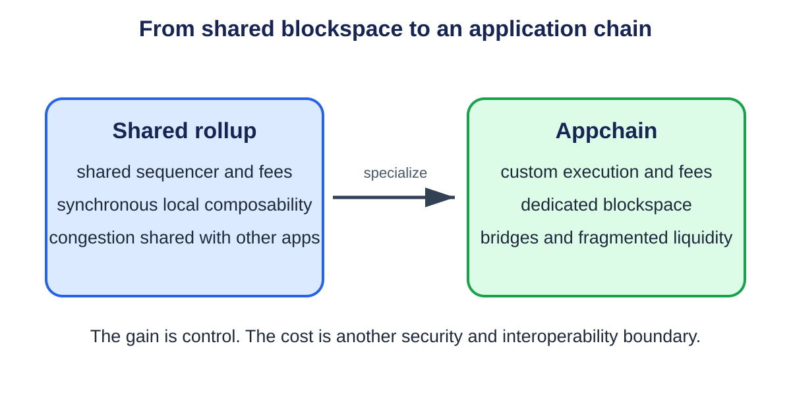

# **Chapter 11: Future Directions**

## **Introduction**

Blockchain scalability is moving from one-chain throughput contests toward specialized stacks. Execution, proving, sequencing, data availability, settlement, and interoperability are becoming separate services that can improve independently.

The next bottleneck is therefore not one number such as TPS. It is coordination: making many fast execution environments feel like one secure, usable system.

---

## **How to Read This Future-Facing Chapter**

This chapter combines deployed ideas, active prototypes, and research proposals. A basic reader should not treat every named mechanism as a product that is already available or as one inevitable roadmap.

For each idea, separate five questions:

1. **What problem is it trying to solve?** Examples include proof delay, fragmented liquidity, censorship, or validator storage.
2. **What is the mechanism?** Name the messages, proofs, committees, or markets that change the outcome.
3. **Which assumption moved?** Faster service may require a new operator, timing bound, hardware class, or governance key.
4. **What evidence exists?** A paper, prototype, testnet, audited deployment, and long-running permissionless production system provide different confidence.
5. **How does failure appear to a user?** A wallet needs states such as pending, preconfirmed, proven, settled, refundable, or blocked.

### **A glossary for the emerging stack**

A **real-time proof** is a validity proof produced quickly enough to fit a protocol's next acceptance deadline. "Real time" is relative to a slot or batch interval, not literally instantaneous.

**Proof aggregation** combines evidence for many computations so a verifier checks one smaller proof. **Recursion** means one proof verifies other proofs inside its proven computation. This is like checking a signed summary whose calculation includes checking the signed summaries beneath it.

A **shared sequencer** orders transactions for several rollups. It may improve cross-rollup coordination, but the rollups still need settlement, DA, and rules for sequencer failure. A **based rollup** derives ordering from base-layer proposers rather than operating an entirely separate sequencer.

A **preconfirmation** is a signed promise about future inclusion or order before full consensus finality. It is useful only when the signer, promise domain, expiry, violation evidence, and penalty are explicit.

An **intent** states an authorized outcome, such as receiving at least 100 units of one asset for no more than 50 units of another. A **solver** chooses a route that satisfies it. The signature should bind recipient, assets, limits, expiry, fees, and settlement rules; the solver receives path freedom, not permission to change the outcome.

**Proposer-builder separation (PBS)** separates the consensus participant proposing a block from specialized builders assembling profitable payloads. A **relay** may check and forward blinded bids between them. The design must handle withholding, censorship, relay failure, and builder concentration.

An **encrypted mempool** hides transaction contents until an ordering point. **Threshold encryption** splits decryption power among members so a threshold must cooperate. It reduces content-based front-running only if the committee cannot decrypt early and still releases shares reliably.

**Stateless validation** lets a validator verify using transaction data plus witnesses rather than a complete state database. **State expiry** removes inactive state from the active set while preserving a commitment and revival path. Someone still needs to retain or serve the expired values.

**Chain abstraction** hides some chain and bridge choices from the user. It is an interface goal, not a security model: software still selects routes, assets, finality, and recovery on the user's behalf.

### **Read maturity labels literally**

- **Paper:** mechanism and argument, possibly without production code.
- **Prototype:** code demonstrates feasibility under limited conditions.
- **Testnet:** multiple parties can test behavior without normal production value.
- **Limited production:** real users or value, often with restricted operators or caps.
- **Permissionless production:** open participation and real value, still subject to bugs and governance.

A mechanism can be mature in cryptography but immature in operations. The detailed sections keep formalism because implementation details decide safety; this guide supplies the intuition and vocabulary needed to follow them.

## **Real-Time Validity Proving**

Validity proofs once required long proving times and specialized circuits. Faster provers, hardware acceleration, recursive aggregation, and general-purpose zkVMs are reducing that delay.

Real-time proving would let a validity proof arrive within one block interval. This could shorten finality, simplify bridges, and allow even base-layer execution to be re-verified succinctly. The remaining constraints are prover cost, memory bandwidth, circuit correctness, and the centralization risk of specialized hardware.

A future proof market may separate block production from proving. Multiple provers compete to generate a proof, while the chain verifies only the winning result. This needs mechanisms for redundancy and censorship resistance so one prover outage does not stop the chain.

---

## **Shared Sequencing and Cross-Rollup Composability**

<p align="center">
  
  <br>
  <em>Figure 11.1: The future appchain trade-off: dedicated execution and customization versus bridges and fragmented liquidity. Original figure for this book, based on SC6019 Lecture 06.</em>
</p>


Independent sequencers fragment ordering. A transaction cannot easily execute atomically across rollups, and cross-rollup messages wait for settlement.

Shared sequencers aim to order transactions for several rollups. If the same sequencer sees both sides, it can offer stronger inclusion guarantees and forms of atomic execution. Based rollups go further by deriving ordering from the base-layer proposer.

The benefit is interoperability and reduced sequencer trust. The risk is moving concentration into a shared service. A shared sequencer must define leader selection, failure recovery, fees, and what a rollup can do when the service censors it.

---

## **Proof Aggregation**

Instead of verifying every rollup proof separately, an aggregator can recursively prove that many proofs were valid. Layer 1 then verifies one proof.

Aggregation reduces settlement cost and lets small rollups share proving economies. It may also support canonical bridges between rollups that settle through the same proof system. The design must preserve data availability and identify which state roots were actually covered.

---

## **More Data Through Sampling**

EIP-4844 created blobspace for rollups. PeerDAS and full danksharding aim to increase capacity without requiring every node to download all blob data.[^1]

Dedicated data layers will also compete on throughput, sampling security, retention, and integration. The market may support different tiers: tightly integrated base-layer blobs for high-value settlement and cheaper external availability for applications willing to accept another consensus assumption.

---

## **Statelessness and State Expiry**

Data availability concerns recent block data, while state growth concerns the long-lived database of accounts and contracts. If state grows forever, running a validator becomes increasingly expensive.

Stateless validation moves toward blocks that include witnesses proving the state values they touch. Verkle trees were proposed to make these witnesses smaller. State expiry or rent would remove or charge for inactive state.

These ideas reduce validator storage but move responsibility elsewhere. Users or archival services may need to retain old state and provide proofs when it becomes active again.[^2]

---

## **Parallel and Specialized Virtual Machines**

Block-STM, object-centric execution, and declared access lists show how multi-core hardware can be used. Future VMs may make state dependencies explicit and provide programming tools that warn about hot-state bottlenecks.

Application-specific rollups will specialize further. An exchange may build native order-book primitives, a game may use an object model, and an AI-agent network may optimize frequent micropayments and verifiable computation. The trade-off is portability: specialized execution makes applications faster but less interchangeable.

---

## **Account Abstraction, Bundlers, and Paymasters**

Account abstraction lets contract logic define how a user's operation is authorized and paid instead of requiring every account to follow one fixed signature and fee model. It can support recovery keys, multisignature policy, session permissions, sponsored fees, and batching. It also introduces new mempool, simulation, and sponsor failure paths.

### User operation

A user signs a structured request rather than a native transaction:

```text
UserOperation {
  chain_id,
  account,
  nonce,
  call_data,
  gas_limits,
  fee_limits,
  authorization_data,
  paymaster_data,
  validity_window,
  entry_point,
  version
}
```

The signature or authorization binds every field that can change destination, value, fee, replay scope, or code path. A wallet displays the effective calls, not only an opaque hash.

A contract account validates the operation under its own policy. The policy may require one key for small payments, several keys for large payments, a guardian delay for recovery, or a session key restricted to one application and amount.

### Entry point and bundler

A **bundler** collects user operations, simulates them, and submits a native transaction to an **entry-point contract**. The entry point validates accounts, charges fees, executes calls, and reconciles payments.

The bundler is replaceable for correctness when another bundler can include the same valid operation. It still controls short-term inclusion and pays native transaction cost upfront. A wallet needs several submission paths or a direct fallback.

Bundle execution must isolate failures. One invalid user operation should not revert every unrelated valid operation unless the protocol explicitly prices and handles that risk.

### Nonces and parallel lanes

A single increasing nonce serializes all operations from one account. Structured nonces can provide independent lanes, such as one for routine payments and another for application sessions. The account contract must prevent reuse within each lane and define cancellation.

Parallel nonces improve throughput but complicate user expectations. Canceling nonce 10 in one lane should not cancel nonce 10 elsewhere. Wallets must bind lane, sequence, and validity window in the signature.

### Simulation and state changes

Bundlers simulate validation before inclusion, but chain state can change before execution. Another operation may consume a nonce, revoke a key, spend a deposit, or change a paymaster policy.

Consensus execution remains authoritative. Simulation failure should produce a specific reason and safe retry; success is not a guarantee of later inclusion. Bundlers protect themselves with conservative admission, reputation, deposits, and resource limits.

Validation code must be bounded and deterministic. If it reads volatile or unrestricted state, attackers can create operations that simulate successfully and fail on-chain, forcing bundlers to pay gas.

### Paymasters

A **paymaster** sponsors fees or accepts payment in another asset. It validates a policy and deposits native fee assets with the entry point.

Sponsorship data binds operation, chain, maximum charge, expiry, and replay identifier. An application should not sign an unlimited promise that an attacker can attach to arbitrary calls.

A paymaster can fail because its deposit is empty, oracle is stale, policy changed, or post-execution accounting reverts. The user's operation should report that sponsorship failed rather than appearing as an unexplained wallet failure.

### Worked sponsorship budget

Suppose a paymaster deposits 10 ETH and caps one operation at 0.002 ETH. Ignoring refill, the theoretical maximum is:

```text
10 / 0.002 = 5,000 operations
```

At a 70 percent planning limit, admit at most 3,500 maximum-cost outstanding operations before requiring refill or lower reservations. Otherwise many individually valid promises can compete for one exhausted deposit.

Reserve against maximum authorized cost, then reconcile actual cost and release the remainder. Concurrent bundlers must see one authoritative reservation state or can overbook the deposit.

### Session keys

A session key gives limited authority for a period. Its policy includes allowed contracts and methods, per-call and cumulative value, fee ceiling, chain, expiry, and revocation.

Checking only the first call is unsafe when that call delegates, batches, or triggers token approvals. Validate the effective call graph or restrict operations to contracts with understood behavior. A token approval can grant value beyond the immediate zero-value call.

Revocation must be available through a stronger key and take effect under a clear finality rule. An operation already in a public mempool may race revocation; policy defines which canonical order wins.

### Recovery and upgrades

Social recovery replaces lost authorization after a delay and guardian threshold. Guardians should not gain immediate spending power. A pending recovery must be visible, cancelable by the current owner when safe, and domain-separated from other accounts and chains.

Contract-account upgrades can replace every validation rule. Bind upgrade authority, delay, implementation hash, and escape behavior. A wallet calling an account "multisignature" is misleading if one upgrade key can remove the threshold instantly.

### Mempool fragmentation

Different account and paymaster rules make validation heterogeneous. Bundlers may support only common implementations, creating a de facto permission boundary. Publish compatibility, rejection reasons, and inclusion latency by account type.

Private bundlers improve UX but can censor or observe operations. A shared mempool needs anti-spam rules that do not require executing unbounded custom validation for free.

### Production tests

Test duplicate and parallel nonces, key revocation races, malformed authorization, bundle partial failure, paymaster depletion, stale exchange rates, simulation/execution divergence, session-key limits, recovery cancellation, entry-point upgrade, bundler outage, and settlement reorganization.

Reconcile user maximum fee, sponsor reservation, actual native gas, token charge, refund, and bundler compensation for every path.

Account abstraction improves usability when flexible authorization remains explicit, bounded, recoverable, and portable across bundlers. It becomes a scalability tool when batching and sponsorship reduce friction without turning one entry point, paymaster, or wallet service into hidden custody.

## **Chain Abstraction**

Users should not need to know which chain holds gas, which bridge route is safe, or when a message changes finality domains. Chain abstraction combines smart accounts, intent systems, solvers, and cross-chain messaging to present one interface.

The security challenge is making hidden routing legible. A solver can improve price and speed but introduces execution and censorship questions. Interfaces should show which chain settles a transaction, when it is final, and which recovery path exists.

---

## **Decentralizing the Full Stack**

Many scaling systems launch with centralized sequencers, provers, upgrade keys, or data committees. This can be a practical deployment stage, but decentralization should be measured rather than promised.

Useful milestones include:

- permissionless proof or fault-proof participation;
- force inclusion and forced withdrawal;
- multiple independent sequencers;
- delayed and transparent upgrades;
- distributed data custody;
- open-source clients from more than one team.

Decentralizing one component can expose another. A decentralized sequencer does not fix a multisig-controlled bridge, and a permissionless prover does not fix unavailable data.

---

## **MEV and Proposer-Builder Separation**

Scaling creates more blockspace but does not remove maximum extractable value. Faster sequencing and cross-domain transactions create new opportunities for reordering and latency advantages.

Proposer-builder separation divides block construction from consensus proposal. Specialized builders compete to assemble valuable blocks while validators choose among bids. Protocol designs must prevent builder concentration, censorship, and timing games. Encrypted mempools and inclusion lists are possible counterweights.

---

## **Proposer-Builder Separation in Practice**

Proposer-builder separation (PBS) divides block construction from consensus proposal. Specialized builders search transaction orderings and assemble payloads; a proposer chooses among bids and publishes the winning block. This can improve block construction and isolate some MEV work, but it creates a new market and relay path whose failure behavior must be designed.

A minimal blinded flow is:

1. users submit transactions to public or private orderflow endpoints;
2. builders simulate transactions and construct candidate payloads;
3. a builder commits to a payload and bids for the right to have it proposed;
4. relays validate the payload and show the proposer a header and bid without revealing the full body;
5. the proposer signs the selected header;
6. the winning payload is revealed and propagated;
7. consensus validates that the revealed payload matches the signed commitment.

The proposer should not sign two headers for one slot. The builder should not receive proposer commitment and then withhold the body. The relay should not be able to substitute a different payload after the signature.

### Bid object

```text
BuilderBid {
  chain_id,
  slot,
  parent_hash,
  payload_commitment,
  fee_recipient,
  gas_or_resource_limits,
  builder_pubkey,
  bid_value,
  protocol_version,
  signature
}
```

Bind every bid to chain, slot, parent, payload, fee recipient, limits, and version. A high bid for a stale parent is not executable value. Compare bids only after validating their common domain and the proposer's policy constraints.

### Relay validation

A relay commonly simulates payload validity before forwarding a bid. Validation should include parent availability, state transition, transaction signatures, resource limits, fee accounting, withdrawals or system operations, and commitment consistency.

Simulation introduces latency and denial-of-service exposure. Builders can send expensive invalid blocks to consume relay capacity. Relays need admission control, reputation or bonds, parallel validation, strict deadlines, and specific error metrics. They must not weaken validation near the slot deadline merely to show more bids.

Relays also see commercially sensitive bids and payloads. Log access, operator conflicts, data retention, and information leakage matter. Multiple relay URLs do not create independence if they share one operator, codebase, cloud, or upstream builder set.

### Builder payment and value

The bid value must be enforceable in the payload. If the builder promises 2 ETH but constructs a payment that can fail, the proposer receives less than the advertised bid. Validation should compute the effective balance change under protocol rules rather than trust an off-chain number.

A rational proposer compares expected value after failure risk, not only face value:

```text
expected value = bid × probability of timely valid reveal - failure penalty
```

Suppose builder A bids 2.0 ETH with a 99.95 percent timely-reveal rate and builder B bids 1.99 ETH with 99.999 percent reliability. Ignoring other costs:

```text
A: 2.0 × 0.9995 = 1.9990 ETH
B: 1.99 × 0.99999 ≈ 1.98998 ETH
```

A still has greater expected value, but the calculation omits the consensus and reputational cost of a missed slot. A proposer may rationally apply a larger failure penalty than lost payment alone.

### Withholding and fallback

After a proposer signs a blinded header, a builder or relay may fail to reveal the body. The proposer cannot safely construct another body for the same signed commitment. The result may be a missed slot.

A fallback policy must operate before signing: query independent relays, maintain a locally built payload, reject bids after a deadline that leaves too little reveal time, and choose local production when no bid clears a risk-adjusted threshold. Once a header is signed, fallback cannot change its committed body.

Test relay disconnection before bid selection, during signature submission, and after header commitment. Measure missed-slot rate, reveal latency percentiles, time remaining for propagation, and whether local fallback remains valid on the selected parent.

### Censorship

PBS can concentrate transaction inclusion decisions among builders even while proposers remain numerous. Measure the share of slots, bids, and winning value by builder and relay; exclusive orderflow; transaction inclusion delay; and whether compliant transactions excluded by leading builders enter through local construction or an inclusion mechanism.

An inclusion list can require the final payload to contain eligible transactions named by the proposer, subject to validity and resource rules. The specification must prevent a proposer from listing invalid or deliberately conflicting transactions and prevent a builder from claiming the block was full when it strategically displaced listed items.

Censorship resistance depends on transaction visibility. Private orderflow can improve user execution but starve public builders and monitoring. Applications should disclose who receives orders, what those parties can do with them, how long exclusivity lasts, and what fallback returns an order to a public path.

### Builder concentration

Builders benefit from low-latency orderflow, proprietary search, capital, simulation infrastructure, and cross-domain inventory. Winning-builder count can therefore fall even when anyone is technically allowed to connect.

Report concentration by blocks and value, not registration count. Examine common ownership, financing, colocated infrastructure, exclusive orderflow, and relay preference. Simulate the sudden loss of the largest builder and the largest relay set; the chain should continue producing valid blocks, even if revenue falls.

### Timing budget

For a 12-second slot, allocate an explicit budget:

```text
bid collection             7.5 s
selection and signing      0.3 s
payload reveal             0.5 s
validation and propagation 2.2 s
safety margin              1.5 s
                           ------
                           12.0 s
```

These numbers are illustrative. Measure geographic p99s and correlated delays. Extending bid collection may raise revenue while reducing propagation margin and increasing fork risk. Optimize the full consensus outcome rather than auction revenue in isolation.

### Production assertions

Before enabling a PBS path, assert that:

- signed headers bind every consensus-critical payload field;
- effective payment equals the validated bid under success and failure cases;
- stale-parent and wrong-slot bids are rejected;
- no relay can make invalid payloads valid;
- the proposer never signs conflicting headers;
- late reveal produces a measured missed-slot outcome, not an unsafe fallback;
- local construction remains tested and ready;
- builder, relay, and orderflow concentration are observable;
- censorship alarms use inclusion delays and eligible transaction tests;
- upgrades preserve domain separation across bid and payload versions.

PBS should be judged as a consensus-adjacent market with safety, liveness, timing, privacy, and competition requirements. Higher bids are useful only when the block is valid, arrives in time, propagates safely, and does not make transaction inclusion depend on a small hidden supply chain.

## **Named Implementation Atlas: What Runs, What Is Piloted, What Is Proposed**

The mechanisms above are easier to judge when attached to a named system. The labels below describe the implementation stage documented in September 2026, not an assurance that a deployment is decentralized, bug-free, or permanent. A production protocol can still depend on a concentrated service; a pilot can handle real transactions while retaining explicit limits; a research design can have working code without a settled operating model.

### **ERC-4337: account abstraction through an alternate mempool**

**Maturity label: production standard and production deployments.** ERC-4337 implements account abstraction without changing Ethereum's consensus transaction format. Its official documentation defines a `UserOperation`, an alternate mempool, bundlers, the singleton-style `EntryPoint` contract, smart accounts, and optional paymasters.[^3] [^4] This is a named instance of the account, bundler, and sponsor mechanics developed earlier in the chapter.

Trace one sponsored operation. Maya's smart account signs a `UserOperation` that calls a game contract. The object binds the account address, nonce, call data, gas limits, fee caps, paymaster data, and signature. She sends it to a bundler rather than directly to Ethereum's native transaction mempool. The bundler simulates validation against the specified `EntryPoint`. The entry point calls the account's `validateUserOp`; when sponsorship is requested it also calls the paymaster's validation logic. The bundler groups Maya's operation with others and sends one native transaction invoking `handleOps`. The entry point validates each operation, executes its call, accounts for gas, and pays the bundler's beneficiary from an account or paymaster deposit.

The observable consequence is that Maya can transact without first holding the chain's native fee asset, while Ethereum still sees a normal transaction from the bundler. Her wallet should expose separate states: accepted by one bundler, included in a bundle, executed by `EntryPoint`, and successful at the application call. A simulation result is not inclusion. A bundler can refuse an otherwise valid operation, so portability across bundlers is part of liveness.

The failure path is concrete. If the paymaster's deposit is exhausted or its policy rejects the operation, sponsorship fails even if Maya's account signature is valid. If state changes after simulation, on-chain validation remains authoritative. A malformed operation can cost the bundler resources, which is why the standard limits validation behavior and uses staking or reputation rules for some entities. The account must explicitly trust the intended entry-point contract; a look-alike dispatcher must not gain authorization. Finally, a wallet upgrade key can replace Maya's validation policy. ERC-4337 makes programmable authorization possible, but the smart-account implementation decides whether recovery, session keys, and upgrades are safe.

### **MEV-Boost: proposer-builder separation through relays**

**Maturity label: production middleware on Ethereum.** Flashbots describes MEV-Boost as open-source middleware run by validators to access a competitive block-building market. It is an implementation of proposer-builder separation outside Ethereum's consensus protocol, sometimes called proposer-builder separation through an external market.[^5]

Trace one proposal slot. Searchers and users send transactions through public or private paths to builders. Builders assemble full execution payloads and include a payment to the validator's registered fee recipient. They submit payloads to relays. A relay validates a payload and returns a blinded header and bid rather than revealing the transactions immediately. The validator's MEV-Boost sidecar asks its configured relays for bids and forwards the selected header to the consensus client. The proposer signs the blinded block. After checking that signature, the winning relay returns the full payload, which the proposer publishes for Ethereum attestation.[^6]

This division protects a builder's payload before the proposer commits, but it introduces timing and service dependencies. The proposer observes bid value, relay identity, response latency, payload delivery, and whether the full block arrived before the slot deadline. A local block-building path is the liveness fallback when MEV-Boost or its relays fail. The Flashbots risk documentation explicitly calls out liveness and local fallback, builder centralization, builder-relay collusion, malicious relays, and hidden MEV.[^7]

Suppose the winning relay withholds the full payload after the proposer signs. The validator can miss the slot unless its client and timing policy safely fall back. Suppose instead one builder controls most profitable order flow. The blocks remain valid, but censorship and market power can concentrate. A relay can also advertise a fraudulent bid that MEV-Boost itself cannot fully verify from a blinded header. Monitoring and reputation can detect abuse, but they are not the same as eliminating the relay assumption. MEV-Boost therefore shows both the value and the limit of a production PBS market: specialization can increase proposer revenue and builder competition while leaving relay trust and concentration for later protocol work.

### **Espresso: shared settlement and sequencing integration**

**Maturity label: production network with integration-dependent guarantees.** Espresso's current documentation describes a proof-of-stake network that provides decentralized settlement and finality for blocks proposed by integrated chains and applications. Each application retains its own execution environment and ordering rules; Espresso does not execute those application transactions or prove that their state transition was correct.[^8] This is an important correction to the loose phrase "shared sequencer": shared ordering or settlement does not automatically validate application execution.

Trace an integrated rollup payment. The rollup receives Maya's transaction and executes it under its own virtual machine. It submits the resulting block or commitment through the Espresso integration. Espresso consensus orders and finalizes the submitted object. Another application can verify Espresso state when coordinating with the rollup, subject to the integration and verification path. The rollup still publishes or serves the data its users need and still applies its own proof or dispute rule for execution correctness.

The visible boundary is an Espresso finality certificate or commitment associated with the rollup block. An application can distinguish "accepted by the rollup operator" from "finalized by Espresso" and from "execution accepted at the rollup's settlement contract." Those are separate claims. If Espresso stalls, an integration needs an explicit fallback or the rollup's finality path stalls with it. If the rollup sequencer constructs an invalid state transition, Espresso can faithfully finalize the submitted block without detecting the application error because execution correctness remains outside Espresso's stated responsibility. If at least the threshold required to corrupt Espresso consensus is dishonest, ordering finality itself can fail. A deployment review must therefore inspect the exact integration, validator and staking state, fallback rules, DA choice, and how a target chain verifies Espresso commitments.

### **Across: intents with relayer capital and optimistic settlement**

**Maturity label: production cross-chain intent protocol.** Across supplies a named implementation of the chapter's intent and solver path. Its documented V3 lifecycle has three phases: initiation, fill, and settlement. A user deposits on an origin-chain `SpokePool`; a relayer advances its own funds on the destination; later, protocol settlement verifies the fill and repays the relayer.[^9]

Trace Maya moving an asset from an origin chain to a destination. She calls `depositV3`, binding destination chain, output token, output amount, recipient, fill deadline, optional message, and any exclusivity fields. The origin `SpokePool` escrows her input and emits `V3FundsDeposited`. Relayers watch that event. A relayer that accepts the quote calls `fillV3Relay` on the destination `SpokePool` using its own inventory. The destination event records fulfillment and prevents another ordinary fill of the same intent. Maya can treat the destination fill as delivered without waiting for the relayer's reimbursement cycle.

Settlement happens later. A dataworker aggregates covered deposits and fills into a root bundle containing relayer refunds, token-rebalancing instructions, slow-fill data, and block ranges. It proposes that bundle to the Ethereum `HubPool` with a bond. Across documents an optimistic verification model in which invalid bundles can be disputed and adjudicated through its UMA-based rules.[^10] After acceptance, relayers receive repayment and liquidity is rebalanced through the protocol's routes.

The architecture moves latency from the user to the relayer's balance sheet. Maya sees a deposit transaction, quoted deadline, destination fill event, and eventual settlement status; the relayer additionally tracks inventory, repayment chain, bundle coverage, and dispute state. If no relayer fills before the deadline, the system needs the documented slow or refund path rather than inventing a destination transfer. If a relayer fills the wrong recipient or too little output, the event does not satisfy Maya's signed intent. If a proposed root bundle repays a nonexistent fill, an honest verifier must dispute it during the optimistic window. If destination-chain finality reverts after a fill is observed, settlement rules must not blindly repay it. The protocol is fast because a relayer fronts value, not because cross-chain finality becomes atomic.

CoW Protocol gives a complementary, same-chain example. Users sign trade intents; solvers compete over an auction; the selected solution settles through the protocol's settlement contract.[^11] Across emphasizes cross-chain delivery and later reimbursement, while CoW emphasizes batch auctions, coincidence of wants, and on-chain trade settlement. In both, the signature constrains the acceptable outcome and the solver chooses a path. Neither design gives a solver permission to alter recipient, limit price, fee cap, expiry, or replay scope.

### **Succinct Prover Network: a market for SP1 proofs**

**Maturity label: production prover service moving through a protocolized mainnet market.** Succinct documents a prover network and migration path for SP1 applications, as well as a protocol architecture that connects proof requesters and provers through auctions and Ethereum settlement.[^12] [^13] The distinction matters: a hosted proving service can be production-ready before every auction, staking, and decentralized settlement component reaches its intended end state.

Trace one proof request. A rollup or application submits the program, inputs or input commitments, a maximum prover-gas bound, maximum fee, minimum prover stake, deadline, and verification key. Eligible provers bid in a proof contest. The assignment service chooses a bid under the market rule. The winning prover runs SP1, returns a proof before the deadline, and receives payment when fulfillment is accepted. The requester verifies the proof against the expected program and public inputs before using it to advance an application state.

The market separates **correctness** from **delivery**. A sound verifier rejects a fabricated proof regardless of which prover won. Staking and deadlines address liveness and economic performance: a prover that accepts work and misses the deadline can lose stake under the documented rules. The user-visible evidence includes request identifier, program and verification-key identity, assigned prover, deadline, proof hash, verification result, fee, and settlement state.

Suppose the cheapest winning prover crashes halfway through a deadline-sensitive rollup batch. The coordinator must reassign or the application misses its proof deadline. A second prover helps only if it can obtain the program and inputs and does not share the same software, cloud region, or hardware bottleneck. Suppose the off-chain auctioneer censors Maya's request. The on-chain proof may remain cryptographically sound, but the service has a liveness and access failure. Suppose the requester names the wrong verification key. The network can correctly prove the wrong program. These failures show why a prover market needs requester-side program binding, redundant capacity, transparent assignment, deadline enforcement, and a route to recover funds or reissue work.

## **Mechanism-to-Implementation Map**

| Mechanism in this chapter | Named implementation | September 2026 label | What the implementation proves - and what it does not |
|---|---|---|---|
| Account abstraction, bundlers, paymasters | ERC-4337 | Production standard/deployments | EntryPoint enforces account and sponsor validation; a bundler receipt does not guarantee inclusion, and account upgrades still define authorization |
| Proposer-builder separation | Flashbots MEV-Boost | Production middleware | Relay-validated blinded bids connect builders and proposers; external relays and concentrated builders remain operational and censorship risks |
| Shared sequencing/settlement | Espresso | Production network, guarantee depends on integration | Consensus finalizes submitted application blocks; it does not execute or validate each application's state transition |
| Intents and solver delivery | Across; CoW Protocol | Production protocols | Signed limits constrain outcomes and contracts record fulfillment; relayers/solvers still control route choice and can fail to deliver |
| Decentralized prover market | Succinct Prover Network | Production service and protocolized mainnet market | Verifiers decide proof correctness; auctions, stake, redundancy, and deadlines decide whether a usable proof arrives |

The maturity column is deliberately more specific than "live." Production says real systems and value use the mechanism. It does not erase the failure path. A reader evaluating a later release should revisit the linked official documentation, identify the deployed version and contracts, and update the label when participation, controls, or fallbacks change.


## **How to Judge Future Claims**

New systems should be evaluated across the entire stack:

1. What workload produced the throughput result?
2. What hardware and validator count were used?
3. Where are execution and data stored?
4. How is invalid state rejected?
5. Can users force inclusion and exit?
6. Which keys can upgrade the system?
7. What finality does the quoted latency represent?
8. What happens during sequencer, prover, bridge, or DA failure?

A scalability result is meaningful only when its security and operating assumptions are stated beside it.

## **A Plausible End-State Architecture**

A future wallet may accept an intent - "swap this asset and pay that merchant" - without asking which chain should execute it. Solvers compete to route the action. A shared sequencer reserves positions across two rollups. Each rollup executes in a parallel VM. Its prover produces a recursive proof. Blob data is dispersed through PeerDAS, and an aggregate proof settles on Ethereum. The wallet shows one confirmation while tracking several finality stages.

Every component exists in an early form. Composition is the hard part. If one rollup reverts, atomic settlement must unwind the other. If a solver disappears, the user needs a refund. If the shared sequencer censors the intent, each rollup needs independent inclusion. If data is available but proving stalls, another prover must take over.

Scalability comes from dividing work, but division creates interfaces. Future systems will be judged by whether those interfaces remain verifiable during failure.

## **Research Problems Still Open**

Cross-rollup atomicity is difficult without a shared trust or timing domain. Decentralized sequencing must resist censorship without recreating global consensus latency. Proof systems need lower hardware barriers and stronger circuit assurance. Data sampling needs resilient peer-to-peer networking at larger scale. State expiry needs a usable way to revive old state. MEV mitigation must operate across several domains, not one mempool.

The field also has a measurement problem. Theoretical capacity, testnet bursts, and sustained mainnet throughput are routinely presented as equivalent. Reproducible workloads, hardware disclosure, adversarial tests, and measurements of recovery and decentralization are needed alongside speed.

## **Based and Shared Sequencing Protocols**

A based rollup lets the L1 proposer order rollup transactions. Users submit through L1-aware builders or inclusion mechanisms, and rollup execution follows the L1 order. This inherits L1 liveness and censorship properties more directly but ties latency and throughput to L1 proposal timing.

A shared sequencer runs a separate ordering protocol for several rollups. It can promise atomic bundles such as "execute on rollup A only if the corresponding action is ordered on rollup B." The promise is meaningful only if both rollups verify the same ordering certificate and define compatible failure behavior.

A shared-sequencing message may bind:

```text
AtomicBundle {
    bundle_id
    participating_rollups[]
    transactions[]
    common_ordering_height
    expiry
}
```

Each rollup must decide what happens if another rollup rejects its transaction during execution. True atomicity may require preconditions, escrow, or a later settlement protocol; common ordering alone does not make arbitrary state transitions atomic.

## **Proof Markets and Aggregation Trees**

A proof market separates execution from the right to prove. Executors publish traces or commitments, and provers bid to generate proofs before a deadline. Redundant provers reduce liveness dependence on one operator.

Aggregation combines proofs in a tree. Leaf proofs cover rollup blocks; intermediate proofs verify groups; a root proof covers many rollups. The settlement layer verifies one root and records the list or commitment of included state roots.

The market needs data access, deterministic witness formats, payment rules, and a fallback when no bid arrives. Aggregation also creates latency: waiting for more leaves lowers verification cost per block but delays settlement. Operators choose an aggregation window much like batchers choose a transaction window.

## **Intents and Solver Safety**

An intent expresses an outcome rather than exact transactions. A user might authorize receiving at least 100 units of asset B before a deadline in exchange for at most 1 unit of asset A. Solvers choose routes across exchanges and chains.

The signed intent must bound solver authority:

- input asset and maximum amount;
- minimum output and recipient;
- permitted chains or settlement contracts;
- expiry and nonce;
- fee limit;
- whether partial fill is allowed;
- cancellation rule.

Settlement should be atomic from the user's perspective: either the output condition is proven and payment releases, or the input remains recoverable. Off-chain solver reputation is not a substitute for enforceable bounds.

Chain abstraction can make routing invisible while keeping the signed conditions visible. Wallets should still report which domains hold funds and when the result reaches finality.

## **Intent Protocol and Solver Settlement Trace**

An intent states an outcome the user authorizes rather than one exact execution path. A solver can choose routes, venues, bridges, and timing that satisfy the constraints. This can hide cross-domain complexity, but it also moves safety into signatures, quote competition, settlement proofs, and solver incentives.

A user exchanging asset `X` on chain `A` for asset `Y` on chain `B` might sign:

```text
Intent {
  owner,
  input_chain,
  input_asset,
  max_input,
  output_chain,
  output_asset,
  min_output,
  recipient,
  expiry,
  nonce,
  partial_fill_policy,
  fee_limit,
  settlement_contract,
  intent_version
}
```

The signature must bind every constraint and domain. A wallet should display the maximum input, minimum received amount, recipient, destination, expiry, fees, partial-fill rule, and approval scope. "Get the best result" is not a safe authorization boundary.

### Quote and fill path

1. The user publishes an intent or requests private quotes.
2. Solvers compute routes and submit signed quotes tied to the intent hash.
3. The user or an auction rule selects a quote without broadening the signed intent.
4. A solver delivers the required output on `B` or locks a verifiable guarantee.
5. Settlement verifies destination delivery and releases no more than `max_input` on `A`.
6. The intent nonce and fill amount are updated atomically so replay or overfill fails.

A solver is replaceable only before it receives exclusive rights or user funds. If the protocol grants an exclusive fill window, specify its duration and the fallback when the solver disappears.

### Delivery proof

A destination transaction hash alone is not proof of final delivery. Settlement must verify that the right asset and amount reached the bound recipient on the right chain under the required finality policy.

The proof may use a light client, canonical bridge message, validity proof, optimistic claim, or bonded oracle. Each gives a different safety and latency boundary. Name it in the interface. A solver payment observed by an indexer is not equivalent to a finalized, on-chain delivery proof.

Fee-on-transfer, rebasing, callback-capable, frozen, or upgradeable tokens complicate delivery. Verify the recipient's effective balance change or a protocol-defined transfer event whose semantics are stable. Token symbols are not identifiers; bind chain and contract address or another canonical asset ID.

### Atomicity without synchronous chains

Chains `A` and `B` do not share one atomic transaction. The protocol therefore chooses who fronts risk. A solver can pay output first and later claim input with proof. The user is protected if input remains recoverable on expiry; the solver is protected if valid delivery guarantees the input claim.

If input is released first, the user takes solver performance risk unless collateral or another mechanism guarantees output. Do not call this atomic merely because both operations normally complete.

### Partial fills

Suppose the user permits up to 100 X for at least 200 Y, with proportional partial fills. After a solver fills 30 X for 61 Y, remaining authorization is at most 70 X. Rounding must preserve the user's minimum rate.

For a fill of `x`, require:

```text
output >= ceil(x × min_output / max_input)
```

With 30 of 100 input and a minimum 200 output:

```text
ceil(30 × 200 / 100) = 60 Y
```

The 61 Y fill is valid. Track cumulative input and output because individually rounded fills can otherwise overconsume input or underdeliver aggregate output. Define whether fees are inside or outside the minimum.

### Nonces, cancellation, and races

A nonce prevents replay, but cancellation is itself a state transition. If a solver delivers on `B` while the user cancels on `A`, one side can lose unless the protocol defines a cutoff and proof order.

Cancellation may be valid only before an exclusive fill acceptance, or it may require a delay long enough for destination delivery evidence to arrive. Wallets should show "cancellation requested" separately from "canceled and no longer fillable."

A replacement intent must not accidentally reactivate an old allowance. Bind permits to the settlement contract, intent hash, asset, amount, nonce, and expiry. Revoke unused token approval after settlement when possible.

### Solver economics

Solvers price gas, bridge latency, inventory imbalance, reorganization risk, and adverse selection. A quote that looks one basis point better but relies on an unsafe bridge is not automatically better execution.

Quote comparison should expose expected output, worst-case output, all fees, estimated completion, finality assumption, solver collateral, and recovery path. Auctions need rules for late bids, bid withdrawal, ties, private orderflow, and information leakage.

Collateral should cover plausible non-performance or invalid claims, but proof conditions must be objective. A bond that governance can slash only after a discretionary vote provides a different guarantee from automatic on-chain settlement.

### Denial of service and griefing

Users can request quotes they never accept, and solvers can win auctions they never fill. Rate-limit unauthenticated requests, require bounded quote validity, and consider small objective bonds where griefing costs are material. Do not impose deposits that make ordinary comparison inaccessible.

An attacker may create many intents sharing one allowance or nonce, submit destination dust transfers to confuse indexers, or race proofs across replicas. Settlement state must serialize fills by intent hash and reject evidence already consumed elsewhere.

### Privacy and information leakage

Public intents reveal desired assets, size, deadline, and willingness to trade. Solvers can infer urgency and move markets. Private requests reduce public leakage but give the request-for-quote operator power over access and quote visibility.

Support size buckets, short quote lifetimes, multiple independent endpoints, and delayed public audit records where appropriate. State which party sees plaintext and when. "Private mempool" does not mean private from its operator.

### Failure matrix

| Failure | Safe state | Recovery |
|---|---|---|
| No solver quotes | user retains input | retry or use another route |
| Selected solver disappears before delivery | input remains locked or unspent | exclusivity expires; another solver fills |
| Delivery occurs but proof is delayed | recipient has output; solver claim pending | permissionless relayer submits proof |
| Destination reorganizes | input is not released against reverted delivery | wait for policy finality and reprove |
| Claim is replayed | consumed fill identifier rejects it | alert; no second release |
| Intent expires unfilled | unused input returns to user | permissionless expiry transaction |
| Settlement pauses | no ambiguous release | documented unpause or user escape delay |

### Production assertions

Test exact, better-than-minimum, partial, duplicate, expired, canceled, and overfill cases. Reorganize each chain around delivery and claim; delay proof relayers; change token behavior; crash during nonce persistence; submit conflicting solver quotes; and exercise escape while governance is unavailable.

Assert conservation of every asset, no input release without qualifying delivery, no fill beyond authorization, one consumption of each proof, eventual user refund after expiry, and an observable state for every delay.

Intent systems improve usability only when outcome freedom remains inside a narrow signed envelope. The solver may choose the path; it may not choose a different recipient, asset, cost ceiling, deadline, finality rule, or recovery outcome than the user authorized.

## **Stateless Validation Pipeline**

A stateless block includes or makes available witnesses for every state access. Validators begin with the prior state root, verify each witness, execute transactions, update touched commitments, and compute the new root without storing the entire state.

Block builders now carry more responsibility: they need state to generate witnesses. If only a few builders maintain complete state, validation becomes cheap while block production centralizes. Distributed state providers, witness markets, and state expiry rules aim to balance this.

A state-expiry design must answer how dormant state returns. A user may present the old value plus a proof against an archived root, pay to reactivate it, and place it in current state. The archive can be untrusted for correctness if proofs verify, but it must remain available.

## **Research Evaluation Milestones**

A future technology should move through increasingly strong evidence:

1. **Correct model.** Security and liveness are proved under explicit assumptions.
2. **Reference implementation.** The protocol runs and interoperates against test vectors.
3. **Adversarial testnet.** Faults, withholding, reorganization, and overload are injected.
4. **Independent implementations.** More than one team reproduces the protocol.
5. **Measured production.** Sustained workloads and recovery paths are published.
6. **Reduced control.** Sequencing, proving, DA, and upgrades gain independent operators.

Roadmap language often mixes these stages. Readers should distinguish a research proposal from deployed, permissionless, failure-tested infrastructure.

## **Decentralized Prover Networks**

A prover network accepts jobs containing a program version, public inputs, witness commitment, deadline, and reward. Provers may submit proofs directly or commit before revealing to prevent copying.

The network must avoid several failure modes. One prover can underbid and fail near the deadline. A coordinator can censor jobs. Witness data can leak private application inputs. Different hardware may produce proofs at unequal cost, concentrating supply.

Redundancy policies assign important jobs to several provers or maintain a fallback prover. Proof verification makes incorrect output harmless to safety, but repeated missed deadlines harm liveness. Reputation, bonds, and slashing can price that behavior if failure is objectively attributable.

## **Preconfirmations**

A preconfirmation is a signed promise by a proposer or sequencer about future inclusion or order. It can give users sub-block latency before consensus finality.

A useful promise states transaction, target slot or height, maximum position or ordering relation, fee, expiry, and penalty. The signer needs collateral or future revenue at risk. Otherwise a conflicting promise is merely evidence of bad behavior without compensation.

Preconfirmations create a market for near-term blockspace and can improve user experience. They can also favor sophisticated builders and private order flow. Protocols must define whether promises are transferable, how conflicts are resolved, and what happens during reorganization.

## **Encrypted Mempools and Threshold Decryption**

Encrypting transaction content until order is fixed can reduce front-running. Users encrypt under a committee key; consensus orders ciphertexts; a threshold of members releases decryption shares afterward.

The committee can withhold shares and halt execution. If members decrypt early, they regain ordering advantage. Distributed key generation, verifiable shares, penalties, and fallback timeouts address these risks.

Encryption hides content but not all metadata. Sender, ciphertext size, timing, and fee may still reveal strategy. It also complicates simulation and fee estimation because builders cannot inspect execution before ordering.

## **Threshold-Encrypted Mempool Protocol Trace**

A threshold-encrypted mempool hides transaction contents until an ordering point, reducing opportunities to copy, front-run, or selectively exclude transactions based on their payload. It does not hide arrival metadata, eliminate all ordering power, or guarantee that decryption will be live.

Let an epoch committee hold shares of a decryption key. Users encrypt transactions under public key `PK_e` and submit ciphertext envelopes:

```text
EncryptedTransaction {
  chain_id,
  epoch,
  ciphertext,
  commitment,
  sender_fee_cap,
  expiry_height,
  encryption_version
}
```

The outer fields let nodes reject wrong-network, stale, oversized, or underfunded envelopes before decryption. They must not reveal enough application detail to recreate the MEV problem.

### Commit, order, decrypt, execute

1. The user builds and signs an ordinary transaction, pads it under a canonical rule, and encrypts it to `PK_e`.
2. Gossip nodes validate envelope bounds and propagate the ciphertext.
3. Consensus orders ciphertext commitments without seeing plaintext.
4. After the ordering boundary is final enough under policy, committee members publish decryption shares.
5. Nodes verify shares, combine the threshold, decrypt the payload, check the transaction signature, and execute in committed order.
6. Invalid plaintext consumes the sender's charged envelope allowance and cannot reorder later valid transactions.

Decryption shares must bind chain, epoch, ciphertext commitment, and ordering boundary. Otherwise a share from one epoch or fork may help decrypt an unintended transaction.

### Key generation and rotation

Distributed key generation should produce `PK_e` without one party learning the full secret. The protocol must authenticate participants, complaints, exclusions, and the final participant set. A transcript that completes with different public keys at honest nodes is a consensus failure.

Rotate keys at a defined epoch. Accepting old-key ciphertext too close to rotation can strand it; accepting new-key ciphertext early may leak or misroute it. Publish an overlap policy with explicit last-submission, ordering, share-release, and key-destruction heights.

Back up availability, not the assembled private key. Committee members need recoverable shares or secure replacement rules, but reconstructing a central master secret removes the threshold assumption.

### Early decryption and collusion

If the threshold is `t` of `n`, any coalition with `t` valid shares can decrypt before ordering. Choose committee composition and threshold against the actual collusion and compromise model, including common cloud, operator, and jurisdiction failures.

Slashing can deter publicly provable early share release, but private collusion may leave no evidence. Threshold encryption shifts trust from the sequencer to a decryption committee unless the committee is broad, rotating, and difficult to corrupt before the transaction expires.

### Withholding and liveness

Fewer than `t` timely shares prevent execution. The protocol needs a deadline and a fallback that does not let strategic members choose which transactions become visible.

Possible policies include extending the share window, rotating in standby members, falling back to public plaintext after user-authorized expiry, or skipping the entire encrypted batch. Selective fallback is dangerous: revealing only profitable ciphertexts gives the fallback controller ordering information.

Suppose a 16-member committee requires 11 shares. The system tolerates five unavailable members, but six withholding members halt decryption. Correlated failure analysis should ask whether six members share one provider, client implementation, or operator.

### Invalid-ciphertext denial of service

An attacker can submit ciphertext that passes cheap envelope checks but decrypts to malformed or computationally expensive input. Charge for bytes and reserved execution before inclusion, cap plaintext expansion, and make decryption and decoding costs predictable.

Padding hides transaction length classes but raises bandwidth. If payloads are padded into 1, 4, 16, and 64 kB buckets, a 4.1 kB transaction consumes 16 kB, nearly four times its plaintext size. Report privacy gain and capacity loss together.

### Censorship before decryption

Encryption hides content, not sender IP, timing, fee cap, ciphertext size, or submission endpoint. A sequencer can censor all traffic from a user or private relay and can delay ciphertexts until expiry. Redundant public ingress, inclusion receipts, proposer inclusion rules, and measured inclusion latency remain necessary.

After decryption, a block producer must not drop a valid but unfavorable transaction while retaining later ones. The committed-order rule should make such omission objectively invalid or require an explicit batch-abort rule whose cost cannot be targeted cheaply.

### Reorganizations

Releasing shares after a weak ordering signal can expose plaintext before the order is stable. A reorganization then lets a builder place transactions around already revealed content. Waiting for stronger finality reduces this risk but adds latency.

Specify the release boundary and test reorganization depths around it. Shares for an orphaned commitment should not authorize another fork. If plaintext is revealed, the system cannot cryptographically make it secret again; recovery is about fair re-inclusion, not confidentiality restoration.

### Production tests

Test malformed proofs of share, duplicate shares, equivocation, wrong epoch and fork domain, committee changes, delayed finality, fewer than threshold shares, early threshold collusion, invalid plaintext, maximum padding, ciphertext flooding, and a reorganization immediately after release.

Expose ciphertext queue age, time to ordering, shares observed by member, threshold completion time, invalid-decryption rate, abort reason, fallback use, and plaintext-to-ciphertext expansion. Rehearse losing the largest correlated member group.

Threshold encryption is ready only when transaction order is fixed before contents become available under the stated adversary, decryption completes under realistic correlated failures, and abort or fallback cannot be selectively used to restore the very MEV advantage encryption was meant to reduce.

## **Cross-Domain MEV**

A transaction on one rollup can change an asset price used on another. Whoever observes or controls message timing may arbitrage the difference. Shared sequencing can coordinate order, but settlement delays and independent reorganization rules remain.

Cross-domain MEV analysis follows information: when does each actor learn an order, price, proof, or bridge message? It also follows control: who can delay publication, proof, or relay? A modular stack may move MEV from one block producer to sequencers, solvers, relayers, or proof markets.

## **Hardware Acceleration and Decentralization**

GPUs, FPGAs, ASICs, fast networking, and high-bandwidth memory increase execution and proving. Specialized hardware can lower unit cost while raising the capital required to compete.

Open hardware designs, commodity-compatible algorithms, proof markets, and cheap verification can preserve access. Measure market concentration and switching cost, not only benchmark speed. A protocol tied to one vendor's hardware inherits supply-chain and censorship risk.

## **Post-Quantum Considerations**

Large-scale quantum computers would threaten common signature and commitment schemes. Migration is difficult because old accounts and bridge keys may remain vulnerable even after the protocol supports new signatures.

A roadmap needs quantum-resistant account authorization, validator signatures, proof commitments, and a process for inactive users to migrate. Post-quantum signatures are larger, affecting data availability and bandwidth. Hash-based proof systems have different assumptions but still use signatures and commitments elsewhere in the stack.

This is long-term research, but scalability and cryptographic agility interact: larger keys and proofs consume the capacity future protocols are trying to create.

## **What "Finished" Means for a Scaling System**

A system is not finished when its fast path reaches mainnet. It approaches maturity when independent clients interoperate, users can force inclusion and exit, proof and DA systems survive operator failure, upgrades are delayed and visible, bridges have bounded risk, benchmarks are reproducible, and incident history demonstrates recovery.

Roadmaps should track removal of trust assumptions alongside throughput. The final product is not maximum speed; it is sustained, verifiable service under realistic faults.

## **Research-to-Production Gate**

Future techniques are easiest to misread when a paper result, benchmark, testnet, and production service are described with the same tense. A deployment gate should require evidence at each level.

### 1. Security statement

Write the exact property and assumptions. For a preconfirmation, define what is promised, who signs, how conflicts are proven, and which collateral can be penalized. For an encrypted mempool, define confidentiality before ordering, the decryption threshold, withholding behavior, and metadata leakage. For a prover market, define correctness, deadline, witness privacy, and fallback.

A proof in one model does not cover implementation bugs, economic griefing, key compromise, or dependencies omitted from the model. List those separately.

### 2. Interoperable specification

The specification needs canonical encodings, domains, state machines, error behavior, version negotiation, test vectors, and upgrade rules. Two teams should implement it without sharing code and agree on every accepted and rejected vector.

Specifications should make unsafe ambiguity impossible. "Recent block," "sufficient collateral," or "available data" needs a parameter or verification rule. Unknown versions should fail closed while preserving a recovery path for in-flight work.

### 3. Reference and independent implementations

A reference client demonstrates one interpretation; an independent client tests whether the specification is complete. Differential tests compare outputs across generated and adversarial inputs. Reproducible builds, pinned dependencies, and public issue histories help reviewers distinguish protocol properties from one implementation.

### 4. Adversarial network

A testnet should inject withholding, equivocation, censorship, partitions, clock skew, key rotation, malformed proofs, worker loss, and overload. Rewards for breaking assumptions are useful only when the target and disclosure process are clear.

Measure recovery, not only whether the network restarted. Did users retain assets? Could independent operators reconstruct state? Did queued work converge without duplicates? Which privileged action was required?

### 5. Bounded production launch

Limit value, throughput, upgrade delay, and dependency scope while incident response is still being learned. Publish the exact controls. A rate limit can bound loss but may also block honest exit. An emergency pause can protect funds but creates a governance key that belongs in the security model.

Increase limits only after observing realistic workload, failures, and independent operation. Time in production is not evidence when one team still runs every critical role.

### 6. Control reduction

Maturity should remove powers and single dependencies: permissionless challengers and provers, multiple sequencers or a tested forced path, independent DA retrieval, client diversity, delayed upgrades, key separation, and user exit under old rules.

A roadmap item is complete when its trust assumption is removed or bounded and the replacement path has survived failure tests, not when a governance vote changes a label.

## **Worked Decision: Should an Exchange Use Preconfirmations?**

Assume an exchange rollup wants 200-millisecond order acknowledgements while settlement finality takes minutes. A sequencer can sign a promise that a valid order will appear before slot `s` with a maximum position and fee.

The promise improves user feedback but introduces questions:

- Can the sequencer issue conflicting positions to two traders?
- What evidence proves a missed inclusion deadline?
- Is the penalty larger than the profit from breaking the promise?
- Does a base-layer reorganization excuse performance?
- Can users submit without accepting a preconfirmation?
- Is the promise valid after an upgrade or sequencer-set change?

A useful envelope is:

```text
Preconfirmation {
  chain_id,
  rollup_id,
  transaction_hash,
  promised_slot,
  ordering_constraint,
  max_fee,
  sequencer_set_version,
  expiry,
  signer
}
```

The exchange can display "preconfirmed" as a separate state, never as settled. Risk limits may allow small reversible actions after preconfirmation while withdrawals and cross-domain releases wait for stronger finality.

Suppose a conflicting promise can earn the sequencer at most $50,000 during a stressed market. A $10,000 slash does not create credible deterrence. Collateral must cover plausible extractable value, and enforcement must be timely and objective. If a coalition controls both ordering and the evidence path, nominal collateral may not be reachable.

The launch test should have the sequencer intentionally miss and conflict promises, rotate keys with outstanding promises, and operate through an L1 reorganization. Users should see the state change, claim process, and final outcome without relying on a private support decision.

## **Technology Watch Template**

Track developing mechanisms with a dated table:

| Field | Question |
|---|---|
| Claim | What measurable improvement is promised? |
| Stage | Paper, prototype, testnet, limited production, or permissionless production? |
| Assumptions | Network, cryptography, honest parties, hardware, governance? |
| Implementation | Which code and commit implement the claim? |
| Evidence | Proof, benchmark, test vectors, audits, incidents? |
| Dependencies | Sequencer, prover, DA, settlement, relayer, keys? |
| Recovery | What happens when each dependency fails? |
| Control | Who can upgrade, pause, censor, or change membership? |
| User status | What can a wallet truthfully display at each boundary? |
| Next gate | Which falsifiable test must pass before wider use? |

Update the table when evidence changes. Do not silently convert a future roadmap into a present property. That discipline keeps a future-directions chapter useful after individual project timelines change.

## **Conclusion**

The future is likely to combine rollups, real-time proofs, sampled data, parallel VMs, shared sequencing, and abstracted cross-chain interfaces. This stack can support far more activity than a single replicated machine.

Its central challenge is preserving verifiability while complexity moves between layers. The successful systems will not be those with the largest TPS claim. They will make their assumptions visible, provide credible recovery paths, and let ordinary users benefit from scale without becoming experts in every layer beneath them.

## **References**

[^1]: Feist, Dankrad, et al. "EIP-7594: PeerDAS." <https://eips.ethereum.org/EIPS/eip-7594>.
[^2]: Ethereum.org. "The Verge." <https://ethereum.org/roadmap/verkle-trees/>.

[^3]: ERC-4337 Documentation. "ERC-4337." <https://docs.erc4337.io/core-standards/erc-4337.html>.
[^4]: ERC-4337 Documentation. "The EntryPoint Contract." <https://docs.erc4337.io/smart-accounts/entrypoint-explainer.html>.
[^5]: Flashbots Docs. "MEV-Boost Overview." <https://docs.flashbots.net/flashbots-mev-boost/introduction>.
[^6]: Flashbots Docs. "MEV-Boost Block Proposal." <https://docs.flashbots.net/flashbots-mev-boost/architecture-overview/block-proposal>.
[^7]: Flashbots Docs. "MEV-Boost Risks and Considerations." <https://docs.flashbots.net/flashbots-mev-boost/architecture-overview/risks>.
[^8]: Espresso Documentation. "Rollup Architecture." <https://docs.espressosys.com/network/learn/rollup-architecture>.
[^9]: Across Docs. "Intent Lifecycle in Across." <https://docs.across.to/guides/concepts/intent-lifecycle>.
[^10]: Across Docs. "Security Model and Verification." <https://docs.across.to/introduction/security>.
[^11]: CoW Protocol Documentation. "Flow of an order." <https://docs.cow.fi/cow-protocol/concepts/how-it-works/flow-of-an-order>.
[^12]: Succinct Docs. "Protocol Architecture." <https://docs.succinct.xyz/docs/protocol/spn/architecture>.
[^13]: Succinct Docs. "Migrate to Mainnet." <https://docs.succinct.xyz/docs/sp1/prover-network/migration-guide>.
